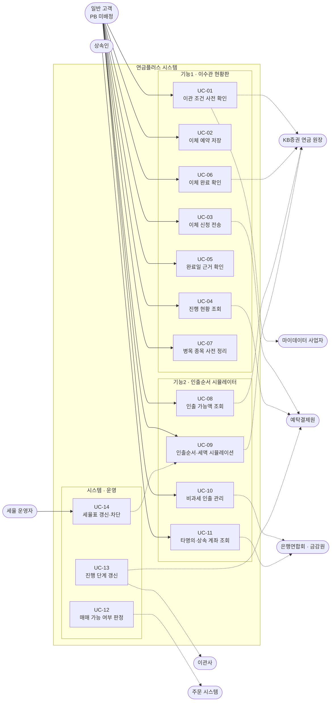
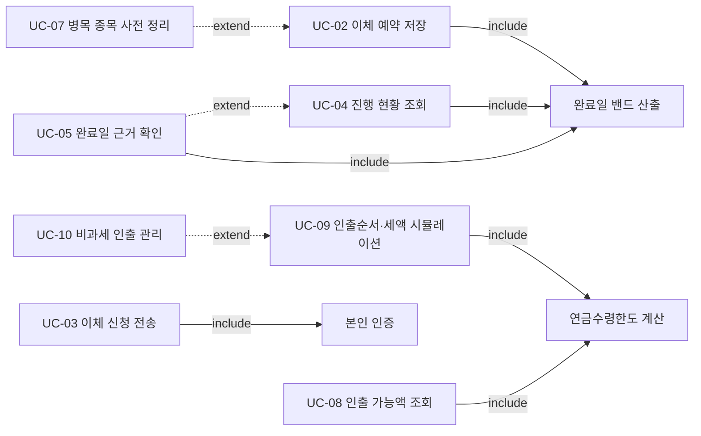

# 01. 유스케이스 명세 (Use Case)

> 출처: `ai-place-srs-v1_0.md` §3 · §6.15.3 · §6.6
> 이 문서는 **누가 시스템으로 무엇을 하는가**를 정의한다. 화면이 아니라 **목적 단위**로 묶는다.

---

## 1. 액터

액터는 시스템 밖에서 시스템과 주고받는 주체다. 사람만이 아니라 **다른 시스템도 액터**다.

| 구분 | 액터 | 설명 |
|---|---|---|
| **주 액터** | 일반 고객 (PB 미배정) | 이 서비스의 핵심 사용자. 이관을 신청하고 진행 상황을 조회하며 인출을 시뮬레이션한다 |
| 주 액터 | 상속인 | 피상속인 명의 계좌를 찾으려는 사용자. 본인 계좌가 없어 조회 경로만 사용한다 |
| **보조 액터** | 이관사 (종전 금융사) | 의사확인 통화, 자산 현금화, 송금을 수행한다. **우리가 실시간으로 들여다볼 수 없다** |
| 보조 액터 | 예탁결제원 (KSD) | 이관 중계망. 단계별 전문을 보내온다 |
| 보조 액터 | 마이데이터 사업자 | 타사 계좌의 평가액·개설일을 제공한다 |
| 보조 액터 | KB증권 연금 원장 | 계좌·재원·상태의 단일 진실 원천 |
| 보조 액터 | 주문 시스템 | 매매 가능 여부를 시스템에 묻는다 |
| 보조 액터 | 은행연합회 · 금융감독원 | 딥링크로 이동하는 외부 서비스 |
| **운영 액터** | 세율 운영자 | 세법 개정 시 세율 설정을 갱신한다 |
| 운영 액터 | 콜센터 상담원 | 문의를 `TRF-STATUS` 코드로 분류 적재한다 |

> **왜 이관사가 "보조 액터"인가.** 이관사는 이 시스템에 직접 요청하지 않는다. 그러나 이관사의 처리 결과가 시스템 상태를 바꾸므로 액터로 잡는다. 다만 **③④ 구간은 실시간 조회 경로가 없어**(SRS L-1) 시스템은 전문 수신 시점만 알 수 있다.

---

## 2. 유스케이스 다이어그램

**포함 · 확장 관계**

> **읽는 법.** `include`는 **항상 실행되는 하위 절차**다 — 전송하려면 본인 인증을 반드시 거친다. `extend`는 **조건부 추가 경로**다 — 병목 종목이 있을 때만 사전 정리 화면이 열린다.

---

## 3. 유스케이스 목록

| ID | 유스케이스 | 주 액터 | 관련 요구사항 | 관련 화면 |
|---|---|---|---|---|
| UC-01 | 이관 조건 사전 확인 | 일반 고객 | FR-F1-02-01 ~ 05 | F1-02 |
| UC-02 | 이체 예약 저장 | 일반 고객 | FR-F1-03-01 ~ 08, 10, 11 | F1-03 |
| UC-03 | 이체 신청 전송 | 일반 고객 | FR-F1-03-04, 09 | F1-03 |
| UC-04 | 진행 현황 조회 | 일반 고객 | FR-F1-01-01, FR-F1-04-01 ~ 10 | F1-01 · F1-04 |
| UC-05 | 완료일 근거 확인 | 일반 고객 | FR-F1-05-01 ~ 05 | F1-05 |
| UC-06 | 이체 완료 확인 | 일반 고객 | FR-F1-06-01 ~ 06 | F1-06 |
| UC-07 | 병목 종목 사전 정리 | 일반 고객 | FR-F1-03-03, 05, 06 | F1-03 |
| UC-08 | 인출 가능액 조회 | 일반 고객 | FR-F2-01-03, FR-F2-03-01, 03, 11 | F2-01 · F2-03 |
| UC-09 | 인출순서·세액 시뮬레이션 | 일반 고객 | FR-F2-03-02 ~ 10, FR-F2-04-01 ~ 12 | F2-03 · F2-04 |
| UC-10 | 비과세 인출 관리 | 일반 고객 | FR-F2-05-01 ~ 05 | F2-05 |
| UC-11 | 타명의·상속 계좌 조회 | 상속인 | FR-F2-06-01 ~ 04 | F2-06 |
| UC-12 | 매매 가능 여부 판정 | 주문 시스템 | FR-F1-03-07, FR-F1-04-09 | (화면 없음) |
| UC-13 | 진행 단계 갱신 | 예탁결제원 | FR-F1-01-02, FR-F1-04-01 | (화면 없음) |
| UC-14 | 세율표 갱신·차단 | 세율 운영자 | FR-F2-04-11 | (운영 화면) |

---

## 4. 주요 유스케이스 명세

### UC-03 이체 신청 전송

| 항목 | 내용 |
|---|---|
| **목적** | 저장해 둔 예약을 고객이 고른 시점에 실제 이체 신청으로 확정한다 |
| **주 액터** | 일반 고객 |
| **선행 조건** | `transfer_status = DRAFT`인 건이 존재한다. 밴드가 산출되어 화면에 표시되어 있다 |
| **후행 조건** | `transfer_status = RECEIVED`, `trading_window = SELL_ONLY`. 감사 로그에 전송 시각·인증수단·표시 밴드 값이 적재된다 |
| **트리거** | 고객이 전송 버튼을 누른다 |

**기본 흐름**

1. 고객이 예약 화면에서 전송 버튼을 누른다.
2. 시스템이 본인 인증을 요구한다. *(include: 본인 인증)*
3. 고객이 인증을 완료한다.
4. 시스템이 **그 시점 화면에 표시되어 있던 밴드 값**을 캡처한다.
5. 시스템이 감사 로그에 `전송 시각 · 인증수단 · 표시 밴드 값`을 적재한다.
6. 시스템이 `transfer_status`를 `RECEIVED`로, `trading_window`를 `SELL_ONLY`로 전이한다.
7. 시스템이 예탁결제원에 이체 요청 전문을 송신한다.
8. 시스템이 접수 완료 알림을 발송한다.
9. 화면이 F1-04 현황판으로 전환된다.

**대안 흐름**

| # | 분기 | 처리 |
|:---:|---|---|
| A1 | 본인 인증 실패 | 전송 버튼을 비활성 상태로 되돌린다. `DRAFT` 유지. 상태 변화 없음 |
| A2 | 미체결 주문이 남아 있음 | 전송을 차단하고 정리 안내를 표시한다 (FR-F1-03 사전 확인 사항) |

**예외 흐름**

| # | 예외 | 처리 |
|:---:|---|---|
| E1 | 전송 중 서버 오류(5xx) | 상태를 **`DRAFT`로 보존**하고 재전송 경로를 제공한다. "전송됐는지 모르는" 중간 상태로 남기지 않는다 (AC F1-03 #8) |
| E2 | 감사 로그 적재 실패 | **전송을 롤백한다.** 로그 없는 전송은 허용하지 않는다 (S-1, 누락률 0%) |
| E3 | 예탁원 전문 송신 실패 | `RECEIVED` 유지 후 재시도 큐에 넣는다. 고객 화면은 "요청 전달 중"으로 표시 |

> **왜 E2에서 롤백까지 하는가.** 전송은 이체 신청이라는 **전자적 의사표시**다(SRS S-1). 나중에 "그때 화면에 뭐라고 떠 있었느냐"가 분쟁의 쟁점이 되므로, 기록 없이 의사표시만 성립시키면 방어 수단을 잃는다.

---

### UC-04 진행 현황 조회

| 항목 | 내용 |
|---|---|
| **목적** | 이관이 지금 어느 단계인지, 언제 끝나는지, 그때까지 무엇이 막히는지 확인한다 |
| **주 액터** | 일반 고객 |
| **선행 조건** | 진행 중인 이관 건이 1건 이상 존재한다 |
| **후행 조건** | 상태 변경 없음 (조회 전용) |

**기본 흐름**

1. 고객이 홈 카드 또는 메뉴로 F1-04에 진입한다.
2. 시스템이 **당일 캐시된 밴드 값**을 조회한다. *(같은 날 재진입 시 값이 흔들리지 않아야 한다 — AC F1-04 #1)*
3. 시스템이 현재 단계를 판정하고 5단계 타임라인을 렌더한다.
4. 확정 단계는 분단위 시각으로, 추정 단계(③④)는 "보통 N영업일" 서술로 구분 표시한다.
5. 제한 업무 4항목과 각각의 해제 시점을 표시한다.
6. 예상 완료일을 밴드로 표시한다.

**대안 흐름 — 예외 상태 4종**

| # | 상태 | 화면 처리 |
|:---:|---|---|
| A1 | `ACTION_REQUIRED` | 통화 예정일과 자동취소 마감을 **같은 화면에 나란히** 표시. 이관사 대표번호와 직접 거는 경로 제공 |
| A2 | `DELAYED` | 단계를 유지하되 "예정보다 늦어지고 있습니다" + 밴드 확장 |
| A3 | `PARTIAL_BLOCKED` | 종목별 처리 구분과 평가손익 표시. **선택지 2개 이상**과 각 결과 병기. 매도 지시 버튼 없음 |
| A4 | `REJECTED` | 사유 코드가 아니라 평이화 문구 + 해소 절차 3단계. 재신청 버튼은 해소 확인 전까지 비활성 |

**예외 흐름**

| # | 예외 | 처리 |
|:---:|---|---|
| E1 | 예탁원 통보를 D+4까지 미수신 | 단계 유지 + 지연 안내 + 밴드 확장. "접수됨"이 며칠째 그대로면 안 된다 |
| E2 | `trading_window.confidence` 임계 미만 | 보수적으로 `LOCKED` 표시 + 대표번호 병기 |

---

### UC-09 인출순서·세액 시뮬레이션

| 항목 | 내용 |
|---|---|
| **목적** | 법이 정한 순서대로 어느 재원이 먼저 빠지고 세금이 얼마인지 인출 **전에** 확인한다 |
| **주 액터** | 일반 고객 |
| **선행 조건** | 자사 계좌이고 적용 가입일이 확정되어 있다. 세율표가 시행일 +30일 이내다 |
| **후행 조건** | 상태 변경 없음. **실제 출금으로 이어지지 않는다** |

**기본 흐름**

1. 고객이 인출 금액을 입력한다.
2. 시스템이 연금수령한도를 계산한다. *(include: 연금수령한도 계산)*
3. 시스템이 한도 내/초과분을 분리한다.
4. 시스템이 3층 재원을 법정 순서로 차감한다 — 1층 과세제외 → 2층 이연퇴직소득 → 3층 세액공제분·운용수익.
5. 층별로 세율을 적용한다. 한도 초과분은 다른 세율을 쓴다.
6. 한도 초과로 잃은 감면액을 별도 금액으로 표시한다.
7. 연 1,500만원 경계 게이지를 표시한다.
8. `모의계산 결과` 라벨과 "실제 원천징수 세액과 다를 수 있습니다"를 병기한다.

**대안 흐름**

| # | 분기 | 처리 |
|:---:|---|---|
| A1 | 인출 사유가 부득이한 사유 | 한도 게이지가 "이번 인출은 한도에 들어가지 않습니다"로 전환 |
| A2 | 인출 사유가 주택 구입·전세보증금 | **한도가 정상 소진되고 일반 세율 적용.** 부득이한 사유와 같은 전환이 일어나면 안 된다 |
| A3 | 연금수령연차 11년 이상 | 산식을 적용하지 않고 "한도 없음" |
| A4 | 4호 확인서 제출 상태 변경 | 4번째 버킷이 3층 → 1층으로 이동하고 세액이 줄어든다 |

**예외 흐름**

| # | 예외 | 처리 |
|:---:|---|---|
| E1 | 인출 금액 > 평가금액 | 계산 중단. "최대 인출 가능액: ○○원" 즉시 안내 |
| E2 | 타사 계좌 | 한도는 계산, **세액란 공란** + 사유 안내. 추정 계산 금지 |
| E3 | 세율표 시행일 +30일 초과 | 결과 대신 "세율 정보 업데이트 중입니다" |
| E4 | 라목 잔액 미분리 계좌 | 1,500만원 게이지를 숨기고 판정 미제공 안내 |

> **결과 화면에 없는 것.** 실제 출금 버튼, 매수·매도 버튼, 1:1 상담 진입점이 **의도적으로 없다**. 있으면 투자일임업·유상 자문 정의에 걸려 규제 지위가 바뀐다 (SRS R-3, R-4).

---

### UC-12 매매 가능 여부 판정

| 항목 | 내용 |
|---|---|
| **목적** | 주문 시스템이 이관 중 계좌의 주문을 받아도 되는지 판정한다 |
| **주 액터** | 주문 시스템 (시스템 액터) |
| **선행 조건** | 대상 계좌에 진행 중인 이관 건이 있다 |
| **후행 조건** | 주문 허용 또는 거부. 거부 시 사유 코드 `TRANSFER_LOCK` |

**기본 흐름**

1. 주문 시스템이 매수/매도/납입/수령 신청 직전에 시스템에 조회한다.
2. 시스템이 `trading_window` 값과 `confidence`를 읽는다.
3. `confidence`가 임계 이상이면 해당 값의 매트릭스대로 판정한다.
4. 판정 결과를 반환한다.

**예외 흐름**

| # | 예외 | 처리 |
|:---:|---|---|
| E1 | `confidence` 임계 미만 | **`LOCKED`로 강등**해 판정한다 (D-4) |
| E2 | 조회 타임아웃 | 보수적으로 `LOCKED` 판정 |

> **이 유스케이스가 가드레일 지표를 만든다.** 화면이 "가능"으로 표시했는데 주문이 거부되면 그 한 번으로 화면 전체의 신뢰가 무너진다. 일간 거부율 0.1%를 넘으면 자동 알람과 롤백이 걸린다 (SRS §6.13.2).

---

## 5. 유스케이스 ↔ 요구사항 추적

| 유스케이스 | 요구사항 건수 | 인수 조건 |
|---|:---:|---|
| UC-01 | 5 | SRS §6.7.2 F1-02 #1 ~ #6 |
| UC-02 | 10 | SRS §6.7.2 F1-03 #1 ~ #3, #7, #11 |
| UC-03 | 2 | SRS §6.7.2 F1-03 #4, #8, #10 |
| UC-04 | 11 | SRS §6.7.2 F1-01 #1 ~ #4, F1-04 #1 ~ #10 |
| UC-05 | 5 | SRS §6.7.2 F1-05 #1 ~ #5 |
| UC-06 | 6 | SRS §6.7.2 F1-06 #1 ~ #6 |
| UC-07 | 3 | SRS §6.7.2 F1-03 #5, #6 |
| UC-08 | 4 | SRS §6.7.2 F2-01 #1 ~ #4, F2-03 #7, #8 |
| UC-09 | 21 | SRS §6.7.2 F2-03 #1 ~ #9, F2-04 #1 ~ #8 |
| UC-10 | 5 | SRS §6.7.2 F2-05 #1 ~ #4 |
| UC-11 | 4 | SRS §6.7.2 F2-06 #1 ~ #4 |
| UC-12 | 2 | SRS §6.7.2 F1-03 #3, #4, #9 |
| UC-13 | 2 | SRS §6.7.2 F1-01 #5, F1-04 #4 |
| UC-14 | 1 | SRS §6.7.2 F2-04 #6 |
