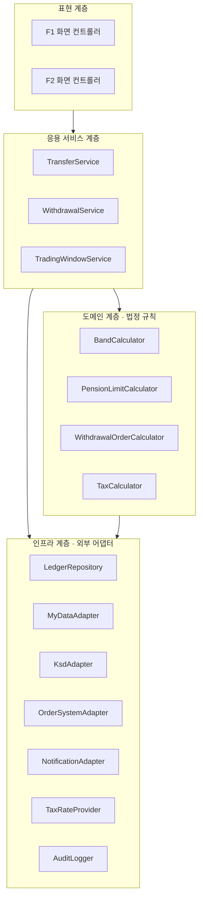
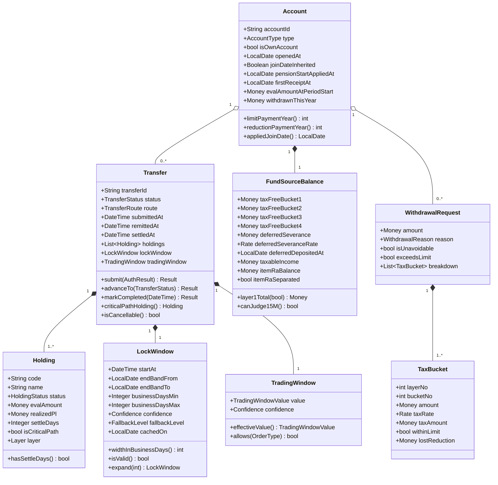
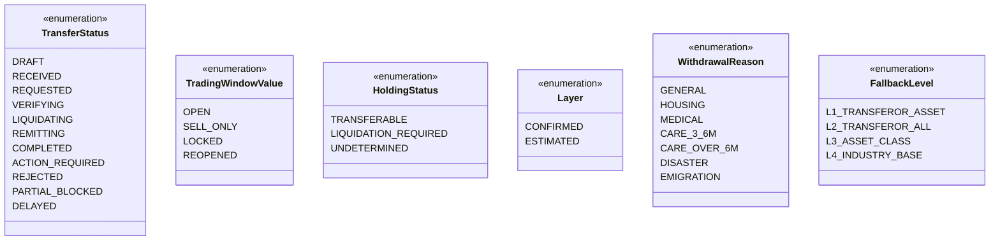
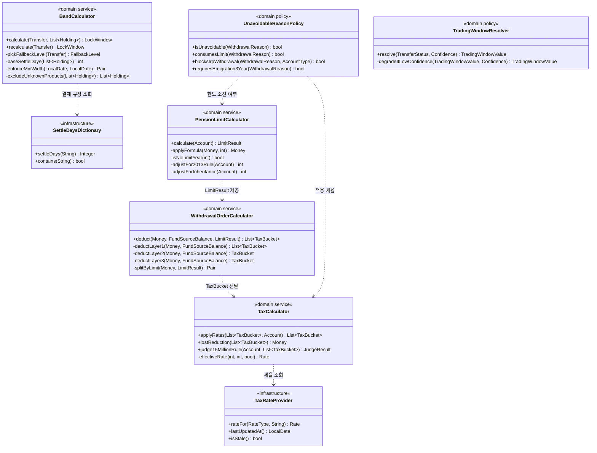
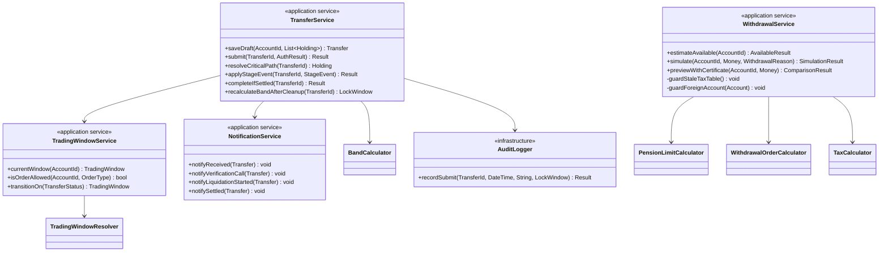
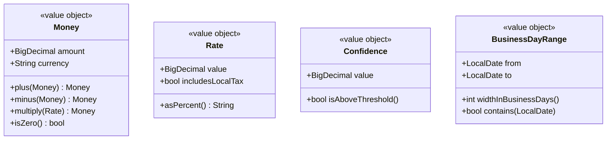

# 03. 클래스 다이어그램 (CLD · Class Diagram)

> 출처: `ai-place-srs-v1_0.md` §6.6 · §6.9 · §6.4
> 이 문서는 **코드가 어떤 책임 단위로 나뉘는가**를 정의한다. ERD가 "무엇을 저장하나"라면 이것은 "무엇이 계산하나"다.
>
> 사업 동태를 다루는 **인과 순환 다이어그램(Causal Loop Diagram)** 은 별도 문서 [`08-causal-loop.md`](08-causal-loop.md)에 있다.

---

## 1. 계층 구조



> **도메인 계층에 법정 규칙만 둔 이유.** 연금수령한도·인출순서·세율은 **법이 정한 것이라 우리가 바꿀 수 없다.** 이 규칙을 화면이나 서비스에 흩어 놓으면 세법 개정 때 고칠 자리를 찾지 못한다. 한곳에 모아 두고 세율만 외부 설정으로 뺐다.

---

## 2. 도메인 모델 클래스



**열거형**



---

## 3. 도메인 서비스 — 법정 계산



### 3.1 계산 순서가 고정된 이유

```
PensionLimitCalculator → WithdrawalOrderCalculator → TaxCalculator
```

한도를 먼저 구해야 "한도 내 / 한도 초과"를 가를 수 있고, 그래야 같은 재원에 **다른 세율**을 적용할 수 있다. 순서를 바꾸면 초과분에 5.5%를 매기는 사고가 난다.

### 3.2 `UnavoidableReasonPolicy` 를 따로 뺀 이유

인출 사유는 **세 갈래로 다르게 작동**한다. 한 곳에 모아 두지 않으면 세 규칙이 서로 어긋난다.

| 사유 | 세법상 부득이한 사유 | 한도 소진 | IRP 인출 가능 |
|---|:---:|:---:|:---:|
| 일반 중도인출 | ✕ | O | O |
| **주택 구입 · 전세보증금** | **✕** | **O** | O |
| 요양 3~6개월 | O | ✕ | **불가할 수 있음** |
| 요양 6개월 이상 | O | ✕ | O |
| 의료 목적 | O | ✕ | O |
| 천재지변 · 재난 · 파산 | O | ✕ | O |
| 해외이주 | O | ✕ | 입금 후 3년 경과 시 |

주택 구입이 함정이다. 근퇴법상 **인출은 되지만** 소득세법상 부득이한 사유는 **아니다.** 이걸 한 플래그로 처리하면 세금 혜택이 있는 것처럼 보이게 된다 (AC F2-03 #2가 이 케이스를 실패로 잡는다).

---

## 4. 응용 서비스



### 4.1 `WithdrawalService` 의 두 가드

계산에 들어가기 **전에** 걸리는 차단이다. 계산 후 걸면 이미 틀린 값이 만들어진 뒤다.

| 가드 | 조건 | 동작 |
|---|---|---|
| `guardStaleTaxTable()` | `TaxRateProvider.isStale()` = 시행일 +30일 초과 | 계산 중단, "세율 정보 업데이트 중입니다" 반환 |
| `guardForeignAccount()` | `Account.isOwnAccount = false` | 한도만 계산하고 세액 산출 생략, 사유 반환 |

### 4.2 `AuditLogger.recordSubmit()` 이 `Result` 를 반환하는 이유

`void`가 아니다. **적재 실패 시 전송 자체를 롤백**해야 하기 때문이다(S-1, 누락률 0%). 로그를 부수 효과로 두면 실패해도 전송이 성립해 버린다.

---

## 5. 값 객체



**`Money` 를 원시 타입으로 두지 않은 이유** — 화면은 원 단위 확정치를 표시해야 하고 비율 단독 표기가 금지된다(Q-2). `BigDecimal` 부동소수 오차가 1원이라도 나면 검증 데이터셋 6건이 실패한다.

**`Rate.includesLocalTax`** — 소득세법 원문은 5%지만 화면은 지방소득세 포함 5.5%를 써야 한다. 이 플래그가 없으면 어느 값인지 코드에서 구분되지 않는다.

---

## 6. 클래스 ↔ 요구사항 추적

| 클래스 | 담당 요구사항 |
|---|---|
| `BandCalculator` | FR-F1-03-02, 03, 05, 08, 10 · FR-F1-04-03 · FR-F1-05-01 ~ 03 |
| `TradingWindowResolver` | FR-F1-03-07 · FR-F1-04-09 · D-4 |
| `PensionLimitCalculator` | FR-F2-01-03 · FR-F2-03-01, 11 · §6.9.1 |
| `WithdrawalOrderCalculator` | FR-F2-04-01, 03, 04 · §6.9.2 |
| `TaxCalculator` | FR-F2-04-05, 06, 08, 11 · §6.9.3, §6.9.4 |
| `UnavoidableReasonPolicy` | FR-F2-03-04, 05, 06, 07 · §6.9.6 |
| `AuditLogger` | FR-F1-03-09 · S-1, S-2 |
| `TaxRateProvider` | FR-F2-04-11 · M-1 · A-4 |
| `NotificationService` | FR-F1-01-02, 03 · FR-F1-06-03 · C-1 |
