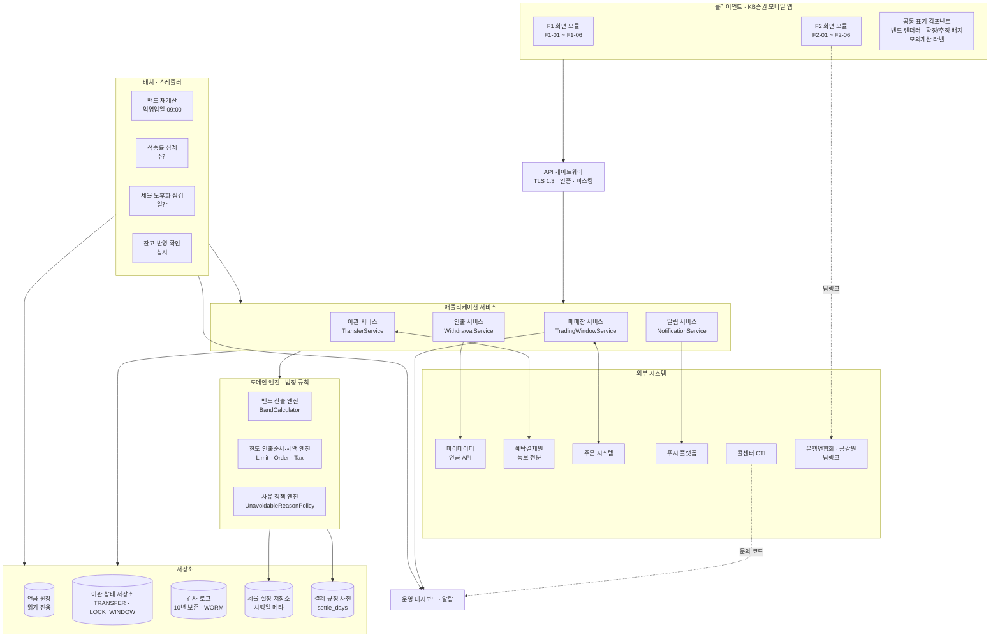
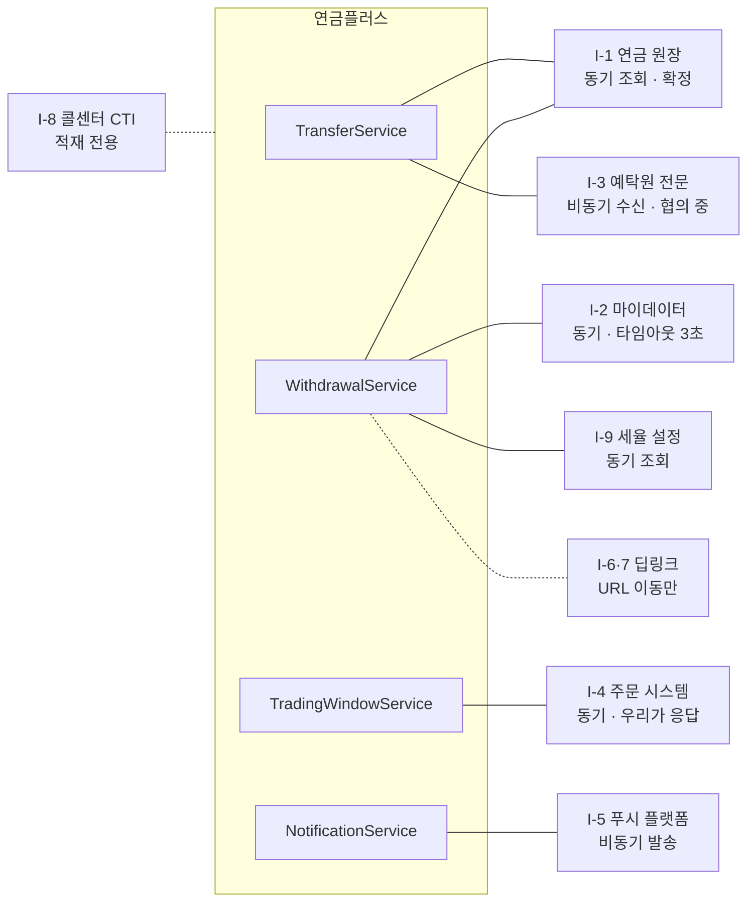
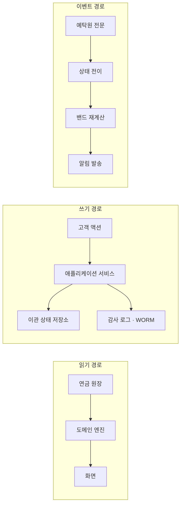
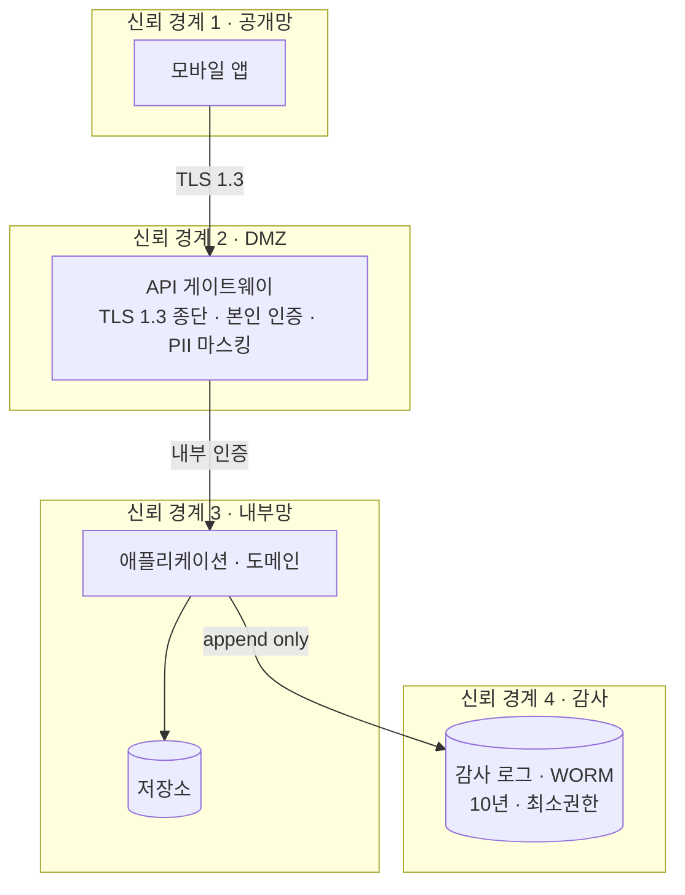

# 04. 컴포넌트 다이어그램 (Component Diagram)

> 출처: `ai-place-srs-v1_0.md` §1.3.1 · §3.2 · §3.2.1 · §4.8
> 이 문서는 **배포 단위가 어떻게 나뉘고 무엇을 통해 대화하는가**를 정의한다. 클래스 다이어그램이 "코드 안"이라면 이것은 "코드 밖 경계"다.

---

## 1. 시스템 전체 컴포넌트

> **읽는 법.** 실선은 동기 호출, 점선은 비동기·간접 경로다. `주문 시스템`만 화살표가 양방향인데, 시스템이 주문 시스템을 부르는 게 아니라 **주문 시스템이 매 주문마다 우리에게 물어보기** 때문이다.

---

## 2. 컴포넌트별 책임과 인터페이스

### 2.1 클라이언트

| 컴포넌트 | 책임 | 하지 않는 것 |
|---|---|---|
| F1 화면 모듈 | 진행 상태·밴드·제한 업무 렌더 | 밴드를 **계산하지 않는다.** 병목 종목도 지정하지 않는다 (D-3) |
| F2 화면 모듈 | 인출액 입력, 계산 결과 렌더 | 세액을 클라이언트에서 확정하지 않는다 |
| 공통 표기 컴포넌트 | 밴드 표기, 확정/추정 배지, `모의계산 결과` 고정 라벨 | — |

> **공통 표기 컴포넌트를 따로 뺀 이유.** "단일 날짜 금지", "확정/추정 시각 분리", "모의계산 라벨 고정"은 **화면마다 지켜야 하는 규칙**이다. 화면별로 구현하면 한 곳이 빠져도 모른다. 컴포넌트 하나로 강제하면 코드 리뷰에서 잡힌다 (M-5).

### 2.2 애플리케이션 서비스

| 컴포넌트 | 제공 인터페이스 | 요구 인터페이스 |
|---|---|---|
| `TransferService` | 예약 저장 · 전송 · 단계 갱신 · 완료 판정 | 밴드 엔진 · 감사 로그 · KSD 어댑터 · 알림 |
| `WithdrawalService` | 인출 가능액 · 시뮬레이션 · 확인서 전후 비교 | 한도/세액 엔진 · 원장 · 세율 설정 |
| `TradingWindowService` | **매매 가능 여부 조회 (외부 공개)** | 이관 상태 저장소 |
| `NotificationService` | 알림 4종 발송 | 푸시 플랫폼 |

`TradingWindowService`만 **외부(주문 시스템)에 공개되는 인터페이스**를 갖는다. 나머지는 앱 전용이다.

### 2.3 도메인 엔진

법정 규칙만 담는다. 외부 I/O가 없어 **단위 시험이 가능하고**, 검증 데이터셋 6건을 그대로 회귀 테스트로 쓸 수 있다 (M-3).

### 2.4 배치

| 배치 | 주기 | 역할 | 실패 시 |
|---|---|---|---|
| 밴드 재계산 | 익영업일 09:00 | 병목 정리·단계 전이 반영 | 이전 밴드 유지 + 갱신 지연 표시 |
| 적중률 집계 | 주간 (월요일) | `band_hit` 집계 → 지표 | 지표 공백. 서비스 영향 없음 |
| 세율 노후화 점검 | 일간 | D+21 경고, D+30 계산 차단 | **차단이 안 걸리면 낡은 값으로 계산되므로 이중화** |
| 잔고 반영 확인 | 상시 | `REMITTING` → `COMPLETED` 판정 | 완료 표시 지연. 오표시보다 낫다 |

---

## 3. 외부 인터페이스 계약

| # | 인터페이스 | 방식 | 실패 시 확정 동작 |
|:---:|---|---|---|
| I-1 | 연금 원장 | 동기 조회 | 조회 실패 시 화면 진입 차단 (추정 금지) |
| I-2 | 마이데이터 연금 API | 동기, 타임아웃 3초 | 폴백 사다리 ③단계 + "대략치입니다" 병기 |
| I-3 | 예탁원 통보 전문 | 비동기 수신 | 폴백 사다리 ③단계. D+4 미수신 시 지연 표시 |
| I-4 | 주문 시스템 | 동기, **우리가 응답** | 타임아웃 시 `LOCKED` 판정 (보수) |
| I-5 | 푸시 플랫폼 | 비동기 발송 | 인앱 알림으로 대체 |
| I-6·7 | 은행연합회 · 금감원 | 딥링크 (URL 이동) | 버튼 비노출 또는 고객센터 안내 |
| I-8 | 콜센터 CTI | 적재 전용 | **기준선 측정 불가 → Phase 1 승격 차단** |
| I-9 | 세율 설정 저장소 | 동기 조회 | 계산 결과 노출 차단 |

> **I-6·7이 "딥링크"인 것이 범위 경계다.** 우리 서버가 은행연합회·금감원에 요청을 보내는 순간 범위 밖(Phase 2)이 된다. URL 이동까지만 이 릴리스다 (SRS §1.2.4).

---

## 4. 데이터 흐름 — 읽기와 쓰기 분리

**연금 원장은 읽기 전용이다.** 이 시스템은 계좌·재원 잔액을 쓰지 않는다. 쓰는 것은 이관 상태(`TRANSFER` 계열)와 감사 로그뿐이다. 인출 시뮬레이션은 **아무것도 쓰지 않는다** — 실제 출금이 아니기 때문이다.

**감사 로그는 WORM**(Write Once Read Many)이다. 전송 시점 밴드 값이 나중에 수정되면 증거로서 의미를 잃는다.

---

## 5. 보안 경계

| 경계 | 통제 | 근거 |
|---|---|---|
| 1 → 2 | TLS 1.3 강제. 1.2 이하 요청 1% 초과 시 알람 | S-3 · N-1 |
| 2 | 전송 버튼은 **본인 인증 후에만** 활성화 | S-1 · FR-F1-03-09 |
| 2 | 계좌번호 중간 4자리 마스킹 | S-6 |
| 2 → 3 | 딥링크에 개인정보를 쿼리 파라미터로 싣지 않음 | N-3 |
| 3 | 저장 시 AES-256 | S-3 |
| 3 → 4 | append only. 운영자 조회는 사유 입력 필수 | S-2 · S-4 |
| 외부 | 마이데이터 조회 시점 유효 동의 100% | S-5 |

---

## 6. 배포 · 확장 단위

| 단위 | 확장 방식 | 이유 |
|---|---|---|
| API 게이트웨이 | 수평 확장 | 트래픽 비례 |
| 애플리케이션 서비스 | 수평 확장 (무상태) | 세션을 갖지 않음 |
| 도메인 엔진 | 애플리케이션에 인프로세스 | 외부 I/O가 없어 분리 이득이 없음 |
| 배치 | 단일 인스턴스 (리더 선출) | 밴드 재계산이 중복 실행되면 값이 흔들림 |
| 감사 로그 | 별도 저장소 | 보존 정책·접근통제가 달라 분리 |

> **배치를 단일 인스턴스로 묶은 이유.** 밴드 재계산이 두 번 돌면 같은 날 값이 달라질 수 있다. AC F1-04 #1이 "같은 날 재진입 시 값 동일"을 요구하므로 중복 실행을 구조로 막는다.

---

## 7. 컴포넌트 ↔ 요구사항 추적

| 컴포넌트 | 담당 요구사항 |
|---|---|
| 공통 표기 컴포넌트 | FR-F1-04-02, 03 · FR-F2-03-10 · U-1 ~ U-4 · Q-1 ~ Q-3 |
| `TransferService` | FR-F1-03-04, 09 · FR-F1-04-06 · FR-F1-06-01, 02 |
| `WithdrawalService` | FR-F2-03-* · FR-F2-04-* |
| `TradingWindowService` | FR-F1-03-07 · FR-F1-04-09 · 가드레일 지표 |
| 밴드 재계산 배치 | FR-F1-03-05 · AC F1-03 #5 |
| 세율 노후화 점검 배치 | FR-F2-04-11 · A-4 |
| 잔고 반영 확인 배치 | FR-F1-06-01, 03 |
| API 게이트웨이 | S-1, S-3, S-6 · N-1, N-3 |
| 감사 로그 저장소 | S-1, S-2, S-4 |
