# 05. 시퀀스 다이어그램 (Sequence Diagram)

> 출처: `ai-place-srs-v1_0.md` §6.6 · §6.7.2 인수 조건
> 이 문서는 **시간 순서로 무엇이 무엇을 부르는가**를 정의한다. 각 시퀀스는 인수 조건과 1:1로 대응한다.

---

## 목록

| ID | 시퀀스 | 대응 인수 조건 |
|---|---|---|
| [SD-01](#sd-01-예약-저장과-밴드-산출) | 예약 저장과 밴드 산출 | F1-03 #1, #2, #7, #11 |
| [SD-02](#sd-02-이체-신청-전송) | 이체 신청 전송 | F1-03 #4, #8, #10 |
| [SD-03](#sd-03-병목-종목-사전-정리와-밴드-재계산) | 병목 종목 사전 정리와 밴드 재계산 | F1-03 #5, #6 |
| [SD-04](#sd-04-진행-단계-갱신과-알림) | 진행 단계 갱신과 알림 | F1-01 #5, F1-04 #3 |
| [SD-05](#sd-05-매매-가능-여부-판정-가드레일) | 매매 가능 여부 판정 (가드레일) | F1-03 #3, #4, #9 |
| [SD-06](#sd-06-이체-완료-판정) | 이체 완료 판정 | F1-06 #1, #2, #5 |
| [SD-07](#sd-07-인출순서세액-시뮬레이션) | 인출순서·세액 시뮬레이션 | F2-03 #8, F2-04 #1, #3 |
| [SD-08](#sd-08-공제확인서-제출과-버킷-이동) | 공제확인서 제출과 버킷 이동 | F2-04 #2, F2-05 #1 |
| [SD-09](#sd-09-세율표-노후화-차단) | 세율표 노후화 차단 | F2-04 #6 |
| [SD-10](#sd-10-지연-감지와-밴드-확장) | 지연 감지와 밴드 확장 | F1-04 #4 |

---

## SD-01 예약 저장과 밴드 산출

마이데이터 응답이 3초를 넘으면 **폴백 사다리로 강등**해 개략 밴드를 낸다. 빈 화면이나 무한 로딩은 실패다.

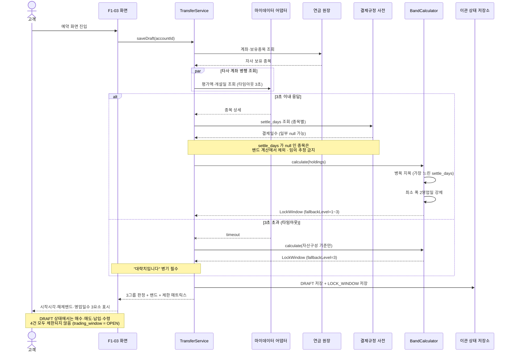

---

## SD-02 이체 신청 전송

**감사 로그 적재 실패 시 전송을 롤백한다.** 기록 없는 의사표시는 허용하지 않는다.

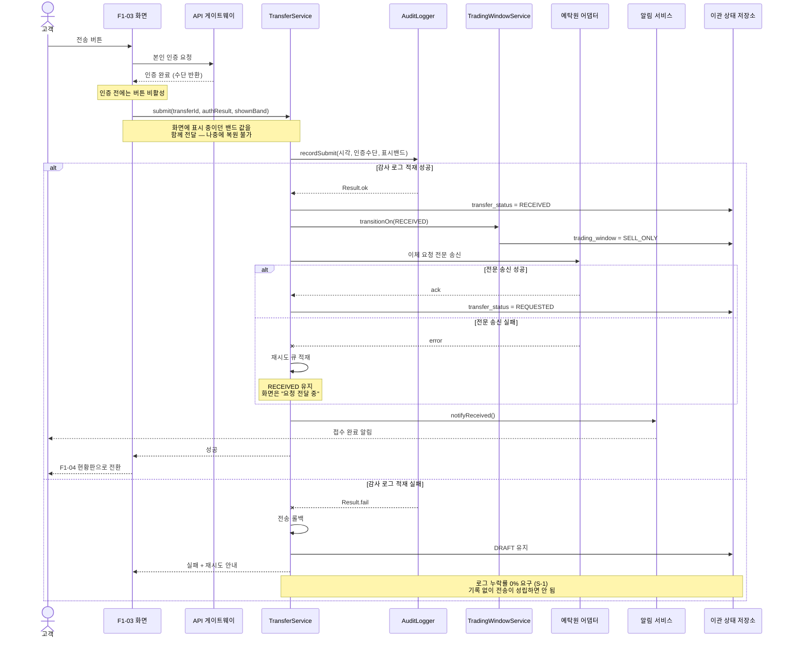

**예외 — 전송 중 서버 오류**

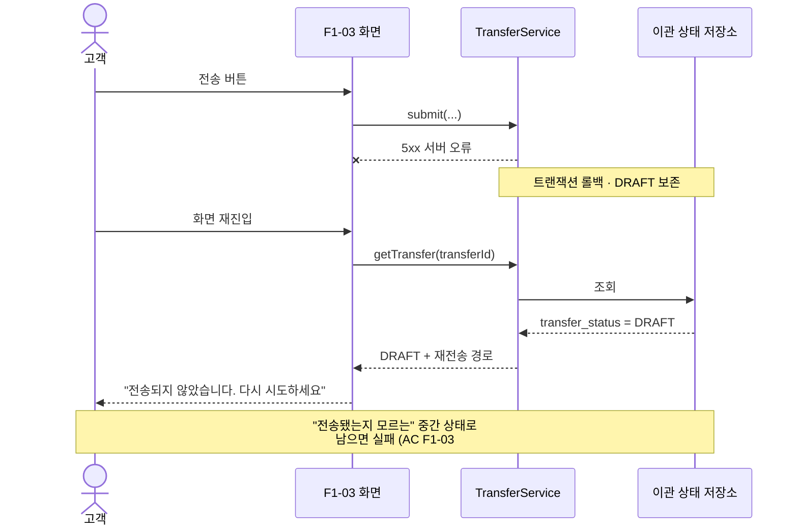

---

## SD-03 병목 종목 사전 정리와 밴드 재계산

밴드는 **즉시 바뀌지 않는다.** 익영업일 09:00 배치 이전에 반영된다.

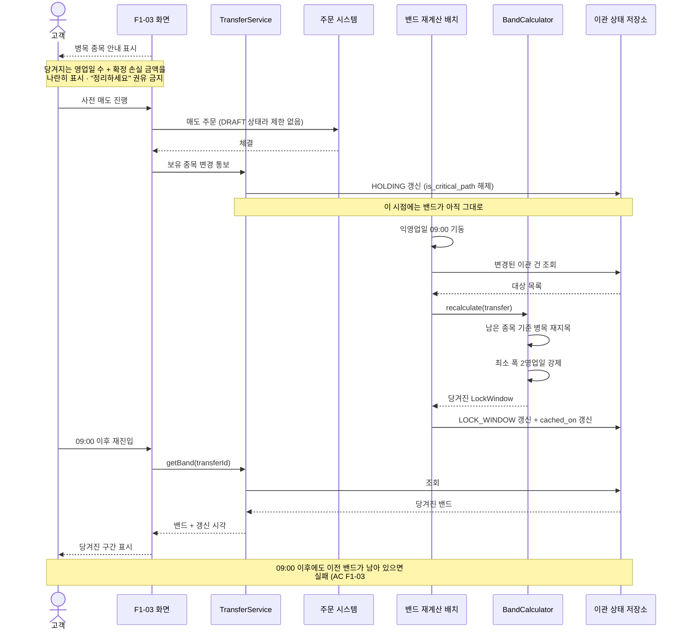

---

## SD-04 진행 단계 갱신과 알림

알림은 **상태 전이 시점에 60초 이내** 나간다. 야간 배치 일괄 발송은 실패다.

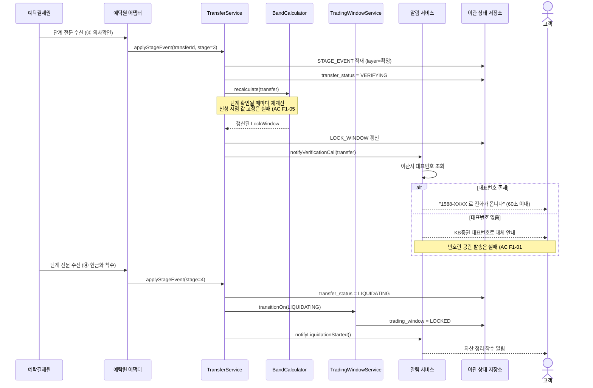

---

## SD-05 매매 가능 여부 판정 (가드레일)

이 경로가 **가드레일 지표를 만든다.** 화면이 "가능"이라 했는데 주문이 거부되면 신뢰가 무너진다.

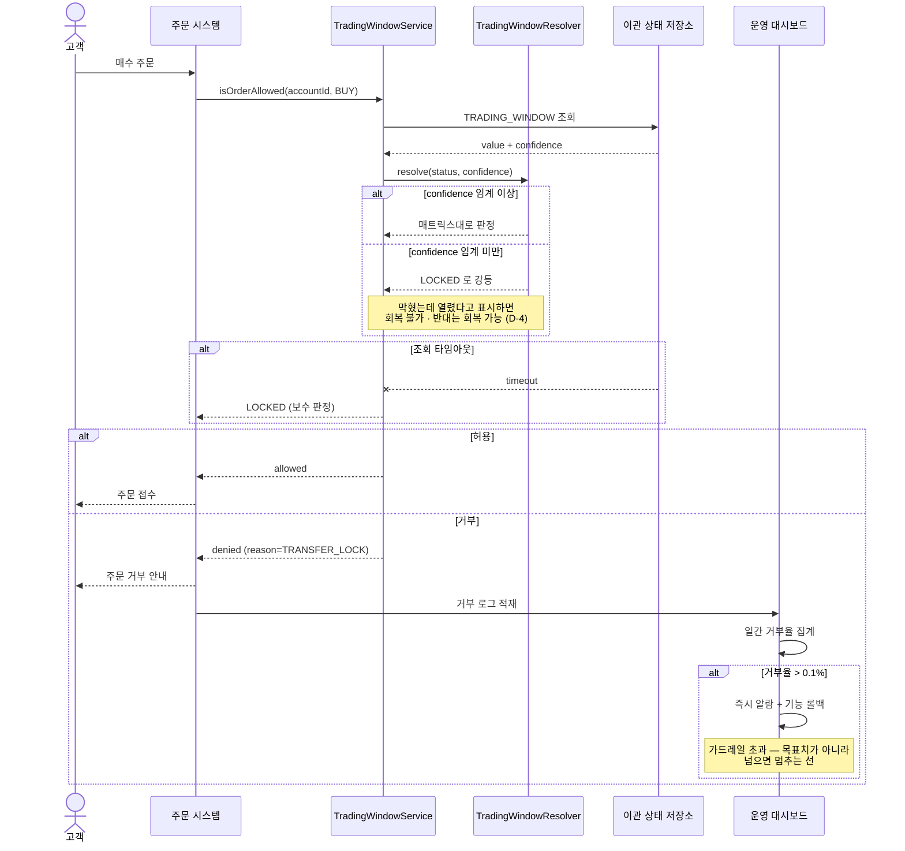

---

## SD-06 이체 완료 판정

**송금 통보만으로 완료를 표시하지 않는다.** 잔고 반영을 확인한 뒤에만 완료다.

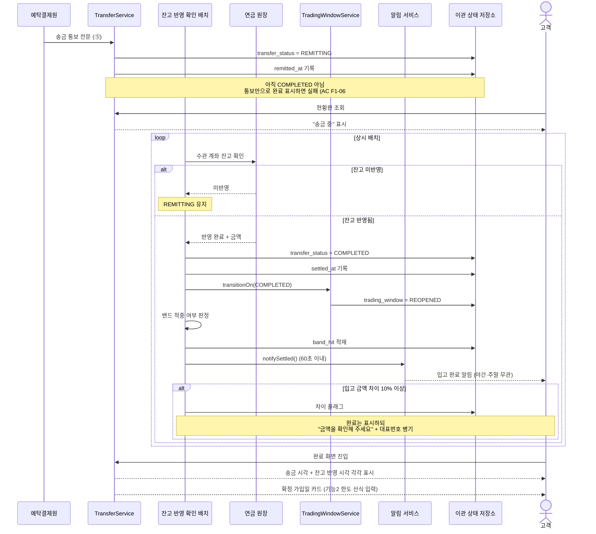

---

## SD-07 인출순서·세액 시뮬레이션

계산 **전에** 두 가드가 걸린다. 계산 후에 걸면 이미 틀린 값이 만들어진 뒤다.

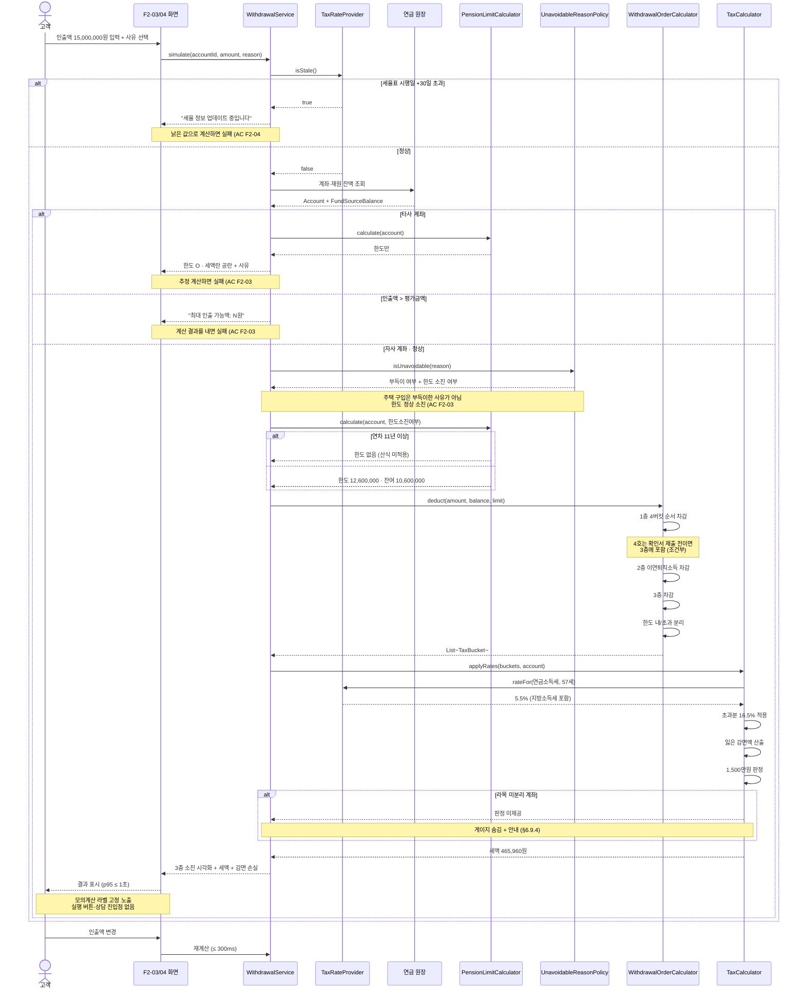

---

## SD-08 공제확인서 제출과 버킷 이동

4호 버킷이 **3층 → 1층으로 이동**하고 세액이 줄어든다.

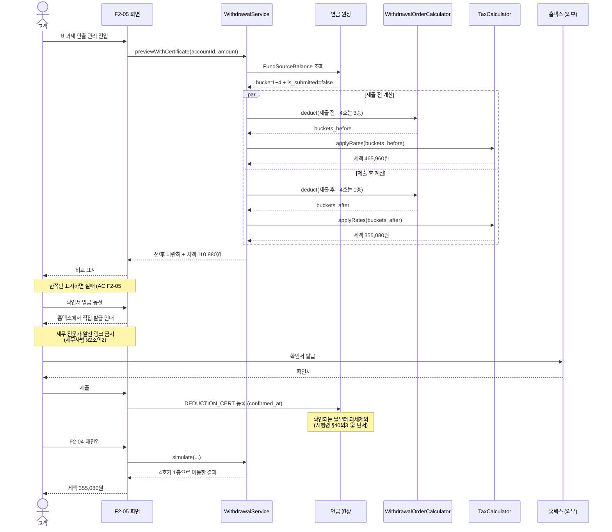

---

## SD-09 세율표 노후화 차단

D+21에 경고, D+30에 차단. **이중화**한다 — 차단이 안 걸리면 낡은 값으로 계산된다.

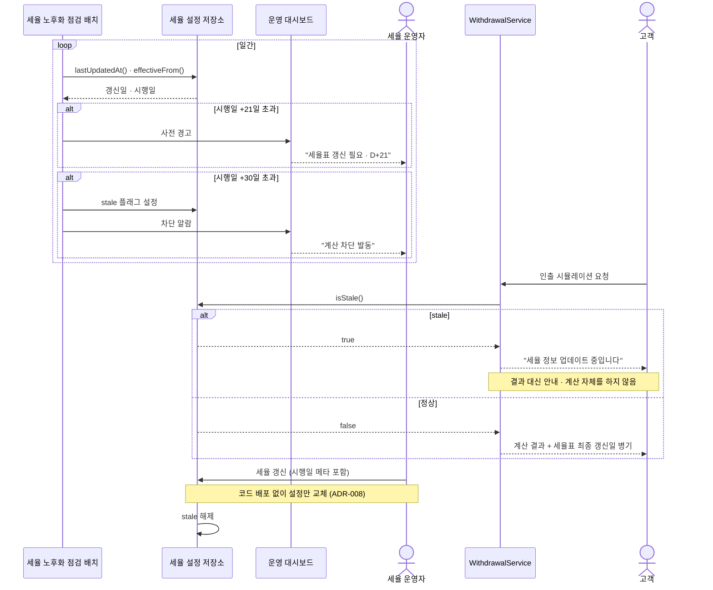

---

## SD-10 지연 감지와 밴드 확장

예탁원 통보를 D+4까지 못 받으면 **단계는 유지하되** 지연을 알린다.

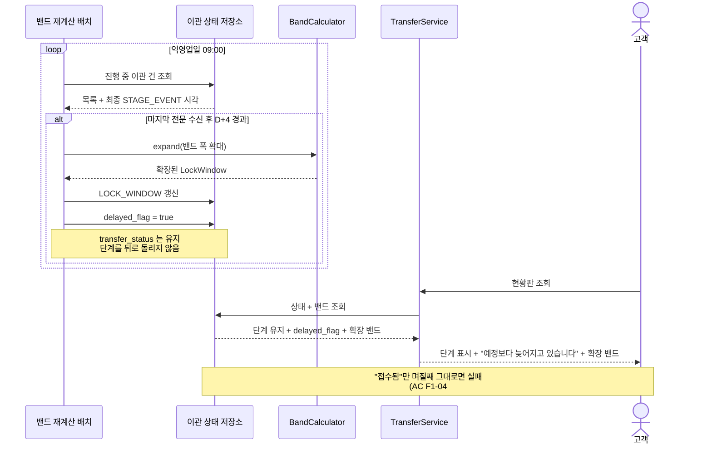

---

## 시퀀스 ↔ 요구사항 추적

| 시퀀스 | 요구사항 | 인수 조건 |
|---|---|---|
| SD-01 | FR-F1-03-01, 02, 03, 08, 10, 11 | F1-03 #1, #2, #7, #11 |
| SD-02 | FR-F1-03-04, 09 | F1-03 #4, #8, #10 |
| SD-03 | FR-F1-03-05, 06 | F1-03 #5, #6 |
| SD-04 | FR-F1-01-02, 03 · FR-F1-04-01, 02 | F1-01 #5, #6 · F1-04 #3 |
| SD-05 | FR-F1-03-07 · FR-F1-04-09 | F1-03 #3, #4, #9 |
| SD-06 | FR-F1-06-01 ~ 05 | F1-06 #1, #2, #3, #6 |
| SD-07 | FR-F2-03-02 ~ 11 · FR-F2-04-01 ~ 12 | F2-03 #1 ~ #9 · F2-04 #1, #3, #7, #8 |
| SD-08 | FR-F2-04-03 · FR-F2-05-01 ~ 03 | F2-04 #2 · F2-05 #1, #2, #4 |
| SD-09 | FR-F2-04-11 | F2-04 #6 |
| SD-10 | FR-F1-04-06 · FR-F1-05-01 | F1-04 #4 · F1-05 #1 |
