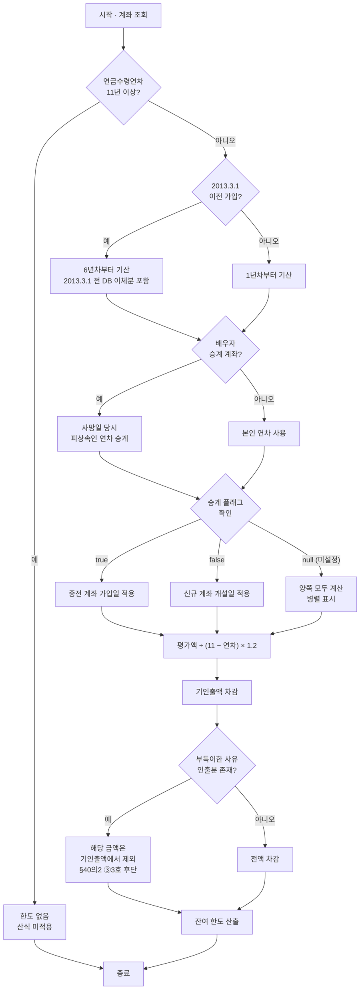
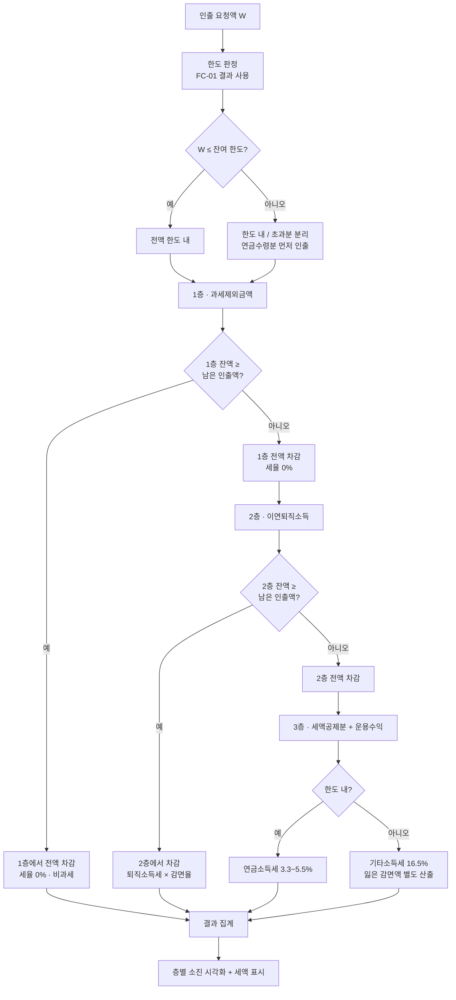
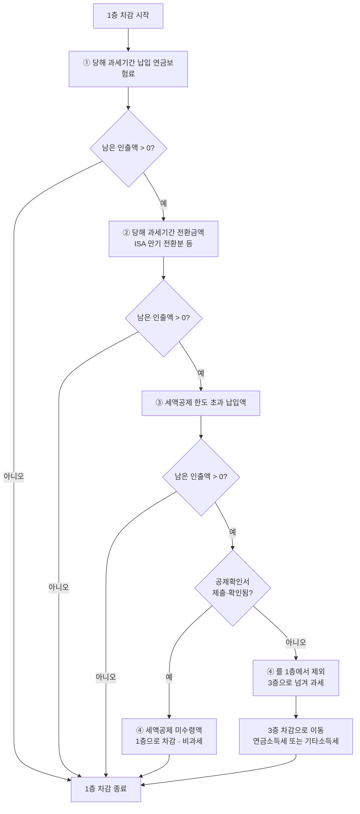
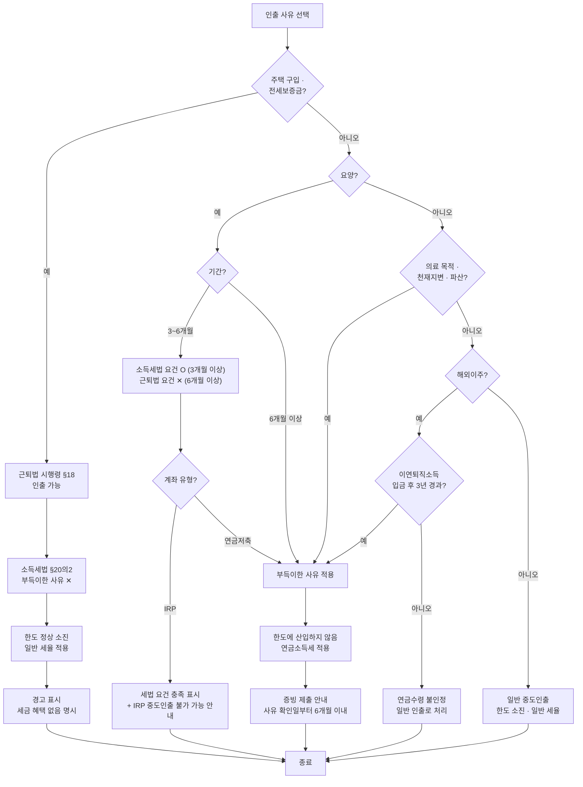
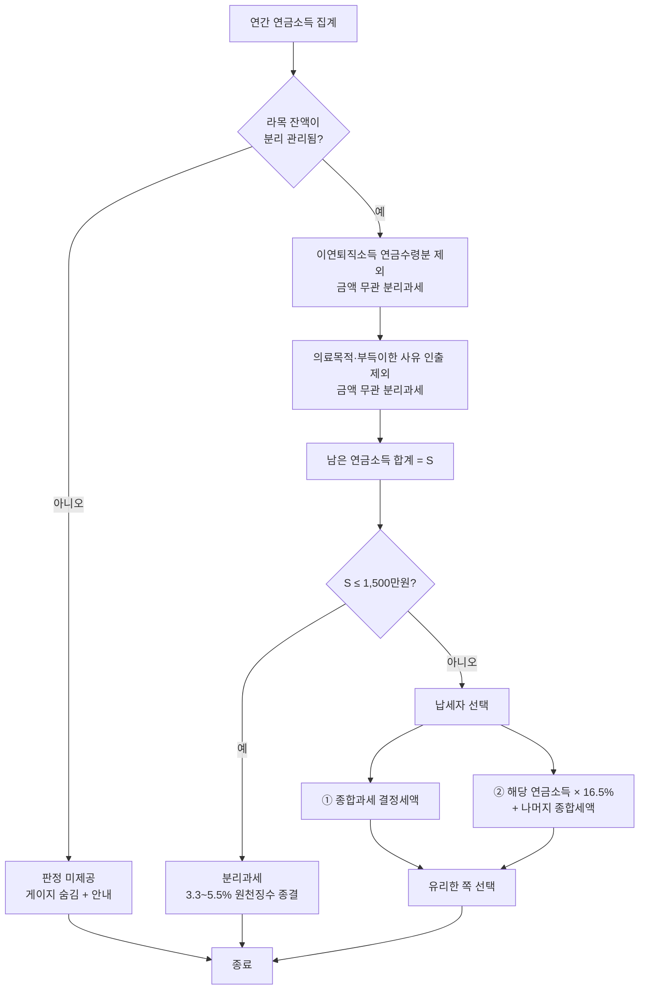
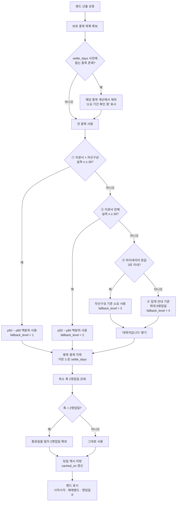
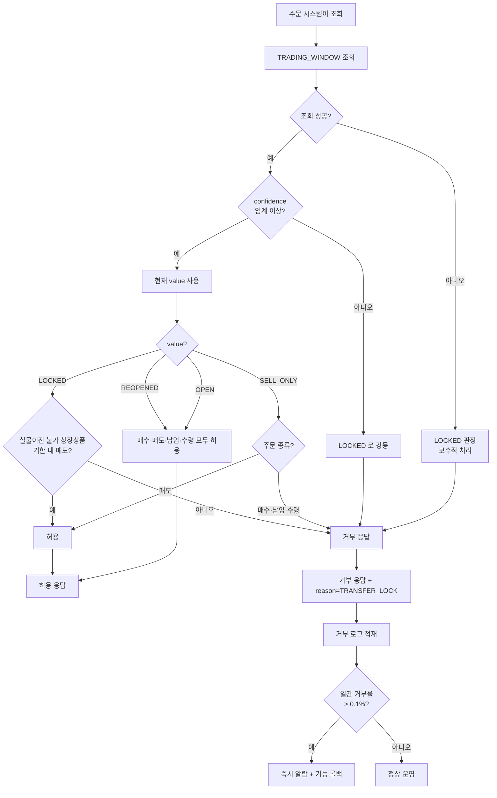
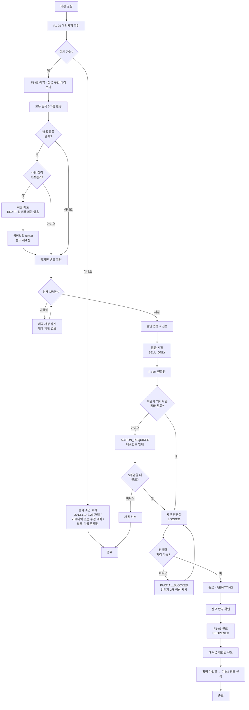
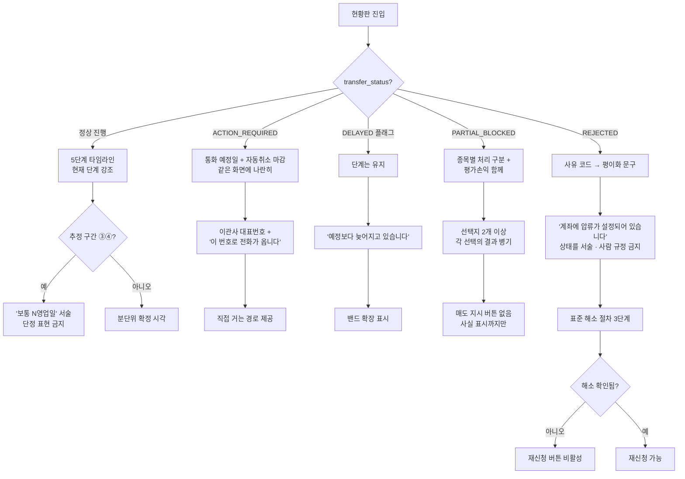

# 07. 논리 흐름도 (Flowchart)

> 출처: `ai-place-srs-v1_0.md` §6.9 법정 계산 규칙 · §6.10 상태 모델
> 이 문서는 **분기 조건이 많아 글로는 따라가기 어려운 로직**을 그림으로 편다. 법정 산식이므로 임의로 순서를 바꿀 수 없다.

---

## 목록

| ID | 흐름 | 근거 |
|---|---|---|
| [FC-01](#fc-01-연금수령한도-산출) | 연금수령한도 산출 | 시행령 §40의2 |
| [FC-02](#fc-02-인출순서-3층-차감) | 인출순서 3층 차감 | 시행령 §40의3 ① |
| [FC-03](#fc-03-1층-내부-4버킷-차감) | 1층 내부 4버킷 차감 | 시행령 §40의3 ② |
| [FC-04](#fc-04-부득이한-사유-판정) | 부득이한 사유 판정 | 시행령 §20의2 · 근퇴법 시행령 §18 |
| [FC-05](#fc-05-연-1500만원-종합과세-판정) | 연 1,500만원 종합과세 판정 | 소득세법 §14③9호 |
| [FC-06](#fc-06-완료일-밴드-폴백-사다리) | 완료일 밴드 폴백 사다리 | SRS §6.9.5 |
| [FC-07](#fc-07-매매-가능-여부-판정) | 매매 가능 여부 판정 | SRS §6.10 · D-4 |
| [FC-08](#fc-08-이관-전체-여정) | 이관 전체 여정 | SRS §6.10 |
| [FC-09](#fc-09-예외-상태-4종-분기) | 예외 상태 4종 분기 | FR-F1-04-06 |

---

## FC-01 연금수령한도 산출

```
연금수령한도 = 과세기간 개시일 현재 평가액 ÷ (11 − 연금수령연차) × 120 / 100
잔여 한도   = 연금수령한도 − 당해 과세기간 기인출액
```



> **분모가 매년 줄고 평가액도 매년 바뀐다.** 이 계산은 매년 다시 해야 한다. 10년차에는 분모가 1이 되어 사실상 전액이 한도가 된다.

**연차가 두 종류인 점에 주의**

| 연차 | 기산 | 쓰이는 곳 |
|---|---|---|
| 한도용 | 최초 수령 가능일이 속한 과세기간부터, **실제 수령 여부와 무관하게** 누적 | 위 산식의 분모 |
| 감면율용 | **실제로 수령한** 연차만 카운트 | 이연퇴직소득 감면율 70/60/50% |

---

## FC-02 인출순서 3층 차감

고객도 금융회사도 순서를 바꿀 수 없다.



**층별 세율**

| 순위 | 재원 | 한도 내 | 한도 초과 |
|:---:|---|---|---|
| 1 | 과세제외금액 | 비과세 | 비과세 |
| 2 | 이연퇴직소득 | 퇴직소득세 × 70 / 60 / 50% | 퇴직소득세 100% |
| 3 | 세액공제분 · 운용수익 | 연금소득세 3.3~5.5% | 기타소득세 16.5% |

**감면율은 실제 수령연차로 정해진다**

| 실제 수령연차 | 감면 후 부담 | 시행 |
|---|:---:|---|
| 10년 이하 | 70% | 기존 |
| 10년 초과 ~ 20년 이하 | 60% | 2020.1.1 |
| 20년 초과 | **50%** | **2026.1.1 신설** |

---

## FC-03 1층 내부 4버킷 차감

4호만 **조건부**다. 이 분기가 F2-05 화면의 존재 이유다.



> **§40의3 ② 단서** — "제4호는 제201조의10에 따라 **확인되는 금액만** 해당하며, **확인되는 날부터** 과세제외금액으로 본다." 확인서를 내기 전에는 원장에 잔액이 있어도 1층이 아니다.

검증 데이터셋 기준, 확인서 제출로 세금이 **465,960원 → 355,080원**(110,880원 감소)이 된다.

---

## FC-04 부득이한 사유 판정

**주택 구입이 함정이다.** 인출은 되지만 세법상 부득이한 사유는 아니다.



**판정표 요약**

| 사유 | 세법상 부득이 | 한도 소진 | 적용 세율 |
|---|:---:|:---:|---|
| 일반 중도인출 | ✕ | O | 일반 |
| **주택 구입 · 전세보증금** | **✕** | **O** | 일반 |
| 요양 3~6개월 | O | ✕ | 연금소득세 (IRP는 인출 불가 가능) |
| 요양 6개월 이상 | O | ✕ | 연금소득세 |
| 의료 목적 | O | ✕ | 연금소득세 |
| 천재지변 · 재난 · 파산 | O | ✕ | 연금소득세 |
| 해외이주 (입금 후 3년 경과) | O | ✕ | 연금소득세 |

---

## FC-05 연 1,500만원 종합과세 판정

분모에 들어가는 것은 **3층 재원에서 나온 연금소득뿐**이다.



> **왜 라목이 문제인가.** 인출순서를 정하는 §40의3 ①3호는 재원을 "나목부터 **라목**까지"로 묶는데, 부득이한 사유 인출을 금액 무관 분리과세하는 §14③9호 나목은 "나목 및 **다목**"만 적는다. 라목(이체·입금되어 이연된 소득)이 섞인 계좌에서 부득이한 사유로 인출하면 두 조문의 적용 범위가 어긋난다. **어긋날 수 있는 판정을 내는 것보다 내지 않는 쪽이 안전하다.**

---

## FC-06 완료일 밴드 폴백 사다리

위에서부터 조건이 맞는 **첫 단계**를 쓴다.



**자산별 기준 소요 (③단계에서 사용)**

| 옮기는 자산 | 기준 소요 |
|---|---:|
| 예금 · 현금성만 | 4영업일 |
| 국내 펀드 · ETF | 6영업일 |
| 해외 펀드 포함 | 9~11영업일 |
| 연금저축보험 (해지환급금 산출) | 7영업일 |
| 실물이전 (IRP → IRP) | 3영업일 |

> **왜 평균이 아니라 백분위인가.** 분쟁·압류 건이 처리 소요 분포의 꼬리를 길게 만든다. 평균을 쓰면 체감보다 늦은 값이 나온다. 중앙값에서 시작해 p80으로 닫으면 다섯 건 중 네 건이 그 안에서 끝난다.

---

## FC-07 매매 가능 여부 판정



> **비대칭한 오류 비용.** 막혔는데 열렸다고 표시하면 주문이 거부되고 그 한 번으로 화면 전체의 신뢰가 무너진다. 열렸는데 막혔다고 표시하면 기회를 놓치지만 회복 가능하다. **둘 다 나쁘지만 앞쪽이 회복 불가능하다.**

---

## FC-08 이관 전체 여정

고객 관점에서 처음부터 끝까지.



---

## FC-09 예외 상태 4종 분기

정상 경로만 만들면 문의가 예외 경로로 몰린다.



**표현 규칙**

| 하면 안 되는 것 | 해야 하는 것 |
|---|---|
| "확인 중입니다" (단정) | "보통 1~3영업일 걸립니다" |
| `VERIFYING` (영문 enum) | "○○에서 확인 중" |
| "원 사업자 처리 대기" (내부 용어) | 회사명으로 서술 |
| "압류 대상자" (사람 규정) | "계좌에 압류가 설정되어 있습니다" |
| 단일 완료 날짜 | 최소 2영업일 폭의 밴드 |
