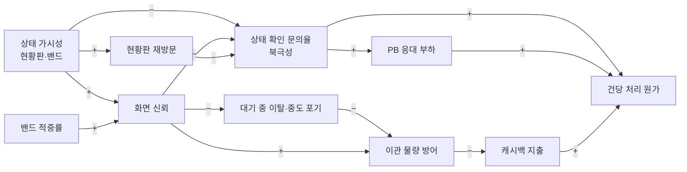
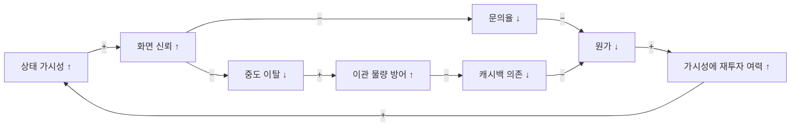
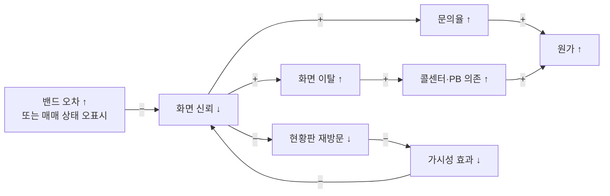
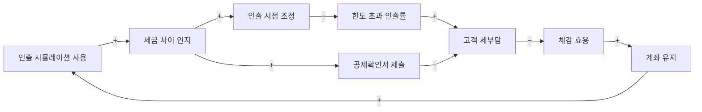
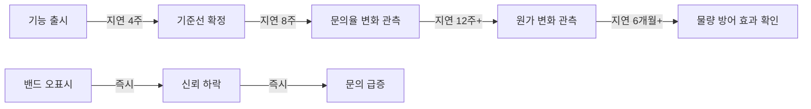

# 08. 인과 순환 다이어그램 (CLD · Causal Loop Diagram)

> 출처: `ai-place-srs-v1_0.md` §6.4.1 가설 · §6.4.2 지표 · §6.10 사업 배경
> 이 문서는 **지표들이 서로를 어떻게 밀고 당기는가**를 그린다. 개별 지표만 보면 놓치는 순환 구조를 드러내는 것이 목적이다.
>
> 코드 구조를 다루는 **클래스 다이어그램(Class Diagram)** 은 [`03-class-diagram.md`](03-class-diagram.md)에 있다.

---

## 읽는 법

| 표기 | 의미 |
|---|---|
| `+` | 같은 방향 — 앞이 커지면 뒤도 커진다 |
| `−` | 반대 방향 — 앞이 커지면 뒤는 작아진다 |
| **R** (Reinforcing) | 강화 순환 — 돌수록 증폭된다. 좋은 쪽으로도, 나쁜 쪽으로도 |
| **B** (Balancing) | 균형 순환 — 스스로 제동을 건다 |

---

## 1. 전체 인과 구조

---

## 2. 핵심 순환

### R1 — 신뢰 강화 순환 (이 제품이 노리는 것)

**이것이 가설 H1·H5의 논리다.** 상태를 보여주면 → 문의가 줄고 → 원가가 내려가고 → 캐시백 없이 물량을 지킬 수 있다. 사업 논리 전체가 이 순환 하나에 걸려 있다.

> **H5가 가장 늦게 검증된다.** 나머지 가설은 화면 단위로 되돌릴 수 있지만 H5는 사업 구조 판단이다. Phase 3 전까지는 원가 지표를 월간으로 계속 읽는다.

### R2 — 신뢰 붕괴 순환 (막아야 하는 것)

**같은 순환이 반대로 돌면 이렇게 된다.** 매일 보는 화면이라 한 번 어긋나면 빠르게 무너진다.

이 순환을 끊는 장치가 **가드레일 지표**다.

| 장치 | 임계 | 발동 |
|---|---|---|
| 매매 상태 오표시 주문 거부율 | ≤ 0.1% (일간) | 초과 시 즉시 알람 + 기능 롤백 |
| 밴드 적중률 | ≥ 85% | 2주 미달 시 밴드 폭 확대, 그래도 미달이면 완료일 표시 중단 |
| 미확인 매매 상태 | — | `LOCKED`로 보수 강등 (오표시 자체를 원천 차단) |

> **가드레일은 목표치가 아니라 브레이크다.** 다른 지표는 목표에 가까울수록 좋지만 이것은 넘으면 멈추는 선이다.

### B1 — 재방문의 자기 제동 (양날)

**재방문은 낮을수록 좋은 지표가 아니다.**

| 구간 | 해석 |
|---|---|
| < 1.5회/건 | 화면을 **못 찾고** 있다 |
| 1.5 ~ 4.0회/건 | 정상 대역 |
| > 4.0회/건 | 화면이 **답을 못 주고** 있다 |

대역을 벗어나면 북극성(문의율)과 교차 확인해 원인을 가른다. 재방문이 높은데 문의율도 높으면 화면이 답을 못 주는 것이고, 재방문이 높은데 문의율이 낮으면 그냥 자주 확인하는 것이다.

### B2 — 예약 기능의 균형 순환

**예약은 양날이다.** 통제감을 주지만 저장만 하고 안 보내면 이관이 성사되지 않는다. 그래서 **예약 → 전송 전환율**을 지표로 잡았다.

| 값 | 판정 |
|---|---|
| ≥ 60% | 목표 달성 — 선택권이 통제감으로 작동 |
| 30 ~ 60% | 관찰 구간 |
| < 30% | **가설 H2 반증** — 예약을 저장 전용으로 축소하고 전송 시점 선택 UI를 걷어낸다 |

---

## 3. 기능2의 인과 구조

**가설 H3·H4가 이 구조에 있다.**

- **H3** — 세금 차이를 미리 보면 인출 시점을 조정한다 → 한도 초과 인출률이 미사용 대비 -30%p
- **H4** — 동선을 만들면 확인서를 실제로 제출한다 → 제출 전환 ≥ 15%

검증 데이터셋 기준으로 이 두 경로의 효과 크기가 다르다.

| 경로 | 세금 변화 | 조건 |
|---|---:|---|
| 확인서 제출 (H4) | 465,960 → 355,080원 (**-110,880원**) | 서류 한 장 |
| 인출 시점 조정 (H3) | 1,020,000 → 264,000원 (**-756,000원**) | 한 해 미루기 |

> **"서두르면 세금이 3배"** — 720만원 한도인데 1,200만원을 빼면 초과 480만원에 16.5%가 붙는다. 같은 480만원을 내년 한도 안에서 빼면 5.5%다. 이 차이를 인출 **전에** 보여주는 것이 기능2의 존재 이유다.

**H3가 반증되면** F2-04를 정보 제공으로 축소하고 무게를 F2-05(확인서)로 옮긴다. 효과 크기는 작지만 행동 장벽이 낮기 때문이다.

---

## 4. 지연 요소 — 왜 효과가 늦게 나타나는가

**손상은 즉시, 효과는 늦게 나타난다.** 이 비대칭이 릴리스 계획을 단계적으로 짠 이유다.

| 단계 | 관측 가능해지는 것 |
|---|---|
| Phase 0 | 기준선 (문의율·자동취소율) |
| Phase 1 | 밴드 적중률 · 예약 전환율 · 확인서 제출률 |
| Phase 2 | 문의율 변화 · 한도 초과 인출률 |
| Phase 3 | 건당 원가 · 물량 방어 |

가드레일(주문 거부율)만 **일간**으로 본다. 이것만 즉시 손상되는 항목이기 때문이다.

---

## 5. 지표 ↔ 순환 대응

| 지표 | 속한 순환 | 역할 |
|---|---|---|
| 상태 확인 문의율 (북극성) | R1 · R2 | 순환의 방향을 알려주는 대표 지표 |
| 밴드 적중률 | R1 · R2 | 신뢰의 선행 지표 |
| 매매 상태 오표시 거부율 | R2 | **브레이크** — 붕괴 순환 차단 |
| 현황판 재방문 | B1 | 양방향 해석 — 단독으로 읽지 않음 |
| 예약 → 전송 전환율 | B2 | 예약 기능의 존속 판정 |
| 한도 초과 인출률 | 기능2 구조 | H3 검증 |
| 공제확인서 제출 건수 | 기능2 구조 | H4 검증 |
| 건당 처리 원가 | R1 | H5 검증 — 사업 논리의 최종 판정 |
