# [SRS 문서] 연금플러스 (한글)

# 소프트웨어 요구사항 명세서 (SRS)

**Document ID:** SRS-PENSION-MVP-001
**Revision:** 2.0
**Date:** 2026-08-25
**Standard:** ISO/IEC/IEEE 29148:2018

---

> **양식 고지.** 이 문서는 예시 SRS(`[SRS 문서] AD-Core-Platform`)의 구성을 따른다. 예시가 다루지 않는 내용은 **[추가]** 표시와 함께 §6 부록에 별도 절로 두었다. 예시 범위 안에서 처리 가능한 내용을 임의로 확장하지 않았고, 예시에 있으나 이 제품에 대응 내용이 없는 절은 만들지 않았다.

---

## 1. 개요 (Introduction)

### 1.1 목적 (Purpose)

이 문서는 **연금계좌 이체 진행 조회 및 인출순서 시뮬레이션 서비스**의 요구사항을 ISO/IEC/IEEE 29148:2018 표준에 따라 정의한다.

이관 처리 속도는 원 사업자와 예탁결제원 단일 인프라에 묶여 있어 어느 증권사도 단축할 수 없다. 이 시스템은 **처리 속도를 바꾸지 않는다.** 처리 상태를 고객에게 보이게 하고, 인출 시 세액을 사전에 계산해 보여주는 것이 목적이다.

### 1.2 범위 (Scope)

- **6단계 이관 진행 상태 추적** — 확정 구간과 추정 구간을 계층(`layer`)으로 분리
- **완료일 밴드 산출** — 단일 날짜가 아닌 최소 2영업일 폭, 4단계 폴백 사다리
- **매매 잠금 계층 관리** (`OPEN` · `SELL_ONLY` · `LOCKED` · `REOPENED`)와 예약(`DRAFT`) 상태 기반 전송 시점 선택
- **보유 종목 3그룹 판정**과 병목 종목(`is_critical_path`) 지목
- **법정 3층 재원 인출순서 계산** (과세제외금액 → 이연퇴직소득 → 세액공제분·운용수익)
- **연금수령한도 산출** 및 한도 내/초과 세율 분리 적용
- **연 1,500만원 종합과세 판정**과 공제확인서 기반 버킷 이동
- 소프트 삭제 없음 — 감사 로그 10년 보존 (WORM)
- 모바일 앱 단일 클라이언트, 시뮬레이션 API는 **어떤 상태도 변경하지 않음**

### 1.3 용어·약어 정의 (Definitions, Acronyms, Abbreviations)

| 용어 | 정의 |
| --- | --- |
| 이수관 | 연금계좌를 다른 금융회사로 옮기는 절차. 보내는 쪽이 **이관사**, 받는 쪽이 **수관사** |
| 실물이전 | 보유 종목을 매도하지 않고 그대로 옮기는 방식. 같은 유형 계좌 간(IRP↔IRP, DC↔DC, DB↔DB)에만 가능 |
| 계좌이체 | 전액 현금화해 옮기는 방식. 연금저축계좌는 이 방식만 가능 |
| 잠금 구간 | 전송 확정 시각부터 수관 계좌 입고 반영 시각까지, 매매·납입 등이 제한되는 기간 |
| 안내 밴드 | 잠금 구간 해제일을 단일 날짜가 아닌 **최소 2영업일 폭의 기간**으로 표시한 값 |
| 병목 종목 | 결제주기가 가장 느려 전체 해제일을 결정하는 종목 (`is_critical_path`) |
| 3층 재원 | 인출 시 법정 순서대로 차감되는 재원 — 1층 과세제외금액, 2층 이연퇴직소득, 3층 세액공제분·운용수익 |
| 과세제외금액 | 세액공제를 받지 않은 원금 등 비과세로 인출되는 재원 (1층). 내부적으로 4개 버킷 |
| 이연퇴직소득 | 퇴직금이 연금계좌에 입금되어 과세가 이연된 재원 (2층) |
| 연금수령한도 | 소득세법 시행령 §40의2가 정한 연간 인출 상한. 초과분은 연금외수령으로 과세 |
| 연금수령연차 | 한도 산식의 분모. **한도용**(수령 여부 무관 누적)과 **감면율용**(실제 수령분만)이 별개 |
| 부득이한 사유 | 시행령 §20의2가 정한 인출 사유. 한도에 산입되지 않고 연금소득세율 적용 |
| 폴백 사다리 | 밴드 산출 근거가 없을 때 4단계로 강등하는 규칙 (실측 → 자산구성 → 업계 기준) |
| 확정 / 추정 | 전문 수신으로 확인된 값(`layer = 확정`)과 기준 소요로 산출한 값(`layer = 추정`)의 구분 |
| 가드레일 지표 | 목표에 근접할수록 좋은 지표가 아니라 **넘으면 즉시 중단하는 상한선** |
| SLO | Service Level Objective — 서비스 수준 목표 |
| AC | Acceptance Criteria — 인수 조건 |
| ADR | Architecture Decision Record — 설계 결정 기록 |
| IRP | Individual Retirement Pension — 개인형 퇴직연금 |
| DB / DC | Defined Benefit / Defined Contribution — 확정급여형 / 확정기여형 퇴직연금 |
| KSD | Korea Securities Depository — 한국예탁결제원 |
| CTI | Computer Telephony Integration — 콜센터 연동 |
| MoSCoW | Must / Should / Could / Won't — 우선순위 분류 |
| PB | Private Banker |
| WORM | Write Once Read Many — 1회 기록 후 변경 불가 저장 |
| E2E 응답 시간 | End-to-end 요청 처리 시간 |

---

## 2. 이해관계자 (Stakeholders)

| 역할 | 소속 | 책임 |
| --- | --- | --- |
| 기획 매니저 (PM) | 기획팀 | 요구사항 수집·우선순위 결정, 문서 승인 |
| 기획 분석가 (IT) | 기획팀 | 상세 요구사항 문서화, 화면 정의 |
| 개발팀 리드 | 백엔드팀 | 설계 검토·승인, 계산 엔진 아키텍처 |
| 개발 엔지니어 | 백엔드 개발 | 구현 및 단위 시험 |
| 시스템 운영자 | 운영팀 | 배포·모니터링, 가드레일 알람 대응 |
| 서비스 운영자 | 운영팀 | 운영 중 예외 처리, 이관 지연 건 대응 |
| **연금시스템 담당자** | 연금운영팀 | **원장 필드 제공, `settle_days` 실측 확보** (§6.12 게이트 항목) |
| **법무·컴플라이언스** | 법무팀 | **규제 해당 여부 판정** (§6.9 제약 11건 검토) |
| 콜센터 운영자 | 고객센터 | 문의코드 `TRF-STATUS` 적재, 북극성 지표 기준선 산출 |
| 세율 운영자 | 세제기획 | 세법 개정 시 세율 설정 갱신 (D+30 이내) |

> **굵게 표시한 두 이해관계자가 착수 게이트를 쥐고 있다.** 연금시스템 담당자가 `settle_days` 실측을 주지 않으면 밴드 정확도가 확보되지 않아 Phase 1에 착수할 수 없고, 법무 검토가 닫히지 않으면 타사 계좌 기능을 Phase 2로 이연한다.

---

## 3. 시스템 컨텍스트 및 인터페이스 (System Context and Interfaces)

- **클라이언트 애플리케이션**
    1. 모바일 앱 (iOS / Android) → `https://api.kbsec.example.com/mobile`
    2. 화면 12종 — F1-01 ~ F1-06 (이수관 현황판), F2-01 ~ F2-06 (인출순서 시뮬레이터)

- **내부 서비스**
    - 이관 서비스 (Transfer Service) : 예약·전송·단계 전이·완료 판정
    - 인출 서비스 (Withdrawal Service) : 한도·인출순서·세액 시뮬레이션
    - 매매창 서비스 (Trading Window Service) : 매매 가능 여부 판정 (주문 시스템에 응답)
    - 밴드 산출 엔진 (Band Calculator) : 완료일 밴드 산출과 폴백 사다리
    - 알림 서비스 (Notification Service) : 상태 전이 알림 4종

- **외부 시스템**
    - KB증권 연금 원장 (읽기 전용)
    - 예탁결제원 통보 전문 (KSD)
    - 마이데이터 연금 API
    - 주문 시스템
    - 은행연합회 · 금융감독원 (딥링크)
    - 콜센터 CTI · 운영 대시보드

**시스템 컨텍스트**

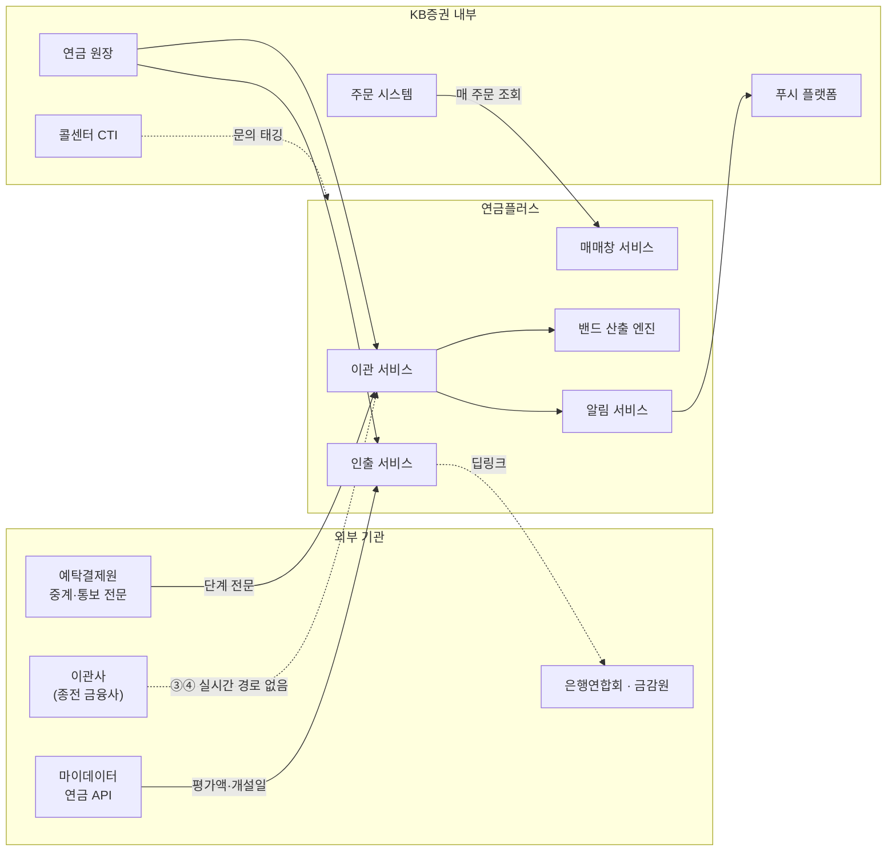
```mermaid
flowchart LR
    subgraph EXT["외부 기관"]
        KSD["예탁결제원<br/>중계·통보 전문"]
        PREV["이관사<br/>(종전 금융사)"]
        MYD["마이데이터<br/>연금 API"]
        EXTL["은행연합회 · 금감원"]
    end
    subgraph SYS["연금플러스"]
        F1["이관 서비스"]
        F2["인출 서비스"]
        TW["매매창 서비스"]
        BC["밴드 산출 엔진"]
        NS["알림 서비스"]
    end
    subgraph INT["KB증권 내부"]
        LED["연금 원장"]
        ORD["주문 시스템"]
        PUSH["푸시 플랫폼"]
        CTI["콜센터 CTI"]
    end

    KSD -->|단계 전문| F1
    PREV -.->|"③④ 실시간 경로 없음"| F1
    MYD -->|평가액·개설일| F2
    LED --> F1 & F2
    F1 --> BC
    F1 --> NS --> PUSH
    ORD -->|매 주문 조회| TW
    F2 -.딥링크.-> EXTL
    CTI -.문의 태깅.-> SYS
```

> **설계 전제 — ③④ 구간에는 실시간 조회 경로가 존재하지 않는다.** 이관사 의사확인(③)과 자산 현금화(④)는 이관사 내부 처리다. 수관사가 받을 수 있는 것은 전문 수신 시점뿐이다. 이 사실 위에 추정 계층(§6.8)과 밴드 표시(§6.7)를 설계했다.

### 3.1 클라이언트 애플리케이션

화면 12종으로 구성된다. 모바일 기준 해상도는 375 × 812이다.

| 화면 ID | 화면명 | 기능 |
|---|---|---|
| F1-01 | 홈 · 진행 알림 | 기능1 |
| F1-02 | 유의사항 확인 | 기능1 |
| F1-03 | 이체 예약 · 잠금 구간 미리보기 | 기능1 |
| F1-04 | 이수관 현황판 | 기능1 |
| F1-05 | 완료일 근거 | 기능1 |
| F1-06 | 이체 완료 | 기능1 |
| F2-01 | 출금관리 | 기능2 |
| F2-02 | 수령 대상 선택 | 기능2 |
| F2-03 | 인출금액 입력 | 기능2 |
| F2-04 | 인출순서 결과 | 기능2 |
| F2-05 | 비과세 인출 관리 | 기능2 |
| F2-06 | 타명의 조회 | 기능2 |

**화면 전이**

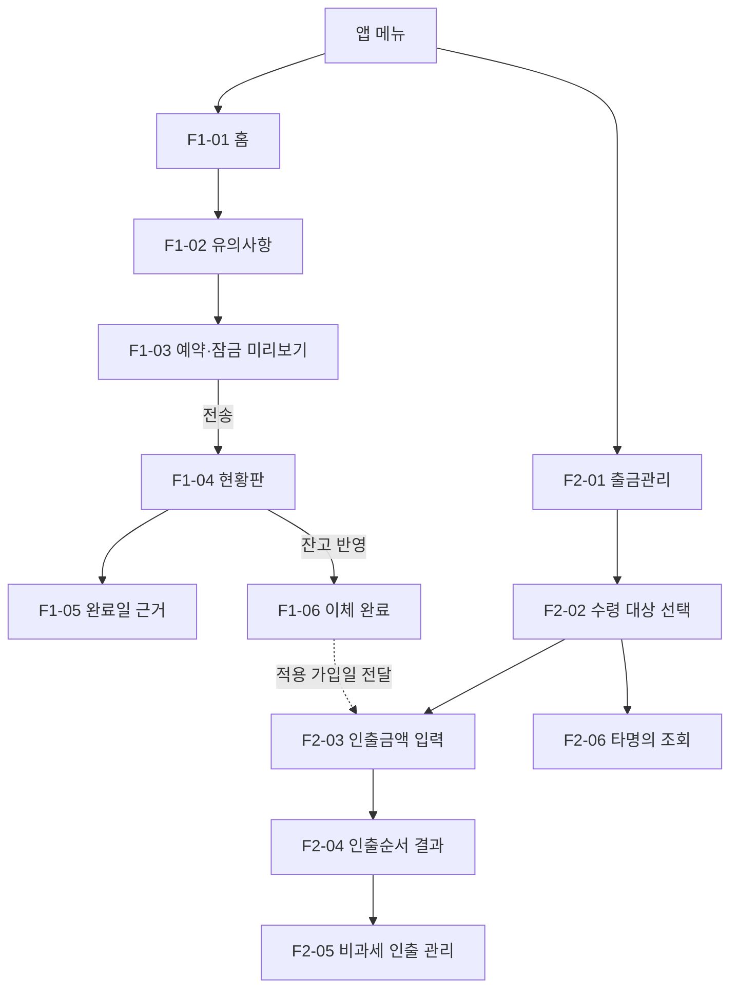
```mermaid
flowchart TD
    MENU["앱 메뉴"] --> F101["F1-01 홈"]
    MENU --> F201["F2-01 출금관리"]
    F101 --> F102["F1-02 유의사항"]
    F102 --> F103["F1-03 예약·잠금 미리보기"]
    F103 -->|전송| F104["F1-04 현황판"]
    F104 --> F105["F1-05 완료일 근거"]
    F104 -->|잔고 반영| F106["F1-06 이체 완료"]
    F106 -.->|적용 가입일 전달| F203
    F201 --> F202["F2-02 수령 대상 선택"]
    F202 --> F203["F2-03 인출금액 입력"]
    F202 --> F206["F2-06 타명의 조회"]
    F203 --> F204["F2-04 인출순서 결과"]
    F204 --> F205["F2-05 비과세 인출 관리"]
```

### 3.2 외부 시스템 연동

**배포 단위와 외부 경계** — 상세는 [설계 04 컴포넌트 다이어그램](./design/04_%EC%BB%B4%ED%8F%AC%EB%84%8C%ED%8A%B8_%EB%8B%A4%EC%9D%B4%EC%96%B4%EA%B7%B8%EB%9E%A8.md)

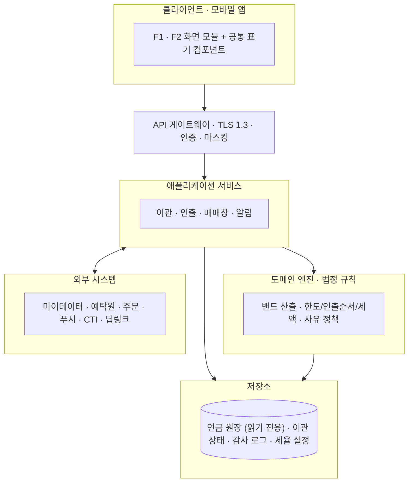
```mermaid
flowchart TB
    subgraph CLIENT["클라이언트 · 모바일 앱"]
        UI["F1 · F2 화면 모듈 + 공통 표기 컴포넌트"]
    end
    GW["API 게이트웨이 · TLS 1.3 · 인증 · 마스킹"]
    subgraph APP["애플리케이션 서비스"]
        SVC["이관 · 인출 · 매매창 · 알림"]
    end
    subgraph DOM["도메인 엔진 · 법정 규칙"]
        ENG["밴드 산출 · 한도/인출순서/세액 · 사유 정책"]
    end
    subgraph STORE["저장소"]
        DB[("연금 원장 (읽기 전용) · 이관 상태 · 감사 로그 · 세율 설정")]
    end
    subgraph EXT["외부 시스템"]
        E["마이데이터 · 예탁원 · 주문 · 푸시 · CTI · 딥링크"]
    end

    CLIENT --> GW --> APP --> DOM
    APP --> STORE
    DOM --> STORE
    APP <--> EXT
```

> **공통 표기 컴포넌트를 따로 둔 이유.** "단일 날짜 금지", "확정/추정 분리", "모의계산 라벨 고정"은 화면마다 지켜야 하는 규칙이다. 화면별로 구현하면 한 곳이 빠져도 모른다.

| # | 인터페이스 | 방향 | 데이터 | 확보 상태 | 미확보 시 동작 |
|:---:|---|:---:|---|:---:|---|
| I-1 | KB증권 연금 원장 | 조회 | 계좌 개설일·승계 플래그·재원별 잔액·연간 누적 인출액 등 (§6.4) | 확정 | — |
| I-2 | 마이데이터 연금 API (`DB-001`, `DC-001~004`, `IRP-001~004`) | 조회 | 계좌잔액·평가금액·투자원금·개설일·최초납입일·상품별 원금·거래내역 | 확정 | 수기 입력 폴백 |
| I-3 | 예탁결제원 통보 전문 | 수신 | 단계별(④⑤) 전문 수신 시각 | 협의 중 | 폴백 사다리 ③단계로 밴드 산출 |
| I-4 | 주문 시스템 | 조회·통제 | `trading_window` 값에 따른 매수·매도·납입·수령 신청 차단 | 확정 | 미확인 시 `LOCKED` 적용 |
| I-5 | 푸시 플랫폼 | 발송 | 알림 3종 + 완료 알림 | 확정 | 인앱 알림으로 대체 |
| I-6 | 은행연합회 한도조회 | 딥링크 | URL 이동만. 결과 수신 없음 | 확인 | 해당 버튼 비노출 |
| I-7 | 금융감독원 상속인 조회 | 딥링크 | URL 이동만. 결과 수신 없음 | 확인 | 고객센터 안내로 대체 |
| I-8 | 콜센터 CTI | 적재 | 문의코드 `TRF-STATUS` | Phase 0 신설 | **기준선 측정 불가 → Phase 1 승격 차단** |
| I-9 | 세율 설정 저장소 | 조회 | 시행일이 붙은 세율·감면율 상수 | 신설 | 계산 결과 노출 차단 |

**I-2 규격 한계** — 마이데이터 은행·금융투자 양 업권 규격 모두에 **과세제외금액 / 이연퇴직소득 / 세액공제 받은 납입액**이 없다. `가입자부담금`과 `사용자부담금`의 구분은 재원 구분의 대체물이 될 수 없다. 이연퇴직소득은 사용자부담금과 다른 개념이고, 세액공제 수령 여부는 어느 필드에도 담기지 않는다.

따라서 **한도 계산은 타사 계좌까지 가능**(평가액·개설일만 필요)하나 **세액 계산은 자사 계좌 전용**이다.

#### 3.2.1 통신 규약

| # | 요구사항 |
|:---:|---|
| N-1 | 모든 외부 통신은 TLS 1.3을 사용한다 |
| N-2 | 마이데이터 호출 타임아웃은 3초로 하고, 초과 시 폴백 사다리로 강등한다 |
| N-3 | 딥링크(I-6, I-7)는 URL 이동만 수행하며 개인정보를 쿼리 파라미터에 싣지 않는다 |

### 3.3 API 개요

내부 API는 **네 갈래**로 나뉜다. 갈래별로 인증 수준과 부수 효과가 다르다.

| 갈래 | 경로 접두 | 성격 | 인증 | 부수 효과 |
|---|---|---|---|---|
| **이관 조회** | `/api/v1/transfers` (GET) | 읽기 | 로그인 | 없음 |
| **이관 변경** | `/api/v1/transfers` (POST/PATCH) | 쓰기 | 로그인 + **본인 인증** | 상태 전이 · 감사 로그 |
| **인출 시뮬레이션** | `/api/v1/withdrawals/simulate` | 계산 | 로그인 | **없음 — 실행이 아님** |
| **매매창 판정** | `/internal/v1/trading-window` | 읽기 | 내부 시스템 간 인증 | 없음 |

전체 엔드포인트 목록과 요청·응답 스키마는 §6.1에 있다.

**설계 원칙**

| # | 원칙 | 이유 |
|:---:|---|---|
| API-1 | **시뮬레이션 API는 어떤 것도 쓰지 않는다** | 실행으로 이어지는 경로를 만들면 투자일임업 정의에 걸린다 (R-4) |
| API-2 | 완료일은 **항상 밴드 두 값**(`endBandFrom`/`endBandTo`)으로 응답한다. 단일 날짜 필드를 두지 않는다 | 응답 스키마 자체가 단정을 막는다 (R-7 · D-2) |
| API-3 | 추정 필드에는 `layer`와 `confidence`를 함께 응답한다 | 클라이언트가 확정/추정을 구분해 렌더할 수 있어야 한다 (D-1) |
| API-4 | 전송 API 요청 본문에 **화면에 표시 중이던 밴드 값**을 포함한다 | 서버가 다시 계산하면 그때 화면 값과 달라진다. 감사 로그에 남을 값은 클라이언트가 보낸 것이어야 한다 (S-1) |

**공통 응답 코드**

| 코드 | HTTP | 의미 | 클라이언트 처리 |
|---|:---:|---|---|
| `TRANSFER_LOCK` | 409 | 이관 중 제한 업무 | 제한 사유와 해제 시점 표시 |
| `AUTH_REQUIRED` | 401 | 본인 인증 미완 | 인증 플로우로 이동 |
| `AUDIT_WRITE_FAILED` | 500 | 감사 로그 적재 실패 | **전송 롤백** 후 재시도 안내 |
| `TAX_TABLE_STALE` | 503 | 세율표 시행일 +30일 초과 | "세율 정보 업데이트 중입니다" |
| `AMOUNT_EXCEEDS_BALANCE` | 400 | 인출액 > 평가금액 | 최대 인출 가능액 안내 |
| `FOREIGN_ACCOUNT_NO_TAX` | **200** | 타사 계좌 | 한도만 표시, 세액란 공란 + 사유 |
| `MYDATA_TIMEOUT` | **200** | 마이데이터 3초 초과 | 개략 밴드 + "대략치입니다" |

> 마지막 두 개는 **오류가 아니라 200 응답의 상태 표시**다. 실패로 처리해 빈 화면을 띄우면 안 된다.

### 3.4 인터랙션 시퀀스

핵심 흐름 4개의 간결한 버전이다. 오류 분기와 대안 흐름까지 담은 확장 버전은 §6.5에 있다.

#### 3.4.1 이체 예약·전송 시퀀스

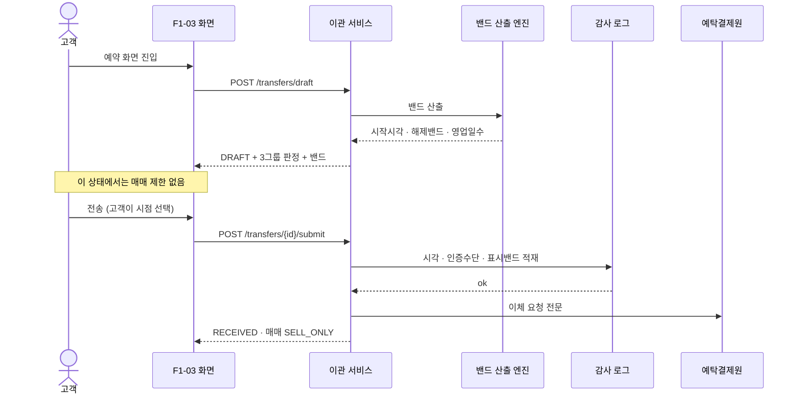
```mermaid
sequenceDiagram
    actor C as 고객
    participant UI as F1-03 화면
    participant TS as 이관 서비스
    participant BC as 밴드 산출 엔진
    participant AL as 감사 로그
    participant KSD as 예탁결제원

    C->>UI: 예약 화면 진입
    UI->>TS: POST /transfers/draft
    TS->>BC: 밴드 산출
    BC-->>TS: 시작시각 · 해제밴드 · 영업일수
    TS-->>UI: DRAFT + 3그룹 판정 + 밴드
    Note over C,UI: 이 상태에서는 매매 제한 없음

    C->>UI: 전송 (고객이 시점 선택)
    UI->>TS: POST /transfers/{id}/submit
    TS->>AL: 시각 · 인증수단 · 표시밴드 적재
    AL-->>TS: ok
    TS->>KSD: 이체 요청 전문
    TS-->>UI: RECEIVED · 매매 SELL_ONLY
```

#### 3.4.2 진행 단계 갱신 시퀀스

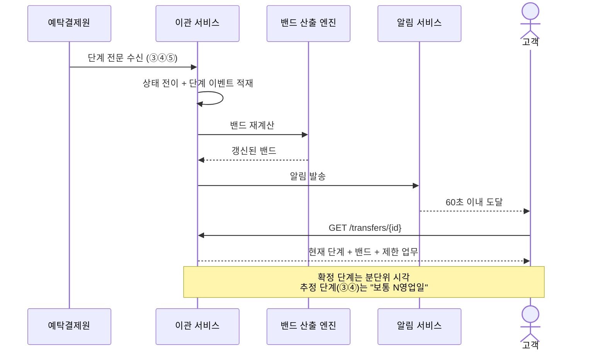
```mermaid
sequenceDiagram
    participant KSD as 예탁결제원
    participant TS as 이관 서비스
    participant BC as 밴드 산출 엔진
    participant NS as 알림 서비스
    actor C as 고객

    KSD->>TS: 단계 전문 수신 (③④⑤)
    TS->>TS: 상태 전이 + 단계 이벤트 적재
    TS->>BC: 밴드 재계산
    BC-->>TS: 갱신된 밴드
    TS->>NS: 알림 발송
    NS-->>C: 60초 이내 도달

    C->>TS: GET /transfers/{id}
    TS-->>C: 현재 단계 + 밴드 + 제한 업무
    Note over C,TS: 확정 단계는 분단위 시각<br/>추정 단계(③④)는 "보통 N영업일"
```

#### 3.4.3 인출순서·세액 계산 시퀀스

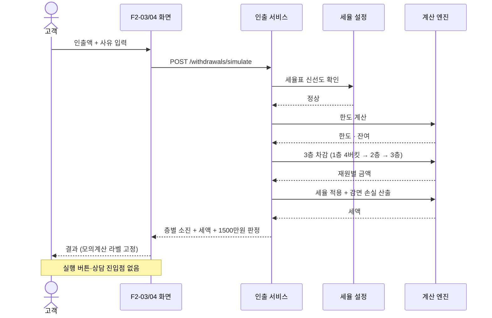
```mermaid
sequenceDiagram
    actor C as 고객
    participant UI as F2-03/04 화면
    participant WS as 인출 서비스
    participant TRP as 세율 설정
    participant ENG as 계산 엔진

    C->>UI: 인출액 + 사유 입력
    UI->>WS: POST /withdrawals/simulate
    WS->>TRP: 세율표 신선도 확인
    TRP-->>WS: 정상
    WS->>ENG: 한도 계산
    ENG-->>WS: 한도 · 잔여
    WS->>ENG: 3층 차감 (1층 4버킷 → 2층 → 3층)
    ENG-->>WS: 재원별 금액
    WS->>ENG: 세율 적용 + 감면 손실 산출
    ENG-->>WS: 세액
    WS-->>UI: 층별 소진 + 세액 + 1500만원 판정
    UI-->>C: 결과 (모의계산 라벨 고정)
    Note over C,UI: 실행 버튼·상담 진입점 없음
```

#### 3.4.4 매매창 판정 시퀀스

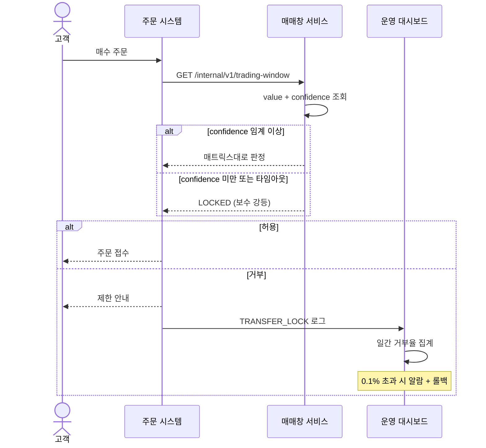
```mermaid
sequenceDiagram
    actor C as 고객
    participant ORD as 주문 시스템
    participant TW as 매매창 서비스
    participant MON as 운영 대시보드

    C->>ORD: 매수 주문
    ORD->>TW: GET /internal/v1/trading-window
    TW->>TW: value + confidence 조회
    alt confidence 임계 이상
        TW-->>ORD: 매트릭스대로 판정
    else confidence 미만 또는 타임아웃
        TW-->>ORD: LOCKED (보수 강등)
    end

    alt 허용
        ORD-->>C: 주문 접수
    else 거부
        ORD-->>C: 제한 안내
        ORD->>MON: TRANSFER_LOCK 로그
        MON->>MON: 일간 거부율 집계
        Note over MON: 0.1% 초과 시 알람 + 롤백
    end
```

---

## 4. 세부 요구사항 (Specific Requirements)

### 4.1 기능 요구사항 (Functional Requirements)

| ID | 제목 | 출처 | 우선순위 | 유형 | 검증 | 인수 조건 | 상태 | 담당 |
| --- | --- | --- | --- | --- | --- | --- | --- | --- |
| **REQ-FUNC-001** | 홈 진행 카드 및 상태 알림 | AS-IS 갭 G-2 | Must Have | Functional | 1) 렌더 시험<br>2) 알림 전이 시험<br>3) QA 검증 | 진행 건이 있으면 5요소(단계·이관사·수관계좌·완료 기간·신청일)를 표시하고, 상태 전이 후 60초 이내 알림 발송. 진행 건이 0건이면 카드 미노출 | Proposed | 개발 엔지니어 |
| **REQ-FUNC-002** | 이관 유의사항 및 가입일 승계 표시 | AS-IS 갭 G-1 | Must Have | Functional | 1) 플래그 분기 시험<br>2) 문구 검사<br>3) QA 검증 | 원장 승계 플래그 값을 그대로 표시. `null`이면 승계·미승계 양쪽 한도를 병렬 표시. 이체 불가 조건 3종 전부 노출 | Proposed | 기획 분석가 (IT) |
| **REQ-FUNC-003** | 보유 종목 3그룹 판정 및 병목 지목 | AS-IS 갭 G-5 | Must Have | Functional | 1) 판정 로직 시험<br>2) 병목 산출 검증<br>3) QA 검증 | 전 종목을 그대로 옮김/팔아야 함/판정 불가로 분류. 결제주기 최장 종목을 `is_critical_path`로 서버가 지목. 현금화 대상은 확정 손익을 금액으로 병기 | Proposed | 개발 엔지니어 |
| **REQ-FUNC-004** | 예약 저장 및 전송 시점 선택 | AS-IS 갭 G-4 · ADR-002 | Must Have | Functional | 1) 상태 전이 시험<br>2) 매매 제한 시험<br>3) QA 검증 | `DRAFT` 상태에서 매수·매도·납입·수령 4건 모두 제한 없음. 전송은 본인 인증 후에만 활성화되며 시각·인증수단·표시 밴드를 감사 로그에 적재 | Proposed | 개발팀 리드 |
| **REQ-FUNC-005** | 잠금 구간 미리보기 및 완료일 밴드 산출 | AS-IS 갭 G-3 · ADR-003 | Must Have | Functional | 1) 밴드 산식 시험<br>2) 폴백 사다리 시험<br>3) 캐시 일관성 시험 | 시작시각·해제밴드·영업일수 3요소 표시. 밴드는 **최소 폭 2영업일**이며 단일 날짜 표시 금지. 같은 날 재조회 시 값 동일 | Proposed | 개발 엔지니어 |
| **REQ-FUNC-006** | 이수관 진행 현황판 | AS-IS 갭 G-2 | Must Have | Functional | 1) 단계 전이 시험<br>2) 문구 검사<br>3) QA 검증 | 6단계 타임라인 표시. 확정 단계는 분단위 시각, 추정 단계(③④)는 "보통 N영업일" 서술. 제한 업무 4항목과 해제 시점 병기 | Proposed | 개발 엔지니어 |
| **REQ-FUNC-007** | 예외 상태 4종 처리 | 설계 문서 §6.8 | Must Have | Functional | 1) 예외 분기 시험<br>2) 문구 검사<br>3) QA 검증 | 고객확인필요/지연/일부이전불가/거절 각각 처리. 거절 시 사유 코드가 아닌 평이화 문구와 해소 절차 3단계 표시. 재신청 버튼은 해소 확인 전까지 비활성 | Proposed | 서비스 운영자 |
| **REQ-FUNC-008** | 이체 완료 판정 및 정산 표시 | ADR-009 | Must Have | Functional | 1) 완료 판정 시험<br>2) 알림 시험<br>3) QA 검증 | **수관 계좌 잔고 반영 확인 후에만** 완료 표시. 송금 통보만으로는 `REMITTING` 유지. 반영 시 60초 이내 알림 (야간·주말 무관) | Proposed | 시스템 운영자 |
| **REQ-FUNC-009** | 인출 메뉴 신설 및 사전 정보 노출 | AS-IS 갭 G-6 | Must Have | Functional | 1) 메뉴 구조 검사<br>2) 값 표시 시험<br>3) QA 검증 | "연금 외 수령"을 연금수령·해지와 **같은 층**에 배치. 평가금액·적용 가입일·기인출액·남은 금액 4개 값을 진입 전 노출. 본인/타명의 분기 제공 | Proposed | 기획 분석가 (IT) |
| **REQ-FUNC-010** | 연금수령한도 산출 및 사유별 판정 | 시행령 §40의2 · §20의2 | Must Have | Functional | 1) 산식 시험 (검증 데이터셋 대조)<br>2) 사유 분기 시험<br>3) QA 검증 | 평가액 ÷ (11 − 연차) × 1.2 적용. 연차 11년 이상은 "한도 없음". **주택 구입은 부득이한 사유가 아니므로 한도 정상 소진.** 한도 초과 입력을 차단하지 않음 | Proposed | 개발 엔지니어 |
| **REQ-FUNC-011** | 3층 재원 인출순서 계산 | 시행령 §40의3 | Must Have | Functional | 1) 차감 순서 시험<br>2) 4버킷 시험<br>3) QA 검증 | 1층 과세제외 → 2층 이연퇴직소득 → 3층 순으로 강제 차감. 1층 내부 4버킷 순서 준수. **4호는 공제확인서 확인 전까지 3층으로 과세** | Proposed | 개발 엔지니어 |
| **REQ-FUNC-012** | 세액 산출 및 연 1,500만원 판정 | 소득세법 §129 · §14③9호 | Must Have | Functional | 1) 세액 시험 (검증 데이터셋 6건)<br>2) 판정 로직 시험<br>3) QA 검증 | 지방소득세 포함 실효세율 표기. 한도 초과분에 다른 세율 적용 후 **잃은 감면액 별도 표시.** 라목 미분리 계좌는 1,500만원 판정 미제공 | Proposed | 개발 엔지니어 |
| **REQ-FUNC-013** | 비과세 인출 관리 및 공제확인서 동선 | 시행령 §40의3 ② 단서 | Should Have | Functional | 1) 전후 비교 시험<br>2) 버킷 이동 시험<br>3) QA 검증 | 확인서 제출 전/후 비과세 인출 가능액을 나란히 표시. 제출 시 4호 버킷이 3층→1층 이동하고 세액 감소. 홈택스 직접 발급 안내만 (알선 금지) | Proposed | CRM 담당자 |
| **REQ-FUNC-014** | 타명의·상속 계좌 조회 안내 | AS-IS 갭 G-8 | Should Have | Functional | 1) 딥링크 시험<br>2) 안내 검사<br>3) QA 검증 | 금감원 상속인 조회 딥링크와 **필요 서류 목록 병기.** 이 조회로 확인되지 않는 기관 목록 명시. 배우자 승계 시 항목별 기준 4종 표 제공 | Proposed | 서비스 운영자 |

우선순위 분포 — Must Have 12건, Should Have 2건. 상세 요구사항 83건 전건과 Given-When-Then 인수 조건 76건은 **§6.6**에 있다.

### 4.2 비기능 요구사항 (Non-Functional Requirements)

| ID | 제목 | 출처 | 우선순위 | 유형 | 검증 | 인수 조건 | 상태 | 담당 |
| --- | --- | --- | --- | --- | --- | --- | --- | --- |
| **REQ-NF-001** | 현황판 E2E 응답 시간 ≤ 1.2초 | 업계 가이드라인 | Must Have | Performance | 부하 시험 (동시 조회 시나리오) | 잠금 구간·현황판 첫 렌더 p95 ≤ 1.2초, 홈 카드 p95 ≤ 0.8초, 상태 조회 API p95 ≤ 500ms | Proposed | 시스템 운영자 |
| **REQ-NF-002** | 계산 결과 응답 시간 ≤ 1초 | 업계 가이드라인 | Must Have | Performance | 부하 시험 (계산 엔진 단독) | 인출 계산 결과 p95 ≤ 1초. 인출액 변경 시 재계산 ≤ 300ms | Proposed | 개발 엔지니어 |
| **REQ-NF-003** | 가용성 ≥ 99.5% | 업계 가이드라인 | Must Have | Reliability | 모니터링 및 SLA 검증 | 월 가용성 ≥ 99.5%, 영업일 08~18시 ≥ 99.9%. 5분 연속 헬스체크 실패 시 알람 | Proposed | 사업관리 담당자 |
| **REQ-NF-004** | 세율표 노후화 시 계산 차단 | ADR-008 | Must Have | Reliability | 신선도 점검 배치 시험 | 시행일 **+21일 사전 경고, +30일 계산 결과 노출 차단.** 낡은 세율로 계산 결과를 내면 실패 | Proposed | 세율 운영자 |
| **REQ-NF-005** | 전송 감사 로그 누락률 0% | 금소법 §44② | Must Have | Security | 감사 로그 적재 시험 · 롤백 시험 | 전송 시각·인증수단·**그때 표시된 밴드 값**을 적재. **적재 실패 시 전송 롤백.** 누락 1건이라도 발생 시 즉시 알람 | Proposed | 개발팀 리드 |
| **REQ-NF-006** | 감사 로그 10년 보존 | 상법 소멸시효 | Must Have | Security | 보존 정책 감사 | WORM 저장소에 10년 보존. 운영자 조회는 사유 입력 필수 | Proposed | 시스템 운영자 |
| **REQ-NF-007** | 전송·저장 암호화 | 보안 정책 | Must Have | Security | 보안 감사 및 접근통제 시험 | 전 구간 TLS 1.3, 저장 시 AES-256. TLS 1.2 이하 요청 1% 초과 시 알람 | Proposed | 개발팀 리드 |
| **REQ-NF-008** | 개인정보 마스킹 및 동의 검증 | 개인정보보호법 | Must Have | Security | 마스킹 검사 · 동의 로그 감사 | 계좌번호 중간 4자리 마스킹. 마이데이터 조회 시점 유효 동의 100%. 딥링크에 개인정보를 쿼리 파라미터로 싣지 않음 | Proposed | 법무·컴플라이언스 |
| **REQ-NF-009** | 매매 상태 오표시 주문 거부율 ≤ 0.1% | 가드레일 | Must Have | Reliability | 일간 거부율 집계 · 실시간 알람 | 화면이 "가능"으로 표시했는데 거부된 주문 비율 **일간 0.1% 이하.** 초과 시 즉시 알람 + 기능 롤백. 미확인 시 `LOCKED` 보수 강등 | Proposed | 시스템 운영자 |
| **REQ-NF-010** | 표기 원칙 준수 | 금소법 §21① | Must Have | Usability | 문구 정적 검사 · 코드 리뷰 체크리스트 | 화면에 내부 상태 코드(영문 enum)·내부 용어·조문 약어 노출 0건. 완료일은 밴드, `모의계산 결과` 라벨 고정 | Proposed | 기획 분석가 (IT) |
| **REQ-NF-011** | 접근성 WCAG 2.1 AA | 접근성 지침 | Should Have | Usability | 색 대비 자동 검사 | 본문 텍스트 4.5:1, 큰 텍스트 3:1 이상. 한글은 어절 단위 줄바꿈 | Proposed | 기획 분석가 (IT) |
| **REQ-NF-012** | 세율 설정 외부화 | ADR-008 | Must Have | Maintainability | 코드 정적 분석 | 세율·감면율을 코드에 하드코딩하지 않고 **시행일이 붙은 설정으로 관리.** 코드 내 세율 리터럴 0건 | Proposed | 개발 엔지니어 |
| **REQ-NF-013** | 계산 로직 버전관리 및 검증 기록 | 금소법 §19 | Must Have | Maintainability | 릴리스별 검증 기록 감사 | 릴리스마다 §6.13 검증 데이터셋 6건 전건 대조. 1원이라도 다르면 릴리스 중단. 검증 기준은 국세청 홈택스 모의계산 | Proposed | 개발팀 리드 |
| **REQ-NF-014** | 운영 자원 상한 | 비용 정책 | Could Have | Efficiency | 자원 사용량 집계 | 이관 건당 푸시 ≤ 8건, 마이데이터 호출 ≤ 12회. 건당 처리 원가 PB 응대 대비 ≤ 5% | Proposed | 사업관리 담당자 |

우선순위 분포 — Must Have 12건, Should Have 1건, Could Have 1건.

---

## 5. 추적 매트릭스 (Traceability Matrix)

| 요구사항 ID | 모듈 | 구현 클래스 | 시험 케이스 ID | 상세 요구사항 |
| --- | --- | --- | --- | --- |
| REQ-FUNC-001 | 이관 서비스 | `TransferService` · `NotificationService` | TC-FUNC-001 | FR-F1-01-01 ~ 05 |
| REQ-FUNC-002 | 이관 서비스 | `JoinDateResolver` | TC-FUNC-002 | FR-F1-02-01 ~ 05 |
| REQ-FUNC-003 | 밴드 산출 엔진 | `HoldingClassifier` · `CriticalPathResolver` | TC-FUNC-003 | FR-F1-03-01, 03, 06 |
| REQ-FUNC-004 | 이관 서비스 | `TransferService` · `AuditLogger` | TC-FUNC-004 | FR-F1-03-04, 09 |
| REQ-FUNC-005 | 밴드 산출 엔진 | `BandCalculator` · `FallbackLadder` | TC-FUNC-005 | FR-F1-03-02, 05, 08, 10, 11 · FR-F1-05-01 ~ 05 |
| REQ-FUNC-006 | 이관 서비스 | `StageTimelineBuilder` | TC-FUNC-006 | FR-F1-04-01 ~ 03, 05, 09, 10 |
| REQ-FUNC-007 | 이관 서비스 | `ExceptionStateHandler` | TC-FUNC-007 | FR-F1-04-04, 06 ~ 08, 11, 12 |
| REQ-FUNC-008 | 이관 서비스 | `SettlementChecker` | TC-FUNC-008 | FR-F1-06-01 ~ 06 |
| REQ-FUNC-009 | 인출 서비스 | `WithdrawalMenuResolver` | TC-FUNC-009 | FR-F2-01-01 ~ 03 · FR-F2-02-01 ~ 03 |
| REQ-FUNC-010 | 인출 서비스 | `PensionLimitCalculator` · `UnavoidableReasonPolicy` | TC-FUNC-010 | FR-F2-03-01 ~ 12 |
| REQ-FUNC-011 | 인출 서비스 | `WithdrawalOrderCalculator` | TC-FUNC-011 | FR-F2-04-01, 03, 04, 09 |
| REQ-FUNC-012 | 인출 서비스 | `TaxCalculator` | TC-FUNC-012 | FR-F2-04-02, 05 ~ 08, 10 ~ 12 |
| REQ-FUNC-013 | 인출 서비스 | `DeductionCertificateService` | TC-FUNC-013 | FR-F2-05-01 ~ 05 |
| REQ-FUNC-014 | 인출 서비스 | `InheritanceGuideService` | TC-FUNC-014 | FR-F2-06-01 ~ 04 |
| REQ-NF-001 | API 게이트웨이 | `PerformanceMonitor` | TC-NF-001 | P-1 ~ P-3 |
| REQ-NF-002 | 인출 서비스 | `PerformanceMonitor` | TC-NF-002 | P-4, P-5 |
| REQ-NF-003 | 전 서비스 | `HealthCheckAggregator` | TC-NF-003 | A-1, A-2 |
| REQ-NF-004 | 세율 설정 저장소 | `TaxRateProvider` | TC-NF-004 | A-4 |
| REQ-NF-005 | 이관 서비스 | `AuditLogger` | TC-NF-005 | S-1 |
| REQ-NF-006 | 감사 로그 저장소 | `AuditRetentionPolicy` | TC-NF-006 | S-2, S-4 |
| REQ-NF-007 | API 게이트웨이 | `TlsEnforcer` | TC-NF-007 | S-3 |
| REQ-NF-008 | API 게이트웨이 | `PiiMasker` · `ConsentValidator` | TC-NF-008 | S-5, S-6 · N-3 |
| REQ-NF-009 | 매매창 서비스 | `TradingWindowResolver` | TC-NF-009 | D-4 · 가드레일 지표 |
| REQ-NF-010 | 공통 표기 컴포넌트 | `DisplayRuleEnforcer` | TC-NF-010 | U-1 ~ U-4 · Q-1 ~ Q-3 |
| REQ-NF-011 | 공통 표기 컴포넌트 | `AccessibilityChecker` | TC-NF-011 | U-5, U-6 · Q-7, Q-8 |
| REQ-NF-012 | 세율 설정 저장소 | `TaxRateProvider` | TC-NF-012 | M-1 |
| REQ-NF-013 | 인출 서비스 | `CalculationVersionRegistry` | TC-NF-013 | M-2, M-3 |
| REQ-NF-014 | 운영 대시보드 | `ResourceUsageAggregator` | TC-NF-014 | C-1 ~ C-3 |

---

## 6. 부록 (Appendix)

### 6.1 API 엔드포인트 목록

§3.3의 네 갈래를 엔드포인트 단위로 편 것이다. 경로 접두는 `/api/v1`, 내부 전용은 `/internal/v1`이다.

#### 6.1.1 이관 (기능1)

| # | 메서드 | 경로 | 설명 | 인증 | 대응 요구사항 |
|:---:|:---:|---|---|:---:|---|
| T-1 | GET | `/transfers` | 진행 중인 이관 건 목록. 없으면 빈 배열 | 로그인 | FR-F1-01-01 |
| T-2 | GET | `/transfers/{id}` | 이관 건 상세 — 단계·밴드·제한 업무 | 로그인 | FR-F1-04-01 ~ 09 |
| T-3 | GET | `/transfers/{id}/band-basis` | 완료일 밴드 산출 근거 | 로그인 | FR-F1-05-01 ~ 03 |
| T-4 | GET | `/transfers/{id}/holdings` | 보유 종목 3그룹 판정 + 병목 지목 | 로그인 | FR-F1-03-01, 03 |
| T-5 | POST | `/transfers/draft` | 예약 저장. 매매 제한 없음 | 로그인 | FR-F1-03-04 |
| T-6 | PATCH | `/transfers/{id}/draft` | 예약 수정 (병목 정리 반영) | 로그인 | FR-F1-03-05 |
| T-7 | **POST** | `/transfers/{id}/submit` | **전송 확정.** 본인 인증 + 감사 로그 필수 | **본인 인증** | FR-F1-03-09 |
| T-8 | DELETE | `/transfers/{id}` | 예약 폐기 또는 신청 취소 (당일·의사확인 전) | 본인 인증 | §6.10 취소 구간 |
| T-9 | GET | `/transfers/{id}/completion` | 완료 정산 — 송금 시각·반영 시각·확정 가입일 | 로그인 | FR-F1-06-01 ~ 04 |

**T-7 요청 본문** — API-4에 따라 화면에 표시 중이던 밴드 값을 반드시 포함한다.

```json
{
  "authMethod": "biometric",
  "shownBand": { "endBandFrom": "2026-08-31", "endBandTo": "2026-09-02" },
  "shownBusinessDays": { "min": 5, "max": 7 }
}
```

**T-2 응답 (발췌)** — API-2·API-3에 따라 단일 날짜 필드가 없고 추정 필드에 `layer`가 붙는다.

```json
{
  "transferId": "TRF-2026-0818-0001",
  "status": "VERIFYING",
  "statusLabel": "국민은행에서 확인 중",
  "currentStage": { "no": 3, "layer": "ESTIMATED", "note": "보통 1~3영업일 걸립니다" },
  "lockWindow": {
    "startAt": "2026-08-18T15:00:00+09:00",
    "endBandFrom": "2026-08-31",
    "endBandTo": "2026-09-02",
    "businessDaysMin": 5,
    "businessDaysMax": 7,
    "confidence": 0.82,
    "fallbackLevel": 3,
    "cachedOn": "2026-08-25"
  },
  "tradingWindow": {
    "value": "SELL_ONLY",
    "buyAllowed": false, "sellAllowed": true,
    "payAllowed": false, "claimAllowed": false,
    "releaseAt": "잔고 반영 후"
  },
  "delayed": false
}
```

#### 6.1.2 인출 (기능2)

| # | 메서드 | 경로 | 설명 | 부수 효과 | 대응 요구사항 |
|:---:|:---:|---|---|:---:|---|
| W-1 | GET | `/accounts/{id}/withdrawal-summary` | 평가금액·적용 가입일·기인출액·남은 금액 | 없음 | FR-F2-01-03 |
| W-2 | GET | `/accounts/{id}/pension-limit` | 연금수령한도 + 산출 근거 | 없음 | FR-F2-03-01, 03 |
| W-3 | **POST** | `/withdrawals/simulate` | **인출순서·세액 시뮬레이션. 아무것도 쓰지 않는다** | **없음** | FR-F2-04-01 ~ 11 |
| W-4 | GET | `/accounts/{id}/tax-free-buckets` | 1층 4버킷 내역 + 확인서 상태 | 없음 | FR-F2-05-01 |
| W-5 | POST | `/withdrawals/simulate/with-certificate` | 확인서 제출 전/후 비교 | 없음 | FR-F2-05-03 |
| W-6 | GET | `/external-links/inheritance` | 금감원 상속인 조회 딥링크 + 서류 목록 | 없음 | FR-F2-06-01 |
| W-7 | GET | `/external-links/kfb-limit` | 은행연합회 한도조회 딥링크 | 없음 | FR-F2-05-04 |

> **W-3에 `POST`를 쓰지만 아무것도 저장하지 않는다.** 요청 본문이 길어 `GET` 쿼리로 담기 어려울 뿐이다. `is_simulation_only`가 항상 `true`이며 실제 출금으로 넘어가는 엔드포인트는 **존재하지 않는다** (API-1 · R-4).

**W-3 응답 (발췌)**

```json
{
  "isSimulationOnly": true,
  "label": "모의계산 결과",
  "disclaimer": "실제 원천징수 세액과 다를 수 있습니다.",
  "limit": { "amount": 12600000, "remaining": 10600000, "noLimit": false },
  "layers": [
    { "layerNo": 1, "bucketNo": 4, "amount": 3500000, "taxRate": 0,
      "locked": true, "lockReason": "공제확인서 미제출" },
    { "layerNo": 2, "amount": 0, "taxRate": 0.066 },
    { "layerNo": 3, "amount": 12450000, "taxRate": 0.055, "withinLimit": true }
  ],
  "totalTax": 465960,
  "lostReduction": 0,
  "judge15Million": { "available": true, "total": 12450000, "separateTaxation": true },
  "taxTableUpdatedAt": "2026-01-01"
}
```

#### 6.1.3 내부 (시스템 간)

| # | 메서드 | 경로 | 호출자 | 설명 |
|:---:|:---:|---|---|---|
| S-1 | GET | `/internal/v1/trading-window?accountId=` | 주문 시스템 | 매매 가능 여부 판정. **타임아웃 시 `LOCKED` 응답** |
| S-2 | POST | `/internal/v1/stage-events` | 예탁원 어댑터 | 단계 전문 수신 → 상태 전이 |
| S-3 | POST | `/internal/v1/settlement-check` | 잔고 확인 배치 | 잔고 반영 확인 → 완료 판정 |
| S-4 | GET | `/internal/v1/tax-rates/freshness` | 세율 점검 배치 | 세율표 신선도 (D+21 경고 / D+30 차단) |

**S-1 응답**

```json
{ "value": "LOCKED", "confidence": 0.41, "degraded": true,
  "allowed": { "buy": false, "sell": false, "pay": false, "claim": false },
  "denyReason": "TRANSFER_LOCK", "contactNumber": "1588-6611" }
```

`degraded: true`는 **`confidence`가 임계 미만이라 보수적으로 강등했다**는 뜻이다 (D-4).

---


### 6.2 데이터 모델 정의 (Data Model Definitions)

```java
// ── 이관 진행 상태 ──────────────────────────────────────
public enum TransferStatus {
    DRAFT("예약 저장됨", "매매 제한 없음. 고객이 전송 시점을 고른다"),
    RECEIVED("신청 접수됨", "전송 확정. 매매 SELL_ONLY 전이"),
    REQUESTED("요청 전달됨", "예탁원 이체 요청 전문 송신 완료"),
    VERIFYING("○○에서 확인 중", "이관사 의사확인 — 추정 구간"),
    LIQUIDATING("자산 정리 중", "이관사 현금화 — 추정 구간"),
    REMITTING("송금 중", "송금 통보 수신. 아직 완료 아님"),
    COMPLETED("이체 완료", "수관 계좌 잔고 반영 확인"),
    // 예외 상태
    ACTION_REQUIRED("고객 확인 필요", "본인 확인 미완. 고객이 해결 가능한 유일 구간"),
    REJECTED("이체 거절", "이관사 거절. 해소 절차 3단계 안내"),
    PARTIAL_BLOCKED("일부 이전 불가", "선택지 2개 이상 제시"),
    DELAYED("예정보다 늦어지고 있습니다", "상태가 아니라 플래그로 처리");
}

// ── 매매 잠금 계층 ──────────────────────────────────────
public enum TradingWindow {
    OPEN(true, true, true, true),          // 예약 저장 중
    SELL_ONLY(false, true, false, false),  // 전송 후 ~ 현금화 착수 전
    LOCKED(false, false, false, false),    // 현금화 진행 중
    REOPENED(true, true, true, true);      // 잔고 반영 후
    private final boolean buyAllowed, sellAllowed, payAllowed, claimAllowed;
    // confidence 가 임계 미만이면 LOCKED 로 강등한다 (D-4)
}

// ── 종목 판정 ───────────────────────────────────────────
public enum HoldingStatus {
    TRANSFERABLE("그대로 옮겨집니다", "실물이전 가능"),
    LIQUIDATION_REQUIRED("팔아야 합니다", "미취급 상품 · 리츠 등"),
    UNDETERMINED("소요 기간 확인 중", "settle_days 사전에 없음 — 밴드 계산에서 제외");
}

// ── 데이터 계층 (확정 / 추정 구분) ──────────────────────
public enum Layer {
    CONFIRMED("확정", "전문 수신 등으로 사실 확인 — 분단위 시각 표시"),
    ESTIMATED("추정", "기준 소요로 산출 — '보통 N영업일' 서술만 허용");
}

// ── 밴드 산출 폴백 사다리 ───────────────────────────────
public enum FallbackLevel {
    L1_TRANSFEROR_ASSET(1, "이관사 × 자산구성 실측", "n >= 30"),
    L2_TRANSFEROR_ALL(2, "이관사 전체 실측", "n >= 30"),
    L3_ASSET_CLASS(3, "자산구성 기준 소요", "항상 사용 가능"),
    L4_INDUSTRY_BASE(4, "업계 안내 기준", "최대 9영업일 · 최후 폴백");
    private final int level;
    private final String basis;
    private final String condition;
}

// ── 자산별 기준 소요 (영업일) ───────────────────────────
public enum AssetClass {
    CASH_ONLY("예금 · 현금성만", 4),
    DOMESTIC_FUND("국내 펀드 · ETF", 6),
    OVERSEAS_FUND("해외 펀드 포함", 11),
    PENSION_INSURANCE("연금저축보험", 7),
    IN_KIND_IRP("실물이전 IRP → IRP", 3);
}

// ── 3층 재원 ────────────────────────────────────────────
public enum FundLayer {
    LAYER1_TAX_FREE(1, "과세제외금액", "비과세"),
    LAYER2_DEFERRED(2, "이연퇴직소득", "퇴직소득세 × 70/60/50%"),
    LAYER3_TAXABLE(3, "세액공제분 · 운용수익", "연금소득세 3.3~5.5%");
}

// ── 1층 내부 버킷 (시행령 §40의3 ② 순서) ────────────────
public enum TaxFreeBucket {
    B1_CURRENT_PREMIUM(1, "당해 과세기간 납입 연금보험료", false),
    B2_CURRENT_CONVERSION(2, "당해 과세기간 전환금액", false),
    B3_OVER_DEDUCTION_LIMIT(3, "세액공제 한도 초과 납입액", false),
    B4_NO_DEDUCTION(4, "세액공제를 받지 않은 금액", true);
    private final int order;
    private final String name;
    private final boolean requiresCertificate;  // true 면 확인서 확인 전까지 3층으로 과세
}

// ── 인출 사유 (세 갈래로 다르게 작동) ───────────────────
public enum WithdrawalReason {
    GENERAL("일반 중도인출",        false, true,  false),
    HOUSING("주택 구입 · 전세보증금", false, true,  false),  // 근퇴법 인출 O, 세법 부득이 X
    CARE_3_6M("요양 3~6개월",       true,  false, true),   // IRP 중도인출 불가 가능
    CARE_OVER_6M("요양 6개월 이상",  true,  false, false),
    MEDICAL("의료 목적",            true,  false, false),
    DISASTER("천재지변 · 재난 · 파산", true,  false, false),
    EMIGRATION("해외이주",          true,  false, false);  // 입금 후 3년 경과 조건
    private final String label;
    private final boolean isUnavoidable;      // 세법상 부득이한 사유
    private final boolean consumesLimit;      // 한도 소진 여부
    private final boolean mayBlockIrp;        // IRP 중도인출 자체가 불가할 수 있음
}

// ── 세율 (지방소득세 포함 실효세율) ─────────────────────
public enum TaxRate {
    PENSION_55_69("연금소득세 55~69세", 0.055),
    PENSION_70_79("연금소득세 70~79세", 0.044),
    PENSION_80_PLUS("연금소득세 80세 이상", 0.033),
    LIFETIME("종신형 수령", 0.033),          // 2026.1.1 시행
    OTHER_INCOME("기타소득세", 0.165),
    OVER_15M_ELECTIVE("1,500만원 초과 선택세율", 0.165);
    // 코드에 하드코딩하지 않는다 — 시행일이 붙은 설정으로 관리 (ADR-008)
}

// ── 이연퇴직소득 감면율 (소득세법 §129①5호의3) ──────────
public enum SeveranceReduction {
    UNDER_10Y("10년 이하", 0.70, "기존"),
    OVER_10_TO_20Y("10년 초과 ~ 20년 이하", 0.60, "2020.1.1"),
    OVER_20Y("20년 초과", 0.50, "2026.1.1 신설");
}

// ── 화면 위치 ───────────────────────────────────────────
public enum ScreenId {
    F1_01("홈 · 진행 알림"), F1_02("유의사항 확인"),
    F1_03("이체 예약 · 잠금 구간 미리보기"), F1_04("이수관 현황판"),
    F1_05("완료일 근거"), F1_06("이체 완료"),
    F2_01("출금관리"), F2_02("수령 대상 선택"),
    F2_03("인출금액 입력"), F2_04("인출순서 결과"),
    F2_05("비과세 인출 관리"), F2_06("타명의 조회");
}
```

---

### 6.3 업무 규칙 요약 (Business Rules Summary)

1. **인출순서 강제** — 3층 재원은 법정 순서(1층 → 2층 → 3층)로만 차감된다. 고객도 금융회사도 바꿀 수 없다.
2. **1층 4버킷 순서** — 1층 내부에서도 순서가 있으며, 4호(세액공제 미수령분)는 **공제확인서가 확인된 날부터만** 1층이다. 그 전에는 3층으로 과세된다.
3. **한도 초과는 차단하지 않는다** — 초과 입력을 막지 않고 초과분 세액과 잃은 감면액을 보여준다. 막는 것이 아니라 보여주는 것이 목적이다.
4. **주택 구입은 부득이한 사유가 아니다** — 근퇴법상 인출은 가능하지만 소득세법 §20의2의 부득이한 사유는 아니다. 한도가 정상 소진되고 일반 세율이 적용된다.
5. **연차는 두 종류** — 한도용 연차(실제 수령 여부 무관 누적)와 감면율용 연차(실제 수령분만)를 원장에서 분리 관리한다.
6. **완료일은 항상 밴드** — 단일 날짜로 표시하지 않는다. 최소 폭 2영업일이며, 저장 구조에 단일 날짜 컬럼을 두지 않는다.
7. **밴드는 당일 캐시** — 같은 날 여러 번 조회해도 값이 동일해야 한다. 밴드 재계산은 익영업일 09:00 배치에서만 반영된다.
8. **추정 구간은 단정하지 않는다** — ③④는 실시간 조회 경로가 없으므로 "보통 N영업일" 서술만 허용한다. "확인 중입니다" 같은 단정 표현은 금지다.
9. **매매 상태는 미확인 시 `LOCKED`** — 막혔는데 열렸다고 표시하면 회복 불가, 열렸는데 막혔다고 표시하면 회복 가능하다. 비대칭한 오류 비용 때문에 보수적으로 강등한다.
10. **완료 판정은 잔고 반영 기준** — 이관사 송금 통보만으로는 완료가 아니다. 수관 계좌 잔고 반영을 확인한 뒤에만 `COMPLETED`로 전이한다.
11. **전송 기록 없이 전송 없음** — 감사 로그 적재가 실패하면 전송 자체를 롤백한다. 로그는 부수 효과가 아니라 전송의 성립 요건이다.
12. **타사 계좌는 세액을 산출하지 않는다** — 마이데이터 규격에 재원 구분 항목이 없다. 한도는 계산하되 세액란은 공란으로 두고 사유를 안내한다.
13. **결과 화면에 실행 경로를 두지 않는다** — 매수·매도·출금 버튼과 1:1 상담 진입점이 없다. 있으면 투자일임업·유상 자문 정의에 걸린다.
14. **세율은 시행일 기준 D+30에 차단** — 갱신되지 않은 세율로 계산 결과를 내지 않는다. D+21에 사전 경고한다.
15. **라목 미분리 계좌는 판정하지 않는다** — 두 조문의 적용 범위가 어긋날 수 있으므로 1,500만원 게이지를 숨기고 미제공을 안내한다.
16. **가드레일 초과 시 즉시 롤백** — 매매 상태 오표시 주문 거부율이 일간 0.1%를 넘으면 목표 미달이 아니라 **중단 사유**다.

---

### 6.4 데이터베이스 스키마 개요 (Database Schema Overview)

```sql
-- 핵심 테이블 요약
customers                    -- 고객 (PB 배정 여부로 대상 선별)
accounts                     -- 연금계좌 (연차 필드 2개 분리: 한도용 / 감면율용)
fund_source_balances         -- 3층 재원 잔액 (1층 4버킷 · 라목 분리 여부 플래그)
deduction_certificates       -- 공제확인서 (확인일부터 4호가 1층으로 이동)

transferors                  -- 이관사 마스터 (의사확인 대표번호)
transfers                    -- 이관 건 (상태 · 송금시각 · 잔고반영시각 · 병목종목)
holdings                     -- 보유 종목 (3그룹 판정 · settle_days · 병목 플래그)
settle_days_dict             -- 상품별 결제 규정 사전 (실측 · Phase 1 게이트)
lock_windows                 -- 잠금 구간 (밴드 2컬럼 · 단일 날짜 컬럼 없음)
trading_windows              -- 매매 상태 (confidence 낮으면 LOCKED 강등)
stage_events                 -- 단계별 전문 수신 시각 (확정/추정 계층)
audit_logs                   -- 전송 감사 로그 (WORM · 10년 보존)

withdrawal_requests          -- 인출 시뮬레이션 (is_simulation_only 항상 true)
pension_limit_inputs         -- 한도 산식 입력값
tax_bucket_breakdowns        -- 재원별 차감 내역 (한도 내/초과 분리)
tax_rate_configs             -- 세율 설정 (시행일 메타 · D+30 초과 시 계산 차단)
```

**스키마가 강제하는 제약 4가지**

| # | 제약 | 구현 |
| --- | --- | --- |
| D-1 | 추정 필드에 계층·신뢰도 부여 | `holdings.layer` · `lock_windows.confidence` · `trading_windows.confidence` |
| D-2 | **날짜는 밴드로 저장** | `lock_windows.end_band_from` / `end_band_to`. **단일 `end_date` 컬럼 없음** |
| D-3 | 병목 종목은 서버가 지정 | `transfers.critical_path_holding_id` (FK). 프런트 계산 금지 |
| D-4 | 신뢰도 낮으면 강등 | 조회 시점에 `trading_windows.value`를 `LOCKED`로 내려 씀 |

> **D-2가 가장 강한 제약이다.** 단일 날짜 컬럼을 아예 두지 않아 **스키마가 단정을 막는다.** 화면 규칙이나 코드 리뷰에 맡기면 언젠가 새어 나간다.

**엔터티 관계**

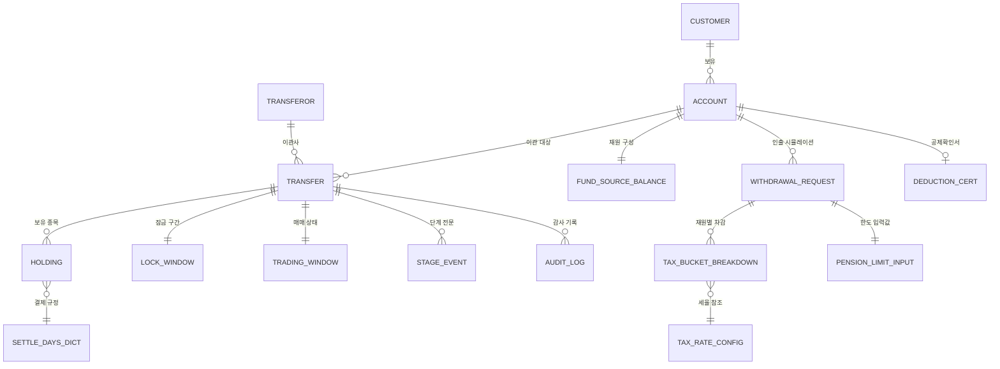
```mermaid
erDiagram
    CUSTOMER ||--o{ ACCOUNT : "보유"
    ACCOUNT ||--o{ TRANSFER : "이관 대상"
    ACCOUNT ||--|| FUND_SOURCE_BALANCE : "재원 구성"
    ACCOUNT ||--o{ WITHDRAWAL_REQUEST : "인출 시뮬레이션"
    ACCOUNT ||--o| DEDUCTION_CERT : "공제확인서"
    TRANSFEROR ||--o{ TRANSFER : "이관사"
    TRANSFER ||--o{ HOLDING : "보유 종목"
    TRANSFER ||--|| LOCK_WINDOW : "잠금 구간"
    TRANSFER ||--|| TRADING_WINDOW : "매매 상태"
    TRANSFER ||--o{ STAGE_EVENT : "단계 전문"
    TRANSFER ||--o{ AUDIT_LOG : "감사 기록"
    HOLDING }o--|| SETTLE_DAYS_DICT : "결제 규정"
    WITHDRAWAL_REQUEST ||--o{ TAX_BUCKET_BREAKDOWN : "재원별 차감"
    WITHDRAWAL_REQUEST ||--|| PENSION_LIMIT_INPUT : "한도 입력값"
    TAX_BUCKET_BREAKDOWN }o--|| TAX_RATE_CONFIG : "세율 참조"
```

전체 필드 정의와 마이데이터 한계는 [설계 02 데이터 모델](./design/02_ERD.md)에 있다.


---

### 6.5 상세 인터랙션 모델

§3.4의 간결 버전에서 생략한 **오류 분기와 대안 흐름**을 담은 확장 버전이다. 각 시퀀스는 §6.7.2 인수 조건과 1:1로 대응한다.

전체 11개 시퀀스 전문은 [설계 05 시퀀스 다이어그램](./design/05_%EC%8B%9C%ED%80%80%EC%8A%A4_%EB%8B%A4%EC%9D%B4%EC%96%B4%EA%B7%B8%EB%9E%A8.md)에 있다. 여기에는 **실패 경로가 있는 3개**만 싣는다.

#### 6.5.1 전송 확장 — 감사 로그 실패 시 롤백

§3.4의 확장. 기록 없는 의사표시는 허용하지 않는다.

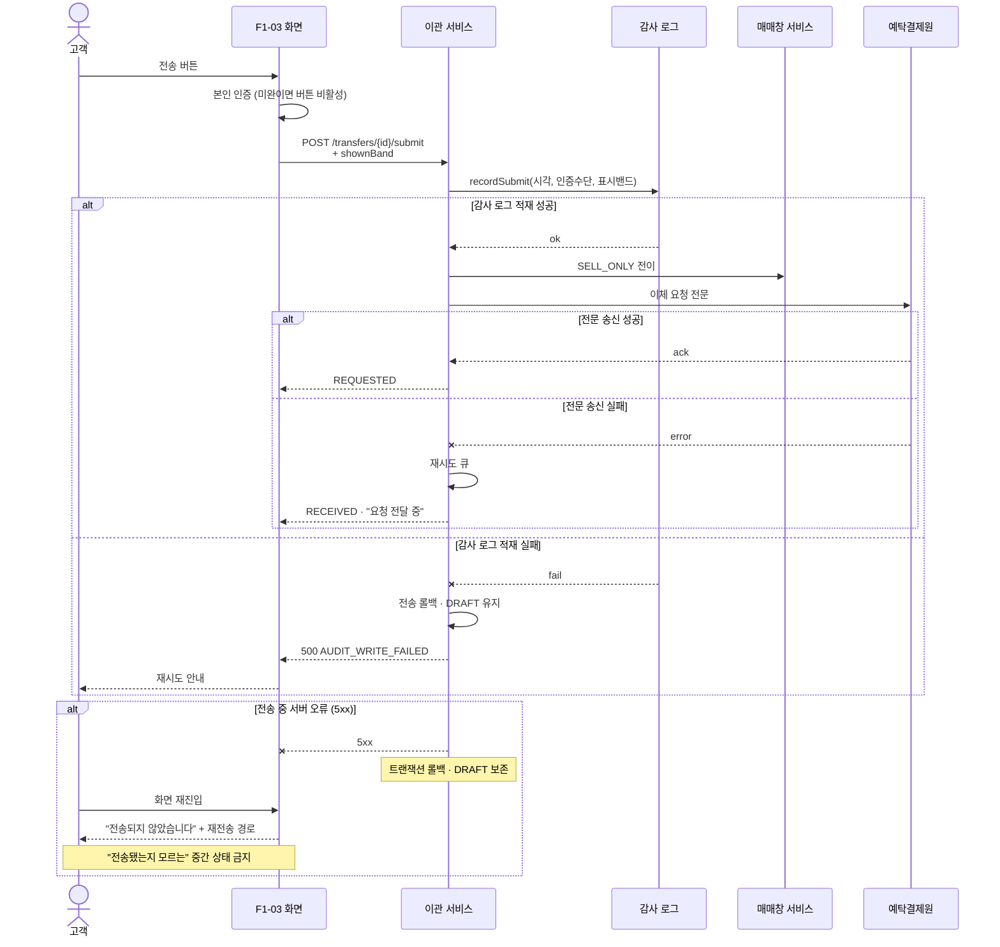
```mermaid
sequenceDiagram
    actor C as 고객
    participant UI as F1-03 화면
    participant TS as 이관 서비스
    participant AL as 감사 로그
    participant TW as 매매창 서비스
    participant KSD as 예탁결제원

    C->>UI: 전송 버튼
    UI->>UI: 본인 인증 (미완이면 버튼 비활성)
    UI->>TS: POST /transfers/{id}/submit<br/>+ shownBand
    TS->>AL: recordSubmit(시각, 인증수단, 표시밴드)

    alt 감사 로그 적재 성공
        AL-->>TS: ok
        TS->>TW: SELL_ONLY 전이
        TS->>KSD: 이체 요청 전문
        alt 전문 송신 성공
            KSD-->>TS: ack
            TS-->>UI: REQUESTED
        else 전문 송신 실패
            KSD--xTS: error
            TS->>TS: 재시도 큐
            TS-->>UI: RECEIVED · "요청 전달 중"
        end
    else 감사 로그 적재 실패
        AL--xTS: fail
        TS->>TS: 전송 롤백 · DRAFT 유지
        TS-->>UI: 500 AUDIT_WRITE_FAILED
        UI-->>C: 재시도 안내
    end

    alt 전송 중 서버 오류 (5xx)
        TS--xUI: 5xx
        Note over TS: 트랜잭션 롤백 · DRAFT 보존
        C->>UI: 화면 재진입
        UI-->>C: "전송되지 않았습니다" + 재전송 경로
        Note over C,UI: "전송됐는지 모르는" 중간 상태 금지
    end
```

**대응 인수 조건** — §6.7.2 F1-03 #4, #8, #10

#### 6.5.2 밴드 산출 확장 — 마이데이터 타임아웃과 폴백

§3.4의 예약 저장 단계 확장. 빈 화면이나 무한 로딩은 실패다.

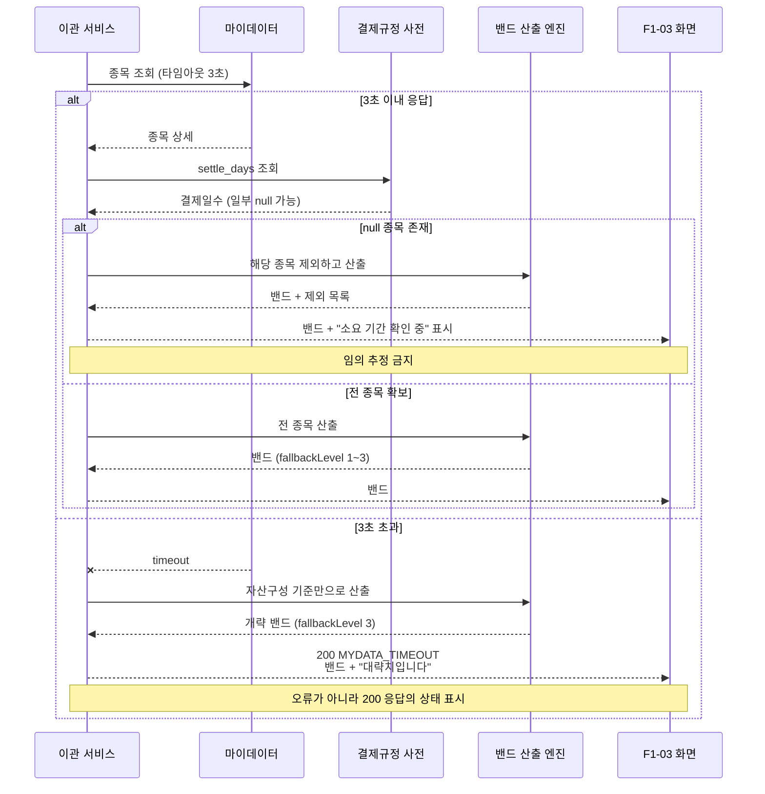
```mermaid
sequenceDiagram
    participant TS as 이관 서비스
    participant MD as 마이데이터
    participant DICT as 결제규정 사전
    participant BC as 밴드 산출 엔진
    participant UI as F1-03 화면

    TS->>MD: 종목 조회 (타임아웃 3초)

    alt 3초 이내 응답
        MD-->>TS: 종목 상세
        TS->>DICT: settle_days 조회
        DICT-->>TS: 결제일수 (일부 null 가능)
        alt null 종목 존재
            TS->>BC: 해당 종목 제외하고 산출
            BC-->>TS: 밴드 + 제외 목록
            TS-->>UI: 밴드 + "소요 기간 확인 중" 표시
            Note over TS,UI: 임의 추정 금지
        else 전 종목 확보
            TS->>BC: 전 종목 산출
            BC-->>TS: 밴드 (fallbackLevel 1~3)
            TS-->>UI: 밴드
        end
    else 3초 초과
        MD--xTS: timeout
        TS->>BC: 자산구성 기준만으로 산출
        BC-->>TS: 개략 밴드 (fallbackLevel 3)
        TS-->>UI: 200 MYDATA_TIMEOUT<br/>밴드 + "대략치입니다"
        Note over TS,UI: 오류가 아니라 200 응답의 상태 표시
    end
```

**대응 인수 조건** — §6.7.2 F1-03 #1, #7, #11 · F1-05 #3, #4

#### 6.5.3 시뮬레이션 확장 — 계산 전 두 가드

§3.4의 확장. 가드는 **계산 전에** 걸린다. 후에 걸면 이미 틀린 값이 만들어진 뒤다.

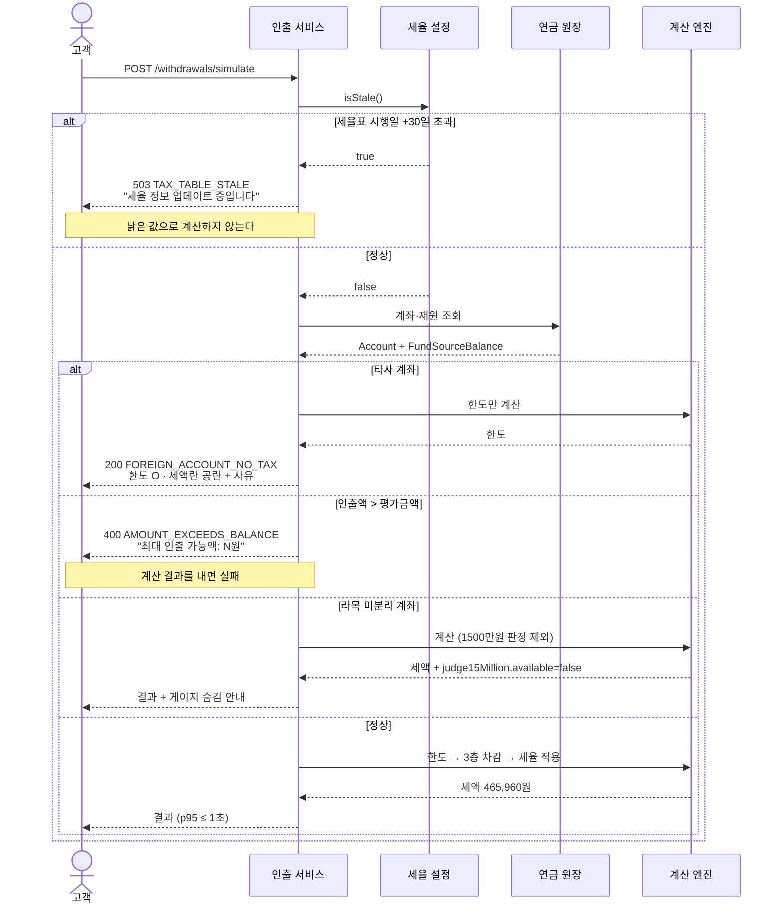
```mermaid
sequenceDiagram
    actor C as 고객
    participant WS as 인출 서비스
    participant TRP as 세율 설정
    participant LD as 연금 원장
    participant ENG as 계산 엔진

    C->>WS: POST /withdrawals/simulate
    WS->>TRP: isStale()

    alt 세율표 시행일 +30일 초과
        TRP-->>WS: true
        WS-->>C: 503 TAX_TABLE_STALE<br/>"세율 정보 업데이트 중입니다"
        Note over WS,C: 낡은 값으로 계산하지 않는다
    else 정상
        TRP-->>WS: false
        WS->>LD: 계좌·재원 조회
        LD-->>WS: Account + FundSourceBalance

        alt 타사 계좌
            WS->>ENG: 한도만 계산
            ENG-->>WS: 한도
            WS-->>C: 200 FOREIGN_ACCOUNT_NO_TAX<br/>한도 O · 세액란 공란 + 사유
        else 인출액 > 평가금액
            WS-->>C: 400 AMOUNT_EXCEEDS_BALANCE<br/>"최대 인출 가능액: N원"
            Note over WS,C: 계산 결과를 내면 실패
        else 라목 미분리 계좌
            WS->>ENG: 계산 (1500만원 판정 제외)
            ENG-->>WS: 세액 + judge15Million.available=false
            WS-->>C: 결과 + 게이지 숨김 안내
        else 정상
            WS->>ENG: 한도 → 3층 차감 → 세율 적용
            ENG-->>WS: 세액 465,960원
            WS-->>C: 결과 (p95 ≤ 1초)
        end
    end
```

**대응 인수 조건** — §6.7.2 F2-03 #4, #5, #8 · F2-04 #3, #6

---

---

### 6.6 상세 기능 요구사항 **[추가]**

우선순위는 MoSCoW를 따른다. 검증 방법은 ISO/IEC/IEEE 29148의 4방식 — **시험**(Test), **검사**(Inspection), **시연**(Demonstration), **해석**(Analysis) — 중 하나를 지정한다.

전체 83건: Must 66 · Should 15 · Could 2.

#### 6.6.1 기능1 이수관 현황판

**F1-01 홈 · 진행 알림**

| ID | 요구사항 | 우선순위 | 검증 |
|---|---|:---:|:---:|
| FR-F1-01-01 | 진행 중인 이관 건이 있으면 홈에 카드로 노출한다. 현재 단계·이관사·수관 계좌·예상 완료 기간·신청일 5요소를 표시한다 | Must | 시연 |
| FR-F1-01-02 | 알림 3종을 발송한다 — 접수 완료 / 의사확인 전화 예정 / 자산 정리 착수 | Must | 시험 |
| FR-F1-01-03 | 의사확인 알림에 걸려올 전화번호와 통화 기한을 포함한다 | Must | 검사 |
| FR-F1-01-04 | 연금계좌 간 이체는 이체 시점에 과세되지 않는다는 안내를 노출한다 | Should | 검사 |
| FR-F1-01-05 | 실물이전 가능 여부 사전조회(예탁결제원) 진입점을 제공한다 | Could (Phase 2) | 시연 |

**F1-02 유의사항 확인**

| ID | 요구사항 | 우선순위 | 검증 |
|---|---|:---:|:---:|
| FR-F1-02-01 | 기존 약관 전문을 그대로 유지한다 | Must | 검사 |
| FR-F1-02-02 | 화면 하단에 고객센터 연결 바를 고정한다 | Must | 시연 |
| FR-F1-02-03 | 연결 시트에서 KB증권(이체 절차)과 이관사(해지공제·의사확인)를 나눠 안내한다 | Must | 검사 |
| FR-F1-02-04 | 가입일 카드를 노출한다 — 종전 계좌 가입일 · KB 계좌 개설일 · 이체 후 적용 가입일 | Must | 시험 |
| FR-F1-02-05 | 이체 불가 조건과 내 계좌 판정을 표시한다 | Must | 시험 |

**F1-03 이체 예약 · 잠금 구간 미리보기**

| ID | 요구사항 | 우선순위 | 검증 |
|---|---|:---:|:---:|
| FR-F1-03-01 | 보유 종목을 3그룹으로 판정한다 — 그대로 옮김 / 팔아야 함 / 판정 불가 | Must | 시험 |
| FR-F1-03-02 | 잠금 구간을 미리 보여준다 — 시작 시각 · 해제 밴드 · 영업일 수 3요소 | Must | 시연 |
| FR-F1-03-03 | 결제주기가 가장 느린 종목을 병목(`is_critical_path`)으로 지목한다 | Must | 시험 |
| FR-F1-03-04 | 예약 저장 후 전송 시점을 고객이 고른다. 저장 중에는 어떤 매매도 제한하지 않는다 | Must | 시험 |
| FR-F1-03-05 | 병목 종목을 전송 전에 정리하면 밴드를 재계산한다 (익영업일 09:00 이전 반영) | Must | 시험 |
| FR-F1-03-06 | 현금화 대상의 확정 손익을 금액으로 병기한다 | Must | 검사 |
| FR-F1-03-07 | 상태별 가능 여부 4항목(매수 · 매도 · 추가 납입 · 수령 신청)을 표로 표시한다 | Must | 시연 |
| FR-F1-03-08 | 기준 소요가 없는 신규 상품은 밴드를 추정하지 않고 계산에서 제외하며 "소요 기간 확인 중"으로 표시한다 | Must | 시험 |
| FR-F1-03-09 | 전송 버튼은 본인 인증 후에만 활성화하고, 누른 시각 · 인증수단 · 그때 표시된 밴드 값을 로그로 보존한다 | Must | 시험 |
| FR-F1-03-10 | 마이데이터 응답이 3초를 넘으면 자산구성 기준 소요로 개략 밴드를 내고 "대략치입니다"를 병기한다 | Should | 시험 |
| FR-F1-03-11 | 영업일 캘린더에 주말 · 공휴일을 제외해 표시하고 영업일 수와 일치시킨다 | Should | 시험 |

**F1-04 이수관 현황판**

| ID | 요구사항 | 우선순위 | 검증 |
|---|---|:---:|:---:|
| FR-F1-04-01 | 5단계 + 완료 타임라인을 표시하고 현재 단계를 강조한다 | Must | 시연 |
| FR-F1-04-02 | 확정 단계는 분단위 시각, 추정 단계는 "예상" 표시와 "보통 이 시점에는" 서술로 구분한다 | Must | 검사 |
| FR-F1-04-03 | 예상 완료일을 기간으로 표시한다. 단일 날짜 표시를 금지한다 | Must | 검사 |
| FR-F1-04-04 | 고객 확인 필요 상태에서 통화 예정일(경과)과 자동취소 마감을 하나의 화면에 나란히 표시한다 | Must | 시연 |
| FR-F1-04-05 | 이관사 대표번호와 "이 번호로 전화가 옵니다"를 노출하고 고객이 직접 거는 경로를 제공한다 | Must | 시연 |
| FR-F1-04-06 | 예외 상태 4종을 처리한다 — 고객 확인 필요 / 지연 / 일부 이전 불가 / 거절 | Must | 시험 |
| FR-F1-04-07 | 거절 시 사유 코드가 아니라 평이화된 사유와 표준 해소 절차 3단계를 안내한다 | Must | 검사 |
| FR-F1-04-08 | 일부 이전 불가 시 종목별 처리 구분과 평가손익을 함께 표시한다 | Must | 시험 |
| FR-F1-04-09 | 이체 중 제한되는 업무 목록과 해제 시점을 표시한다 | Must | 검사 |
| FR-F1-04-10 | 단계 상세 시트에서 처리 주체·하는 일·표준 소요를 제공한다 | Should | 검사 |
| FR-F1-04-11 | 표준 소요 대비 p90 초과 시 지연을 자동 감지한다 | Should (Phase 2) | 시험 |
| FR-F1-04-12 | 자산 정리 단계에서 상품별 예상 완료일을 분해해 표시한다 | Could (Phase 2) | 시연 |

**F1-05 완료일 근거**

| ID | 요구사항 | 우선순위 | 검증 |
|---|---|:---:|:---:|
| FR-F1-05-01 | 신청일·옮기는 자산·기준 소요·여유 기간·안내 기간을 단계별로 공개한다 | Must | 검사 |
| FR-F1-05-02 | 자산별 기준 소요 표를 제공하고 내 계좌에 적용된 행을 강조한다 | Must | 시연 |
| FR-F1-05-03 | 지금까지 확인된 단계와 확인 시점을 표시한다 | Must | 시험 |
| FR-F1-05-04 | 업계 안내 기준을 병기한다 | Should | 검사 |
| FR-F1-05-05 | IRP와 연금저축 사이에는 현금이전만 가능하다는 점을 명시한다 | Should | 검사 |

**F1-06 이체 완료**

| ID | 요구사항 | 우선순위 | 검증 |
|---|---|:---:|:---:|
| FR-F1-06-01 | 완료는 수관 계좌 잔고 반영을 확인한 뒤에만 표시한다. 그 전까지는 송금 중으로 둔다 | Must | 시험 |
| FR-F1-06-02 | 이관사 송금 시각과 잔고 반영 시각을 각각 표시한다 | Must | 검사 |
| FR-F1-06-03 | 잔고 반영 시 60초 이내 알림을 발송한다 (야간·주말 무관) | Must | 시험 |
| FR-F1-06-04 | 가입일 확정 카드를 표시한다 | Must | 시연 |
| FR-F1-06-05 | 예상 소요 대비 실제 소요를 표시하고 밴드 적중 여부를 로그에 적재한다 | Should | 시험 |
| FR-F1-06-06 | 완료 직후 수익률 랭킹과 인출순서 미리 보기로 연결한다 (2탭 이내) | Should | 시연 |

#### 6.6.2 기능2 인출순서 시뮬레이터

**F2-01 출금관리**

| ID | 요구사항 | 우선순위 | 검증 |
|---|---|:---:|:---:|
| FR-F2-01-01 | 출금관리에 "연금 외 수령" 메뉴를 신설한다. 연금수령·해지와 같은 층에 둔다 | Must | 검사 |
| FR-F2-01-02 | 메뉴마다 한 줄 설명을 붙여 목적 차이를 진입 전에 구분한다 | Must | 검사 |
| FR-F2-01-03 | 평가금액·적용 가입일·올해 기인출액·올해 남은 금액을 진입 전에 노출한다 | Must | 시험 |

**F2-02 수령 대상 선택**

| ID | 요구사항 | 우선순위 | 검증 |
|---|---|:---:|:---:|
| FR-F2-02-01 | 본인 계좌 / 타인 명의(상속 등) 2분기를 제공한다 | Must | 시연 |
| FR-F2-02-02 | 각 갈래에 무슨 일이 일어나는지 한 줄로 미리 설명한다 | Must | 검사 |
| FR-F2-02-03 | 승계를 마친 계좌는 본인 계좌 목록에서 선택하도록 안내한다 | Should | 시험 |

**F2-03 인출금액 입력**

| ID | 요구사항 | 우선순위 | 검증 |
|---|---|:---:|:---:|
| FR-F2-03-01 | 연금수령한도 게이지를 표시한다. 이미 인출 / 이번 인출 / 한도 초과를 색으로 구분한다 | Must | 시연 |
| FR-F2-03-02 | 한도 초과 입력을 차단하지 않는다. 초과분의 세액을 미리 보여준다 | Must | 시험 |
| FR-F2-03-03 | 계산 근거를 토글로 공개한다 — 산식·대입값·기준일·적용 가입일·근거 법령 | Must | 검사 |
| FR-F2-03-04 | 인출 사유 선택이 한도 소진 여부와 세율에 실제로 반영된다 | Must | 시험 |
| FR-F2-03-05 | 주택 구입·전세보증금은 세법상 부득이한 사유가 아님을 경고한다 | Must | 시험 |
| FR-F2-03-06 | 요양 3~6개월 구간은 세법 요건은 충족해도 IRP 중도인출이 불가할 수 있음을 안내한다 | Must | 검사 |
| FR-F2-03-07 | 해외이주 + 퇴직금 유입 계좌는 입금일부터 3년 경과 여부를 표시한다 | Must | 시험 |
| FR-F2-03-08 | 인출 금액이 계좌 평가금액을 초과하면 계산을 진행하지 않고 최대 인출 가능액을 안내한다 | Must | 시험 |
| FR-F2-03-09 | 타사 계좌는 세액을 표시하지 않고 사유를 안내한다. 한도는 계산한다 | Must | 시험 |
| FR-F2-03-10 | `모의계산 결과` 라벨을 스크롤과 무관하게 고정 노출한다 | Must | 시연 |
| FR-F2-03-11 | 연금수령연차 11년 이상은 산식을 적용하지 않고 "한도 없음"으로 처리한다 | Must | 시험 |
| FR-F2-03-12 | 승계 계좌는 항목별 기준일이 다르다는 표를 근거 안에 제공한다 | Should | 검사 |

**F2-04 인출순서 결과**

| ID | 요구사항 | 우선순위 | 검증 |
|---|---|:---:|:---:|
| FR-F2-04-01 | 재원 3층을 법정 순서대로 표시하고 층별 소진을 시각화한다 | Must | 시연 |
| FR-F2-04-02 | "법이 정한 순서"임을 화면 머리에 먼저 명시한다 (자문이 아님) | Must | 검사 |
| FR-F2-04-03 | 1층을 4개 버킷으로 분해한다. 4번째는 확인서 제출 전까지 잠금 상태로 노출한다 | Must | 시험 |
| FR-F2-04-04 | 층 안에서 한도 내 / 한도 초과분을 분리하고 각각 다른 세율을 적용한다 | Must | 시험 |
| FR-F2-04-05 | 한도 초과로 잃은 감면액을 별도로 표시한다 | Must | 시험 |
| FR-F2-04-06 | 연 1,500만원 경계 게이지를 표시하고 판정에서 제외되는 항목을 명시한다 | Must | 시험 |
| FR-F2-04-07 | 금액은 비율이 아니라 원(₩) 확정 금액으로 우선 표기한다 | Must | 검사 |
| FR-F2-04-08 | 세율은 지방소득세를 포함한 실효세율로 표기한다 | Must | 검사 |
| FR-F2-04-09 | 세금 내역 3줄(연금·기타·퇴직소득세)을 유지하되 순서표와 연결한다 | Must | 시연 |
| FR-F2-04-10 | 계산에 쓴 값과 "실제 원천징수 세액과 다를 수 있습니다"를 병기한다 | Must | 검사 |
| FR-F2-04-11 | 세율표 최종 갱신일을 병기하고, 시행일 기준 D+30을 초과하면 계산 결과 노출을 차단한다 | Must | 시험 |
| FR-F2-04-12 | 결과 화면에 1:1 상담 진입점과 매수·매도 버튼을 두지 않는다 | Must | 검사 |

**F2-05 비과세 인출 관리**

| ID | 요구사항 | 우선순위 | 검증 |
|---|---|:---:|:---:|
| FR-F2-05-01 | 현재 비과세로 인출 가능한 금액과 4개 버킷 내역을 표시한다 | Must | 시험 |
| FR-F2-05-02 | 「연금보험료 등 소득·세액 공제확인서」 제출 동선을 제공한다 | Must | 시연 |
| FR-F2-05-03 | 제출 전/후 비과세 인출 가능액을 나란히 비교한다 | Must | 시험 |
| FR-F2-05-04 | 은행연합회 연금저축 세액공제 한도 조회·변경으로 딥링크 연결한다 | Should | 시연 |
| FR-F2-05-05 | 추가 계좌 안내는 특정 회사 링크가 아니라 사업자 비교표(F3) 경유로 한다 | Should (F3 출시 전 보류) | 검사 |

**F2-06 타명의 조회**

| ID | 요구사항 | 우선순위 | 검증 |
|---|---|:---:|:---:|
| FR-F2-06-01 | 금융감독원 상속인 금융거래조회 서비스로 딥링크 연결하고 필요 서류를 안내한다 | Must | 시연 |
| FR-F2-06-02 | 조회 결과에 자사 계좌가 있는 경우의 상담 경로를 제공한다 | Must | 검사 |
| FR-F2-06-03 | 이 조회로 확인되지 않는 기관 목록을 명시한다 (국민연금·근로복지공단 등) | Should | 검사 |
| FR-F2-06-04 | 배우자 승계 시 항목별 기준을 표로 제시한다 | Should | 검사 |


---

### 6.7 상세 인수 조건 및 검증 **[추가]**

#### 6.7.1 검증 방법

| 방법 | 정의 | 적용 |
|---|---|---|
| **시험** (Test) | 정해진 입력으로 실행해 출력을 기대값과 대조 | 계산 로직, 상태 전이, 성능 임계치 |
| **검사** (Inspection) | 산출물·화면을 육안·정적 분석으로 확인 | 문구 규칙, 표기 원칙, 규제 제약 |
| **시연** (Demonstration) | 실제 조작으로 동작을 보임 | 화면 전이, 진입점, 접근 경로 |
| **해석** (Analysis) | 모델·통계로 추론 | 밴드 산출 규격, 폴백 사다리 |

#### 6.7.2 인수 조건 (Given-When-Then)

각 화면의 인수 조건을 Given-When-Then으로 기술한다. **판정** 열은 해당 조건이 깨졌을 때의 실패 기준이다. 화면당 실패 케이스를 3건 이상 유지한다.

> **호출 순서를 확인하려면** [설계 05 시퀀스 다이어그램](./design/05_%EC%8B%9C%ED%80%80%EC%8A%A4_%EB%8B%A4%EC%9D%B4%EC%96%B4%EA%B7%B8%EB%9E%A8.md)을 함께 본다. 시퀀스 SD-01 ~ SD-10이 아래 인수 조건과 1:1로 대응한다.
>
> | 시퀀스 | 대응 인수 조건 |
> |---|---|
> | SD-01 예약 저장과 밴드 산출 | F1-03 #1, #2, #7, #11 |
> | SD-02 이체 신청 전송 | F1-03 #4, #8, #10 |
> | SD-03 병목 정리와 밴드 재계산 | F1-03 #5, #6 |
> | SD-04 진행 단계 갱신과 알림 | F1-01 #5, #6 · F1-04 #3 |
> | SD-05 매매 가능 여부 판정 | F1-03 #3, #4, #9 |
> | SD-06 이체 완료 판정 | F1-06 #1, #2, #3, #6 |
> | SD-07 인출순서·세액 시뮬레이션 | F2-03 #1 ~ #9 · F2-04 #1, #3, #7, #8 |
> | SD-08 공제확인서 제출과 버킷 이동 | F2-04 #2 · F2-05 #1, #2, #4 |
> | SD-09 세율표 노후화 차단 | F2-04 #6 |
> | SD-10 지연 감지와 밴드 확장 | F1-04 #4 · F1-05 #1 |

#### F1-01 홈 · 진행 알림

| # | Given | When | Then | 판정 |
|:---:|---|---|---|:---:|
| 1 | 진행 중인 이관 건이 0건이다 | 홈에 진입한다 | 진행 카드가 렌더되지 않는다 | **실패** — 값이 빈 카드가 노출되면 |
| 2 | 진행 중인 이관 건이 1건 있다 | 홈에 진입한다 | 5요소가 모두 표시되고 첫 렌더 p95 ≤ 0.8초 | **실패** — 5요소 중 하나라도 누락되면 |
| 3 | 예상 완료일이 산출되어 있다 | 카드가 렌더된다 | 완료 예상이 밴드(최소 폭 2영업일)로 표시된다 | **실패** — 단일 날짜로 표시되면 |
| 4 | 진행 카드가 노출되어 있다 | "진행 상황 자세히 보기"를 누른다 | F1-04로 이동하고 화면 전환 p95 ≤ 1.2초 | **실패** — 전환이 2초를 넘으면 |
| 5 | `REQUESTED` → `VERIFYING`으로 전이한다 | 전이 전문을 수신한다 | 해당 알림이 전이 후 60초 이내 발송된다 | **실패** — 야간 배치로 일괄 발송되면 |
| 6 | 이관사 대표번호가 마스터에 없다 | 의사확인 알림을 발송한다 | 번호 없이 발송하지 않고 KB증권 대표번호로 대체 안내한다 | **실패** — 번호란이 공란으로 발송되면 |

#### F1-02 유의사항 확인

| # | Given | When | Then | 판정 |
|:---:|---|---|---|:---:|
| 1 | 원장 승계 플래그가 `true`다 | 가입일 카드를 렌더한다 | 플래그 값을 그대로 표시하고 "5년은 다시 세지 않습니다"로 전환된다 | **실패** — 화면이 플래그와 무관하게 단정하면 |
| 2 | 원장 승계 플래그가 `false`다 | 가입일 카드를 렌더한다 | "5년을 다시 세게 됩니다"로 전환되고 미승계 기준 한도가 병기된다 | **실패** — 문구가 전환되지 않으면 |
| 3 | 원장 승계 플래그가 `null`이다 | 가입일 카드를 렌더한다 | 승계·미승계 양쪽 한도를 모두 표시하고 확정 시점을 안내한다 | **실패** — 한쪽만 표시하면 |
| 4 | 계좌가 이체 가능 상태다 | 유의사항 화면에 진입한다 | 이체 불가 조건 3종이 모두 표시된다 | **실패** — 3종 중 하나라도 누락되면 |
| 5 | 고객이 문의 바를 누른다 | 연결 시트가 열린다 | KB증권과 이관사 두 번호가 역할과 함께 구분 노출된다 | **실패** — 한 번호만 노출되면 |
| 6 | 약관 전문 로딩이 3초를 넘는다 | 화면에 진입한다 | 로딩 상태를 표시하고 약관 미로딩 상태에서 다음 단계 진행을 차단한다 | **실패** — 약관 없이 신청으로 넘어가지면 |

#### F1-03 이체 예약 · 잠금 구간 미리보기

| # | Given | When | Then | 판정 |
|:---:|---|---|---|:---:|
| 1 | 보유 종목이 6종이고 `settle_days`가 모두 확보돼 있다 | 예약 화면에 진입한다 | 3요소가 모두 표시되고 첫 렌더 p95 ≤ 1.2초 | **실패** — 3요소 중 하나라도 누락되면 |
| 2 | 밴드가 산출되었다 | 해제일을 표시한다 | 밴드로만, 최소 폭 2영업일로 표시된다 | **실패** — 단일 날짜로 표시되면 |
| 3 | `transfer_status`가 `DRAFT`다 | 매수·매도·납입·수령 신청을 각각 시도한다 | 4건 모두 정상 처리된다 | **실패** — 4건 중 하나라도 막히면 |
| 4 | 전송이 확정되었다 (`RECEIVED`) | 매수를 시도한다 | 매수는 거부되고 매도만 허용된다 | **실패** — 전송 후에도 매수가 열려 있으면 |
| 5 | 병목 종목을 전송 전에 매도했다 | 익영업일 09:00 배치가 돈다 | 밴드가 당겨진 값으로 갱신되고 갱신 시각이 표시된다 | **실패** — 09:00 이후에도 이전 밴드가 남아 있으면 |
| 6 | 병목 정리 안내를 노출한다 | 고객이 안내를 본다 | 당겨지는 영업일 수와 확정 손실 금액이 나란히 표시된다 | **실패** — 일수만 표시하거나 권유 문구가 있으면 |
| 7 | 보유 종목 중 1종이 `settle_days` 사전에 없다 | 밴드를 계산한다 | 해당 종목을 계산에서 제외하고 "소요 기간 확인 중"을 표시한다 | **실패** — 임의 추정치로 밴드를 내면 |
| 8 | 전송 요청 중 서버 오류(5xx)가 발생한다 | 고객이 화면을 다시 연다 | 상태가 `DRAFT`로 보존되고 재전송 경로가 제공된다 | **실패** — 전송 여부를 알 수 없는 중간 상태로 남으면 |
| 9 | `trading_window.confidence`가 임계 미만이다 | 상태 표를 렌더한다 | 보수적으로 `LOCKED`로 표시하고 대표번호를 병기한다 | **실패** — "매도 가능"으로 단정하면 |
| 10 | 전송 버튼을 누른다 | 본인 인증을 마친다 | 누른 시각·인증수단·표시 중이던 밴드 값이 감사 로그에 적재된다 | **실패** — 인증 없이 활성화되거나 밴드 값이 누락되면 |
| 11 | 마이데이터 응답이 3초를 초과한다 | 밴드를 계산한다 | 개략 밴드를 내고 "대략치입니다"를 병기한다 | **실패** — 빈 화면이나 무한 로딩이 되면 |

#### F1-04 이수관 현황판

| # | Given | When | Then | 판정 |
|:---:|---|---|---|:---:|
| 1 | 같은 날 이미 현황판을 조회했다 | 같은 날 다시 진입한다 | 밴드 값이 직전 조회와 동일하다 | **실패** — 같은 날 값이 달라지면 |
| 2 | 현재 단계가 추정 구간(③④)이다 | 단계 설명을 렌더한다 | "보통 1~3영업일 걸립니다" 형태로 표시된다 | **실패** — 단정 표현이 쓰이면 |
| 3 | 상태가 `VERIFYING`이다 | 화면 문구를 렌더한다 | "○○에서 확인 중"으로 표시된다 | **실패** — 영문 enum·내부 용어가 노출되면 |
| 4 | 예탁원 통보를 D+4까지 수신하지 못했다 | 현황판에 진입한다 | 단계는 유지하되 지연 안내와 밴드 확장이 표시된다 | **실패** — 며칠째 변화 없이 그대로면 |
| 5 | 상태가 `PARTIAL_BLOCKED`다 | 화면을 렌더한다 | 선택지가 2개 이상, 각 선택의 결과와 함께 표시된다 | **실패** — 선택지가 1개거나 매도 지시 버튼이 있으면 |
| 6 | 거절 사유 코드가 압류다 | 거절 화면을 렌더한다 | 상태를 서술하고 해소 절차 3단계를 표시한다 | **실패** — 사람을 규정하는 표현이 쓰이면 |
| 7 | 거절 상태이고 해소가 확인되지 않았다 | 재신청 버튼을 본다 | 버튼이 비활성이다 | **실패** — 해소 확인 전에 재신청이 눌리면 |
| 8 | 이체가 진행 중이다 | 제한 업무 목록을 렌더한다 | 4항목 각각에 해제 시점이 함께 표시된다 | **실패** — 목록만 있고 해제 시점이 없으면 |
| 9 | 현황판에 진입한다 | 화면이 렌더된다 | 첫 렌더 p95 ≤ 1.2초, 상태 조회 API p95 ≤ 500ms | **실패** — p95가 임계를 넘으면 |
| 10 | `ACTION_REQUIRED` 상태다 | 화면을 렌더한다 | 통화 예정일과 자동취소 마감이 같은 화면에 나란히 표시된다 | **실패** — 두 날짜가 다른 화면에 흩어져 있으면 |

#### F1-05 완료일 근거

| # | Given | When | Then | 판정 |
|:---:|---|---|---|:---:|
| 1 | 신청 후 ③ 단계 전문을 수신했다 | 근거 화면에 진입한다 | 예상 완료일이 수신 시점 기준으로 재계산된다 | **실패** — 신청 시점 값이 고정돼 있으면 |
| 2 | 밴드를 산출한다 | 안내 기간을 표시한다 | 최소 폭이 2영업일 이상이다 | **실패** — 폭이 0~1영업일이면 |
| 3 | 보유 상품이 `settle_days` 사전에 없다 | 밴드를 계산한다 | 계산에서 제외하고 "소요 기간 확인 중"을 표시한다 | **실패** — 임의 추정치를 넣으면 |
| 4 | 마이데이터 응답이 3초를 초과한다 | 근거 화면에 진입한다 | 개략 밴드와 "대략치입니다"가 병기된다 | **실패** — 빈 화면이나 무한 로딩이 되면 |
| 5 | 내 계좌 자산이 해외 펀드를 포함한다 | 기준 소요 표를 렌더한다 | "해외 펀드 포함 9~11영업일" 행이 강조된다 | **실패** — 적용 행이 표시되지 않으면 |

#### F1-06 이체 완료

| # | Given | When | Then | 판정 |
|:---:|---|---|---|:---:|
| 1 | 송금 통보만 수신했고 잔고는 미반영이다 | 현황판을 렌더한다 | 상태가 `REMITTING`으로 유지된다 | **실패** — "완료"로 표시되면 |
| 2 | 잔고 반영이 확인된다 | 원장에 반영된다 | 60초 이내 알림이 발송된다 (야간·주말 무관) | **실패** — 익일 배치로 밀리면 |
| 3 | 입고 금액이 예상과 10% 이상 차이난다 | 완료 화면을 렌더한다 | 완료는 표시하되 확인 안내와 대표번호를 병기한다 | **실패** — 차이를 표시하지 않으면 |
| 4 | 완료 화면에서 수익률 랭킹으로 이동한다 | 랭킹을 렌더한다 | 과거 수익률 정렬 사실만 표시된다 | **실패** — 전망·추천 문구가 붙으면 |
| 5 | 가입일 확정 카드가 표시된다 | 기능2 F2-03에 진입한다 | 한도 산식이 같은 가입일 값을 사용한다 | **실패** — 두 화면의 가입일이 다르면 |
| 6 | 밴드가 8/31~9/2였고 실제 완료가 9/1이다 | 완료 처리한다 | 적중 `true`로 로그에 적재되고 주간 집계에 반영된다 | **실패** — 적중 여부가 적재되지 않으면 |

#### F2-01 출금관리

| # | Given | When | Then | 판정 |
|:---:|---|---|---|:---:|
| 1 | 출금관리 화면에 진입한다 | 메뉴 목록을 렌더한다 | "연금 외 수령"이 연금수령·해지와 같은 층에 있다 | **실패** — 해지 메뉴의 하위 섹션에 있으면 |
| 2 | 계좌 원장이 정상 조회된다 | 메뉴 화면을 렌더한다 | 4개 값이 모두 표시된다 | **실패** — 하나라도 누락되면 |
| 3 | 적용 가입일이 원장에 없다 | 메뉴 화면을 렌더한다 | "확인 중"으로 표시하고 한도 관련 수치를 노출하지 않는다 | **실패** — 가입일 없이 한도를 계산해 표시하면 |
| 4 | 메뉴 화면에 진입한다 | 화면이 렌더된다 | 첫 렌더 p95 ≤ 1초 | **실패** — p95가 1초를 넘으면 |

#### F2-02 수령 대상 선택

| # | Given | When | Then | 판정 |
|:---:|---|---|---|:---:|
| 1 | 수령 대상 선택 화면에 있다 | "타 명의 · 상속"을 선택한다 | F2-06이라는 별도 화면으로 분기한다 | **실패** — 같은 화면에서 조건 분기만 하면 |
| 2 | 두 갈래가 표시된다 | 화면을 렌더한다 | 각 갈래에 결과를 설명하는 한 줄이 붙어 있다 | **실패** — 라벨만 있고 설명이 없으면 |
| 3 | 배우자 승계가 완료된 계좌를 보유한다 | 수령 대상 선택 화면에 진입한다 | 해당 계좌가 본인 계좌 목록에 나타난다 | **실패** — 타 명의 목록에 있거나 어느 쪽에도 없으면 |

#### F2-03 인출금액 입력

| # | Given | When | Then | 판정 |
|:---:|---|---|---|:---:|
| 1 | 인출 사유로 "의료 목적"을 선택한다 | 한도 게이지를 렌더한다 | "이번 인출은 한도에 들어가지 않습니다"로 전환된다 | **실패** — 한도가 소진되는 것으로 계산되면 |
| 2 | 인출 사유로 "주택 구입"을 선택한다 | 한도 게이지를 렌더한다 | 한도가 정상 소진되고 일반 세율이 적용된다 | **실패** — 부득이한 사유와 같은 전환이 일어나면 |
| 3 | "요양 3~6개월"을 선택하고 계좌가 IRP다 | 결과를 렌더한다 | 세법 요건 충족 표시와 IRP 중도인출 불가 안내가 함께 표시된다 | **실패** — 세법 요건 충족만 표시되면 |
| 4 | 평가금액이 18,500,000원이다 | 20,000,000원을 입력한다 | 계산을 중단하고 최대 인출 가능액을 즉시 안내한다 | **실패** — 계산 결과가 산출되면 |
| 5 | 타사 계좌를 선택했다 | 인출액을 입력한다 | 한도는 계산되고 세액란은 공란 + 사유가 표시된다 | **실패** — 추정 세액이 표시되면 |
| 6 | 결과가 화면 아래로 길게 이어진다 | 하단까지 스크롤한다 | `모의계산 결과` 라벨이 계속 보인다 | **실패** — 스크롤 시 라벨이 사라지면 |
| 7 | 연금수령연차가 12년차다 | 한도를 계산한다 | 산식을 적용하지 않고 "한도 없음"으로 표시한다 | **실패** — 산식이 적용되면 |
| 8 | 검증 계좌 조건이다 (§6.7.3) | 한도를 계산한다 | 한도 12,600,000원, 남은 금액 10,600,000원이 산출되고 응답 p95 ≤ 1초 | **실패** — 검증값과 1원이라도 다르면 |
| 9 | 인출액을 변경한다 | 값을 입력한다 | 게이지·세액이 ≤ 300ms 내 재계산된다 | **실패** — 조회 버튼을 눌러야 갱신되면 |

#### F2-04 인출순서 결과

| # | Given | When | Then | 판정 |
|:---:|---|---|---|:---:|
| 1 | 인출액 15,000,000원이 입력돼 있다 | 인출액을 변경한다 | 층별 소진·세율·세액이 ≤ 300ms 내 재계산된다 | **실패** — 조회 버튼을 눌러야 갱신되면 |
| 2 | 4호 확인서가 미제출 상태다 | 확인서를 제출 상태로 바꾼다 | 4번째 버킷이 3층 → 1층으로 이동하고 세액이 줄어든다 | **실패** — 버킷 위치나 세액에 변화가 없으면 |
| 3 | 검증 계좌 조건이다 (§6.7.3) | 15,000,000원 인출을 계산한다 | 일반 465,960원, 확인서 제출 후 355,080원, 부득이한 사유 378,840원 | **실패** — 세 값 중 하나라도 다르면 |
| 4 | 결과 화면이 렌더된다 | 화면 전체를 훑는다 | 실제 출금·매수·매도로 넘어가는 버튼이 하나도 없다 | **실패** — 실행 버튼이 하나라도 있으면 |
| 5 | 결과 화면이 렌더된다 | 화면 전체를 훑는다 | 1:1 상담 진입점이 없다 | **실패** — 상담 진입점이 있으면 |
| 6 | 세율표 최종 갱신일이 시행일 + 31일이다 | 결과 화면에 진입한다 | "세율 정보 업데이트 중입니다"가 표시된다 | **실패** — 낡은 세율로 결과를 내면 |
| 7 | 계산 결과가 표시된다 | 세율 표기를 확인한다 | 지방소득세 포함 실효세율로 표기된다 | **실패** — 원문 세율로 표기되면 |
| 8 | 인출액이 한도를 480만원 초과한다 | 결과를 렌더한다 | 초과분에 16.5%가 적용되고 잃은 감면액이 별도 금액으로 표시된다 | **실패** — 초과분이 한도 내와 같은 세율이면 |

#### F2-05 비과세 인출 관리

| # | Given | When | Then | 판정 |
|:---:|---|---|---|:---:|
| 1 | 4호 확인서가 미제출 상태다 | 비과세 인출 관리 화면에 진입한다 | 제출 전 금액과 후 금액이 나란히 표시되고 차액이 강조된다 | **실패** — 한쪽만 표시되면 |
| 2 | 확인서 제출 동선을 연다 | 안내를 읽는다 | 홈택스에서 고객이 직접 발급·제출하는 절차로만 안내된다 | **실패** — 세무 전문가 알선 링크가 있으면 |
| 3 | F3이 아직 출시되지 않았다 | 비과세 인출 관리 화면에 진입한다 | "계좌 하나 더" 안내가 노출되지 않는다 | **실패** — 특정 증권사로 직접 연결되는 링크가 노출되면 |
| 4 | 1층 4개 버킷 잔액이 조회된다 | 화면을 렌더한다 | 버킷 4개가 각각 금액과 함께 표시되고 4호는 잠금 상태로 구분된다 | **실패** — 4개를 합산해 한 줄로만 표시하면 |

#### F2-06 타명의 조회

| # | Given | When | Then | 판정 |
|:---:|---|---|---|:---:|
| 1 | 타 명의 · 상속 화면에 진입한다 | 화면을 렌더한다 | 금감원 조회 딥링크와 필요 서류 목록이 함께 표시된다 | **실패** — 링크만 있고 서류 안내가 없으면 |
| 2 | 조회로 확인되지 않는 기관이 있다 | 안내를 렌더한다 | 기관 목록이 링크와 함께 병기된다 | **실패** — 링크만 있고 목록이 없으면 |
| 3 | 이 화면은 계산 결과 화면이 아니다 | 고객센터 연결을 배치한다 | 정상 배치된다 (R-3 적용 대상 아님) | **실패** — 세액 계산 결과가 이 화면에 함께 표시되면 |
| 4 | 배우자 승계 계좌를 조회한다 | 기준 표를 렌더한다 | 4항목의 기준이 각각 표시된다 | **실패** — 하나의 기준일로 뭉뚱그리면 |

#### 6.7.3 검증 데이터셋

릴리스마다 아래 6건을 전건 대조한다. 1원이라도 다르면 릴리스를 중단한다.

**기준 계좌** — 평가액 84,000,000원 · 만 57세 · 연금수령연차 3년 · 올해 기인출 2,000,000원 · 이연퇴직소득 28,000,000원 (적용 퇴직소득세율 6.6%)

| # | 조건 | 기대값 |
|:---:|---|---:|
| 1 | 연금수령한도 | 12,600,000원 (= 84,000,000 ÷ 8 × 1.2) |
| 2 | 올해 남은 금액 | 10,600,000원 |
| 3 | 가입일 미승계 시 한도 (1년차) | 10,080,000원 — 차이 2,520,000원 |
| 4 | 15,000,000원 인출 · 일반 | 세금 465,960원 |
| 5 | 15,000,000원 인출 · 공제확인서 제출 후 | 세금 355,080원 — 110,880원 감소 |
| 6 | 15,000,000원 인출 · 부득이한 사유 | 세금 378,840원 — 한도 미소진 |

**밴드 검증값** — 서동현 IRP 이체 (6종 · 48,500,000원 · 2026-08-18(화) 15:00 전송)

| 조건 | 기준 소요 | 해제 밴드 |
|---|:---:|---|
| 병목 그대로 (해외 펀드 포함) | 9~11영업일 | 8월 31일(월) ~ 9월 2일(수) |
| 병목 정리 후 | 6~8영업일 | 8월 26일(수) ~ 8월 28일(금) |

당겨지는 폭 **3영업일**, 그 대가로 확정되는 손실 **420,000원**.


---

### 6.8 비기능 요구사항 상세 **[추가]**

#### 6.8.1 사용성

| # | 요구사항 | 판정 기준 | 검증 |
|:---:|---|---|:---:|
| U-1 | 화면 문구에 내부 상태 코드·내부 용어·조문 번호 약어를 쓰지 않는다 | 영문 enum, "원 사업자 처리 대기" 등 노출 0건 | 검사 |
| U-2 | 근거 조문은 정식 법령명으로 근거 공개 영역에만 표기한다 | 본문 영역 조문 표기 0건 | 검사 |
| U-3 | 금액은 원 단위 확정치로 표시하고 세율 단독 표기를 금지한다 | 비율만 표기된 금액 항목 0건 | 검사 |
| U-4 | 확정과 추정을 시각적으로 분리 표기한다 | `layer` 값별 표기 규칙 일치 | 검사 |
| U-5 | 본문 텍스트 색 대비 4.5:1, 큰 텍스트 3:1 이상 | WCAG 2.1 AA | 시험 |
| U-6 | 한글은 어절 단위로 끊는다 | `word-break: keep-all` 적용 | 검사 |
| U-7 | 완료 후 다음 행동으로 2탭 이내에 도달한다 | F1-06 → 랭킹/인출 미리보기 | 시연 |

#### 6.8.2 성능

| # | 요구사항 | 임계치 | 모니터링 항목 | 알람 조건 |
|:---:|---|---|---|---|
| P-1 | 홈 진행 카드 첫 렌더 | p95 ≤ 0.8초 | `f1_01_render_ms` | p95 1.0초 초과 10분 지속 |
| P-2 | 잠금 구간 · 현황판 첫 렌더 | p95 ≤ 1.2초 | `f1_03_render_ms` · `f1_04_render_ms` | p95 1.5초 초과 10분 지속 |
| P-3 | 이관 상태 조회 API | p95 ≤ 500ms | `api_transfer_status_ms` | p95 700ms 초과 5분 지속 |
| P-4 | 기능2 계산 결과 응답 | p95 ≤ 1초 | `f2_calc_ms` | p95 1.3초 초과 10분 지속 |
| P-5 | 인출액 변경 시 재계산 | ≤ 300ms | `f2_recalc_ms` | p95 500ms 초과 |
| P-6 | 마이데이터 응답 타임아웃 | 3초 (초과 시 폴백) | `mydata_timeout_rate` | 타임아웃율 5% 초과 |

#### 6.8.3 데이터 설계 규칙

원장에서 확보해야 할 필드 15종과 핵심 엔터티 7종의 정의는 **§6.4 엔티티 및 데이터 모델**에 있다. 이 절에는 그 위에 걸리는 **설계 규칙**만 둔다.


| # | 규칙 | 이유 |
|:---:|---|---|
| D-1 | 모든 추정 필드에 `layer` + `confidence`를 부여한다 | ③④는 실시간 조회 경로가 없어(L-1) 확정과 추정이 한 화면에 섞인다 |
| D-2 | 날짜는 단일값이 아니라 밴드로 저장한다 | 단일 날짜로 저장하면 확정처럼 보여주게 되고 금소법 §21① 단정 금지에 걸린다 |
| D-3 | `critical_path_holding`은 서버가 지정한다 (프런트 계산 금지) | 클라이언트마다 다른 병목을 지목하면 밴드가 흔들린다 |
| D-4 | `trading_window`는 `confidence`가 낮으면 `LOCKED`로 내려 쓴다 | 막혔는데 열렸다고 표시하면 회복 불가, 반대는 회복 가능 |

> **D-2가 가장 강한 제약이다.** 저장 구조에 단일 날짜 컬럼을 아예 두지 않아 **스키마가 단정을 막는다.** 화면 규칙이나 코드 리뷰에 맡기면 언젠가 새어 나간다.

#### 6.8.4 시스템 속성

##### 신뢰성 · 가용성

| # | 요구사항 | 임계치 | 모니터링 항목 | 알람 조건 |
|:---:|---|---|---|---|
| A-1 | 월 가용성 | ≥ 99.5% | `uptime_monthly` | 99.5% 미달 시 월간 리포트 |
| A-2 | 영업일 08~18시 가용성 | ≥ 99.9% | `uptime_business_hours` | 5분 연속 헬스체크 실패 |
| A-3 | 마이데이터 장애 시 폴백 | 폴백 사다리 ③단계로 자동 강등 | `fallback_level` | ④단계 진입 시 |
| A-4 | 세율표 노후화 시 차단 | 시행일 +30일 초과 시 결과 노출 차단 | `tax_table_age_days` | D+21 사전 경고, D+30 차단 |
| A-5 | 전송 중 시스템 오류 시 상태 보존 | 예약(`DRAFT`) 상태 보존율 100% | `submit_orphan_count` | 중간 상태 1건이라도 발생 시 |

##### 보안

| # | 요구사항 | 임계치 | 모니터링 항목 | 알람 조건 |
|:---:|---|---|---|---|
| S-1 | 전송 버튼은 본인 인증 후에만 활성화하고, 누른 시각 · 인증수단 · 그때 표시된 밴드 값을 감사 로그로 보존한다 | 로그 누락률 **0%** | `submit_audit_missing` | 누락 1건이라도 발생 시 즉시 |
| S-2 | 감사 로그 보존 기간 | **10년** | `audit_retention_days` | 보존 정책 위반 감지 시 |
| S-3 | 전송·인증 구간 암호화 | TLS 1.3, 저장 시 AES-256 | `tls_version_dist` | TLS 1.2 이하 요청 1% 초과 |
| S-4 | 계좌·세액 데이터 접근통제 | 최소권한. 운영자 조회는 사유 입력 필수 | `admin_access_log` | 사유 없는 조회 시도 발생 시 |
| S-5 | 마이데이터 타사 계좌 조회 동의 | 조회 시점 유효 동의 100% | `mydata_consent_valid` | 동의 없는 조회 1건이라도 |
| S-6 | 화면·로그의 개인정보 마스킹 | 계좌번호 중간 4자리 마스킹 | `pii_unmasked_detect` | 비마스킹 노출 감지 시 즉시 |

##### 유지보수성

| # | 요구사항 | 판정 기준 |
|:---:|---|---|
| M-1 | 세율 상수와 감면율을 코드에 하드코딩하지 않는다. 시행일이 붙은 설정으로 관리한다 | 코드 내 세율 리터럴 0건 |
| M-2 | 계산 로직을 버전관리하고 검증 기록을 보존한다 | 릴리스별 검증 기록 100% |
| M-3 | 릴리스마다 §6.7.3 검증 데이터셋 전건을 대조한다 | 6건 전건 통과 |
| M-4 | 이체 진행 단계 전문 수신 시마다 예상 완료일을 재계산한다 | 재계산 누락 0건 |
| M-5 | R-1 ~ R-11 준수를 코드 리뷰 체크리스트로 강제한다 | 체크리스트 미통과 머지 0건 |

##### 운영 자원 (비용)

| # | 요구사항 | 임계치 | 모니터링 항목 |
|:---:|---|---|---|
| C-1 | 이관 건당 푸시 발송 | ≤ 8건 | `push_per_transfer` |
| C-2 | 이관 건당 마이데이터 호출 | ≤ 12회 | `mydata_call_per_transfer` |
| C-3 | 건당 처리 원가 | PB 응대 대비 ≤ 5% | `unit_cost_ratio` |

---


---

### 6.9 법정 계산 규칙 **[추가]**

> 원본 PRD §7에 작성된 내용이다. 산식이 화면 출력을 직접 결정하므로 기능 요구사항의 일부로 배치했다. 모든 산식은 법정 산식이며 재량 판단이 아니다.

#### 6.9.1 연금수령한도 (시행령 §40의2)

```
연금수령한도 = 과세기간 개시일 현재 평가액 ÷ (11 − 연금수령연차) × 120 / 100
잔여 한도   = 연금수령한도 − 당해 과세기간 기인출액
```

| 규칙 | 내용 | 근거 |
|---|---|---|
| 기준일 | 과세기간 개시일(1월 1일). 개시 신청 과세기간에는 신청일 현재 평가액 | §40의2 ③3호 |
| 11년차 이상 | 산식을 적용하지 않는다. 한도 없음 | §40의2 ③3호 |
| 2013.3.1 이전 가입 | 6년차부터 기산. 2013.3.1 전 DB형 가입자가 퇴직해 전액 이체된 계좌 포함 | §40의2 ④1호 |
| 승계 계좌 | 사망일 당시 피상속인의 연금수령연차를 승계 | §40의2 ④2호 |
| 한도 초과분 | 연금외수령으로 본다 | §40의2 ⑤ |
| 부득이한 인출 | §20의2①에 따라 인출한 금액은 '인출한 금액'에 포함하지 않는다 | §40의2 ③3호 후단 |

**산출 흐름** — 상세는 [설계 07 FC-01](./design/07_%ED%94%8C%EB%A1%9C%EC%9A%B0%EC%B0%A8%ED%8A%B8.md#fc-01-연금수령한도-산출)

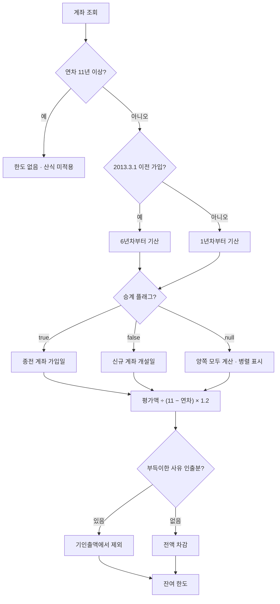
```mermaid
flowchart TD
    A["계좌 조회"] --> B{"연차 11년 이상?"}
    B -->|예| C["한도 없음 · 산식 미적용"]
    B -->|아니오| D{"2013.3.1 이전 가입?"}
    D -->|예| E["6년차부터 기산"]
    D -->|아니오| F["1년차부터 기산"]
    E --> G{"승계 플래그?"}
    F --> G
    G -->|true| H["종전 계좌 가입일"]
    G -->|false| I["신규 계좌 개설일"]
    G -->|"null"| J["양쪽 모두 계산 · 병렬 표시"]
    H --> K["평가액 ÷ (11 − 연차) × 1.2"]
    I --> K
    J --> K
    K --> L{"부득이한 사유 인출분?"}
    L -->|있음| M["기인출액에서 제외"]
    L -->|없음| N["전액 차감"]
    M --> O["잔여 한도"]
    N --> O
```

**연금 인정 3요건** — ① 55세 이후 수령 개시 신청 ② 가입일부터 5년 경과(이연퇴직소득이 있는 계좌는 면제) ③ 한도 이내 인출.

**연차 필드 분리 요구** — 한도용 연차는 최초로 연금수령할 수 있는 날이 속하는 과세기간부터 실제 수령 여부와 무관하게 누적된다. 감면율용 연차는 실제로 수령한 연차만 카운트한다. **원장에서 두 필드를 분리 관리해야 한다** (§6.4).

#### 6.9.2 인출순서 (시행령 §40의3 ①)

인출은 아래 순서로 강제된다. 고객도 금융회사도 바꿀 수 없다.

| 순위 | 재원 | 세금 |
|:---:|---|---|
| 1 | 과세제외금액 | 비과세 |
| 2 | 이연퇴직소득 | 퇴직소득세 × 70 / 60 / 50%. 한도 초과 시 100% |
| 3 | 세액공제분 · 운용수익 등 | 연금소득세 3.3~5.5%. 한도 초과 시 기타소득세 16.5% |

**차감 흐름** — 상세는 [설계 07 FC-02](./design/07_%ED%94%8C%EB%A1%9C%EC%9A%B0%EC%B0%A8%ED%8A%B8.md#fc-02-인출순서-3층-차감)

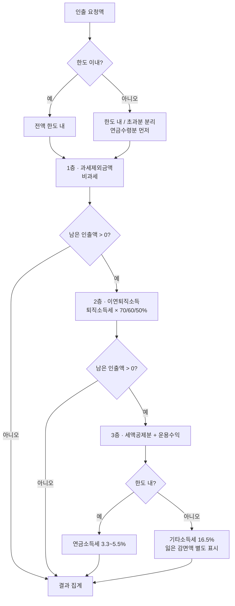
```mermaid
flowchart TD
    A["인출 요청액"] --> B{"한도 이내?"}
    B -->|예| C["전액 한도 내"]
    B -->|아니오| D["한도 내 / 초과분 분리<br/>연금수령분 먼저"]
    C --> E["1층 · 과세제외금액<br/>비과세"]
    D --> E
    E --> F{"남은 인출액 > 0?"}
    F -->|아니오| Z["결과 집계"]
    F -->|예| G["2층 · 이연퇴직소득<br/>퇴직소득세 × 70/60/50%"]
    G --> H{"남은 인출액 > 0?"}
    H -->|아니오| Z
    H -->|예| I["3층 · 세액공제분 + 운용수익"]
    I --> J{"한도 내?"}
    J -->|예| K["연금소득세 3.3~5.5%"]
    J -->|아니오| L["기타소득세 16.5%<br/>잃은 감면액 별도 표시"]
    K --> Z
    L --> Z
```

**1층 내부 순서 (§40의3 ②)**

```
① 당해 과세기간에 납입한 연금보험료
② 당해 과세기간에 납입한 전환금액 (ISA 만기 전환분 등)
③ 세액공제 한도를 초과하여 납입한 금액
④ 세액공제를 받지 않은 금액
```

**④의 조건부 성격** — §40의3 ② 단서는 "제4호는 제201조의10에 따라 **확인되는 금액만** 해당하며, **확인되는 날부터** 과세제외금액으로 본다"고 정한다. 「연금보험료 등 소득·세액 공제확인서」 제출 전에는 3층에 포함되어 과세된다. 원장 구조 변경 없이 구현 가능하며, 확인서 제출 유도가 F2-05의 핵심 동선이다.

| 규칙 | 내용 | 근거 |
|---|---|---|
| 한도 초과 시 인출 순서 | 연금수령분이 먼저 인출되고 그다음 연금외수령분이 인출된다 | §40의3 ③ |
| 운용손실 | 원금이 인출순서의 **역순**으로 차감된 후의 금액을 기준으로 한다 | §40의3 ⑤ |

#### 6.9.3 세율

화면에는 지방소득세를 포함한 실효세율을 표시한다.

| 구분 | 소득세법 원문 | 화면 표시 |
|---|---|---|
| 연금소득세 (55~69세) | 100분의 5 | **5.5%** |
| 연금소득세 (70~79세) | 100분의 4 | **4.4%** |
| 연금소득세 (80세 이상) | 100분의 3 | **3.3%** |
| 종신형 수령 | 100분의 3 (2026.1.1 시행) | **3.3%** |
| 기타소득세 | 100분의 15 | **16.5%** |
| 1,500만원 초과 선택세율 | 100분의 15 | **16.5%** |

**이연퇴직소득 감면율 (§129①5호의3)**

| 실제 수령연차 | 감면 후 부담 | 시행 |
|---|:---:|---|
| 10년 이하 | 퇴직소득세의 **70%** | 기존 |
| 10년 초과 ~ 20년 이하 | **60%** | 2020.1.1 |
| **20년 초과** | **50%** | **2026.1.1 신설** |

**검증 기준** — 종신형 세율은 2025.12.23 개정으로 4% → 3%로 인하되어 2026.1.1 시행됐다. 시중 자료와 타사 계산기 대부분이 아직 4.4%로 표기하고 있어 외부 자료와 대조하면 오히려 틀린 결과가 나온다. 검증 기준은 **국세청 홈택스 모의계산**으로 한다.

#### 6.9.4 연 1,500만원 판정

판정의 분모에 들어가는 것은 **3층 재원에서 나온 연금소득뿐**이다.

| 구분 | 판정 포함 여부 |
|---|---|
| 이연퇴직소득을 연금수령하는 연금소득 | 제외 (금액 무관 분리과세) |
| 의료목적·부득이한 사유 인출 | 제외 (금액 무관 분리과세) |
| 위 둘을 제외한 연금소득 | **포함** — 합계 1,500만원 이하면 분리과세 |

초과 시 종합과세 결정세액과 (해당 연금소득 × 16.5% + 나머지 종합세액) 중 납세자가 유리한 쪽을 선택한다.

**라목 처리 규칙** — 인출순서를 정하는 §40의3 ①3호는 재원을 "나목부터 라목까지"로 묶지만, 부득이한 사유 인출을 금액 무관 분리과세하는 §14③9호 나목은 "나목 및 다목"만 적는다. 라목이 섞인 계좌에서 부득이한 사유로 인출할 때 두 조문의 적용 범위가 어긋날 수 있다.

> **결정** — 라목 잔액이 원장에서 분리 관리되는 계좌만 1,500만원 판정을 수행한다. 분리되지 않은 계좌는 게이지를 숨기고 "이 계좌는 재원 구성상 종합과세 판정을 제공하지 않습니다"를 표시한다.

#### 6.9.5 완료일 밴드 산출

```
예상 완료일 = 신청일 + 기준 소요(자산 구성) + 단계별 조정
안내 기간   = 예상 완료일 ~ 예상 완료일 + 2영업일 (최소 폭 2영업일)
잠금 구간   = 전송 확정 시각 ~ 수관 계좌 입고 반영 시각
```

**자산별 기준 소요**

| 옮기는 자산 | 기준 소요 |
|---|---:|
| 예금 · 현금성만 | 4영업일 |
| 국내 펀드 · ETF | 6영업일 |
| 해외 펀드 포함 | 9~11영업일 |
| 연금저축보험 (해지환급금 산출) | 7영업일 |
| 실물이전 (IRP → IRP) | 3영업일 |

**회사별 밴드 산출 규격 (Phase 3)**

| 항목 | 값 |
|---|---|
| 집계 창 | 최근 180일 (rolling) |
| 표본 요건 | n ≥ 30 |
| 밴드 | p50 ~ p80 영업일 |
| 최소 폭 | 2영업일 |
| 이상치 | 90영업일 초과 건 제외 |
| 지연 감지 | p90 초과 |
| 재계산 | 매주 월요일, 조문·절차 변경 시 즉시 |

**폴백 사다리** — 위에서부터 조건이 맞는 첫 단계를 사용한다. 상세는 [설계 07 FC-06](./design/07_%ED%94%8C%EB%A1%9C%EC%9A%B0%EC%B0%A8%ED%8A%B8.md#fc-06-완료일-밴드-폴백-사다리)

| 단계 | 산출 근거 | 조건 |
|:---:|---|---|
| ① | 이관사 × 자산구성 실측 | n ≥ 30 |
| ② | 이관사 전체 실측 | n ≥ 30 |
| ③ | 자산구성 기준 소요 | 항상 사용 가능 |
| ④ | 업계 안내 기준 (최대 9영업일) | 최후 폴백 |

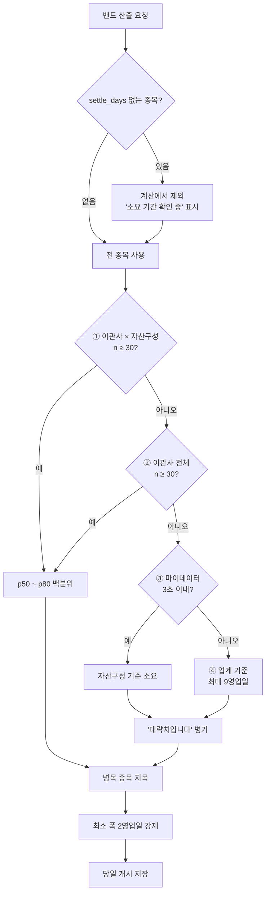
```mermaid
flowchart TD
    A["밴드 산출 요청"] --> B{"settle_days 없는 종목?"}
    B -->|있음| C["계산에서 제외<br/>'소요 기간 확인 중' 표시"]
    B -->|없음| D["전 종목 사용"]
    C --> D
    D --> E{"① 이관사 × 자산구성<br/>n ≥ 30?"}
    E -->|예| F["p50 ~ p80 백분위"]
    E -->|아니오| G{"② 이관사 전체<br/>n ≥ 30?"}
    G -->|예| F
    G -->|아니오| H{"③ 마이데이터<br/>3초 이내?"}
    H -->|예| I["자산구성 기준 소요"]
    H -->|아니오| J["④ 업계 기준<br/>최대 9영업일"]
    I --> K["'대략치입니다' 병기"]
    J --> K
    F --> L["병목 종목 지목"]
    K --> L
    L --> M["최소 폭 2영업일 강제"]
    M --> N["당일 캐시 저장"]
```

> **평균이 아니라 백분위를 쓰는 이유.** 분쟁·압류 건이 처리 소요 분포의 꼬리를 길게 만들어 평균은 체감보다 늦게 나온다. 중앙값에서 시작해 p80으로 닫으면 다섯 건 중 네 건이 그 안에서 끝난다.

#### 6.9.6 가입일 승계 · 배우자 승계 · 부득이한 사유

**가입일 승계 (§40의4 ④)**

| 규칙 | 내용 |
|---|---|
| 원칙 | 연금계좌의 가입일 등은 **이체받은 계좌**를 기준으로 적용한다 |
| 단서 | 연금계좌가 새로 설정되어 전액이 이체되는 경우에는 이체 전 계좌를 기준으로 **할 수 있다** |

KB증권은 "거래내역이 없는 신연금저축계좌로만 이체 가능"이라는 제약을 두고 있어 단서 요건이 항상 충족된다. 단서가 임의규정이므로 **화면은 승계 여부를 판단하지 않고 원장 승계 플래그를 단일 진실 원천으로 삼는다.** 플래그가 `null`인 계좌에 한해 적용·미적용 양쪽 한도를 병렬 표시한다.

**배우자 승계 계좌** — 세 조문이 각각 다른 것을 정한다. 상충이 아니라 역할 분담이다.

| 무엇을 | 어느 날 · 누구 기준 | 근거 |
|---|---|---|
| 계좌 가입일 | 승계하는 날 | 시행령 §100의2 ① 본문 |
| 5년 경과 요건 | 피상속인이 처음 가입한 날 | 시행령 §100의2 ① 단서 |
| 연금수령연차 | 사망일 당시 피상속인의 연차 | 시행령 §40의2 ④2호 |
| 연금 개시 연령 | 승계받은 배우자 본인 나이 (만 55세) | 소득세법 §44 ②, 시행령 §100의2 ① |

**부득이한 사유 판정표**

| 사유 | 세법상 부득이한 사유 | 한도 소진 | 적용 세율 |
|---|:---:|:---:|---|
| 일반 중도인출 | ✕ | O | 일반 |
| **주택 구입 · 전세보증금** | **✕** | **O** | 일반 |
| 요양 3~6개월 | O | ✕ | 연금소득세 |
| 요양 6개월 이상 | O | ✕ | 연금소득세 |
| 의료 목적 | O | ✕ | 연금소득세 |
| 천재지변 · 재난 · 파산 | O | ✕ | 연금소득세 |
| 해외이주 (조건부) | O | ✕ | 연금소득세 |

- **주택 구입 · 전세보증금** — 무주택자에 한해 근퇴법 시행령 §18의 중도인출 사유이므로 인출은 가능하다. 그러나 소득세법 §20의2의 부득이한 사유는 **아니다.** 한도도 그대로 소진되고 세율도 일반 인출과 같다.
- **요양 3~6개월** — 소득세법은 3개월 이상, 근퇴법은 6개월 이상이다. 이 구간은 세법 요건은 충족해도 IRP 중도인출 자체가 불가할 수 있다.
- **해외이주 + 이연퇴직소득** — 그 퇴직소득을 연금계좌에 **입금한 날부터 3년 이후** 해외이주하는 경우에 한정하여 연금수령으로 본다 (§40의2 ③ 단서).
- **증빙** — 사유가 확인된 날부터 **6개월 이내** 연금계좌취급자에게 제출해야 한다.


---

### 6.10 상태 모델 **[추가]**

**진행 단계**

| # | 단계 | 처리 주체 | 트리거 | 표준 소요 | 데이터 계층 |
|:---:|---|---|---|---|:---:|
| ① | 신청 접수 | KB증권 (수관사) | 이체신청서 등록 | 신청 당일~다음 영업일 | 확정 |
| ② | 이체 요청 전달 | 중계망 | 이체요청 전문 송신 | D+0~1영업일 | 확정 |
| ③ | 이관사 의사확인 | 이관사 | 의사확인 통화·녹취 | D+1영업일 | **추정** |
| ④ | 자산 현금화 | 이관사 | 환매·해지, 보험은 해지환급금 산출 | 상품별 상이 | **추정** |
| ⑤ | 송금·입금 반영 | 이관사 → KB증권 | 송금내역 통보 | D+1영업일 | 확정 |
| ⑥ | 이체 완료 | KB증권 | 수관 계좌 잔고 반영 확인 | 송금 후 반나절~1일 | 확정 |

**상태 전이** — 상세는 [설계 06 상태 다이어그램](./design/06_%EC%83%81%ED%83%9C_%EB%8B%A4%EC%9D%B4%EC%96%B4%EA%B7%B8%EB%9E%A8.md)

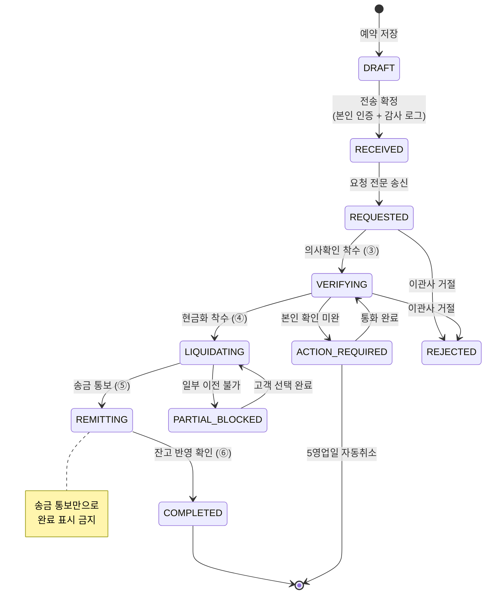
```mermaid
stateDiagram-v2
    [*] --> DRAFT : 예약 저장
    DRAFT --> RECEIVED : 전송 확정<br/>(본인 인증 + 감사 로그)
    RECEIVED --> REQUESTED : 요청 전문 송신
    REQUESTED --> VERIFYING : 의사확인 착수 (③)
    VERIFYING --> LIQUIDATING : 현금화 착수 (④)
    LIQUIDATING --> REMITTING : 송금 통보 (⑤)
    REMITTING --> COMPLETED : 잔고 반영 확인 (⑥)
    COMPLETED --> [*]

    VERIFYING --> ACTION_REQUIRED : 본인 확인 미완
    ACTION_REQUIRED --> VERIFYING : 통화 완료
    ACTION_REQUIRED --> [*] : 5영업일 자동취소
    REQUESTED --> REJECTED : 이관사 거절
    VERIFYING --> REJECTED : 이관사 거절
    LIQUIDATING --> PARTIAL_BLOCKED : 일부 이전 불가
    PARTIAL_BLOCKED --> LIQUIDATING : 고객 선택 완료

    note right of REMITTING
        송금 통보만으로
        완료 표시 금지
    end note
```

> **`DELAYED`는 별도 상태가 아니라 플래그다.** 지연은 단계가 뒤로 가는 것이 아니라 같은 단계에 오래 머무는 것이다. 상태로 만들면 단계가 왕복해 더 혼란스러워진다.

**상태값**

| 계층 | 필드 | 값 |
|---|---|---|
| 건 | `transfer_status` | `DRAFT` · `RECEIVED` · `REQUESTED` · `VERIFYING` · `LIQUIDATING` · `REMITTING` · `COMPLETED` |
| 건 (예외) | `transfer_status` | `ACTION_REQUIRED` · `REJECTED` · `PARTIAL_BLOCKED` · `DELAYED` |
| 종목 | `holding_status` | 실물이전 가능 / 현금화 필요 / 판정 불가 3그룹 + 현금화 진행 상태 + `is_critical_path` |
| 매매 | `trading_window` | `OPEN` · `SELL_ONLY` · `LOCKED` · `REOPENED` |

**상태 ↔ 화면 표시 매핑**

| 코드 | 화면 표시 | 코드 | 화면 표시 |
|---|---|---|---|
| `DRAFT` | 예약 저장됨 | `COMPLETED` | 이체 완료 |
| `RECEIVED` | 신청 접수됨 | `ACTION_REQUIRED` | 고객 확인 필요 |
| `REQUESTED` | 요청 전달됨 | `REJECTED` | 이체 거절 |
| `VERIFYING` | ○○에서 확인 중 | `PARTIAL_BLOCKED` | 일부 이전 불가 |
| `LIQUIDATING` | 자산 정리 중 | `DELAYED` | 지연 |
| `REMITTING` | 송금 중 | | |

**매매창 상태 전이와 이관 단계의 연동**

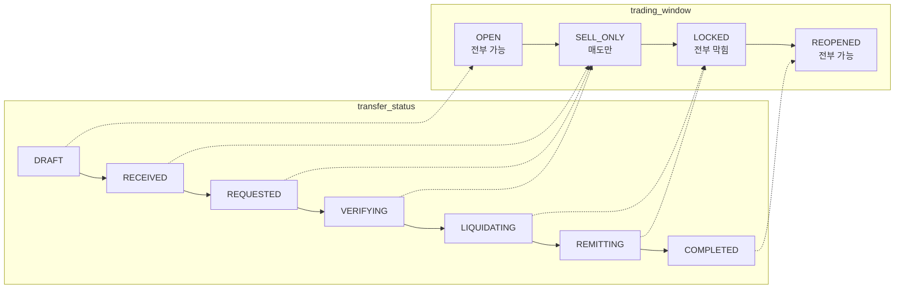
```mermaid
flowchart LR
    subgraph TS["transfer_status"]
        direction TB
        T1["DRAFT"] --> T2["RECEIVED"] --> T3["REQUESTED"] --> T4["VERIFYING"] --> T5["LIQUIDATING"] --> T6["REMITTING"] --> T7["COMPLETED"]
    end
    subgraph TW["trading_window"]
        direction TB
        W1["OPEN<br/>전부 가능"] --> W2["SELL_ONLY<br/>매도만"] --> W3["LOCKED<br/>전부 막힘"] --> W4["REOPENED<br/>전부 가능"]
    end
    T1 -.-> W1
    T2 -.-> W2
    T3 -.-> W2
    T4 -.-> W2
    T5 -.-> W3
    T6 -.-> W3
    T7 -.-> W4
```

> **두 상태를 분리한 이유.** 매매 제한의 범위와 시작 시점은 이관사가 정한다(L-4). 회사마다 다를 수 있어 한 필드로 묶으면 이관사 정책이 다를 때 표현할 수 없다.

**매매 잠금 매트릭스**

| 상태 | 적용 시점 | 매수 | 매도 | 추가 납입 | 수령 신청 |
|---|---|:---:|:---:|:---:|:---:|
| `OPEN` | 예약 저장 중 | 가능 | 가능 | 가능 | 가능 |
| `SELL_ONLY` | 전송 후 ~ 현금화 착수 전 | 막힘 | 가능 | 막힘 | 막힘 |
| `LOCKED` | 현금화 진행 중 | 막힘 | 막힘 | 막힘 | 막힘 |
| `REOPENED` | 잔고 반영 후 | 가능 | 가능 | 가능 | 가능 |

**보수 표시 규칙** — `trading_window.confidence`가 임계 미만이면 `LOCKED`로 내려 쓴다. 막혔는데 열렸다고 표시하면 주문이 거부되고, 열렸는데 막혔다고 표시하면 기회를 놓친다. 둘 다 나쁘지만 앞쪽이 회복 불가능하다.

**의사확인 기한 이중 눈금** — 두 날짜는 모순이 아니라 성격이 다르다. 하나의 타임라인에 눈금 두 개로 표시한다.

| 날짜 | 성격 |
|---|---|
| 이체신청일 +1영업일 | 통화가 이뤄져야 하는 **원칙 기한** |
| 신청 후 5영업일 | 재시도까지 끝난 뒤의 **자동취소 마감** |


---

### 6.11 규제 준수 제약 **[추가]**

#### 6.11.1 규제 제약 11건

> 원본 PRD §11에 작성된 내용이다. 이 제약이 깨지면 서비스의 규제 지위가 바뀌므로 설계 제약으로 배치했다. 인가는 불필요하나 아래 조건은 구현 단계에서 강제되어야 한다.

| # | 제약 | 근거 | 구현에서의 처리 |
|:---:|---|---|---|
| R-1 | 종목·수량·시기를 지정하지 않는다 | 자본시장법 §6⑦ | 세액과 일정만 계산한다. 무엇을 얼마나 팔지는 정하지 않는다 |
| R-2 | 계산기를 유료화하지 않는다 | 자본시장법 시행령 §7④8호 | 전 가입자 무료. 프리미엄 분기 없음 |
| R-3 | 결과 화면에 유상 1:1 자문을 두지 않는다 | 자본시장법 §6⑦ · 시행령 §7④8호 | F2-04에 상담 진입점 없음. 고객센터 연결은 절차 안내 화면에만 |
| R-4 | 자동 인출·운용을 실행하지 않는다 | 자본시장법 §6⑧ | 실제 출금·매매로 넘어가는 버튼 없음 |
| R-5 | 조세에 관한 상담·자문으로 넘어가지 않는다 | 세무사법 §2 4호 | 법정 산식에 값을 넣은 결과와 조문만 표시. 개별 사안 해석 없음 |
| R-6 | 세무대리를 소개·알선하고 대가를 받지 않는다 | 세무사법 §2조의2 | 외부 세무 전문가 알선 없음. 확인서는 고객이 직접 발급·제출 |
| R-7 | 불확실한 것을 단정하지 않는다 | 금융소비자보호법 §21① 1호 | 완료일은 기간, ③④는 "보통 이 시점에는", 가입일 승계는 양쪽 계산. `모의계산 결과` 라벨 고정 |
| R-8 | 상품의 가치 상승·하락을 단정하지 않는다 | 근퇴법 시행령 §34 4호 | 수익률 랭킹은 과거 수익률 정렬 사실만 표시 |
| R-9 | 특정 가입자에게 특별한 이익을 주지 않는다 | 근퇴법 §33④ | 전 가입자 동일 제공. 등급·자산 규모별 분기 없음 |
| R-10 | 산출근거를 감추지 않는다 | R-7 준수 수단 | 산식·대입값·기준일·밴드 산출 규격 공개 |
| R-11 | 타사 계좌는 세액을 표시하지 않는다 | 마이데이터 규격 한계 (L-2) | 재원 3층 공란, 세액 미산출, 사유 안내 |

**인용 범위** — 근퇴법 시행령 §34는 5호까지이며, 이 서비스에 걸리는 조항은 4호(운용방법의 가치 판단)다. 자본시장법 §7③은 "개별성 없는 조언"(간행물·방송 등)에 대한 적용배제 조항이라 개별 계좌 데이터를 쓰는 이 계산에는 적용되지 않으므로 근거에서 제외했다. 적용배제의 실제 근거는 §6⑦ 정의와 시행령 §7④8호의 무상·부수 요건이다.

**중립성 조건**

| # | 조건 |
|:---:|---|
| ① | "계좌 하나 더" 안내는 특정 회사 링크가 아니라 사업자 비교표(F3) 경유 |
| ② | 수익률을 약속하지 않음 — "회사별로 얼마나 다른지 보여드립니다"까지만 |
| ③ | 로보어드바이저를 한 회사 링크로 두지 않음 |
| ④ | 이관 진단(F1)과 로보어드바이저를 같은 화면에 나란히 두지 않음 |

**계산 오류 책임**

- 성격: 부수적 정보제공 의무 위반에 따른 채무불이행·불법행위 책임.
- 금소법 §19 설명의무 위반이 인정되면 §44②의 **입증책임 전환**(고의 및 과실 없음을 금융회사가 입증)이 적용될 수 있다.
- "참고용" 면책 문구는 신뢰 형성 정도를 낮추고 과실상계 사유로 작동하는 정도이며, 약관규제법상 고의·중과실 면책조항은 무효로 보는 것이 일반 법리다.
- **실효적 방어** — 산식·가정·기준일의 완전 공개, 계산 로직 버전관리와 검증기록, 세법 개정 반영 SLA, "실제 원천징수 세액과 다를 수 있음" 병기.

#### 6.11.2 외부 데이터 제약

| # | 제약 | 대응 |
|:---:|---|---|
| E-1 | ③④ 실시간 조회 경로 부재 (L-1) | 추정 레이어로만 표시. 확정 표기 금지 |
| E-2 | 마이데이터에 재원 구분 항목 없음 (L-2) | 타사 계좌 세액 미산출 (R-11) |
| E-3 | 이관사가 매매 제한 범위·시점을 정함 (L-4) | 미확인 시 `LOCKED` 보수 표시 (D-4) |
| E-4 | `settle_days` 사전에 없는 신규 상품 | 밴드 계산에서 제외. 임의 추정 금지 |


---

### 6.12 설계 결정 기록 (ADR) **[추가]**

> 원본 PRD §13.2에 작성된 내용이다. 일반적인 SRS 본문에 대응 절이 없어 부록으로 배치했다. 요구사항이 왜 그 형태인지의 근거이므로 §3의 각 요구사항에서 참조한다.

| ADR | 결정 | 관련 요구사항 |
|---|---|---|
| **ADR-001** | 기능3(연금수령한도 계산기)을 독립 기능으로 세우지 않고 기능2의 구성요소로 둔다. 인출순서는 한도 없이 성립하지 않는다 | §1.2, FR-F2-03-01 |
| **ADR-002** | 예약(`DRAFT`) 상태를 두고 전송 시점을 고객이 고르게 한다. 속도는 못 줄여도 시작 시점은 고객이 정할 수 있다 | FR-F1-03-04 |
| **ADR-003** | 완료일을 단일 날짜가 아니라 밴드로 표시한다. 단일 날짜는 지킬 수 없는 약속이 된다 | FR-F1-04-03, FR-F1-01-01 |
| **ADR-004** | 타사 계좌는 한도만 계산하고 세액은 표시하지 않는다. `가입자부담금`/`사용자부담금` 근사는 재원 구분의 대체물이 될 수 없다 | FR-F2-03-09, R-11 |
| **ADR-005** | 한도 초과 입력을 차단하지 않고 세액을 보여준다. 이 제품의 목적은 막는 것이 아니라 보여주는 것이다 | FR-F2-03-02 |
| **ADR-006** | 결과 화면에 상담·매매 진입점을 두지 않는다. 시행령 §7④8호의 무상·부수 요건이 깨진다 | FR-F2-04-12, R-3, R-4 |
| **ADR-007** | 밴드 산출에 평균이 아니라 백분위(p50~p80)를 쓴다. 분쟁·압류 건이 분포의 꼬리를 길게 만든다 | §6.9.5 |
| **ADR-008** | 세율을 코드가 아니라 시행일이 붙은 설정으로 관리한다. 배포 없이 세율을 바꿀 수 있어야 한다 | FR-F2-04-11, M-1, A-4 |
| **ADR-009** | 완료 판정 기준을 송금 통보가 아니라 잔고 반영으로 둔다. "완료라는데 돈이 없다"가 최악의 문의다 | FR-F1-06-01 |

각 결정의 배경·대안·결과 전문은 원본 PRD §13.2를 참조한다.


---

### 6.13 리스크 · 가정 · 지표 **[추가]**

#### 6.13.1 리스크 등록부

> 원본 PRD §14에 작성된 내용이다. 각 리스크에는 발동 조건이 있는 대응책이 걸려 있다.

| 구분 | 리스크 | 대응 |
|---|---|---|
| 기술 | ③④ 추정이 반복 어긋나 확정 단계 신뢰까지 오염 | 밴드 적중률 주간 85% 미만 시 밴드 폭 확대 |
| 기술 | 예탁원 통보 미수신으로 화면이 한 단계에서 멈춤 | 경과일 기반 추정 문구 + 밴드 확장 |
| 기술 | `trading_window` 오표시로 주문이 거부됨 | 미확인 시 `LOCKED` 보수 표시. 가드레일 0.1% 초과 시 즉시 알림 |
| 규제 | 예약 전송이 이체 신청 접수 규정과 충돌 | 착수 전 확인. 미확인 시 예약을 저장 전용으로만 출시 |
| 데이터 | `settle_days` 실측값이 실제와 달라 밴드가 부정확 | 출시 전 실측 확보를 릴리스 게이트로 |
| 데이터 | 라목 잔액 미분리로 1,500만원 판정이 어긋남 | 착수 전 원장 확인. 미확인 시 해당 계좌 판정 비노출 |
| 데이터 | 마이데이터가 과세제외금액·이연퇴직소득을 구분하지 못함 | 타사 계좌 세액 미표시. 자사 계좌 전용 설계 |
| 법규 | 세율표 노후화로 오안내 | 세율표를 시행일 기반 설정으로 분리, 갱신일 대시보드 노출 |
| 법규 | 계산 오류 시 책임 | 산식 공개, 버전관리, 검증기록 보존 |
| 규제 | 결과 화면에 상담을 붙이면 적용배제 요건이 깨짐 | 화면 설계 단계에서 차단. 코드 리뷰 체크리스트 포함 |
| 규제 | 사업자 비교·로보 안내가 권유로 오인 | 중립성 조건 준수, 관련 문의·민원 모니터링 |
| 개인정보 | 타사 계좌 조회에 마이데이터 허가·동의 절차가 추가로 필요 | Phase 0 종료를 법무 검토 완료 게이트로. 미완 시 Phase 2 이연 |
| 개인정보 | 진행 알림이 광고성 정보로 분류될 여지 | 알림 문안에서 상품·혜택 언급 배제. 광고성 판정 시 수신동의 취득 후 발송 |
| 측정 | 콜센터 문의 코드 미태깅으로 북극성 기준선이 없음 | Phase 0에서 태깅 선행 |
| 운영 | Phase 3 통계 미축적 시 회사별 개인화 불가 | 폴백 사다리로 표본 없이도 정상 동작 |


---

#### 6.13.2 가정과 지표

##### 6.13.2.1 검증해야 할 가설

이 시스템은 아래 6개 가설 위에 서 있다. 각 가설은 지표로 검증되며 반증 시 조치를 미리 정했다.

| # | 가설 | 검증 지표 | 검증 시점 | 반증 시 조치 |
|:---:|---|---|:---:|---|
| H1 | 이관 문의의 상당수는 "상태를 몰라서" 발생한다 | 상태 확인 문의율 ≤ 0.3건/건 | Phase 2 | 문의 원인 재분류. 원인이 아니면 현황판 투자 축소 |
| H2 | 고객은 처리 속도보다 언제 시작할지 고를 수 있는 것에 가치를 둔다 | 예약 → 전송 전환율 ≥ 60% (하한 30%) | Phase 1 | 30% 미만이면 예약을 저장 전용으로 축소 |
| H3 | 세금 차이를 미리 보면 인출 시점을 조정한다 | 한도 초과 인출률 미사용 대비 -30%p | Phase 2 | F2-04를 정보 제공으로 축소하고 무게를 F2-05로 이동 |
| H4 | 동선을 만들면 공제확인서를 실제로 제출한다 | 제출 전환 ≥ 15% | Phase 1 +1개월 | 5% 미만이면 인출 시점 알림 기반으로 전환 |
| H5 | 캐시백 없이도 이관 물량을 방어할 수 있다 | 건당 원가 PB 대비 ≤ 5% | Phase 3 | 실패 시 이벤트 병행 재검토. **사업 논리 자체가 바뀜** |
| H6 | 밴드 표시가 단일 날짜보다 신뢰를 준다 | 밴드 적중률 ≥ 85% · 재방문 1.5~4.0회/건 | Phase 1 | 2주 지속 미달 시 밴드 폭 확대, 그래도 미달이면 완료일 표시 중단 |

##### 6.13.2.2 성공 지표

| 지표 | 정의 | 기준선 | 목표 | 측정 창구 | 주기 |
|---|---|---|:---:|---|:---:|
| **북극성 — 상태 확인 문의율** | 신청 후 완료 전까지 콜센터·PB 문의 ÷ 이관 건수 | Phase 0 4주 관측치 | **≤ 0.3건/건** | CTI `TRF-STATUS` ÷ `TRANSFER` | 주간 |
| 완료일 밴드 적중률 | 실제 완료일이 안내 밴드 안에 든 비율 | 0% | ≥ 85% | `LOCK_WINDOW` vs `settled_at` | 주간 |
| 사전 조회 → 신청 전환율 | 유의사항 조회 후 이체 신청 전환 | Phase 1 4주 관측치 | ≥ 35% | GA `f1_02_view` → `f1_03_submit` | 주간 |
| 의사확인 자동취소율 | 자동 취소 건수 ÷ 신청 건수 | Phase 0 4주 관측치 | -50%, 상한 ≤ 5% | `CANCELED_NO_VERIFY` ÷ 신청 | 주간 |
| 시뮬레이션 후 한도 초과 인출률 | 시뮬레이터 사용자의 한도 초과 발생률 | 미사용 코호트 | -30%p, ≤ 10% | `exceeds_limit` × 사용 코호트 | 월간 |
| 공제확인서 제출 건수 | F2-05 진입 후 제출 전환 | 0% | ≥ 15% | GA → 원장 4호 플래그 전환 | 월간 |
| 예약 → 전송 전환율 | 예약 저장 중 전송 확정 비율 | 0% | ≥ 60% (하한 30%) | `DRAFT` → `RECEIVED` 전이율 | 주간 |
| **가드레일 — 매매 상태 오표시 주문 거부율** | 화면이 "가능"으로 표시했는데 거부된 주문 ÷ 전체 | 0% | **≤ 0.1%** | 거부 로그 `TRANSFER_LOCK` ÷ 전체 | **일간 · 실시간** |
| 현황판 재방문 횟수 | 신청 1건당 현황판 조회 횟수 | Phase 1 4주 관측치 | 대역 1.5~4.0회/건 | GA `f1_04_view` ÷ `TRANSFER` | 주간 |

**가드레일의 성격** — 나머지 지표는 목표에 가까울수록 좋지만 이것은 **넘으면 즉시 멈추는 선**이다. 일간 집계가 0.1%를 넘으면 자동 알람이 울리고 해당 기능을 롤백한다.

**재방문 횟수의 성격** — 낮을수록 좋은 지표가 아니다. 1.5회 미만이면 화면을 못 찾고 있다는 뜻이고, 4.0회를 넘으면 화면이 답을 못 주고 있다는 뜻이다.

##### 6.13.2.3 외부 의존

| 대상 | 확보 상태 | 확보 기한 | 미확보 시 확정 동작 |
|---|:---:|:---:|---|
| 마이데이터 연금 API | 확정 | — | 수기 입력 폴백 |
| 예탁원 통보 전문 (④⑤) | 협의 중 | Phase 0 종료 | 폴백 사다리 ③단계로 밴드 산출 |
| 상품별 결제 규정 (`settle_days`) | 협의 중 | **Phase 1 게이트** | **미확보 시 Phase 1 착수하지 않는다** |
| 이관사 내부 진행 (③④) | **경로 없음 (설계 전제)** | — | 추정 레이어로만 표시 |
| 은행연합회 한도조회 | 딥링크 확인 | Phase 1 | 링크 미확보 시 버튼 비노출 |
| 금감원 상속인 조회 | 딥링크 확인 | Phase 1 | 링크 미확보 시 고객센터 안내 |


---

### 6.14 인도 계획과 미해결 사항 **[추가]**

#### 6.14.1 단계적 인도 계획

> 원본 PRD §12에 작성된 내용이다. 요구사항의 인도 시점을 규정하므로 부록으로 배치했다.

| 단계 | 범위 | 승격 조건 |
|---|---|---|
| **0. 내부** | 임직원 IRP 이관 건(기능1) · 세율표 검증(기능2) · 콜센터 문의 코드 `TRF-STATUS` 태깅 · 마이데이터 동의 절차 법무 검토 | 문의율·자동취소율 기준선 4주 관측치 확정 · 인수 조건 전건 통과 · `settle_days` 실측 확보 |
| **1. 제한 베타** | PB 미배정 · IRP 단건 10%(기능1) / 기능2 전 사용자 공개 | 밴드 적중률 ≥ 75% · 주문 거부율 ≤ 0.1% · 계산 오류 0건 |
| **2. 확대** | 동일 조건 50% | 밴드 적중률 ≥ 85% · 예약 → 전송 전환율 ≥ 40% · 문의율 기준선 대비 감소 확인 |
| **3. 전체** | PB 미배정 전체 | 진행 단계 커버리지 유지 · 문의율 ≤ 0.3건/건 |

**기능 단위 단계**

| Phase | 범위 |
|---|---|
| Phase 1 | 예약 · 잠금 구간 미리보기 · 진행 단계 타임라인 · 완료일 밴드 · 의사확인 안내 · 알림 3종 · 기능2 전체 |
| Phase 2 | 지연 자동 감지 · 상품별 환매 완료일 분해 · 실물이전 사전조회 연동 · 운용손실 역순 차감 |
| Phase 3 | 이관사별 처리 소요 통계 축적 → 회사별 밴드 개인화 |


---

#### 6.14.2 미해결 사항

착수 전 확인이 필요한 항목이다. **결정을 미루는 목록이 아니다.** 각 항목은 §6.13.1에 대응책이 걸려 있어 답이 늦어져도 정해진 축소형으로 인도된다.

| 차단 등급 | 의미 |
|---|---|
| **게이트** | 답이 없으면 해당 Phase에 착수하지 않는다 |
| 축소 | 답이 없으면 기능을 정해진 축소형으로 인도한다 |

**연금시스템팀**

| # | 질문 | 차단 | 답이 없을 때의 확정 동작 |
|:---:|---|:---:|---|
| 1 | 이관으로 개설된 계좌의 가입일은 종전 계좌 기준인가, 신규 계좌 기준인가? | 축소 | 승계·미승계 양쪽 한도를 병렬 표시 |
| 2 | 3층 재원 중 라목 잔액이 별도로 관리되는가? | 축소 | 라목 미분리 계좌는 판정 게이지 비노출 |
| 3 | 상품별 결제 규정을 실측 확보할 수 있는가? | **게이트** | **Phase 1에 착수하지 않는다** |
| 4 | 의사확인 자동취소 기준일은 +1영업일인가, 5영업일인가? | 축소 | 두 날짜를 눈금 2개로 병기 |
| 5 | 이연퇴직소득 입금일이 원장에 기록되어 있는가? | 축소 | 해외이주 사유를 선택 목록에서 제외 |
| 6 | 단계별 전문 수신 시각을 이관사 × 자산구성 단위로 적재할 수 있는가? | 축소 | 폴백 사다리 ②~③단계로 운영 |
| 7 | 콜센터 문의 코드에 "이관 상태 확인" 분류를 추가할 수 있는가? | **게이트** | **기준선 없이 Phase 1로 승격하지 않는다** |
| 8 | 이관 중 매매 제한 정책이 확정됐는가? 전송 후 매도는 열리는가? | 축소 | 미확인 구간은 `LOCKED`로 보수 표시 |
| 9 | 예약 저장 후 전송하는 구조가 이체 신청 접수 규정과 충돌하지 않는가? | 축소 | 예약을 저장 전용으로 축소해 인도 |

**법무 · 컴플라이언스**

| # | 질문 | 차단 | 답이 없을 때의 확정 동작 |
|:---:|---|:---:|---|
| 1 | 종목·수량·시기를 지정하지 않는 이 계산이 투자자문업에 해당하는가? | 축소 | R-1 ~ R-11을 코드 리뷰 체크리스트로 강제한 상태로 인도 |
| 2 | 타사 계좌 조회에 마이데이터를 쓰려면 별도 허가·동의가 어디까지 필요한가? | 축소 | 타사 계좌 기능을 Phase 2로 이연 |
| 3 | 이체 진행 상황 푸시가 광고성 정보에 해당하는가? | 축소 | 인앱 알림으로만 제공, 푸시 보류 |
| 4 | 계산 오류 시 면책 문구로 어디까지 방어되는가? | 축소 | §6.11.1의 실효적 방어 4종을 전부 적용 |
| 5 | 전송 버튼을 전자적 의사표시로 볼 때 인증수단과 로그 보존 범위는? | 축소 | 감사 로그 10년 보존(S-2)을 상한으로 적용 |


---

### 6.15 사업 배경 및 근거 자료 **[추가]**

#### 6.15.1 시장 근거

> 원본 PRD §1.1 · §1.2 · §2.1 · §2.3에 작성된 내용이다. ISO/IEC/IEEE 29148에서 시장 분석과 사업 목표는 SRS 본문이 아니라 이해관계자 요구사항(StRS) 영역이므로, 요구사항의 발생 근거로서 부록에 배치했다.

##### 1 시장 상황

이관 처리 속도는 원 사업자와 예탁결제원 단일 인프라에 묶여 있어 어느 증권사도 이 구간을 단축할 수 없다. 경쟁축은 **처리 속도**가 아니라 **그 상태를 고객 눈에 보이게 하는가**로 옮겨왔다.

PB가 배정되는 고액 자산가는 상담사를 통해 진행 상황과 세제 설명을 받는다. PB가 없는 일반 고객 구간에는 그 기능이 시스템화되어 있지 않다. 이 구간이 신규 진입 시 가장 빠르게 확장할 수 있는 영역이다.

| 구분 | 규모 |
|---|---|
| TAM · 국내 연금계좌 전체 적립금 | 약 699.6조원 (퇴직연금 501.4조 + 연금저축 198.2조) |
| SAM · 연간 실제 이관 처리 물량 | 연 321만 건 / 금액 하한 연 9.6조원 |
| SOM · 개선 기능으로 확보·방어 가능한 물량 | 연 9,600건 / 약 5,900억원 (SAM × 0.3%, 보수적) |
| 참고 · 수령 국면 모집단 | 2025년 퇴직연금 수급 개시 60.1만 명 (일시금 83.5%) |

##### 2 차별화 축 — 어디가 비어 있는가

| 구간 | 현재 시장 | 판정 | 대응 |
|---|---|---|---|
| **신청 전** 판별 | 예탁결제원이 실물이전 가능 여부 사전조회를 무료 제공 (2025.7.21~) | 기본기. 여기서는 차별화되지 않음 | 범위 제외 (§1.2) |
| **신청 후** 진행 가시성 | 확인된 제공 사업자 없음 | **공백** | 기능1 전체 |
| 인출 시점 세액 계산 | 개인 계좌 기준으로 3층 순서·세액을 계산해 주는 곳 없음 | **공백** | 기능2 전체 |
| 수령 한도 조회 | 통합연금포털은 "조회는 충족, 비교는 미제공" | 부분 공백 | FR-F2-03-01 |

**왜 지금인가** — 2026.1.1 개정으로 이연퇴직소득 감면 구간이 20년 초과 50%까지 3단계로 늘었다. 계산 복잡도가 올라갔는데, 새로 열린 50% 구간에 실제로 서 있는 사람은 연금 수령자의 **2.3%**뿐이다(10년 이하가 82%). 제도는 열렸지만 계산해 본 사람이 없다는 뜻이다.

##### 3 사업 목표

사람(PB·콜센터)이 처리하던 확인과 설명을 화면으로 대체한다. 일반 고객 구간의 비대면 원가를 낮추고, 대기 중 이탈과 중도 포기를 줄여 캐시백을 태우지 않고도 이관 물량을 방어한다. **PB 고정비 + 이벤트 변동비의 이중 부담 구조를 푸는 것**이 목적이다.

| 기능 | 한 줄 제안 |
|---|---|
| 기능1 이수관 현황판 | "지금 어디까지 왔는지, 언제 끝나는지, 그때까지 무엇이 막히는지 보여드립니다." |
| 기능2 인출순서 시뮬레이터 | "법이 정한 순서대로 어느 돈이 먼저 나가고 세금이 얼마인지 미리 계산해 드립니다." |

##### 4 핵심 성공 요인(KSF) 대응

| KSF | 현재 수준 | 대응 요구사항 |
|---|---|---|
| 1. 이관 가능 여부 사전 판별력 | 중간 (PB 고객만) | FR-F1-02-04 · FR-F1-02-05 |
| 2. 통제 불가 구간의 상태 가시성 | 낮음~중간 (PB 고객만) | **FR-F1-04-01 ~ 09 · FR-F1-05-01 ~ 03** |
| 3. PB 1인당 관리 자산 확대 | 중간 | FR-F1-06-06 |
| 4. 일반 고객 구간 비대면 원가 절감 | 낮음 | FR-F1-04-04 · FR-F1-04-07 · 기능2 전체 |
| 5. 이벤트 경쟁과 고정비 동시 부담 관리 | 위험 신호 | 캐시백 없이 방어하는 구조 전체 (가설 H5) |

#### 6.15.2 AS-IS 갭 분석

> 원본 PRD §1.3 · §1.3에 작성된 내용이다. ISO/IEC/IEEE 29148 §5.2.6은 요구사항이 그 출처까지 추적 가능할 것을 요구한다. 이 부록은 각 요구사항이 **어느 실측 갭에서 나왔는지**를 연결한다.

##### 1 Problem Statement

> KB증권의 **일반 고객(PB 미배정)** 은 **연금 이전을 결심한 순간**에 **상품별 이전 가능 여부, 실시간 진행 현황, 추가 운용지시 제한 사유를 즉각 확인할 방법이 없어서** **투자손실을 최소화하며 이관을 완료하는 것**을 달성하지 못하고 있다.

##### 2 실측 갭

KB증권 앱 실화면을 캡처해 확인한 갭이다. 신청 플로우 ①~④·⑥은 정상 구간이라 손대지 않는다.

| 갭 ID | 지점 | 현재 화면에서 벌어지는 일 |
|:---:|---|---|
| **G-1** | 기능1 ⑤ 유의사항 | 해지공제·투자위험·압류 등 일반 약관 14개 조항이 팝업 전문으로만 노출. 읽다가 막혀도 물어볼 경로가 없음. 가입일이 이어지는지에 대한 안내가 어디에도 없음 |
| **G-2** | 기능1 ⑦ 신청내역 | 처리상태 칸에 "신청중" 한 줄. 5단계 진행 순서는 하단 안내문에 고정 텍스트로만 존재해 내 건과 연결되지 않음. 의사확인 기한이 ⑤ 약관(+1영업일)과 ⑦ 안내문(5영업일)에 다르게 적혀 있음 |
| **G-3** | 기능1 · 매매 제한 | 이체 중 어떤 업무가 언제까지 막히는지 고지되지 않음 (**고지율 0%**) |
| **G-4** | 기능1 · 신청 시점 | 신청 화면에 보내기 버튼 하나뿐. 저장해 두고 나중에 보내는 경로가 없어 잠금이 언제 시작될지를 고객이 고를 수 없음 |
| **G-5** | 기능1 · 종목 판정 | 어느 종목이 그대로 옮겨지고 어느 종목이 팔려 나가는지 신청 전에 알 수 없음. 특정 종목 하나가 전체를 늦추고 있어도 드러나지 않음 |
| **G-6** | 기능2 ② 해지없이 출금하기 | 중도인출이 "연금저축 해지" 화면 하위 섹션에만 존재. 해지 의사가 없는 고객은 도달하지 않음. 본인/타명의 분기 없음 |
| **G-7** | 기능2 ③ 예상 해지 금액 | 과세제외 3항목·과세대상 3항목의 금액은 이미 표시됨. 다만 병렬 나열만 하고 어느 재원부터 차감되는지 순서가 없음. 세금은 합계 3줄만 있고 어느 재원에서 나왔는지 연결되지 않음 |
| **G-8** | 기능2 전반 | 은행연합회 비과세 한도조회, 금감원 상속인금융거래조회 링크 전무 |

##### 3 갭 → 요구사항 추적

| 갭 ID | 대응 요구사항 | 검증 |
|:---:|---|---|
| G-1 | FR-F1-02-01 ~ 05 | §6.7.2 F1-02 #1 ~ #6 |
| G-2 | FR-F1-01-01 · FR-F1-04-01 ~ 04 | §6.7.2 F1-01 #2, F1-04 #1 ~ #4, #10 |
| G-3 | FR-F1-03-07 · FR-F1-04-09 | §6.7.2 F1-03 #3, #4, F1-04 #8 |
| G-4 | FR-F1-03-04 | §6.7.2 F1-03 #3, #4 |
| G-5 | FR-F1-03-01 · 03 · 06 | §6.7.2 F1-03 #5 ~ #7 |
| G-6 | FR-F2-01-01 · FR-F2-02-01 | §6.7.2 F2-01 #1, F2-02 #1 |
| G-7 | FR-F2-04-01 · 09 | §6.7.2 F2-04 #1, #3 |
| G-8 | FR-F2-05-04 · FR-F2-06-01 | §6.7.2 F2-05 #2, F2-06 #1 |

**정상 구간** — 신청 플로우 ①~④·⑥은 갭이 확인되지 않았다. 이 구간을 변경하는 요구사항은 두지 않는다.

#### 6.15.3 사용자 프로파일

> 원본 PRD §4에 작성된 내용이다. §6.15.3의 사용자 특성 표를 확장한 것으로, 각 요구사항이 누구의 어떤 문제를 푸는지 연결한다.

##### 1 서동현 (41세, 적극투자형, PB 미배정) · 기능1

> "옮기는 며칠 동안 시장이 빠지면, 그건 누가 책임지죠?"

**보유** — 은행권 DC형 1건 + IRP 1건. ETF 4종·채권형 펀드 1종·원리금보장 예금 1건 혼합. 종목별로 손익 구간이 갈려 있다.

**Pain** — 보유 종목의 실물이전 가능 여부는 예탁결제원에서 사전 조회할 수 있다. 그러나 신청부터 완료까지 수 영업일간 매매 지시가 막히는데, **그 구간이 언제 시작해서 언제 끝나는지 안내되지 않는다.**

**대응** — FR-F1-03-02 · 04 (전송 시점 선택), FR-F1-03-03 · 05 (병목 정리 시 밴드 재계산), FR-F1-04-09 (제한 업무와 해제 시점), FR-F1-05-01 (완료일 근거)

##### 2 오정숙 (수령 개시 예정) · 기능2

> "개시하시면 이제 못 옮기세요"를 지나가듯 들은 순간, 개시 전에 정리할 게 무엇인지 알고 싶다.

**Pain** — 되돌릴 수 없는 선택인데 미리 알려주는 곳이 없다. 중요도 5 · 비가역.

**대응** — FR-F2-03-01 (한도 게이지), FR-F2-04-01 ~ 05 (인출순서 결과)

##### 3 최은호 (상속·승계) · 기능2

> 승계라는 절차의 존재만 알게 되고 처리 방법이 안내되지 않아, 무엇부터 할지 정하지 못한다.

**대응** — FR-F2-06-01 ~ 04. 상속인 조회는 계좌를 **찾기 이전** 단계이고, 찾은 뒤 서류를 준비하는 것은 F10 소관이다 (§1.2).

##### 4 강태섭 (극단 사용자)

> "안 된다고만 하지 말고, 뭘 하면 되는지 알려주세요."

**Pain** — 압류가 설정된 연금저축계좌 보유. 이전 신청마다 거절되는데 사유가 코드·전문용어로만 통보된다.

**대응** — FR-F1-04-07 (평이화된 사유와 해소 절차 3단계). 개별 해소 대행은 F4 소관이다 (§1.2).

##### 5 김상철 (비활성 사용자)

> "옮기면 세금 문다던데, 굳이 건드릴 이유가 있나요?"

**Pain** — 이체 시 과세되지 않는다는 사실을 모른 채 방치. 절차상 막힌 것은 없고 오해 때문에 진입 자체를 하지 않는다.

**대응** — FR-F1-01-04 (이체 시 비과세 안내)

#### 6.15.4 벤치마크 분석

> 원본 PRD §16.2에 작성된 내용이다. 설계가 무엇을 참조했고 무엇을 바꿨는지의 기록이다.

| 사례 | 가져온 작동 원리 | 변형한 부분 | 반영 요구사항 |
|---|---|---|---|
| **도미노 피자 트래커** (미국, 2008) | 조리 시간은 그대로 두고 단계만 보이게 해서 상태 확인 전화를 줄임 (17년간 25억 건 이상 추적) | 배달은 GPS 위치를 보여주지만 이관에는 위치가 없다. "어느 기관에서 어떤 업무가 처리 중인지"로 바꿔 적용 | FR-F1-04-01 · 10 |
| **토스 · 핀다 대출 비교** (한국) | 여러 금융사 한도·금리를 가조회로 확인해 신청 전에 결과를 보여줌 | 대출은 여러 회사를 병렬 조회하지만 이관은 내 계약 하나에 대한 단일 판정이라 형태를 바꿔 적용 | FR-F1-03-01 · 02 |
| **영국 연금 인출세 계산기** | 인출 금액을 입력하면 비과세분과 과세분을 나눠 세액을 계산 | 영국은 2분할이지만 한국은 3층이고 순서가 법으로 강제된다. 비율 계산이 아니라 순서대로 빼는 방식으로 적용 | FR-F2-04-01 · 04 |
| **통합연금포털** (금감원) | 수령 방식별 일반 정보·회사별 공시 제공 | "조회는 충족, 비교는 미제공" — 개인 계좌의 개인 숫자 계산은 공백으로 남아 우리가 채움 | FR-F2-03-01 · 03 |

#### 6.15.5 프로토타입 검증 기준

> 원본 프로토타입(`프로토타입_연금플러스_V7.html`)과 그 내용 전문(`프로토타입_연금플러스_V7.md`)에 작성된 내용이다. §6.7.3 검증 데이터셋의 출처이므로 검증 기준의 신뢰도에 직결된다.

##### 1 프로토타입 구성

| 화면 ID | 대응 SRS 화면 |
|---|---|
| `screen-menu` | 앱 메뉴 (진입점) |
| `screen-manage` | 연금저축 관리 (F2 진입점) |
| `screen-f1-0` ~ `screen-f1-3` | F1-01 ~ F1-06 계열 |
| `screen-f2-entry`, `screen-f2-detail` | F2-01 ~ F2-03 계열 |
| `tax-modal` | F2-04 인출순서 결과 |

##### 2 검증 기준값 불일치 — **해소 필요**

§6.7.3의 밴드 검증값은 PRD에서 가져왔으나, **실제 V7 프로토타입의 값과 다르다.** QA가 프로토타입을 기준으로 검증하면 전건 실패한다.

| 항목 | PRD (§6.7.3 채택값) | V7 프로토타입 실측 | 차이 |
|---|---:|---:|---:|
| 보유 6종목 평가금액 합계 | 48,500,000원 | 44,890,000원 | **3,610,000원** |
| 병목 정리 시 확정 손실 | 420,000원 | 312,000원 | **108,000원** |
| 당겨지는 영업일 수 | 3영업일 | 3영업일 | 일치 |

> **조치** — 착수 전에 어느 쪽을 검증 기준으로 삼을지 확정한다. 확정 전까지 §6.7.3의 **밴드 검증값은 인수 판정에 사용하지 않는다.** 계좌 검증값 6건(세액 계산)은 이 불일치와 무관하므로 그대로 사용한다.

##### 3 프로토타입 자체의 내부 불일치

프로토타입 구현에서 확인된 것으로, 요구사항이 아니라 **참조 자료의 결함**이다. 구현 시 프로토타입을 그대로 옮기면 함께 옮겨진다.

| # | 불일치 | 영향 |
|:---:|---|---|
| 1 | 최종 입고액 표기(44,804,000원)가 종목 합계 − 손익(44,706,000원)과 **98,000원** 어긋남 | 정산 화면 수치 신뢰도 |
| 2 | 포커스 카드 소요 문구가 초기값("보통 1~3영업일")과 초기화 후("최장 1~3일")가 다름 | FR-F1-04-02 문구 규칙 위반 소지 |
| 3 | 초기화 로직이 존재하지 않는 요소(`#pnr-box-cancel`)를 참조 | 동작 없음 (무해) |
| 4 | `screen-f2-entry`로 가는 진입 경로가 없음 | FR-F2-01-01 진입 동선 누락 |
| 5 | 캘린더 2행 라벨이 "9월"인데 첫 두 칸은 8월 30·31일 | FR-F1-03-11 캘린더 정합성 |
| 6 | 인출 항목 3건 합계(15,950,000원)가 적립금이 아니라 세후 인출가능액과 일치 — 세전/세후 기준 미명시 | FR-F2-04-07 금액 표기 기준 |

> **조치** — 4번과 5번은 요구사항(FR-F2-01-01, FR-F1-03-11)에 이미 정의되어 있으므로 구현 시 SRS를 따른다. 1번과 6번은 §6.7.3 검증값 확정과 함께 정리한다.

---

---


---

### 6.16 참조 법령 및 선행 문서 **[추가]**

#### 6.16.1 법령

| 법령 | 조문 |
|---|---|
| 소득세법 | §14③9호(분리과세연금소득), §20조의3(연금소득), §44②(연금계좌 승계), §64조의4(세액계산 특례), §129①5호의3(원천징수세율) |
| 소득세법 시행령 | §20조의2(부득이한 인출사유), §40조의2(연금수령 요건·한도·연차), §40조의3(인출순서), §40조의4(연금계좌 이체·가입일 승계), §100조의2(배우자 승계), §201조의10(공제확인서) |
| 근로자퇴직급여보장법 | §7(수급권의 보호), §25(개인형퇴직연금 특례), §33(퇴직연금사업자의 책무) |
| 근퇴법 시행령 | §18(IRP 급여·중도인출), §34(퇴직연금사업자의 금지행위) |
| 자본시장법 | §6⑦⑧(투자자문업·투자일임업) |
| 자본시장법 시행령 | §7④8호(적용배제) |
| 금융소비자보호법 | §19(설명의무), §21(부당권유), §44②(손해배상 입증책임) |
| 세무사법 | §2(직무), §2조의2(소개·알선 금지) |

#### 6.16.2 표준

| 표준 | 적용 범위 |
|---|---|
| ISO/IEC/IEEE 29148:2018 | 이 문서의 구성 (Annex C) 및 요구사항 기술 원칙 |
| WCAG 2.1 Level AA | 색 대비 요구사항 (§6.8.1) |

#### 6.16.3 선행 문서

| 문서 | 역할 |
|---|---|
| [`design/`](./design/00_INDEX.md) | **이 SRS에서 파생된 기술 설계 문서 8종.** 유스케이스·ERD·클래스·컴포넌트·시퀀스·상태·흐름도·인과 순환 (다이어그램 45개) |
| `ai-place-prd-v3_1.md` | 이 SRS의 원본 PRD. 시장 근거·지표·ADR 출처 |
| `프로토타입_연금플러스_V7.html` | TO-BE 프로토타입. 화면 구성·계산 검증값 출처 |
| `프로토타입_연금플러스_V7.md` | 위 프로토타입의 내용 전문 (Markdown) |
| AS-IS 화면 흐름 문서 | KB증권 앱 실캡처 10장. §1.2 갭 분석 근거 |

---


## 7. 향후 개선 (Future Enhancements)

현재 MVP 설계는 **확정 구간을 보여주는 것**과 **법정 산식을 정확히 계산하는 것**에 집중한다. 아래는 이후 버전 계획이다.

### 7.1 이관사별 처리 소요 개인화

- 이관사 × 자산구성 단위로 처리 소요 통계를 축적해 폴백 사다리 ①단계(n ≥ 30)를 실제로 가동
- p50~p80 백분위 기반 회사별 밴드로 전환. 현재는 자산구성 기준 소요(③단계)에 머물러 있음
- 지연 임계도 임의 "+2영업일" 대신 같은 분포의 p90으로 대체

### 7.2 예탁결제원 실시간 연동 확대

- 현재 ④⑤ 전문만 수신. ③(의사확인) 구간의 진행 신호 확보 협의
- 상품별 환매 진행 전문을 받아 자산 정리 단계를 종목 단위로 분해 표시
- 확보 시 추정 계층이 확정 계층으로 이동해 밴드 폭 축소 가능

### 7.3 외부 기관 API 연동

- 은행연합회 연금저축 한도조회를 딥링크에서 **API 연동**으로 전환해 화면 내 조회
- 금융감독원 상속인 금융거래조회 결과를 수신해 자사 계좌 보유 여부 자동 판정
- 현재는 두 기관 모두 URL 이동까지만 (우리 서버가 요청을 보내면 범위 밖)

### 7.4 마이데이터 규격 확장 대응

- 규격에 재원 구분 항목(과세제외금액 · 이연퇴직소득 · 세액공제 납입액)이 추가되면 **타사 계좌 세액 계산 개방**
- 현재는 규격 한계로 자사 계좌 전용. 한도만 타사까지 계산
- 규격 개정 시 `guardForeignAccount()` 분기를 제거하고 전 계좌 동일 경로로 통합

### 7.5 사업자 비교표(F3) 연계

- "계좌 하나 더" 안내를 F3 경유로 노출. 현재는 F3 미출시라 안내 자체를 비노출
- 중립성 조건상 특정 회사 직접 연결이 금지되어 F3 없이는 이 동선을 열 수 없음
- 회사별 수수료·상품 라인업 비교를 붙여 인출 시뮬레이션과 연결

### 7.6 만기 대기 vs 즉시 이전 비교 시뮬레이션

- 중도해지금리 곡선 데이터를 확보해 "지금 옮길 때"와 "만기까지 기다릴 때"의 손익 비교 제공
- 현재는 중도해지 시 확정 손실만 표시하고 대안을 계산하지 않음

---

*작성: 기획 분석가 (IT) · 검토: 개발팀 리드 · 승인: 기획 매니저 (PM)*

---

## 면책

이 문서는 제품 구현을 위한 요구사항 명세이며 **법률·세무 자문이 아니다.** 조문 인용은 국가법령정보센터·국세청 공개 법령 자료 원문으로 확인했다. §6.11의 규제 해당 여부는 이 문서가 내린 설계 판단이며, 출시 전 법무·컴플라이언스 검토로 확정한다 (§6.14).
