# Software Requirements Specification (SRS)

Document ID: SRS-001
version: 0.1
Date: 2026-08-25
Standard: ISO/IEC/IEEE 29148:2018

**System:** 연금플러스 — 연금계좌 이체 진행 조회 및 인출순서 시뮬레이터
**Source of Truth:** [REF-01] `ai-place-prd-v3_1.md`

---

## 1. Introduction

### 1.1 Purpose

이 문서는 연금플러스의 소프트웨어 요구사항을 ISO/IEC/IEEE 29148:2018에 따라 정의한다.

**해결 대상 문제** — KB증권의 일반 고객(PB 미배정)은 연금 이전을 결심한 시점에 상품별 이전 가능 여부, 실시간 진행 현황, 추가 운용지시 제한 사유를 확인할 수단이 없다. 이로 인해 투자손실을 최소화하며 이관을 완료하지 못한다. [REF-01 §1.4]

이관 처리 속도는 예탁결제원 단일 인프라에 종속되어 어느 증권사도 단축할 수 없다. 따라서 이 시스템은 처리 속도를 개선 대상으로 삼지 않는다. **처리 상태의 가시화**와 **인출 시 세액의 사전 산출**이 목적이다.

대상 독자는 개발팀, QA, 법무·컴플라이언스, 연금시스템 운영팀이다.

### 1.2 Scope

#### 1.2.1 In-Scope

| # | 범위 | 근거 |
| --- | --- | --- |
| IS-01 | 이관 진행 6단계 추적. 확정 구간과 추정 구간을 `layer` 필드로 분리 표기 | [REF-01 §8.1] |
| IS-02 | 완료일 밴드 산출. 최소 폭 2영업일, 4단계 폴백 사다리 | [REF-01 §8.5] |
| IS-03 | 매매 잠금 계층 4상태 관리 및 주문 시스템 판정 응답 | [REF-01 §8.4] |
| IS-04 | 예약(`DRAFT`) 상태 기반 전송 시점 고객 선택 | [REF-01 §13.2 ADR-002] |
| IS-05 | 보유 종목 3그룹 판정 및 병목 종목 지목 | [REF-01 F1-03] |
| IS-06 | 연금수령한도 산출 (시행령 §40의2) | [REF-05] |
| IS-07 | 법정 3층 재원 인출순서 계산 (시행령 §40의3) | [REF-05] |
| IS-08 | 재원별 세액 산출 및 한도 초과분 분리 과세 | [REF-04] |
| IS-09 | 연 1,500만원 종합과세 판정 | [REF-04 §14③9호] |
| IS-10 | 공제확인서 제출 전후 비과세 인출 가능액 비교 | [REF-05 §40의3 ② 단서] |
| IS-11 | 은행연합회·금융감독원 딥링크 안내 | [REF-01 §3.1] |
| IS-12 | 전송 감사 로그 적재 및 10년 보존 | [REF-09 §44②] |

#### 1.2.2 Out-of-Scope

| # | 제외 항목 | 제외 사유 | 소관 |
| --- | --- | --- | --- |
| OS-01 | 연금수령한도 단독 계산기 | 한도는 기능2 내부에서 계산됨. 별도 진입점은 중복 | — |
| OS-02 | 이관 가능 여부 사전 판별 로직 | 예탁결제원이 무료 제공 중 [REF-15] | 예탁결제원 |
| OS-03 | 이관 중 매수 허용 | 화면이 아니라 정책·제도 변경 사항 | 정책 |
| OS-04 | 다건 통합 현황판 | B2C 확정으로 범위 밖 | — |
| OS-05 | 만기 대기 vs 즉시 이전 비교 시뮬레이션 | 중도해지금리 곡선 데이터 미확보 | Phase 2 |
| OS-06 | 이전 후 예상 수익률 포함 회사별 비교 | 사업자 비교표 영역 | F3 |
| OS-07 | 거절 사유의 개별 해소 대행·상담 배정 | 사유 평이화와 표준 절차 안내까지가 이 릴리스 | F4 |
| OS-08 | 상속 서류 준비 체크리스트 | 계좌 확인 이후 단계 | F10 |
| OS-09 | 타사 계좌의 세액 계산 | 마이데이터 규격에 재원 구분 항목 부재 [REF-13] | — |
| OS-10 | 은행연합회·금감원 실시간 API 연동 | 이 릴리스는 딥링크 수준 | Phase 2 |
| OS-11 | 세무 상담·자문 | 세무사법 §2 위반 소지 [REF-10] | — |
| OS-12 | 로보어드바이저 단독 연결·수익률 약속형 문구 | 중립성 조건 위배 | — |

#### 1.2.3 Scope Boundary Decisions

In/Out이 같은 대상을 다르게 자르는 4지점이다.

| 지점 | In-Scope | Out-of-Scope | 판정 기준 |
| --- | --- | --- | --- |
| 외부 기관 연결 | 딥링크 이동, 준비 서류 안내 | API 호출·결과 수신·화면 내 렌더링 | 우리 서버가 외부에 요청을 보내면 Out |
| 실물이전 사전조회 | 예탁결제원 화면 진입점 | 이전 가능 여부 판정 로직 | 판정 주체가 우리면 Out |
| 거절 사유 대응 | 사유 코드 평이화, 표준 해소 절차 3단계 | 개별 해소 대행·상담사 배정 | 고객마다 다른 답을 주면 Out |
| 사업자 비교표 경유 | F3 진입점 링크 | F3 화면 구축 | F3 미출시 구간에는 안내 자체를 비노출 |

### 1.3 Definitions, Acronyms, Abbreviations

| 용어 | 정의 |
| --- | --- |
| 이수관 | 연금계좌를 다른 금융회사로 옮기는 절차. 보내는 쪽이 이관사, 받는 쪽이 수관사 |
| 실물이전 | 보유 종목을 매도하지 않고 그대로 옮기는 방식. 동일 유형 계좌 간에만 가능 |
| 계좌이체 | 전액 현금화하여 옮기는 방식. 연금저축계좌는 이 방식만 가능 |
| 잠금 구간 | 전송 확정 시각부터 수관 계좌 입고 반영 시각까지 매매·납입이 제한되는 기간 |
| 안내 밴드 | 잠금 구간 해제일을 단일 날짜가 아닌 최소 2영업일 폭의 기간으로 표시한 값 |
| 병목 종목 | 결제주기가 가장 느려 전체 해제일을 결정하는 종목 (`is_critical_path`) |
| 3층 재원 | 인출 시 법정 순서로 차감되는 재원. 1층 과세제외금액, 2층 이연퇴직소득, 3층 세액공제분·운용수익 |
| 과세제외금액 | 세액공제를 받지 않은 원금 등 비과세 인출 재원. 내부적으로 4개 버킷으로 구성 |
| 이연퇴직소득 | 퇴직금이 연금계좌에 입금되어 과세가 이연된 재원 |
| 연금수령한도 | 시행령 §40의2가 정한 연간 인출 상한. 초과분은 연금외수령으로 과세 |
| 연금수령연차 | 한도 산식의 분모. 한도용(수령 여부 무관 누적)과 감면율용(실제 수령분만)이 별개 |
| 부득이한 사유 | 시행령 §20의2가 정한 인출 사유. 한도에 산입되지 않고 연금소득세율 적용 |
| 폴백 사다리 | 밴드 산출 근거 부족 시 4단계로 강등하는 규칙 |
| 확정 / 추정 | 전문 수신으로 확인된 값(`layer = CONFIRMED`)과 기준 소요로 산출한 값(`layer = ESTIMATED`)의 구분 |
| 가드레일 지표 | 목표 근접도가 아니라 초과 시 즉시 중단을 발동하는 상한선 |
| **JTBD** | Jobs to be Done. 사용자가 완수하려는 과업 |
| **AOS** | Adjusted Opportunity Score. 보정 기회 점수 |
| **DOS** | Discovered Opportunity Score. 발굴 기회 점수 |
| **Validator** | 요구사항이 실제 문제를 해결하는지 확인하는 검증 장치 |
| AC | Acceptance Criteria. 인수 기준 |
| ADR | Architecture Decision Record. 아키텍처 결정 기록 |
| SLA / SLO | Service Level Agreement / Objective |
| RPO / RTO | Recovery Point / Time Objective |
| RBAC | Role-Based Access Control |
| IRP | Individual Retirement Pension. 개인형 퇴직연금 |
| DB / DC | Defined Benefit / Defined Contribution 퇴직연금 |
| KSD | Korea Securities Depository. 한국예탁결제원 |
| CTI | Computer Telephony Integration. 콜센터 연동 |
| MoSCoW | Must / Should / Could / Won't 우선순위 분류 |
| PB | Private Banker |
| WORM | Write Once Read Many. 1회 기록 후 변경 불가 저장 |
| p95 | 95 백분위수 응답 시간 |
| eCPM 등 | 본 시스템에는 해당 없음 |

### 1.4 References

| ID | 문서 | 용도 |
| --- | --- | --- |
| **REF-01** | `ai-place-prd-v3_1.md` — 연금플러스 PRD v3.0 | **본 SRS의 유일한 비즈니스·기능 요구 원천** |
| REF-02 | `프로토타입_연금플러스_V7.html` — TO-BE 프로토타입 | 화면 구성·계산 검증값 |
| REF-03 | AS-IS 화면 흐름 문서 (실캡처 10장) | 갭 분석 근거 |
| REF-04 | 소득세법 §14③9호, §20조의3, §44②, §64조의4, §129①5호의3 | 세율·과세 구분 |
| REF-05 | 소득세법 시행령 §20조의2, §40조의2, §40조의3, §40조의4, §100조의2, §201조의10 | 한도·인출순서·승계 |
| REF-06 | 근로자퇴직급여보장법 §7, §25, §33 | 수급권 보호·사업자 책무 |
| REF-07 | 근퇴법 시행령 §18, §34 | 중도인출 사유·금지행위 |
| REF-08 | 자본시장법 §6⑦⑧, 시행령 §7④8호 | 투자자문업·투자일임업 적용배제 |
| REF-09 | 금융소비자보호법 §19, §21, §44② | 설명의무·부당권유·입증책임 |
| REF-10 | 세무사법 §2, §2조의2 | 세무 자문·알선 금지 |
| REF-11 | ISO/IEC/IEEE 29148:2018 | 본 문서의 구성 및 요구사항 기술 원칙 |
| REF-12 | WCAG 2.1 Level AA | 접근성 기준 |
| REF-13 | 마이데이터 표준 API 규격 (은행·금융투자 업권) | 외부 데이터 한계 |
| REF-14 | 국세청 홈택스 연금소득 모의계산 | 계산 검증 기준 |
| REF-15 | 예탁결제원 실물이전 사전조회 서비스 (2025.7.21~) | 범위 제외 근거 |

### 1.5 Constraints

ADR 및 구조적 제약을 통합한다. 설계 판단이 갈릴 때 이 표로 돌아온다.

| ID | 제약 | 성격 | 영향 | 출처 |
| --- | --- | --- | --- | --- |
| CON-01 | 이관사 내부 진행(③④)에 실시간 조회 경로가 존재하지 않는다 | 구조적·불변 | 해당 구간은 추정 계층으로만 표기. 확정 표기 금지 | [REF-01 §8.1] |
| CON-02 | 마이데이터 규격에 과세제외금액·이연퇴직소득·세액공제 납입액 항목이 없다 | 외부 규격 | 타사 계좌 세액 미산출. 한도만 계산 | [REF-13] |
| CON-03 | 처리 속도는 예탁결제원 단일 인프라에 종속된다 | 구조적·불변 | 속도 개선을 요구사항으로 두지 않는다 | [REF-01 §1.1] |
| CON-04 | 이관 중 매매 제한의 범위·시작 시점은 이관사가 정한다 | 외부 정책 | 미확인 시 보수적으로 `LOCKED` 표시 | [REF-01 §8.4] |
| CON-05 | 세법은 매년 개정된다 | 법규 | 세율·감면율을 코드에 하드코딩하지 않는다 | [REF-01 ADR-008] |
| CON-06 | 화면이 종목·수량·시기를 지정하면 투자자문업 정의에 해당한다 | 법규 | 결과 화면에 실행 버튼·상담 진입점을 두지 않는다 | [REF-08 §6⑦] |
| CON-07 | 계산기를 유료화하거나 결과 화면에 유상 자문을 배치하면 적용배제 요건이 깨진다 | 법규 | 전 가입자 무료, 프리미엄 분기 없음 | [REF-08 시행령 §7④8호] |
| CON-08 | 세무대리를 소개·알선하고 대가를 받을 수 없다 | 법규 | 확인서는 고객이 홈택스에서 직접 발급·제출 | [REF-10 §2조의2] |
| CON-09 | 불확실한 것을 단정할 수 없다 | 법규 | 완료일은 밴드, 추정 구간은 "보통 N영업일" 서술 | [REF-09 §21①] |
| CON-10 | 상품의 가치 상승·하락을 단정할 수 없다 | 법규 | 수익률 랭킹은 과거 수익률 정렬 사실만 표시 | [REF-07 §34 4호] |
| CON-11 | 특정 가입자에게 특별한 이익을 줄 수 없다 | 법규 | 전 가입자 동일 제공. 등급·자산 규모별 분기 없음 | [REF-06 §33④] |
| CON-12 | 완료 판정은 이관사 송금 통보가 아니라 수관 계좌 잔고 반영 기준이다 | 설계 결정 | 통보만 수신한 상태는 `REMITTING` 유지 | [REF-01 ADR-009] |
| CON-13 | 완료일은 단일 날짜로 저장·표시하지 않는다 | 설계 결정 | 스키마에 단일 날짜 컬럼을 두지 않는다 | [REF-01 ADR-003] |
| CON-14 | 밴드 산출에 평균이 아닌 백분위(p50~p80)를 사용한다 | 설계 결정 | 분쟁·압류 건이 분포 꼬리를 길게 만들어 평균은 체감보다 늦다 | [REF-01 ADR-007] |
| CON-15 | 인출 시뮬레이션은 어떤 상태도 변경하지 않는다 | 설계 결정 | 실제 출금으로 이어지는 경로를 두지 않는다 | [REF-01 ADR-005] |

### 1.6 Assumptions

검증 대상 가설과 외부 의존 가정이다. 반증 시 조치를 사전 확정했다.

| ID | 가정 | 검증 지표 | 검증 시점 | 반증 시 조치 |
| --- | --- | --- | --- | --- |
| ASM-01 | 이관 문의의 상당수는 상태를 몰라서 발생한다 | 상태 확인 문의율 ≤ 0.3건/건 | Phase 2 | 문의 원인 재분류. 원인이 아니면 현황판 투자 축소 |
| ASM-02 | 고객은 처리 속도보다 시작 시점 선택권에 가치를 둔다 | 예약 → 전송 전환율 ≥ 60% | Phase 1 | 30% 미만이면 예약을 저장 전용으로 축소 |
| ASM-03 | 세금 차이를 사전에 인지하면 인출 시점을 조정한다 | 한도 초과 인출률 미사용 대비 -30%p | Phase 2 | REQ-FUNC(F2-04군)을 정보 제공으로 축소 |
| ASM-04 | 동선을 제공하면 공제확인서를 실제로 제출한다 | 제출 전환 ≥ 15% | Phase 1 +1개월 | 5% 미만이면 인출 시점 알림 기반으로 전환 |
| ASM-05 | 캐시백 없이 이관 물량을 방어할 수 있다 | 건당 원가 PB 대비 ≤ 5% | Phase 3 | 이벤트 병행 재검토. 사업 논리 재수립 |
| ASM-06 | 밴드 표시가 단일 날짜보다 신뢰를 준다 | 밴드 적중률 ≥ 85% | Phase 1 | 2주 미달 시 밴드 폭 확대, 재미달 시 완료일 표시 중단 |
| ASM-07 | 예탁원 ④⑤ 전문을 수신할 수 있다 | 전문 수신율 | Phase 0 | 폴백 사다리 ③단계로 밴드 산출 |
| ASM-08 | 상품별 결제 규정(`settle_days`) 실측을 확보할 수 있다 | 사전 등재율 | **Phase 1 게이트** | **미확보 시 Phase 1 착수하지 않는다** |
| ASM-09 | 콜센터 문의코드 `TRF-STATUS`를 신설할 수 있다 | 태깅 적용 여부 | **Phase 1 게이트** | **기준선 없이 Phase 1로 승격하지 않는다** |
| ASM-10 | 원장에 라목 잔액이 분리 관리된다 | 분리 여부 플래그 | Phase 0 | 미분리 계좌는 1,500만원 판정 미제공 |
| ASM-11 | 예약 저장 구조가 이체 신청 접수 규정과 충돌하지 않는다 | 법무 회신 | Phase 0 | 예약을 저장 전용으로 축소 |

---

## 2. Stakeholders

| 역할 (Role) | 책임 (Responsibility) | 관심사 (Interest) |
| --- | --- | --- |
| 기획 매니저 (PM) | 요구사항 우선순위 결정, 문서 승인, 범위 통제 | 북극성 지표(문의율) 달성, 캐시백 없는 물량 방어 |
| 기획 분석가 (IT) | 상세 요구사항 문서화, 화면 정의, 문구 규칙 수립 | 표기 원칙 준수, 인수 조건의 판정 가능성 |
| 개발팀 리드 | 설계 검토·승인, 계산 엔진 아키텍처, 코드 리뷰 체크리스트 운영 | 규제 제약(CON-06~11)의 코드 레벨 강제 |
| 개발 엔지니어 | 구현, 단위 시험, 검증 데이터셋 회귀 시험 | 법정 산식 정확도, 검증값 6건 전건 통과 |
| QA 엔지니어 | 인수 조건 기반 시험 케이스 설계·실행 | 실패 케이스 재현성, 추적 매트릭스 커버리지 |
| 시스템 운영자 | 배포, 모니터링, 가드레일 알람 대응 | 가용성 SLA, 주문 거부율 0.1% 상한 |
| 서비스 운영자 | 운영 중 예외 처리, 이관 지연 건 대응 | 예외 상태 4종의 화면 처리 완결성 |
| **연금시스템 담당자** | **원장 필드 제공, `settle_days` 실측 확보** | 원장 구조 변경 최소화 (ASM-08 게이트 보유) |
| **법무·컴플라이언스** | **규제 해당 여부 판정, 마이데이터 동의 절차 확정** | 투자자문업·세무자문 저촉 여부 (ASM-11 게이트 보유) |
| 콜센터 운영자 | 문의코드 `TRF-STATUS` 적재 | 문의 유형 분류 체계 (ASM-09 게이트 보유) |
| 세율 운영자 | 세법 개정 시 세율 설정 갱신 (시행일 +30일 이내) | 배포 없는 세율 교체, 노후화 차단 |
| 사업관리 담당자 | SLA·계약 조건 관리, 원가 집계 | 건당 처리 원가 PB 대비 5% 이하 |

> 굵게 표시한 세 이해관계자가 **착수 게이트**를 보유한다. 회신이 없으면 Phase 1에 착수할 수 없거나 기능이 축소형으로 인도된다.

---

## 3. System Context and Interfaces

### 3.1 External Systems

| ID | 외부 시스템 | 방향 | 데이터 | 프로토콜 | 실패 시 동작 |
| --- | --- | :---: | --- | --- | --- |
| EXT-01 | KB증권 연금 원장 | 조회 (읽기 전용) | 계좌 개설일·승계 플래그·재원별 잔액·연간 누적 인출액 | 내부 API | 화면 진입 차단 (추정 금지) |
| EXT-02 | 마이데이터 연금 API (`DB-001`, `DC-001~004`, `IRP-001~004`) | 조회 | 계좌잔액·평가금액·투자원금·개설일·거래내역 | REST / TLS 1.3 | 타임아웃 3초 초과 시 폴백 사다리 ③단계 |
| EXT-03 | 예탁결제원 통보 전문 | 수신 (비동기) | 단계별(④⑤) 전문 수신 시각 | 전용 전문 | D+4 미수신 시 지연 플래그 + 밴드 확장 |
| EXT-04 | 주문 시스템 | **응답 제공** | `trading_window` 판정 결과 | 내부 API | 타임아웃 시 `LOCKED` 응답 (보수 판정) |
| EXT-05 | 푸시 플랫폼 | 발송 | 알림 4종 | 내부 API | 인앱 알림으로 대체 |
| EXT-06 | 은행연합회 한도조회 | 딥링크 | URL 이동만. 결과 수신 없음 | HTTPS | 버튼 비노출 |
| EXT-07 | 금융감독원 상속인 조회 | 딥링크 | URL 이동만. 결과 수신 없음 | HTTPS | 고객센터 안내로 대체 |
| EXT-08 | 콜센터 CTI | 적재 | 문의코드 `TRF-STATUS` | 배치 | 북극성 기준선 측정 불가 → 승격 차단 |
| EXT-09 | 세율 설정 저장소 | 조회 | 시행일이 붙은 세율·감면율 상수 | 내부 API | 계산 결과 노출 차단 |
| EXT-10 | 이관사 (종전 금융사) | **경로 없음** | ③④ 구간 내부 처리 | — | 구조적 제약 CON-01. 추정 계층으로만 표기 |

**시스템 컨텍스트**

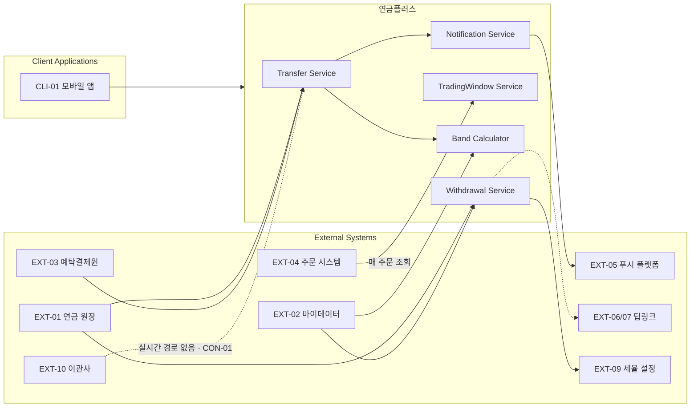
```mermaid
flowchart LR
    subgraph EXTG["External Systems"]
        E1["EXT-01 연금 원장"]
        E2["EXT-02 마이데이터"]
        E3["EXT-03 예탁결제원"]
        E4["EXT-04 주문 시스템"]
        E5["EXT-05 푸시 플랫폼"]
        E67["EXT-06/07 딥링크"]
        E9["EXT-09 세율 설정"]
        E10["EXT-10 이관사"]
    end
    subgraph SYS["연금플러스"]
        S1["Transfer Service"]
        S2["Withdrawal Service"]
        S3["TradingWindow Service"]
        S4["Band Calculator"]
        S5["Notification Service"]
    end
    subgraph CLI["Client Applications"]
        C1["CLI-01 모바일 앱"]
    end

    C1 --> SYS
    E1 --> S1 & S2
    E2 --> S2 & S4
    E3 --> S1
    E4 -->|매 주문 조회| S3
    S5 --> E5
    S2 -.-> E67
    S2 --> E9
    E10 -.->|"실시간 경로 없음 · CON-01"| S1
    S1 --> S4
    S1 --> S5
```

**컴포넌트 다이어그램** — 배포 단위와 신뢰 경계

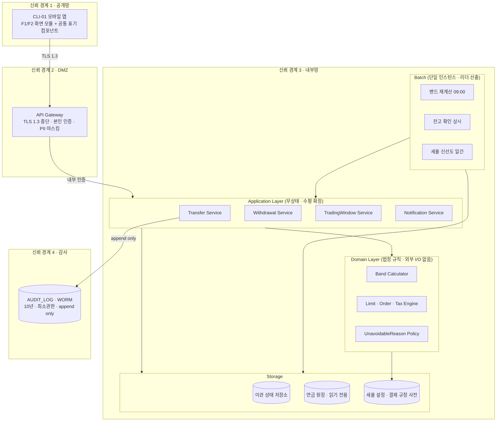
```mermaid
flowchart TB
    subgraph Z1["신뢰 경계 1 · 공개망"]
        UI["CLI-01 모바일 앱<br/>F1/F2 화면 모듈 + 공통 표기 컴포넌트"]
    end
    subgraph Z2["신뢰 경계 2 · DMZ"]
        GW["API Gateway<br/>TLS 1.3 종단 · 본인 인증 · PII 마스킹"]
    end
    subgraph Z3["신뢰 경계 3 · 내부망"]
        direction LR
        subgraph APP["Application Layer (무상태 · 수평 확장)"]
            A1["Transfer Service"]
            A2["Withdrawal Service"]
            A3["TradingWindow Service"]
            A4["Notification Service"]
        end
        subgraph DOM["Domain Layer (법정 규칙 · 외부 I/O 없음)"]
            D1["Band Calculator"]
            D2["Limit · Order · Tax Engine"]
            D3["UnavoidableReason Policy"]
        end
        subgraph BAT["Batch (단일 인스턴스 · 리더 선출)"]
            B1["밴드 재계산 09:00"]
            B2["잔고 확인 상시"]
            B3["세율 신선도 일간"]
        end
        subgraph STO["Storage"]
            T1[("이관 상태 저장소")]
            T2[("연금 원장 · 읽기 전용")]
            T3[("세율 설정 · 결제 규정 사전")]
        end
    end
    subgraph Z4["신뢰 경계 4 · 감사"]
        AU[("AUDIT_LOG · WORM<br/>10년 · 최소권한 · append only")]
    end

    UI -->|TLS 1.3| GW
    GW -->|내부 인증| APP
    APP --> DOM
    APP --> STO
    DOM --> T3
    BAT --> APP
    BAT --> STO
    A1 -->|append only| AU
```

> **도메인 계층에 외부 I/O를 두지 않은 이유.** 연금수령한도·인출순서·세율은 법이 정한 것이라 우리가 바꿀 수 없다. 이 규칙을 화면이나 서비스에 흩어 놓으면 세법 개정 시 고칠 자리를 찾지 못한다. 한곳에 모으고 세율만 외부 설정으로 분리했다 (CON-05).
>
> **배치를 단일 인스턴스로 묶은 이유.** 밴드 재계산이 중복 실행되면 같은 날 값이 달라진다. REQ-FUNC-037이 당일 캐시 일관성을 요구하므로 구조로 막는다.

### 3.2 Client Applications

| ID | 클라이언트 | 엔드포인트 | 화면 수 |
| --- | --- | --- | :---: |
| CLI-01 | KB증권 모바일 앱 (iOS / Android) | `https://api.kbsec.example.com/mobile` | 12 |

**화면 목록**

| 화면 ID | 화면명 | Story |
| --- | --- | --- |
| F1-01 | 홈 · 진행 알림 | US-01 |
| F1-02 | 유의사항 확인 | US-02 |
| F1-03 | 이체 예약 · 잠금 구간 미리보기 | US-03 |
| F1-04 | 이수관 현황판 | US-04 |
| F1-05 | 완료일 근거 | US-05 |
| F1-06 | 이체 완료 | US-06 |
| F2-01 | 출금관리 | US-07 |
| F2-02 | 수령 대상 선택 | US-08 |
| F2-03 | 인출금액 입력 | US-09 |
| F2-04 | 인출순서 결과 | US-10 |
| F2-05 | 비과세 인출 관리 | US-11 |
| F2-06 | 타명의 조회 | US-12 |

**유스케이스 모델** — 액터가 시스템으로 무엇을 하는가

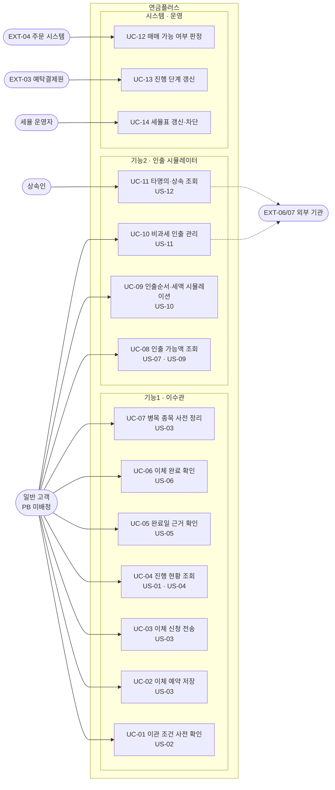
```mermaid
flowchart LR
    CUST(["일반 고객<br/>PB 미배정"])
    HEIR(["상속인"])
    OPER(["세율 운영자"])

    subgraph SYS["연금플러스"]
        direction TB
        subgraph G1["기능1 · 이수관"]
            U1["UC-01 이관 조건 사전 확인<br/>US-02"]
            U2["UC-02 이체 예약 저장<br/>US-03"]
            U3["UC-03 이체 신청 전송<br/>US-03"]
            U4["UC-04 진행 현황 조회<br/>US-01 · US-04"]
            U5["UC-05 완료일 근거 확인<br/>US-05"]
            U6["UC-06 이체 완료 확인<br/>US-06"]
            U7["UC-07 병목 종목 사전 정리<br/>US-03"]
        end
        subgraph G2["기능2 · 인출 시뮬레이터"]
            U8["UC-08 인출 가능액 조회<br/>US-07 · US-09"]
            U9["UC-09 인출순서·세액 시뮬레이션<br/>US-10"]
            U10["UC-10 비과세 인출 관리<br/>US-11"]
            U11["UC-11 타명의·상속 조회<br/>US-12"]
        end
        subgraph G3["시스템 · 운영"]
            U12["UC-12 매매 가능 여부 판정"]
            U13["UC-13 진행 단계 갱신"]
            U14["UC-14 세율표 갱신·차단"]
        end
    end

    KSD(["EXT-03 예탁결제원"])
    ORD(["EXT-04 주문 시스템"])
    EXTL(["EXT-06/07 외부 기관"])

    CUST --> U1 & U2 & U3 & U4 & U5 & U6 & U7
    CUST --> U8 & U9 & U10
    HEIR --> U11
    OPER --> U14
    KSD --> U13
    ORD --> U12
    U10 -.-> EXTL
    U11 -.-> EXTL
```

**포함 · 확장 관계**

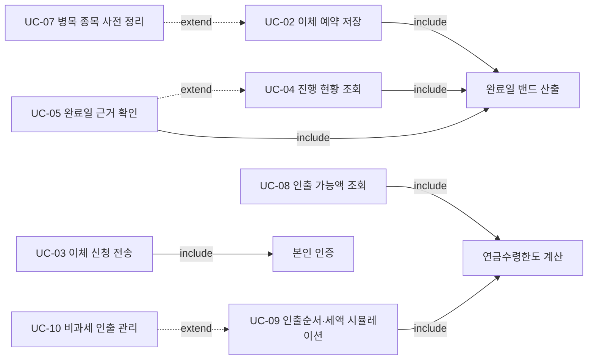
```mermaid
flowchart LR
    U3["UC-03 이체 신청 전송"]
    U2["UC-02 이체 예약 저장"]
    U4["UC-04 진행 현황 조회"]
    U5["UC-05 완료일 근거 확인"]
    U7["UC-07 병목 종목 사전 정리"]
    U8["UC-08 인출 가능액 조회"]
    U9["UC-09 인출순서·세액 시뮬레이션"]
    U10["UC-10 비과세 인출 관리"]

    AUTH["본인 인증"]
    BAND["완료일 밴드 산출"]
    LIMIT["연금수령한도 계산"]

    U3 -->|include| AUTH
    U2 -->|include| BAND
    U4 -->|include| BAND
    U5 -->|include| BAND
    U8 -->|include| LIMIT
    U9 -->|include| LIMIT
    U7 -.->|extend| U2
    U5 -.->|extend| U4
    U10 -.->|extend| U9
```

> `include`는 항상 실행되는 하위 절차다 — 전송하려면 본인 인증을 반드시 거친다 (REQ-FUNC-027). `extend`는 조건부 경로다 — 병목 종목이 있을 때만 사전 정리가 열린다.

**화면 전이**

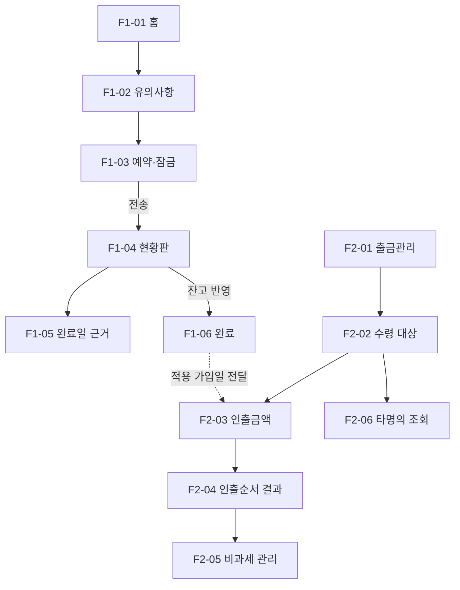
```mermaid
flowchart TD
    F101["F1-01 홈"] --> F102["F1-02 유의사항"] --> F103["F1-03 예약·잠금"]
    F103 -->|전송| F104["F1-04 현황판"]
    F104 --> F105["F1-05 완료일 근거"]
    F104 -->|잔고 반영| F106["F1-06 완료"]
    F106 -.->|적용 가입일 전달| F203
    F201["F2-01 출금관리"] --> F202["F2-02 수령 대상"]
    F202 --> F203["F2-03 인출금액"] --> F204["F2-04 인출순서 결과"] --> F205["F2-05 비과세 관리"]
    F202 --> F206["F2-06 타명의 조회"]
```

### 3.3 API Overview

| 갈래 | 경로 접두 | 성격 | 인증 | 상태 변경 |
| --- | --- | --- | --- | :---: |
| 이관 조회 | `/api/v1/transfers` (GET) | 읽기 | 로그인 | 없음 |
| 이관 변경 | `/api/v1/transfers` (POST/PATCH/DELETE) | 쓰기 | 로그인 + 본인 인증 | 상태 전이 · 감사 로그 |
| 인출 시뮬레이션 | `/api/v1/withdrawals`, `/api/v1/accounts` | 계산 | 로그인 | **없음 (CON-15)** |
| 외부 링크 | `/api/v1/external-links` | 읽기 | 로그인 | 없음 |
| 내부 판정 | `/internal/v1/*` | 읽기·수신 | 시스템 간 인증 | 상태 전이 (전문 수신) |

전체 엔드포인트 목록은 **§6.1**에 있다.

**API 설계 원칙**

| ID | 원칙 | 근거 |
| --- | --- | --- |
| API-01 | 시뮬레이션 API는 어떤 데이터도 기록하지 않는다 | CON-15, CON-06 |
| API-02 | 완료일은 `endBandFrom`/`endBandTo` 두 필드로만 응답한다. 단일 날짜 필드를 정의하지 않는다 | CON-13, CON-09 |
| API-03 | 추정 필드에 `layer`와 `confidence`를 함께 응답한다 | CON-01 |
| API-04 | 전송 요청 본문에 화면 표시 중이던 밴드 값을 포함한다 | REQ-NF-005 |

**공통 응답 코드**

| 코드 | HTTP | 의미 | 클라이언트 처리 |
| --- | :---: | --- | --- |
| `TRANSFER_LOCK` | 409 | 이관 중 제한 업무 | 제한 사유와 해제 시점 표시 |
| `AUTH_REQUIRED` | 401 | 본인 인증 미완 | 인증 플로우로 이동 |
| `AUDIT_WRITE_FAILED` | 500 | 감사 로그 적재 실패 | 전송 롤백 후 재시도 안내 |
| `TAX_TABLE_STALE` | 503 | 세율표 시행일 +30일 초과 | 계산 결과 대신 갱신 중 안내 |
| `AMOUNT_EXCEEDS_BALANCE` | 400 | 인출액 > 평가금액 | 최대 인출 가능액 안내 |
| `FOREIGN_ACCOUNT_NO_TAX` | 200 | 타사 계좌 | 한도만 표시, 세액란 공란 |
| `MYDATA_TIMEOUT` | 200 | 마이데이터 3초 초과 | 개략 밴드 + 대략치 병기 |

### 3.4 Interaction Sequences

핵심 흐름 4종의 간결 버전이다. 오류 분기를 포함한 확장 버전은 **§6.3**에 있다.

#### 3.4.1 이체 예약 및 전송

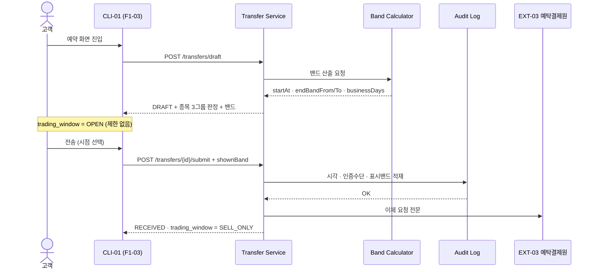
```mermaid
sequenceDiagram
    actor C as 고객
    participant UI as CLI-01 (F1-03)
    participant TS as Transfer Service
    participant BC as Band Calculator
    participant AL as Audit Log
    participant KSD as EXT-03 예탁결제원

    C->>UI: 예약 화면 진입
    UI->>TS: POST /transfers/draft
    TS->>BC: 밴드 산출 요청
    BC-->>TS: startAt · endBandFrom/To · businessDays
    TS-->>UI: DRAFT + 종목 3그룹 판정 + 밴드
    Note over C,UI: trading_window = OPEN (제한 없음)

    C->>UI: 전송 (시점 선택)
    UI->>TS: POST /transfers/{id}/submit + shownBand
    TS->>AL: 시각 · 인증수단 · 표시밴드 적재
    AL-->>TS: OK
    TS->>KSD: 이체 요청 전문
    TS-->>UI: RECEIVED · trading_window = SELL_ONLY
```

#### 3.4.2 진행 단계 갱신 및 알림

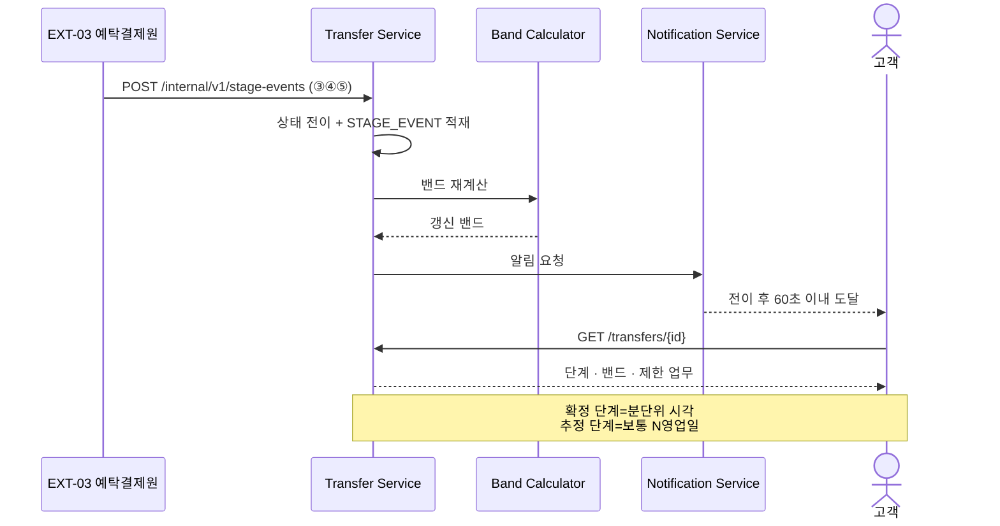
```mermaid
sequenceDiagram
    participant KSD as EXT-03 예탁결제원
    participant TS as Transfer Service
    participant BC as Band Calculator
    participant NS as Notification Service
    actor C as 고객

    KSD->>TS: POST /internal/v1/stage-events (③④⑤)
    TS->>TS: 상태 전이 + STAGE_EVENT 적재
    TS->>BC: 밴드 재계산
    BC-->>TS: 갱신 밴드
    TS->>NS: 알림 요청
    NS-->>C: 전이 후 60초 이내 도달
    C->>TS: GET /transfers/{id}
    TS-->>C: 단계 · 밴드 · 제한 업무
    Note over C,TS: 확정 단계=분단위 시각<br/>추정 단계=보통 N영업일
```

#### 3.4.3 인출순서 및 세액 계산

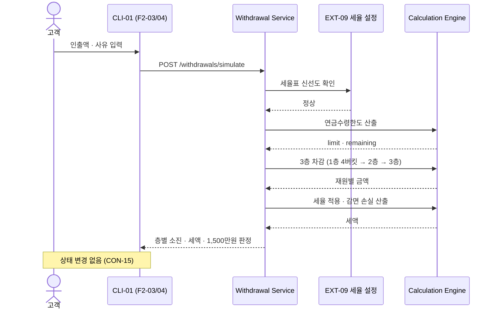
```mermaid
sequenceDiagram
    actor C as 고객
    participant UI as CLI-01 (F2-03/04)
    participant WS as Withdrawal Service
    participant TR as EXT-09 세율 설정
    participant EN as Calculation Engine

    C->>UI: 인출액 · 사유 입력
    UI->>WS: POST /withdrawals/simulate
    WS->>TR: 세율표 신선도 확인
    TR-->>WS: 정상
    WS->>EN: 연금수령한도 산출
    EN-->>WS: limit · remaining
    WS->>EN: 3층 차감 (1층 4버킷 → 2층 → 3층)
    EN-->>WS: 재원별 금액
    WS->>EN: 세율 적용 · 감면 손실 산출
    EN-->>WS: 세액
    WS-->>UI: 층별 소진 · 세액 · 1,500만원 판정
    Note over UI,C: 상태 변경 없음 (CON-15)
```

#### 3.4.4 매매 가능 여부 판정

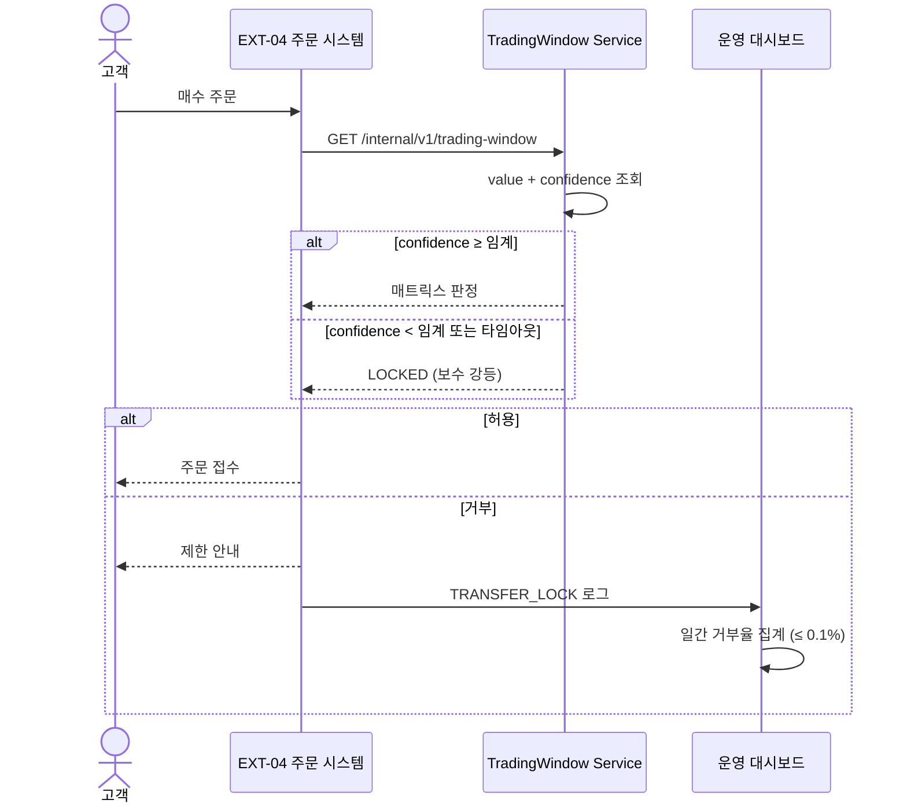
```mermaid
sequenceDiagram
    actor C as 고객
    participant ORD as EXT-04 주문 시스템
    participant TW as TradingWindow Service
    participant MON as 운영 대시보드

    C->>ORD: 매수 주문
    ORD->>TW: GET /internal/v1/trading-window
    TW->>TW: value + confidence 조회
    alt confidence ≥ 임계
        TW-->>ORD: 매트릭스 판정
    else confidence < 임계 또는 타임아웃
        TW-->>ORD: LOCKED (보수 강등)
    end
    alt 허용
        ORD-->>C: 주문 접수
    else 거부
        ORD-->>C: 제한 안내
        ORD->>MON: TRANSFER_LOCK 로그
        MON->>MON: 일간 거부율 집계 (≤ 0.1%)
    end
```

---

## 4. Specific Requirements

### 4.1 Functional Requirements

83개 원자 요구사항으로 분해했다. `Source` 열의 `US-xx`는 §3.2의 사용자 스토리, `FR-xx`는 [REF-01]의 기능 명세 항목이다. 검증 방법은 **T**(Test) · **I**(Inspection) · **D**(Demonstration) · **A**(Analysis)로 표기한다.

**사용자 스토리**

| ID | 스토리 |
| --- | --- |
| US-01 | PB 미배정 일반 고객으로서, 콜센터에 전화하지 않고 이관 진행 상황을 알기 위해, 앱 진입 시 진행 카드를 보고 싶다 |
| US-02 | 이관을 결심한 고객으로서, 약관을 읽다 막혔을 때 물어볼 곳을 알기 위해, 회사별 문의 창구와 내 계좌 판정을 함께 보고 싶다 |
| US-03 | 적극투자형 고객으로서, 시장 하락 시 손이 묶이는 사고를 피하기 위해, 거래 제한 구간을 미리 확인하고 전송 시점을 직접 고르고 싶다 |
| US-04 | 이관을 신청한 고객으로서, "신청중" 한 줄만 보며 불안해하지 않기 위해, 어느 회사가 무엇을 하고 있고 내가 할 일이 있는지 알고 싶다 |
| US-05 | 완료일 안내를 받은 고객으로서, 그 날짜를 신뢰할지 판단하기 위해, 산출 근거를 열어보고 싶다 |
| US-06 | 이관을 마친 고객으로서, 현금으로 들어온 자금이 방치되지 않도록, 무엇이 얼마 입고됐고 다음에 무엇을 할 수 있는지 알고 싶다 |
| US-07 | 해지 의사가 없는 고객으로서, 계좌를 유지하며 필요한 금액만 인출하기 위해, 그 선택지를 출금 메뉴에서 바로 발견하고 싶다 |
| US-08 | 상속을 앞둔 고객으로서, 본인 건과 타인 명의 건의 절차 차이를 알기 위해, 첫 갈림길에서 구분해 진입하고 싶다 |
| US-09 | 수령 개시를 앞둔 고객으로서, 비가역적 선택 전에 손해를 확인하기 위해, 인출액별 한도 저촉 여부와 세금 차이를 보고 싶다 |
| US-10 | 인출을 앞둔 고객으로서, 세금 산출 근거를 납득하기 위해, 법정 순서대로 재원이 차감되는 과정을 금액으로 보고 싶다 |
| US-11 | 세부담을 줄이려는 고객으로서, 서류 제출의 효과를 판단하기 위해, 공제확인서 제출 전후 금액을 나란히 보고 싶다 |
| US-12 | 상속인으로서, 피상속인 계좌 소재를 파악하기 위해, 공식 조회 창구와 준비 서류를 안내받고 싶다 |

**기능 요구사항 명세**

| ID | Title | Source | Priority | Acceptance Criteria (Given / When / Then) | Verif. |
| --- | --- | --- | :---: | --- | :---: |
| REQ-FUNC-001 | 진행 카드 노출 및 5요소 표시 | US-01 / FR-F1-01-01 | Must | **G** 진행 중 이관 건이 1건 존재한다 **W** 홈에 진입한다 **T** 현재 단계·이관사·수관 계좌·예상 완료 기간·신청일 5요소가 모두 표시된다 | D |
| REQ-FUNC-002 | 진행 건 부재 시 카드 미노출 | US-01 / FR-F1-01-01 | Must | **G** 진행 중 이관 건이 0건이다 **W** 홈에 진입한다 **T** 진행 카드가 렌더되지 않는다 | T |
| REQ-FUNC-003 | 상태 전이 연동 알림 3종 발송 | US-01 / FR-F1-01-02 | Must | **G** `transfer_status`가 전이한다 **W** 전이 전문을 수신한다 **T** 접수 완료·의사확인 예정·자산 정리 착수 중 해당 알림이 전이 후 60초 이내 발송된다 | T |
| REQ-FUNC-004 | 의사확인 알림에 연락처·기한 포함 | US-01 / FR-F1-01-03 | Must | **G** 상태가 `ACTION_REQUIRED`로 전이한다 **W** 의사확인 알림을 발송한다 **T** 이관사 대표번호와 통화 기한이 본문에 포함된다 | I |
| REQ-FUNC-005 | 대표번호 부재 시 대체 안내 | US-01 / FR-F1-01-03 | Must | **G** 이관사 대표번호가 마스터에 없다 **W** 의사확인 알림을 발송한다 **T** KB증권 대표번호로 대체 안내하며 번호란을 공란으로 발송하지 않는다 | T |
| REQ-FUNC-006 | 이체 시 비과세 안내 노출 | US-01 / FR-F1-01-04 | Should | **G** 홈 진행 카드가 노출된다 **W** 화면을 렌더한다 **T** 연금계좌 간 이체는 이체 시점에 과세되지 않는다는 안내가 표시된다 | I |
| REQ-FUNC-007 | 실물이전 사전조회 진입점 제공 | US-01 / FR-F1-01-05 | Could | **G** 사전조회 딥링크가 설정되어 있다 **W** 진입점을 선택한다 **T** 예탁결제원 사전조회 화면으로 이동한다. 이전 가능 여부를 자체 판정하지 않는다 | D |
| REQ-FUNC-008 | 약관 전문 원형 유지 | US-02 / FR-F1-02-01 | Must | **G** 기존 약관 14개 조항이 존재한다 **W** 유의사항 화면을 렌더한다 **T** 전문이 요약·발췌 없이 그대로 표시된다 | I |
| REQ-FUNC-009 | 약관 미로딩 시 진행 차단 | US-02 / FR-F1-02-01 | Must | **G** 약관 전문 로딩이 3초를 초과한다 **W** 다음 단계를 시도한다 **T** 진행이 차단되고 로딩 상태가 표시된다 | T |
| REQ-FUNC-010 | 고객센터 연결 바 고정 | US-02 / FR-F1-02-02 | Must | **G** 유의사항 화면에 진입했다 **W** 하단까지 스크롤한다 **T** 연결 바가 계속 노출된다 | D |
| REQ-FUNC-011 | 회사별 문의 창구 분리 안내 | US-02 / FR-F1-02-03 | Must | **G** 고객이 문의 바를 선택한다 **W** 연결 시트가 열린다 **T** KB증권(이체 절차)과 이관사(해지공제·의사확인) 두 번호가 역할과 함께 구분 표시된다 | I |
| REQ-FUNC-012 | 가입일 카드 3요소 표시 | US-02 / FR-F1-02-04 | Must | **G** 계좌 정보가 조회된다 **W** 가입일 카드를 렌더한다 **T** 종전 계좌 가입일·KB 계좌 개설일·이체 후 적용 가입일이 표시된다 | D |
| REQ-FUNC-013 | 승계 플래그 값 그대로 표시 | US-02 / FR-F1-02-04 | Must | **G** 원장 승계 플래그가 `true` 또는 `false`다 **W** 가입일 카드를 렌더한다 **T** 플래그 값에 따라 문구가 전환되며 화면이 승계 여부를 자체 판단하지 않는다 | T |
| REQ-FUNC-014 | 승계 플래그 미설정 시 양쪽 계산 | US-02 / FR-F1-02-04 | Must | **G** 승계 플래그가 `null`이다 **W** 가입일 카드를 렌더한다 **T** 승계·미승계 양쪽 한도를 모두 표시한다 | T |
| REQ-FUNC-015 | 이체 불가 조건 3종 표시 | US-02 / FR-F1-02-05 | Must | **G** 계좌 상태가 조회된다 **W** 유의사항 화면을 렌더한다 **T** 2013.1.1~2.28 가입·거래내역 있는 수관 계좌·압류/가압류/질권 3종이 모두 표시된다 | I |
| REQ-FUNC-016 | 보유 종목 3그룹 판정 | US-03 / FR-F1-03-01 | Must | **G** 보유 종목 목록이 조회된다 **W** 예약 화면에 진입한다 **T** 전 종목이 그대로 옮김·팔아야 함·판정 불가 중 하나로 분류된다 | T |
| REQ-FUNC-017 | 잠금 구간 3요소 표시 | US-03 / FR-F1-03-02 | Must | **G** 밴드가 산출되었다 **W** 예약 화면을 렌더한다 **T** 시작 시각·해제 밴드·영업일 수 3요소가 모두 표시된다 | D |
| REQ-FUNC-018 | 해제일 밴드 전용 표시 | US-03 / FR-F1-03-02 | Must | **G** 밴드가 산출되었다 **W** 해제일을 표시한다 **T** 최소 폭 2영업일의 기간으로만 표시되며 단일 날짜를 표시하지 않는다 | I |
| REQ-FUNC-019 | 병목 종목 서버 지목 | US-03 / FR-F1-03-03 | Must | **G** 종목별 `settle_days`가 확보되었다 **W** 밴드를 산출한다 **T** 결제주기 최장 종목이 서버에서 `is_critical_path = true`로 지정된다. 클라이언트가 계산하지 않는다 | T |
| REQ-FUNC-020 | 예약 저장 시 매매 무제한 | US-03 / FR-F1-03-04 | Must | **G** `transfer_status = DRAFT`다 **W** 매수·매도·납입·수령 신청을 각각 시도한다 **T** 4건 모두 정상 처리된다 | T |
| REQ-FUNC-021 | 전송 시점 고객 선택 | US-03 / FR-F1-03-04 | Must | **G** 예약이 저장되어 있다 **W** 고객이 전송을 실행하지 않는다 **T** 상태가 `DRAFT`로 유지되며 잠금이 시작되지 않는다 | T |
| REQ-FUNC-022 | 병목 정리 후 밴드 재계산 | US-03 / FR-F1-03-05 | Must | **G** 병목 종목을 전송 전에 매도했다 **W** 익영업일 09:00 배치가 실행된다 **T** 밴드가 당겨진 값으로 갱신되고 갱신 시각이 표시된다 | T |
| REQ-FUNC-023 | 현금화 대상 확정 손익 금액 병기 | US-03 / FR-F1-03-06 | Must | **G** 현금화 대상 종목이 존재한다 **W** 판정 결과를 렌더한다 **T** 확정 손익이 금액(원)으로 병기된다 | I |
| REQ-FUNC-024 | 병목 정리 안내에 일수·손실 동시 표시 | US-03 / FR-F1-03-06 | Must | **G** 병목 종목이 지목되었다 **W** 정리 안내를 노출한다 **T** 당겨지는 영업일 수와 확정 손실 금액이 나란히 표시되며 매도 권유 문구가 없다 | I |
| REQ-FUNC-025 | 상태별 가능 여부 4항목 표시 | US-03 / FR-F1-03-07 | Must | **G** `trading_window` 값이 확정되었다 **W** 상태 표를 렌더한다 **T** 매수·매도·추가 납입·수령 신청 4항목의 가능 여부가 표로 표시된다 | D |
| REQ-FUNC-026 | 기준 소요 부재 상품 계산 제외 | US-03 / FR-F1-03-08 | Must | **G** 보유 종목 중 1종이 `settle_days` 사전에 없다 **W** 밴드를 산출한다 **T** 해당 종목이 계산에서 제외되고 "소요 기간 확인 중"이 표시된다. 임의 추정치를 사용하지 않는다 | T |
| REQ-FUNC-027 | 전송 버튼 본인 인증 게이팅 | US-03 / FR-F1-03-09 | Must | **G** 본인 인증이 완료되지 않았다 **W** 전송 버튼을 확인한다 **T** 버튼이 비활성 상태다 | T |
| REQ-FUNC-028 | 전송 감사 로그 3요소 적재 | US-03 / FR-F1-03-09 | Must | **G** 본인 인증이 완료되었다 **W** 전송을 실행한다 **T** 누른 시각·인증수단·표시 중이던 밴드 값이 감사 로그에 적재된다 | T |
| REQ-FUNC-029 | 감사 로그 실패 시 전송 롤백 | US-03 / FR-F1-03-09 | Must | **G** 감사 로그 적재가 실패한다 **W** 전송을 처리한다 **T** 전송이 롤백되고 상태가 `DRAFT`로 보존된다 | T |
| REQ-FUNC-030 | 전송 오류 시 예약 상태 보존 | US-03 / FR-F1-03-04 | Must | **G** 전송 중 서버 오류(5xx)가 발생한다 **W** 고객이 화면을 재진입한다 **T** 상태가 `DRAFT`로 보존되고 재전송 경로가 제공된다 | T |
| REQ-FUNC-031 | 마이데이터 지연 시 개략 밴드 제공 | US-03 / FR-F1-03-10 | Should | **G** 마이데이터 응답이 3초를 초과한다 **W** 밴드를 산출한다 **T** 자산구성 기준 소요로 개략 밴드를 산출하고 "대략치입니다"를 병기한다 | T |
| REQ-FUNC-032 | 영업일 캘린더 정합성 | US-03 / FR-F1-03-11 | Should | **G** 밴드 구간에 주말·공휴일이 포함된다 **W** 캘린더를 렌더한다 **T** 주말·공휴일이 제외 표시되고 표기 영업일 수와 칸 수가 일치한다 | T |
| REQ-FUNC-033 | 6단계 타임라인 표시 | US-04 / FR-F1-04-01 | Must | **G** 이관이 진행 중이다 **W** 현황판에 진입한다 **T** 6단계 타임라인이 표시되고 현재 단계가 강조된다 | D |
| REQ-FUNC-034 | 확정 단계 분단위 시각 표기 | US-04 / FR-F1-04-02 | Must | **G** 단계 `layer`가 `CONFIRMED`다 **W** 단계를 렌더한다 **T** 분단위 시각이 표시된다 | I |
| REQ-FUNC-035 | 추정 단계 비단정 서술 | US-04 / FR-F1-04-02 | Must | **G** 단계 `layer`가 `ESTIMATED`다 **W** 단계 설명을 렌더한다 **T** "보통 N영업일 걸립니다" 형태로 표시되며 단정 표현을 사용하지 않는다 | I |
| REQ-FUNC-036 | 완료일 기간 표시 및 단일 날짜 금지 | US-04 / FR-F1-04-03 | Must | **G** 예상 완료일이 산출되었다 **W** 현황판을 렌더한다 **T** 최소 2영업일 폭의 기간으로 표시된다 | I |
| REQ-FUNC-037 | 당일 캐시 일관성 | US-04 / FR-F1-04-03 | Must | **G** 같은 날 이미 조회했다 **W** 같은 날 재진입한다 **T** 밴드 값이 직전 조회와 동일하다 | T |
| REQ-FUNC-038 | 통화 예정일·자동취소 마감 동시 표시 | US-04 / FR-F1-04-04 | Must | **G** 상태가 `ACTION_REQUIRED`다 **W** 현황판을 렌더한다 **T** 통화 예정일과 자동취소 마감이 하나의 화면에 나란히 표시된다 | D |
| REQ-FUNC-039 | 이관사 대표번호 노출 및 발신 경로 | US-04 / FR-F1-04-05 | Must | **G** 상태가 `ACTION_REQUIRED`다 **W** 화면을 렌더한다 **T** 대표번호와 "이 번호로 전화가 옵니다" 문구가 노출되고 직접 발신 경로가 제공된다 | D |
| REQ-FUNC-040 | 예외 상태 4종 분기 처리 | US-04 / FR-F1-04-06 | Must | **G** 상태가 예외값 중 하나다 **W** 현황판을 렌더한다 **T** 고객확인필요·지연·일부이전불가·거절 각각의 전용 화면이 표시된다 | T |
| REQ-FUNC-041 | 지연 시 단계 유지 및 밴드 확장 | US-04 / FR-F1-04-06 | Must | **G** 마지막 전문 수신 후 D+4가 경과했다 **W** 현황판을 렌더한다 **T** 단계는 유지되고 지연 안내와 확장된 밴드가 표시된다 | T |
| REQ-FUNC-042 | 거절 사유 평이화 및 해소 절차 안내 | US-04 / FR-F1-04-07 | Must | **G** 상태가 `REJECTED`이고 사유 코드가 압류다 **W** 거절 화면을 렌더한다 **T** "계좌에 압류가 설정되어 있습니다"처럼 상태를 서술하고 표준 해소 절차 3단계를 표시한다 | I |
| REQ-FUNC-043 | 해소 미확인 시 재신청 차단 | US-04 / FR-F1-04-07 | Must | **G** 거절 상태이고 해소가 확인되지 않았다 **W** 재신청 버튼을 확인한다 **T** 버튼이 비활성이다 | T |
| REQ-FUNC-044 | 일부 이전 불가 시 선택지 2개 이상 제시 | US-04 / FR-F1-04-08 | Must | **G** 상태가 `PARTIAL_BLOCKED`다 **W** 화면을 렌더한다 **T** 종목별 처리 구분과 평가손익이 표시되고 선택지가 2개 이상 각 결과와 함께 제시된다 | T |
| REQ-FUNC-045 | 일부 이전 불가 화면 매도 지시 배제 | US-04 / FR-F1-04-08 | Must | **G** 상태가 `PARTIAL_BLOCKED`다 **W** 화면 전체를 검사한다 **T** 매도 지시 버튼이 존재하지 않는다 | I |
| REQ-FUNC-046 | 제한 업무 목록과 해제 시점 병기 | US-04 / FR-F1-04-09 | Must | **G** 이관이 진행 중이다 **W** 제한 업무 목록을 렌더한다 **T** 4항목 각각에 해제 시점이 함께 표시된다 | I |
| REQ-FUNC-047 | 내부 코드·용어 노출 금지 | US-04 / FR-F1-04-02 | Must | **G** 상태가 `VERIFYING`이다 **W** 화면 문구를 렌더한다 **T** "○○에서 확인 중"으로 표시되며 영문 enum과 내부 용어가 노출되지 않는다 | I |
| REQ-FUNC-048 | 단계 상세 시트 제공 | US-04 / FR-F1-04-10 | Should | **G** 고객이 단계를 선택한다 **W** 상세 시트가 열린다 **T** 처리 주체·하는 일·표준 소요가 표시된다 | D |
| REQ-FUNC-049 | p90 초과 지연 자동 감지 | US-04 / FR-F1-04-11 | Should | **G** 처리 소요 통계 표본이 n ≥ 30이다 **W** 실제 소요가 p90을 초과한다 **T** 지연 플래그가 자동 설정된다 | A |
| REQ-FUNC-050 | 상품별 예상 완료일 분해 표시 | US-04 / FR-F1-04-12 | Could | **G** 자산 정리 단계이고 상품별 진행 전문이 수신된다 **W** 현황판을 렌더한다 **T** 상품별 예상 완료일이 분해 표시된다 | D |
| REQ-FUNC-051 | 완료일 산출 근거 단계별 공개 | US-05 / FR-F1-05-01 | Must | **G** 밴드가 산출되었다 **W** 근거 화면에 진입한다 **T** 신청일·옮기는 자산·기준 소요·여유 기간·안내 기간이 단계별로 공개된다 | I |
| REQ-FUNC-052 | 적용 기준 소요 행 강조 | US-05 / FR-F1-05-02 | Must | **G** 내 계좌 자산이 해외 펀드를 포함한다 **W** 기준 소요 표를 렌더한다 **T** 해당 행이 강조 표시된다 | D |
| REQ-FUNC-053 | 확인 단계 및 확인 시점 표시 | US-05 / FR-F1-05-03 | Must | **G** 단계 전문이 수신되었다 **W** 근거 화면을 렌더한다 **T** 지금까지 확인된 단계와 각 확인 시점이 표시된다 | I |
| REQ-FUNC-054 | 단계 확인 시마다 완료일 재계산 | US-05 / FR-F1-05-01 | Must | **G** 신규 단계 전문을 수신했다 **W** 근거 화면에 진입한다 **T** 예상 완료일이 수신 시점 기준으로 재계산된 값으로 표시된다 | T |
| REQ-FUNC-055 | 업계 안내 기준 병기 | US-05 / FR-F1-05-04 | Should | **G** 밴드가 표시된다 **W** 근거 화면을 렌더한다 **T** 업계 안내 기준이 함께 표시된다 | I |
| REQ-FUNC-056 | IRP·연금저축 간 현금이전 제약 명시 | US-05 / FR-F1-05-05 | Should | **G** 이관 경로가 IRP↔연금저축이다 **W** 근거 화면을 렌더한다 **T** 현금이전만 가능하다는 점이 명시된다 | I |
| REQ-FUNC-057 | 잔고 반영 기준 완료 판정 | US-06 / FR-F1-06-01 | Must | **G** 이관사 송금 통보만 수신했고 잔고는 미반영이다 **W** 현황판을 렌더한다 **T** 상태가 `REMITTING`으로 유지되며 완료로 표시되지 않는다 | T |
| REQ-FUNC-058 | 송금 시각·반영 시각 분리 표시 | US-06 / FR-F1-06-02 | Must | **G** 이관이 완료되었다 **W** 완료 화면을 렌더한다 **T** 이관사 송금 시각과 잔고 반영 시각이 각각 표시된다 | I |
| REQ-FUNC-059 | 잔고 반영 60초 이내 알림 | US-06 / FR-F1-06-03 | Must | **G** 잔고 반영이 확인된다 **W** 원장에 반영된다 **T** 60초 이내 알림이 발송된다. 야간·주말에도 지연되지 않는다 | T |
| REQ-FUNC-060 | 입고 금액 차이 10% 이상 시 확인 안내 | US-06 / FR-F1-06-01 | Must | **G** 입고 금액이 예상 이전 금액과 10% 이상 차이난다 **W** 완료 화면을 렌더한다 **T** 완료를 표시하되 확인 안내와 대표번호를 병기한다 | T |
| REQ-FUNC-061 | 가입일 확정 카드 표시 및 전달 | US-06 / FR-F1-06-04 | Must | **G** 이관이 완료되었다 **W** 기능2 한도 계산에 진입한다 **T** 완료 화면의 확정 가입일과 동일한 값이 한도 산식에 사용된다 | T |
| REQ-FUNC-062 | 밴드 적중 여부 로그 적재 | US-06 / FR-F1-06-05 | Should | **G** 밴드가 8/31~9/2였고 실제 완료가 9/1이다 **W** 완료 처리한다 **T** 적중 `true`로 로그에 적재되고 주간 집계에 반영된다 | T |
| REQ-FUNC-063 | 완료 후 재편입 동선 2탭 이내 | US-06 / FR-F1-06-06 | Should | **G** 완료 화면이 표시된다 **W** 다음 행동을 선택한다 **T** 수익률 랭킹 또는 인출순서 미리보기에 2탭 이내 도달한다 | D |
| REQ-FUNC-064 | 수익률 랭킹 사실 표시 한정 | US-06 / FR-F1-06-06 | Should | **G** 수익률 랭킹으로 이동한다 **W** 랭킹을 렌더한다 **T** 과거 수익률 정렬 사실만 표시되며 전망·추천 문구가 없다 | I |
| REQ-FUNC-065 | 연금 외 수령 메뉴 동일 계층 배치 | US-07 / FR-F2-01-01 | Must | **G** 출금관리 화면에 진입한다 **W** 메뉴 목록을 렌더한다 **T** "연금 외 수령"이 연금수령·해지와 동일 계층에 배치된다 | I |
| REQ-FUNC-066 | 메뉴별 목적 설명 제공 | US-07 / FR-F2-01-02 | Must | **G** 메뉴 목록이 렌더된다 **W** 각 항목을 확인한다 **T** 항목마다 목적 차이를 설명하는 한 줄이 표시된다 | I |
| REQ-FUNC-067 | 진입 전 4개 값 노출 | US-07 / FR-F2-01-03 | Must | **G** 계좌 원장이 정상 조회된다 **W** 메뉴 화면을 렌더한다 **T** 평가금액·적용 가입일·올해 기인출액·올해 남은 금액 4개가 모두 표시된다 | D |
| REQ-FUNC-068 | 가입일 부재 시 한도 수치 비노출 | US-07 / FR-F2-01-03 | Must | **G** 적용 가입일이 원장에 없다 **W** 메뉴 화면을 렌더한다 **T** "확인 중"으로 표시하고 한도 관련 수치를 노출하지 않는다 | T |
| REQ-FUNC-069 | 본인·타명의 2분기 화면 분리 | US-08 / FR-F2-02-01 | Must | **G** 수령 대상 선택 화면에 있다 **W** "타 명의 · 상속"을 선택한다 **T** 별도 화면으로 분기한다. 동일 화면 내 조건 분기가 아니다 | T |
| REQ-FUNC-070 | 갈래별 결과 사전 설명 | US-08 / FR-F2-02-02 | Must | **G** 두 갈래가 표시된다 **W** 화면을 렌더한다 **T** 각 갈래에 결과를 설명하는 한 줄이 부착된다 | I |
| REQ-FUNC-071 | 승계 완료 계좌 본인 목록 편입 | US-08 / FR-F2-02-03 | Should | **G** 배우자 승계가 완료된 계좌를 보유한다 **W** 수령 대상 선택 화면에 진입한다 **T** 해당 계좌가 본인 계좌 목록에 표시된다 | T |
| REQ-FUNC-072 | 연금수령한도 게이지 3구간 표시 | US-09 / FR-F2-03-01 | Must | **G** 한도가 산출되었다 **W** 게이지를 렌더한다 **T** 이미 인출·이번 인출·한도 초과가 색으로 구분 표시된다 | D |
| REQ-FUNC-073 | 한도 산식 정확도 | US-09 / FR-F2-03-01 | Must | **G** 평가액 84,000,000원·연차 3년·기인출 2,000,000원이다 **W** 한도를 계산한다 **T** 한도 12,600,000원, 남은 금액 10,600,000원이 산출된다 | T |
| REQ-FUNC-074 | 한도 초과 입력 허용 및 세액 표시 | US-09 / FR-F2-03-02 | Must | **G** 인출액이 잔여 한도를 초과한다 **W** 계산을 실행한다 **T** 입력이 차단되지 않고 초과분 세액이 산출·표시된다 | T |
| REQ-FUNC-075 | 계산 근거 5요소 공개 | US-09 / FR-F2-03-03 | Must | **G** 계산 결과가 표시된다 **W** 근거 토글을 연다 **T** 산식·대입값·기준일·적용 가입일·근거 법령이 공개된다 | I |
| REQ-FUNC-076 | 부득이한 사유 한도 미산입 처리 | US-09 / FR-F2-03-04 | Must | **G** 인출 사유로 "의료 목적"을 선택한다 **W** 한도 게이지를 렌더한다 **T** 해당 인출이 한도에 산입되지 않는 것으로 전환된다 | T |
| REQ-FUNC-077 | 주택 구입 사유 한도 정상 소진 | US-09 / FR-F2-03-05 | Must | **G** 인출 사유로 "주택 구입"을 선택한다 **W** 한도 게이지를 렌더한다 **T** 한도가 정상 소진되고 일반 세율이 적용되며 세제 혜택 경고가 표시된다 | T |
| REQ-FUNC-078 | 요양 3~6개월 IRP 인출 제약 안내 | US-09 / FR-F2-03-06 | Must | **G** 사유가 "요양 3~6개월"이고 계좌가 IRP다 **W** 결과를 렌더한다 **T** 세법 요건 충족 표시와 IRP 중도인출 불가 가능 안내가 함께 표시된다 | I |
| REQ-FUNC-079 | 해외이주 3년 경과 여부 표시 | US-09 / FR-F2-03-07 | Must | **G** 사유가 해외이주이고 이연퇴직소득 입금일이 존재한다 **W** 결과를 렌더한다 **T** 입금일부터 3년 경과 여부가 표시된다 | T |
| REQ-FUNC-080 | 평가금액 초과 입력 시 계산 중단 | US-09 / FR-F2-03-08 | Must | **G** 평가금액이 18,500,000원이다 **W** 20,000,000원을 입력한다 **T** 계산을 중단하고 최대 인출 가능액을 즉시 안내한다 | T |
| REQ-FUNC-081 | 타사 계좌 세액 미산출 | US-09 / FR-F2-03-09 | Must | **G** 타사 계좌를 선택했다 **W** 인출액을 입력한다 **T** 한도는 계산되고 세액란은 공란으로 사유가 표시된다. 추정 계산을 하지 않는다 | T |
| REQ-FUNC-082 | 모의계산 라벨 고정 노출 | US-09 / FR-F2-03-10 | Must | **G** 결과가 화면 아래로 길게 이어진다 **W** 하단까지 스크롤한다 **T** `모의계산 결과` 라벨이 계속 표시된다 | D |
| REQ-FUNC-083 | 연차 11년 이상 한도 미적용 | US-09 / FR-F2-03-11 | Must | **G** 연금수령연차가 12년차다 **W** 한도를 계산한다 **T** 산식을 적용하지 않고 "한도 없음"으로 처리한다 | T |
| REQ-FUNC-084 | 승계 계좌 기준일 표 제공 | US-09 / FR-F2-03-12 | Should | **G** 승계 계좌를 조회한다 **W** 근거 토글을 연다 **T** 계좌 가입일·5년 요건·연금수령연차·개시 연령 4항목의 기준이 각각 표시된다 | I |
| REQ-FUNC-085 | 3층 법정 순서 차감 및 시각화 | US-10 / FR-F2-04-01 | Must | **G** 인출액이 입력되었다 **W** 계산을 실행한다 **T** 1층→2층→3층 순으로 차감되고 층별 소진이 시각화된다 | T |
| REQ-FUNC-086 | 법정 순서 고지 선행 | US-10 / FR-F2-04-02 | Must | **G** 결과 화면에 진입한다 **W** 화면 상단을 확인한다 **T** "법이 정한 순서"임이 먼저 명시된다 | I |
| REQ-FUNC-087 | 1층 4버킷 분해 표시 | US-10 / FR-F2-04-03 | Must | **G** 1층 잔액이 조회된다 **W** 결과를 렌더한다 **T** 4개 버킷이 각각 금액과 함께 표시된다 | D |
| REQ-FUNC-088 | 4호 버킷 확인서 조건부 처리 | US-10 / FR-F2-04-03 | Must | **G** 4호 확인서가 미제출 상태다 **W** 확인서를 제출 상태로 변경한다 **T** 4번째 버킷이 3층에서 1층으로 이동하고 세액이 감소한다 | T |
| REQ-FUNC-089 | 한도 내·초과분 분리 과세 | US-10 / FR-F2-04-04 | Must | **G** 인출액이 한도를 480만원 초과한다 **W** 계산을 실행한다 **T** 한도 내는 연금소득세, 초과분은 기타소득세 16.5%가 각각 적용된다 | T |
| REQ-FUNC-090 | 잃은 감면액 별도 표시 | US-10 / FR-F2-04-05 | Must | **G** 한도 초과 인출이 발생한다 **W** 결과를 렌더한다 **T** 초과로 잃은 감면액이 별도 금액으로 표시된다 | T |
| REQ-FUNC-091 | 연 1,500만원 경계 게이지 표시 | US-10 / FR-F2-04-06 | Must | **G** 3층 재원 인출이 발생한다 **W** 결과를 렌더한다 **T** 1,500만원 경계 게이지와 판정 제외 항목이 표시된다 | D |
| REQ-FUNC-092 | 라목 미분리 계좌 판정 미제공 | US-10 / FR-F2-04-06 | Must | **G** 라목 잔액이 분리 관리되지 않는다 **W** 결과를 렌더한다 **T** 1,500만원 게이지를 숨기고 미제공 사유를 안내한다 | T |
| REQ-FUNC-093 | 원 단위 확정 금액 우선 표기 | US-10 / FR-F2-04-07 | Must | **G** 계산 결과가 산출되었다 **W** 결과를 렌더한다 **T** 금액이 비율이 아닌 원 단위 확정치로 우선 표기된다 | I |
| REQ-FUNC-094 | 실효세율 표기 | US-10 / FR-F2-04-08 | Must | **G** 세율이 적용되었다 **W** 세율을 표시한다 **T** 지방소득세를 포함한 실효세율(5.5% 등)로 표기된다 | I |
| REQ-FUNC-095 | 세금 내역 3줄과 순서표 연결 | US-10 / FR-F2-04-09 | Must | **G** 세액이 산출되었다 **W** 결과를 렌더한다 **T** 연금·기타·퇴직소득세 3줄이 각각 어느 재원에서 나왔는지 순서표와 연결된다 | D |
| REQ-FUNC-096 | 계산 사용값 및 면책 병기 | US-10 / FR-F2-04-10 | Must | **G** 결과가 표시된다 **W** 화면을 확인한다 **T** 계산에 사용한 값과 "실제 원천징수 세액과 다를 수 있습니다"가 병기된다 | I |
| REQ-FUNC-097 | 세율표 갱신일 병기 | US-10 / FR-F2-04-11 | Must | **G** 계산 결과가 표시된다 **W** 화면을 확인한다 **T** 세율표 최종 갱신일이 병기된다 | I |
| REQ-FUNC-098 | 세율표 노후화 시 결과 차단 | US-10 / FR-F2-04-11 | Must | **G** 세율표 최종 갱신일이 시행일 +31일이다 **W** 결과 화면에 진입한다 **T** 계산 결과 대신 갱신 중 안내가 표시된다 | T |
| REQ-FUNC-099 | 결과 화면 실행 버튼 배제 | US-10 / FR-F2-04-12 | Must | **G** 결과 화면이 렌더된다 **W** 화면 전체를 검사한다 **T** 실제 출금·매수·매도로 넘어가는 버튼이 존재하지 않는다 | I |
| REQ-FUNC-100 | 결과 화면 상담 진입점 배제 | US-10 / FR-F2-04-12 | Must | **G** 결과 화면이 렌더된다 **W** 화면 전체를 검사한다 **T** 1:1 상담 진입점이 존재하지 않는다 | I |
| REQ-FUNC-101 | 인출액 변경 시 즉시 재계산 | US-10 / FR-F2-04-01 | Must | **G** 결과가 표시되어 있다 **W** 인출액을 변경한다 **T** 층별 소진·세율·세액이 별도 조회 없이 재계산된다 | T |
| REQ-FUNC-102 | 비과세 인출 가능액 및 4버킷 표시 | US-11 / FR-F2-05-01 | Must | **G** 1층 버킷 잔액이 조회된다 **W** 화면을 렌더한다 **T** 비과세 인출 가능액과 4개 버킷 내역이 표시되며 4호는 잠금 상태로 구분된다 | D |
| REQ-FUNC-103 | 공제확인서 제출 동선 제공 | US-11 / FR-F2-05-02 | Must | **G** 확인서가 미제출 상태다 **W** 제출 동선을 연다 **T** 홈택스 직접 발급·제출 절차로만 안내되며 세무 전문가 알선 링크가 없다 | I |
| REQ-FUNC-104 | 제출 전후 금액 병렬 비교 | US-11 / FR-F2-05-03 | Must | **G** 확인서가 미제출 상태다 **W** 화면에 진입한다 **T** 제출 전 금액과 후 금액이 나란히 표시되고 차액이 강조된다 | T |
| REQ-FUNC-105 | 은행연합회 한도조회 딥링크 | US-11 / FR-F2-05-04 | Should | **G** 딥링크가 설정되어 있다 **W** 버튼을 선택한다 **T** 은행연합회 한도조회 페이지로 이동한다. API 호출을 수행하지 않는다 | D |
| REQ-FUNC-106 | F3 미출시 시 계좌 추가 안내 비노출 | US-11 / FR-F2-05-05 | Should | **G** F3이 출시되지 않았다 **W** 화면에 진입한다 **T** "계좌 하나 더" 안내가 노출되지 않는다. 특정 회사 직접 연결 링크가 없다 | I |
| REQ-FUNC-107 | 금감원 조회 딥링크 및 서류 안내 | US-12 / FR-F2-06-01 | Must | **G** 타명의 화면에 진입한다 **W** 화면을 렌더한다 **T** 금감원 조회 딥링크와 필요 서류 목록이 함께 표시된다 | D |
| REQ-FUNC-108 | 자사 계좌 발견 시 상담 경로 제공 | US-12 / FR-F2-06-02 | Must | **G** 조회 결과에 자사 계좌가 포함된다 **W** 안내를 렌더한다 **T** 상담 경로가 제공된다 | I |
| REQ-FUNC-109 | 미확인 기관 목록 병기 | US-12 / FR-F2-06-03 | Should | **G** 조회로 확인되지 않는 기관이 존재한다 **W** 안내를 렌더한다 **T** 국민연금·근로복지공단 등 기관 목록이 링크와 함께 병기된다 | I |
| REQ-FUNC-110 | 배우자 승계 항목별 기준 표 제시 | US-12 / FR-F2-06-04 | Should | **G** 배우자 승계 계좌를 조회한다 **W** 기준 표를 렌더한다 **T** 4항목의 기준이 각각 표시되며 단일 기준일로 통합되지 않는다 | I |

**우선순위 분포**

| Priority | 건수 | 비중 |
| --- | :---: | :---: |
| Must | 88 | 80.0% |
| Should | 19 | 17.3% |
| Could | 3 | 2.7% |
| **합계** | **110** | **100%** |

> [REF-01]의 기능 명세 83개 항목을 원자 요구사항 110개로 분해했다. 하나의 FR이 복수의 검증 가능한 조건을 담고 있던 경우(예: `FR-F1-03-04`는 예약 저장과 전송 시점 선택 두 조건)를 각각 독립 요구사항으로 나눈 결과다.

### 4.2 Non-Functional Requirements

| ID | Title | Category | Source | Priority | Acceptance Criteria | Verif. |
| --- | --- | --- | --- | :---: | --- | :---: |
| REQ-NF-001 | 홈 진행 카드 렌더 지연 | Performance | [REF-01 §10.1] | Must | 첫 렌더 **p95 ≤ 0.8초**. 모니터링 `f1_01_render_ms`, p95 1.0초 초과 10분 지속 시 알람 | T |
| REQ-NF-002 | 현황판·예약 화면 렌더 지연 | Performance | [REF-01 §10.1] | Must | 첫 렌더 **p95 ≤ 1.2초**. 모니터링 `f1_03_render_ms`·`f1_04_render_ms`, p95 1.5초 초과 10분 지속 시 알람 | T |
| REQ-NF-003 | 이관 상태 조회 API 지연 | Performance | [REF-01 §10.1] | Must | **p95 ≤ 500ms**. 모니터링 `api_transfer_status_ms`, p95 700ms 초과 5분 지속 시 알람 | T |
| REQ-NF-004 | 인출 계산 응답 지연 | Performance | [REF-01 §10.1] | Must | **p95 ≤ 1초**. 모니터링 `f2_calc_ms`, p95 1.3초 초과 10분 지속 시 알람 | T |
| REQ-NF-005 | 인출액 변경 시 재계산 지연 | Performance | [REF-01 §10.1] | Must | **p95 ≤ 300ms**. 모니터링 `f2_recalc_ms`, p95 500ms 초과 시 알람 | T |
| REQ-NF-006 | 마이데이터 호출 타임아웃 | Performance | [REF-01 §10.1] | Must | **3초** 초과 시 폴백 사다리 ③단계로 강등. 타임아웃율 5% 초과 시 알람 | T |
| REQ-NF-007 | 처리량 확장성 | Scalability | [REF-01 §10.2] | Should | 애플리케이션 계층 무상태 구성으로 **수평 확장 가능**. 인스턴스 증설 시 선형 처리량 증가 확인 | T |
| REQ-NF-008 | 월 가용성 | Reliability | [REF-01 §10.2] | Must | **≥ 99.5%** (연간 다운타임 ≤ 43.8시간). 모니터링 `uptime_monthly` | A |
| REQ-NF-009 | 영업시간 가용성 | Reliability | [REF-01 §10.2] | Must | 영업일 08~18시 **≥ 99.9%**. 5분 연속 헬스체크 실패 시 알람 | A |
| REQ-NF-010 | 복구 목표 | Reliability | [REF-01 §10.2] | Should | **RPO ≤ 5분, RTO ≤ 30분**. 이관 상태·감사 로그는 RPO 0 (동기 복제) | T |
| REQ-NF-042 | 전문 재처리 (Replay) | Reliability | [REF-01 §8.7 RC-2] | Must | 수신 전문 원문을 보존하고 **상태를 재생할 수 있다.** 처리 실패 전문도 폐기하지 않는다 | T |
| REQ-NF-043 | 정합성 조정 (Reconciliation) | Reliability | [REF-01 §8.7 RC-3] | Must | 시간별 배치가 `TRANSFER` ↔ `TRADING_WINDOW` ↔ `STAGE_EVENT` 3자 일치를 검사한다. 불일치 시 **보수적 방향으로 보정**하고 이력을 남긴다 | T |
| REQ-NF-044 | 계산 설정 롤백 | Reliability | [REF-01 ADR-008] | Must | 세율 설정을 **이전 버전으로 즉시 되돌릴 수 있다.** 롤백 시 영향받는 계산 결과를 식별할 수 있다 | T |
| REQ-NF-045 | 전문 멱등 처리 | Reliability | [REF-01 §8.7 ID-2] | Must | 동일 멱등 키 전문은 **최초 1회만 처리**한다. 중복 수신 시 상태 변경 0건 | T |
| REQ-NF-046 | 금지 전이 차단 | Reliability | [REF-01 §8.6.4] | Must | §6.6.2 매트릭스에 정의되지 않은 상태 전이는 **거부하고 알람**한다. 발생 시 데이터 정합성 오류로 분류 | T |
| REQ-NF-011 | 마이데이터 장애 시 폴백 | Reliability | [REF-01 §8.5] | Must | 폴백 사다리 ③단계로 **자동 강등**. ④단계 진입 시 알람. 빈 화면·무한 로딩 금지 | T |
| REQ-NF-012 | 세율표 노후화 차단 | Reliability | [REF-01 ADR-008] | Must | 시행일 **+21일 사전 경고, +30일 계산 결과 노출 차단**. 모니터링 `tax_table_age_days` | T |
| REQ-NF-013 | 전송 중 상태 보존 | Reliability | [REF-01 F1-03] | Must | 서버 오류 시 `DRAFT` **보존율 100%**. 모니터링 `submit_orphan_count`, 중간 상태 1건이라도 발생 시 알람 | T |
| REQ-NF-014 | 전송 감사 로그 무결성 | Security | [REF-09 §44②] | Must | 시각·인증수단·표시 밴드 3요소 **누락률 0%**. 적재 실패 시 전송 롤백. 누락 1건이라도 즉시 알람 | T |
| REQ-NF-015 | 감사 로그 보존 기간 | Security | 법무·정보보호 정책 (OI-17) | Must | **정책 확정값 적용. 현재 설계 상한 10년** WORM 저장. 모니터링 `audit_retention_days` | I |
| REQ-NF-016 | 전송 구간 암호화 | Security | 보안 정책 | Must | 전 구간 **TLS 1.3**, 저장 시 **AES-256**. TLS 1.2 이하 요청 비율 1% 초과 시 알람 | T |
| REQ-NF-017 | 접근 통제 | Security | 보안 정책 | Must | **RBAC 최소권한**. 운영자 계좌·세액 조회는 사유 입력 필수. 사유 없는 조회 시도 발생 시 알람 | I |
| REQ-NF-018 | 마이데이터 동의 검증 | Security | 개인정보보호법 | Must | 조회 시점 **유효 동의 100%**. 동의 없는 조회 1건이라도 발생 시 알람 | T |
| REQ-NF-019 | 개인정보 마스킹 | Security | 개인정보보호법 | Must | 화면·로그에서 **계좌번호 중간 4자리 마스킹**. 비마스킹 노출 감지 시 즉시 알람 | I |
| REQ-NF-020 | 딥링크 개인정보 비전달 | Security | 개인정보보호법 | Must | 딥링크 URL의 **쿼리 파라미터에 개인정보를 포함하지 않는다** | I |
| REQ-NF-021 | 매매 상태 오표시 주문 거부율 | Reliability (Guardrail) | [REF-01 §2.2] | Must | 화면이 "가능"으로 표시한 주문의 거부 비율 **일간 ≤ 0.1%**. 초과 시 즉시 알람 및 기능 롤백 | T |
| REQ-NF-022 | 상태 확인 문의율 | Operational | [REF-01 §2.2] | Must | 이관 건당 콜센터·PB 문의 **≤ 0.3건/건**. 측정 창구 CTI `TRF-STATUS` ÷ `TRANSFER` 건수, 주간 | A |
| REQ-NF-023 | 완료일 밴드 적중률 | Operational | [REF-01 §2.2] | Must | 실제 완료일이 안내 밴드 내에 든 비율 **≥ 85%**. 주간 집계, 2주 미달 시 밴드 폭 확대 | A |
| REQ-NF-024 | 예약 → 전송 전환율 | Operational | [REF-01 §2.2] | Should | `DRAFT` → `RECEIVED` 전이율 **≥ 60%** (하한 30%). 주간 | A |
| REQ-NF-025 | 의사확인 자동취소율 | Operational | [REF-01 §2.2] | Should | 자동 취소 건수 ÷ 신청 건수, 기준선 대비 **-50%**, 절대 상한 **≤ 5%**. 주간 | A |
| REQ-NF-026 | 공제확인서 제출 전환율 | Operational | [REF-01 §2.2] | Should | 비과세 관리 화면 진입 대비 제출 **≥ 15%**. 월간 | A |
| REQ-NF-027 | 한도 초과 인출률 | Operational | [REF-01 §2.2] | Should | 시뮬레이터 사용 코호트가 미사용 대비 **-30%p**, 절대치 **≤ 10%**. 월간 | A |
| REQ-NF-028 | 현황판 재방문 정상 대역 | Operational | [REF-01 §2.2] | Could | 신청 1건당 조회 **1.5~4.0회**. 대역 이탈 시 문의율과 교차 확인 | A |
| REQ-NF-041 | 사전 조회 → 신청 전환율 | Operational | [REF-01 §2.2] | Should | 유의사항·가입일 화면 조회 후 이체 신청 전환 **≥ 35%**. 측정 창구 GA 퍼널 `f1_02_view` → `f1_03_submit`, 주간 | A |
| REQ-NF-029 | 이관 건당 푸시 발송 | Cost | [REF-01 §10.4] | Could | **≤ 8건**. 모니터링 `push_per_transfer` | A |
| REQ-NF-030 | 이관 건당 마이데이터 호출 | Cost | [REF-01 §10.4] | Could | **≤ 12회**. 모니터링 `mydata_call_per_transfer` | A |
| REQ-NF-031 | 건당 처리 원가 | Cost | [REF-01 §10.4] | Should | PB 응대 대비 **≤ 5%**. 모니터링 `unit_cost_ratio`, 월간 | A |
| REQ-NF-032 | 표기 원칙 준수 | Usability | [REF-09 §21①] | Must | 화면 문구의 내부 상태 코드·내부 용어·조문 약어 노출 **0건**. 정적 검사 및 코드 리뷰 체크리스트 | I |
| REQ-NF-033 | 확정·추정 시각 분리 표기 | Usability | [REF-01 §8.1] | Must | `layer` 값에 따라 표기 규칙이 분기한다. 위반 **0건** | I |
| REQ-NF-034 | 접근성 색 대비 | Usability | [REF-12] | Should | 본문 텍스트 **4.5:1**, 큰 텍스트 **3:1** 이상 (WCAG 2.1 AA) | T |
| REQ-NF-035 | 한글 줄바꿈 규칙 | Usability | [REF-01 §10.5] | Could | 어절 단위 줄바꿈 (`word-break: keep-all`) 적용 | I |
| REQ-NF-036 | 세율 설정 외부화 | Maintainability | [REF-01 ADR-008] | Must | 코드 내 세율·감면율 리터럴 **0건**. 시행일 메타가 붙은 외부 설정으로 관리 | I |
| REQ-NF-037 | 계산 로직 버전관리 | Maintainability | [REF-09 §19] | Must | 릴리스별 계산 로직 버전과 검증 기록 보존 **100%** | I |
| REQ-NF-038 | 검증 데이터셋 회귀 시험 | Maintainability | [REF-14] | Must | 릴리스마다 §6.4 검증값 **6건 전건 통과**. 1원이라도 불일치 시 릴리스 중단 | T |
| REQ-NF-039 | 단계 전문 수신 시 재계산 | Maintainability | [REF-01 §8.5] | Must | 전문 수신 시마다 예상 완료일 재계산. 누락 **0건** | T |
| REQ-NF-040 | 규제 제약 코드 리뷰 강제 | Maintainability | [REF-08] | Must | CON-06 ~ CON-11을 코드 리뷰 체크리스트로 강제. 미통과 머지 **0건** | I |

**분포**

| Category | 건수 |
| --- | :---: |
| Performance | 6 |
| Scalability | 1 |
| Reliability | 12 |
| Security | 7 |
| Operational | 8 |
| Cost | 3 |
| Usability | 4 |
| Maintainability | 5 |
| **합계** | **46** |

---

## 5. Traceability Matrix

Story ↔ Requirement ID ↔ Test Case ID의 3방향 추적이다. 모든 REQ-FUNC는 하나 이상의 Story에, 모든 Story는 하나 이상의 Test Case에 연결된다.

### 5.1 Requirement Traceability Matrix (RTM)

사업 목표에서 지표까지 한 줄로 추적한다. **왜 이 요구사항을 만드는가 → 무엇으로 검증하는가 → 어떤 데이터가 필요한가**를 하나의 행으로 연결한다.

| # | Business Goal | User | Requirement | Acceptance Criteria | Data | NFR | Metric |
| :---: | --- | --- | --- | --- | --- | --- | --- |
| RTM-01 | 상태 확인 문의 감소 | 서동현 (US-01·04) | REQ-FUNC-001 ~ 007, 033 ~ 050 | §4.1 해당 행 G/W/T | `TRANSFER` · `STAGE_EVENT` | REQ-NF-001 ~ 003 | 상태 확인 문의율 ≤ 0.3건/건 |
| RTM-02 | 완료일 신뢰 확보 | 서동현 (US-05) | REQ-FUNC-017, 018, 051 ~ 056 | §4.1 해당 행 G/W/T | `LOCK_WINDOW` · `SETTLE_DAYS_DICT` | REQ-NF-011, 039 | 밴드 적중률 ≥ 85% |
| RTM-03 | 잠금 구간 통제감 제공 | 서동현 (US-03) | REQ-FUNC-020 ~ 032 | §4.1 해당 행 G/W/T | `TRANSFER.transfer_status` · `TRADING_WINDOW` | REQ-NF-013, 045 | 예약 → 전송 전환율 ≥ 60% |
| RTM-04 | 매매 오표시 사고 차단 | 서동현 (US-03·04) | REQ-FUNC-025, 046 | §4.1 해당 행 G/W/T | `TRADING_WINDOW.confidence` | REQ-NF-021, 043 | 주문 거부율 ≤ 0.1% (가드레일) |
| RTM-05 | 전송 의사표시 입증 | 서동현 (US-03) | REQ-FUNC-027 ~ 030 | §4.1 해당 행 G/W/T | `AUDIT_LOG` | REQ-NF-014 ~ 015 | 감사 로그 누락률 0% |
| RTM-06 | 완료 오표시 방지 | 서동현 (US-06) | REQ-FUNC-057 ~ 062 | §4.1 해당 행 G/W/T | `TRANSFER.settled_at` | REQ-NF-043 | 완료 오표시 0건 |
| RTM-07 | 인출 경로 발견성 | 오정숙 (US-07·08) | REQ-FUNC-065 ~ 071 | §4.1 해당 행 G/W/T | `ACCOUNT` | REQ-NF-004 | 사전 조회 → 신청 전환율 ≥ 35% |
| RTM-08 | 세액 이해 및 시점 조정 | 오정숙 (US-09·10) | REQ-FUNC-072 ~ 101 | §4.1 해당 행 G/W/T | `FUND_SOURCE_BALANCE` · `TAX_BUCKET_BREAKDOWN` | REQ-NF-004 ~ 005, 038 | 한도 초과 인출률 미사용 대비 -30%p |
| RTM-09 | 세율 오안내 차단 | 오정숙 (US-10) | REQ-FUNC-097, 098 | §4.1 해당 행 G/W/T | `TAX_RATE_CONFIG` | REQ-NF-012, 036, 044 | 세율표 경과일 ≤ 30일 |
| RTM-10 | 서류 한 장의 절세 실현 | 오정숙 (US-11) | REQ-FUNC-087, 088, 102 ~ 106 | §4.1 해당 행 G/W/T | `DEDUCTION_CERT` | REQ-NF-038 | 공제확인서 제출 전환 ≥ 15% |
| RTM-11 | 상속 절차 진입 지원 | 최은호 (US-12) | REQ-FUNC-107 ~ 110 | §4.1 해당 행 G/W/T | — (딥링크) | REQ-NF-020 | 외부 링크 클릭 후 이탈률 |
| RTM-12 | 거절 사유 이해 가능화 | 강태섭 (US-04) | REQ-FUNC-042 ~ 043 | §4.1 해당 행 G/W/T | `TRANSFER.transfer_status` | REQ-NF-032 | 거절 건 재문의율 |
| RTM-13 | 오해로 인한 진입 차단 해소 | 김상철 (US-01) | REQ-FUNC-006 | §4.1 해당 행 G/W/T | — (정적 문구) | REQ-NF-032 | 사전 조회 진입률 |
| RTM-14 | 규제 지위 유지 | 전 사용자 | REQ-FUNC-045, 082, 086, 093 ~ 096, 099 ~ 100, 103, 106 | §4.1 해당 행 G/W/T | `WITHDRAWAL_REQUEST.is_simulation_only` | REQ-NF-032, 040 | 코드 리뷰 미통과 머지 0건 |
| RTM-15 | 캐시백 없는 물량 방어 | 전 사용자 | 전 REQ-FUNC | 전 AC | 전 Entity | REQ-NF-031 | 건당 원가 PB 대비 ≤ 5% |

> **RTM-15가 최종 판정이다.** 나머지 14개 목표가 모두 달성돼도 건당 원가가 PB 응대 대비 5%를 넘으면 사업 논리(ASM-05)가 성립하지 않는다. Phase 3까지 관측되지 않으므로 그 전까지는 선행 지표(RTM-01·02)로 방향을 읽는다.

### 5.2 Story → Requirement → Test Case

| Story | Story 요약 | Requirement ID | Test Case ID | 화면 |
| --- | --- | --- | --- | --- |
| US-01 | 진행 상황 확인 | REQ-FUNC-001 ~ 007 | TC-US01-001 ~ 007 | F1-01 |
| US-02 | 이관 조건 사전 확인 | REQ-FUNC-008 ~ 015 | TC-US02-001 ~ 008 | F1-02 |
| US-03 | 잠금 구간 확인 및 전송 시점 선택 | REQ-FUNC-016 ~ 032 | TC-US03-001 ~ 017 | F1-03 |
| US-04 | 진행 현황 추적 | REQ-FUNC-033 ~ 050 | TC-US04-001 ~ 018 | F1-04 |
| US-05 | 완료일 근거 확인 | REQ-FUNC-051 ~ 056 | TC-US05-001 ~ 006 | F1-05 |
| US-06 | 완료 확인 및 재편입 | REQ-FUNC-057 ~ 064 | TC-US06-001 ~ 008 | F1-06 |
| US-07 | 인출 방법 탐색 | REQ-FUNC-065 ~ 068 | TC-US07-001 ~ 004 | F2-01 |
| US-08 | 수령 대상 선택 | REQ-FUNC-069 ~ 071 | TC-US08-001 ~ 003 | F2-02 |
| US-09 | 인출 가능액·한도 확인 | REQ-FUNC-072 ~ 084 | TC-US09-001 ~ 013 | F2-03 |
| US-10 | 인출순서·세액 확인 | REQ-FUNC-085 ~ 101 | TC-US10-001 ~ 017 | F2-04 |
| US-11 | 비과세 인출 관리 | REQ-FUNC-102 ~ 106 | TC-US11-001 ~ 005 | F2-05 |
| US-12 | 타명의·상속 조회 | REQ-FUNC-107 ~ 110 | TC-US12-001 ~ 004 | F2-06 |

**커버리지** — REQ-FUNC-001 ~ 110 전건이 Story 12개 중 하나에 연결된다. 미연결 요구사항 0건.

**비기능 요구사항의 추적** — REQ-NF는 특정 Story가 아니라 **전 Story에 걸리는 품질 속성**이므로 Story 대신 적용 범위를 명시한다.

| Requirement | 적용 범위 (Story) | Test Case ID | 검증 시점 |
| --- | --- | --- | --- |
| REQ-NF-001 ~ 003 | US-01, US-03, US-04 | TC-NF-001 ~ 003 | 부하 시험 (Phase 0) |
| REQ-NF-004 ~ 005 | US-09, US-10 | TC-NF-004 ~ 005 | 부하 시험 (Phase 0) |
| REQ-NF-006 | US-03, US-05 | TC-NF-006 | 장애 주입 시험 |
| REQ-NF-007 | 전 Story | TC-NF-007 | 확장 시험 (Phase 2) |
| REQ-NF-008 ~ 010 | 전 Story | TC-NF-008 ~ 010 | 가용성 모니터링 |
| REQ-NF-011 | US-03, US-05 | TC-NF-011 | 장애 주입 시험 |
| REQ-NF-012 | US-10 | TC-NF-012 | 배치 시험 |
| REQ-NF-013 | US-03 | TC-NF-013 | 장애 주입 시험 |
| REQ-NF-014 ~ 015 | US-03 | TC-NF-014 ~ 015 | 감사 로그 시험 |
| REQ-NF-016 ~ 017 | 전 Story | TC-NF-016 ~ 017 | 보안 감사 |
| REQ-NF-018 ~ 020 | US-09, US-11, US-12 | TC-NF-018 ~ 020 | 개인정보 점검 |
| REQ-NF-021 | US-03, US-04 | TC-NF-021 | **일간 가드레일 집계** |
| REQ-NF-022 ~ 028, 041 | US-01 ~ 12 | TC-NF-022 ~ 028, 041 | 지표 집계 (Phase 1~3) |
| REQ-NF-029 ~ 031 | 전 Story | TC-NF-029 ~ 031 | 자원 사용량 집계 |
| REQ-NF-032 ~ 035 | 전 Story | TC-NF-032 ~ 035 | 정적 검사 · 접근성 검사 |
| REQ-NF-036 ~ 040 | US-09, US-10 | TC-NF-036 ~ 040 | 코드 리뷰 · 회귀 시험 |

**커버리지** — REQ-NF-001 ~ 041 전건이 Test Case에 연결된다. 미연결 요구사항 0건.

### 5.3 Requirement → Module → Implementation Class

| Requirement 군 | Module | Implementation Class |
| --- | --- | --- |
| REQ-FUNC-001 ~ 007 | Transfer Service | `HomeCardBuilder` · `NotificationService` |
| REQ-FUNC-008 ~ 015 | Transfer Service | `TermsRenderer` · `JoinDateResolver` |
| REQ-FUNC-016 ~ 019, 022 ~ 026, 031 ~ 032 | Band Calculator | `HoldingClassifier` · `CriticalPathResolver` · `BandCalculator` · `FallbackLadder` |
| REQ-FUNC-020 ~ 021, 027 ~ 030 | Transfer Service | `DraftManager` · `SubmitHandler` · `AuditLogger` |
| REQ-FUNC-033 ~ 041, 046 ~ 050 | Transfer Service | `StageTimelineBuilder` · `DelayDetector` |
| REQ-FUNC-042 ~ 045 | Transfer Service | `ExceptionStateHandler` · `RejectReasonTranslator` |
| REQ-FUNC-047 | 공통 표기 컴포넌트 | `DisplayRuleEnforcer` |
| REQ-FUNC-051 ~ 056 | Band Calculator | `BandBasisExplainer` |
| REQ-FUNC-057 ~ 064 | Transfer Service | `SettlementChecker` · `CompletionSummaryBuilder` |
| REQ-FUNC-065 ~ 071 | Withdrawal Service | `WithdrawalMenuResolver` · `RecipientBrancher` |
| REQ-FUNC-072 ~ 084 | Withdrawal Service | `PensionLimitCalculator` · `UnavoidableReasonPolicy` |
| REQ-FUNC-085 ~ 093, 101 | Withdrawal Service | `WithdrawalOrderCalculator` |
| REQ-FUNC-094 ~ 098 | Withdrawal Service | `TaxCalculator` · `TaxRateProvider` |
| REQ-FUNC-099 ~ 100 | 공통 표기 컴포넌트 | `ComplianceGuard` |
| REQ-FUNC-102 ~ 106 | Withdrawal Service | `DeductionCertificateService` |
| REQ-FUNC-107 ~ 110 | Withdrawal Service | `InheritanceGuideService` |
| REQ-NF-001 ~ 007 | API Gateway | `PerformanceMonitor` |
| REQ-NF-008 ~ 013 | 전 서비스 | `HealthCheckAggregator` · `FallbackLadder` · `TaxRateProvider` |
| REQ-NF-014 ~ 020 | API Gateway · 감사 저장소 | `AuditLogger` · `TlsEnforcer` · `PiiMasker` · `ConsentValidator` |
| REQ-NF-021 | TradingWindow Service | `TradingWindowResolver` |
| REQ-NF-022 ~ 031 | 운영 대시보드 | `MetricAggregator` |
| REQ-NF-032 ~ 035 | 공통 표기 컴포넌트 | `DisplayRuleEnforcer` · `AccessibilityChecker` |
| REQ-NF-036 ~ 040 | 전 서비스 | `TaxRateProvider` · `CalculationVersionRegistry` |

### 5.4 Constraint → Requirement

제약이 어느 요구사항으로 구현되는지의 역추적이다.

| Constraint | 구현 요구사항 |
| --- | --- |
| CON-01 실시간 조회 경로 부재 | REQ-FUNC-034, 035, 041 · REQ-NF-033 |
| CON-02 마이데이터 재원 구분 부재 | REQ-FUNC-081 |
| CON-04 이관사 매매 제한 정책 | REQ-FUNC-025 · REQ-NF-021 |
| CON-05 세법 연간 개정 | REQ-FUNC-097, 098 · REQ-NF-012, 036 |
| CON-06 투자자문업 정의 | REQ-FUNC-024, 045, 099 |
| CON-07 적용배제 무상·부수 요건 | REQ-FUNC-100 |
| CON-08 세무대리 알선 금지 | REQ-FUNC-103 |
| CON-09 단정 금지 | REQ-FUNC-018, 026, 035, 036 · REQ-NF-032 |
| CON-10 가치 판단 금지 | REQ-FUNC-064 |
| CON-12 잔고 반영 기준 완료 | REQ-FUNC-057 |
| CON-13 단일 날짜 금지 | REQ-FUNC-018, 036 |
| CON-14 백분위 기반 밴드 | REQ-FUNC-049 |
| CON-15 시뮬레이션 무상태 | REQ-FUNC-099, 100 |

---

## 6. Appendix

### 6.1 API Endpoint List

#### 6.1.1 Transfer Service

| Method | Endpoint | Description | Auth | Requirement |
| :---: | --- | --- | :---: | --- |
| GET | `/api/v1/transfers` | 진행 중 이관 건 목록. 없으면 빈 배열 | 로그인 | REQ-FUNC-001, 002 |
| GET | `/api/v1/transfers/{id}` | 이관 건 상세 — 단계·밴드·제한 업무 | 로그인 | REQ-FUNC-033 ~ 046 |
| GET | `/api/v1/transfers/{id}/holdings` | 보유 종목 3그룹 판정 + 병목 지목 | 로그인 | REQ-FUNC-016, 019 |
| GET | `/api/v1/transfers/{id}/band-basis` | 완료일 밴드 산출 근거 | 로그인 | REQ-FUNC-051 ~ 056 |
| GET | `/api/v1/transfers/{id}/completion` | 완료 정산 — 송금·반영 시각, 확정 가입일 | 로그인 | REQ-FUNC-057 ~ 061 |
| POST | `/api/v1/transfers/draft` | 예약 저장 | 로그인 | REQ-FUNC-020, 021 |
| PATCH | `/api/v1/transfers/{id}/draft` | 예약 수정 (병목 정리 반영) | 로그인 | REQ-FUNC-022 |
| POST | `/api/v1/transfers/{id}/submit` | **전송 확정** — 본인 인증 + 감사 로그 필수 | 본인 인증 | REQ-FUNC-027 ~ 030 |
| DELETE | `/api/v1/transfers/{id}` | 예약 폐기 또는 신청 취소 (당일·의사확인 전) | 본인 인증 | REQ-FUNC-021 |

#### 6.1.2 Withdrawal Service

| Method | Endpoint | Description | 상태 변경 | Requirement |
| :---: | --- | --- | :---: | --- |
| GET | `/api/v1/accounts/{id}/withdrawal-summary` | 평가금액·가입일·기인출액·남은 금액 | 없음 | REQ-FUNC-067, 068 |
| GET | `/api/v1/accounts/{id}/pension-limit` | 연금수령한도 + 산출 근거 | 없음 | REQ-FUNC-072 ~ 075, 083 |
| GET | `/api/v1/accounts/{id}/tax-free-buckets` | 1층 4버킷 내역 + 확인서 상태 | 없음 | REQ-FUNC-087, 102 |
| POST | `/api/v1/withdrawals/simulate` | **인출순서·세액 시뮬레이션** | **없음 (CON-15)** | REQ-FUNC-085 ~ 101 |
| POST | `/api/v1/withdrawals/simulate/with-certificate` | 확인서 제출 전후 비교 | 없음 | REQ-FUNC-088, 104 |
| GET | `/api/v1/external-links/kfb-limit` | 은행연합회 한도조회 딥링크 | 없음 | REQ-FUNC-105 |
| GET | `/api/v1/external-links/inheritance` | 금감원 상속인 조회 딥링크 + 서류 목록 | 없음 | REQ-FUNC-107 |

#### 6.1.3 Internal API

| Method | Endpoint | Caller | Description | Requirement |
| :---: | --- | --- | --- | --- |
| GET | `/internal/v1/trading-window` | EXT-04 주문 시스템 | 매매 가능 여부 판정. 타임아웃 시 `LOCKED` 응답 | REQ-FUNC-025 · REQ-NF-021 |
| POST | `/internal/v1/stage-events` | EXT-03 예탁원 어댑터 | 단계 전문 수신 → 상태 전이 | REQ-FUNC-003, 054 |
| POST | `/internal/v1/settlement-check` | 잔고 확인 배치 | 잔고 반영 확인 → 완료 판정 | REQ-FUNC-057, 059 |
| GET | `/internal/v1/tax-rates/freshness` | 세율 점검 배치 | 세율표 신선도 (D+21 경고 / D+30 차단) | REQ-FUNC-098 · REQ-NF-012 |

#### 6.1.4 주요 요청·응답 스키마

**`POST /api/v1/transfers/{id}/submit` 요청** — API-04에 따라 화면 표시 중이던 밴드 값을 포함한다.

```json
{
  "authMethod": "biometric",
  "shownBand": { "endBandFrom": "2026-08-31", "endBandTo": "2026-09-02" },
  "shownBusinessDays": { "min": 5, "max": 7 }
}
```

**`GET /api/v1/transfers/{id}` 응답** — API-02·API-03에 따라 단일 날짜 필드가 없고 추정 필드에 `layer`가 부착된다.

```json
{
  "transferId": "TRF-2026-0818-0001",
  "status": "VERIFYING",
  "statusLabel": "국민은행에서 확인 중",
  "currentStage": { "no": 3, "layer": "ESTIMATED", "note": "보통 1~3영업일 걸립니다" },
  "lockWindow": {
    "startAt": "2026-08-18T15:00:00+09:00",
    "endBandFrom": "2026-08-31", "endBandTo": "2026-09-02",
    "businessDaysMin": 5, "businessDaysMax": 7,
    "confidence": 0.82, "fallbackLevel": 3, "cachedOn": "2026-08-25"
  },
  "tradingWindow": {
    "value": "SELL_ONLY",
    "buyAllowed": false, "sellAllowed": true,
    "payAllowed": false, "claimAllowed": false
  },
  "delayed": false
}
```

**`POST /api/v1/withdrawals/simulate` 응답**

```json
{
  "isSimulationOnly": true,
  "label": "모의계산 결과",
  "disclaimer": "실제 원천징수 세액과 다를 수 있습니다.",
  "limit": { "amount": 12600000, "remaining": 10600000, "noLimit": false },
  "layers": [
    { "layerNo": 1, "bucketNo": 4, "amount": 3500000, "taxRate": 0,
      "locked": true, "lockReason": "공제확인서 미제출" },
    { "layerNo": 2, "amount": 0, "taxRate": 0.066 },
    { "layerNo": 3, "amount": 12450000, "taxRate": 0.055, "withinLimit": true }
  ],
  "totalTax": 465960,
  "lostReduction": 0,
  "judge15Million": { "available": true, "total": 12450000, "separateTaxation": true },
  "taxTableUpdatedAt": "2026-01-01"
}
```

**`GET /internal/v1/trading-window` 응답** — `degraded: true`는 신뢰도 미달로 보수 강등했음을 뜻한다.

```json
{ "value": "LOCKED", "confidence": 0.41, "degraded": true,
  "allowed": { "buy": false, "sell": false, "pay": false, "claim": false },
  "denyReason": "TRANSFER_LOCK", "contactNumber": "1588-6611" }
```

### 6.2 Entity & Data Model

#### 6.2.1 Entity 목록

| Entity | 설명 | 주요 제약 |
| --- | --- | --- |
| `CUSTOMER` | 고객 | PB 배정 여부로 대상 선별 |
| `ACCOUNT` | 연금계좌 | **연차 필드 2개 분리** (한도용 / 감면율용) |
| `FUND_SOURCE_BALANCE` | 3층 재원 잔액 | 1층 4버킷, 라목 분리 여부 플래그 |
| `DEDUCTION_CERT` | 공제확인서 | 확인일부터 4호가 1층으로 이동 |
| `TRANSFEROR` | 이관사 마스터 | 의사확인 대표번호 |
| `TRANSFER` | 이관 건 | 상태·송금시각·잔고반영시각·병목종목 |
| `HOLDING` | 보유 종목 | 3그룹 판정, `settle_days`, 병목 플래그 |
| `SETTLE_DAYS_DICT` | 상품별 결제 규정 사전 | 실측 확보 필요 (ASM-08 게이트) |
| `LOCK_WINDOW` | 잠금 구간 | **밴드 2컬럼. 단일 날짜 컬럼 없음** |
| `TRADING_WINDOW` | 매매 상태 | 신뢰도 미달 시 `LOCKED` 강등 |
| `STAGE_EVENT` | 단계별 전문 수신 시각 | 확정/추정 계층 구분 |
| `AUDIT_LOG` | 전송 감사 로그 | WORM, 10년 보존 |
| `WITHDRAWAL_REQUEST` | 인출 시뮬레이션 | `is_simulation_only` 항상 `true` |
| `PENSION_LIMIT_INPUT` | 한도 산식 입력값 | — |
| `TAX_BUCKET_BREAKDOWN` | 재원별 차감 내역 | 한도 내/초과 분리 |
| `TAX_RATE_CONFIG` | 세율 설정 | 시행일 메타. D+30 초과 시 계산 차단 |

#### 6.2.2 Data Contract — 핵심 필드 생애주기

필드 목록을 넘어 **어디가 진실이고, 언제 갱신되고, 얼마나 보관하는지**를 명시한다. 금융·세액 데이터는 수집 → 처리 → 저장 → 사용 → 로그 → 보존 → 파기 전 구간이 정의되어야 한다.

| Field | Type | Nullable | Source of Truth | Update Trigger | Retention | 파기 |
| --- | --- | :---: | --- | --- | --- | --- |
| `transfer_status` | enum | N | `TRANSFER` (자사) | 전문 수신 · 사용자 액션 | **10년** | 보존기간 경과 후 자동 삭제 |
| `submitted_at` | timestamp | Y | `TRANSFER` | 전송 확정 1회 | **10년** | 상동 |
| `settled_at` | timestamp | Y | **수관 원장** (EXT-01) | 잔고 반영 확인 배치 | **10년** | 상동 |
| `critical_path_holding_id` | varchar | Y | Band Calculator (서버 산출) | 밴드 재계산 시 | 이관 완료 + 1년 | 자동 삭제 |
| `end_band_from` / `end_band_to` | date | N | Band Calculator | 전문 수신 · 09:00 배치 | 이관 완료 + 1년 | 자동 삭제 |
| `confidence` | decimal(4,3) | N | Band Calculator | 재계산 시 | **90일** | 자동 삭제 |
| `fallback_level` | tinyint | N | Band Calculator | 재계산 시 | 이관 완료 + 1년 | 자동 삭제 |
| `trading_window.value` | enum | N | `TRADING_WINDOW` | 상태 전이 · 정합성 배치 | 이관 완료 + 1년 | 자동 삭제 |
| `settle_days` | int | Y | `SETTLE_DAYS_DICT` (실측) | 분기별 실측 갱신 | 상시 (마스터) | 상품 폐지 후 3년 |
| `pension_start_applied_at` | date | Y | **연금 원장** (EXT-01) | 개시 신청 시 1회 | 계좌 유지 기간 | 계좌 해지 + 5년 |
| `first_receipt_at` | date | Y | **연금 원장** (EXT-01) | 최초 실제 수령 시 1회 | 계좌 유지 기간 | 계좌 해지 + 5년 |
| `tax_free_bucket1~4` | decimal(18,0) | N | **연금 원장** (EXT-01) | 납입 · 인출 · 확인서 등록 | 계좌 유지 기간 | 계좌 해지 + 5년 |
| `deferred_severance` | decimal(18,0) | N | **연금 원장** (EXT-01) | 퇴직금 입금 · 인출 | 계좌 유지 기간 | 계좌 해지 + 5년 |
| `item_ra_separated` | boolean | N | **연금 원장** (EXT-01) | 원장 구조 변경 시 | 계좌 유지 기간 | 계좌 해지 + 5년 |
| `tax_rate` | decimal(6,4) | N | `TAX_RATE_CONFIG` | **세율 버전 변경 시** | 계산 로그와 동일 | 계산 로그 파기 시 |
| `effective_from` | date | N | `TAX_RATE_CONFIG` | 세법 개정 반영 시 | 영구 (법령 이력) | 파기하지 않음 |
| `withdrawal_amount` | decimal(18,0) | N | `WITHDRAWAL_REQUEST` | 시뮬레이션 실행 시 | **90일** | 자동 삭제 |
| `tax_bucket_breakdown` | 복합 | N | Calculation Engine | 시뮬레이션 실행 시 | **90일** | 자동 삭제 |
| `pressed_at` / `auth_method` | timestamp / varchar | N | `AUDIT_LOG` (WORM) | 전송 1회 | **10년** | 보존기간 경과 후 파기 |
| `shown_band_from` / `shown_band_to` | date | N | `AUDIT_LOG` (WORM) | 전송 1회 (스냅샷) | **10년** | 상동 |

**보존 정책 근거**

| 구분 | 기간 | 근거 |
| --- | :---: | --- |
| 이관 거래 기록 · 감사 로그 | **정책 확정값 · 설계 상한 10년** | 법무·정보보호 정책으로 확정 (OI-17). 상법 §64 상사채권 소멸시효는 **5년**이므로 10년의 직접 근거가 아니다 |
| 계좌 원장 파생 데이터 | 계좌 해지 + 5년 | 전자금융거래법 기록 보존 |
| 시뮬레이션 결과 | 90일 | **실제 거래가 아니므로 장기 보존 불필요.** 최소 수집 원칙 |
| 밴드 산출 중간값 (`confidence`) | 90일 | 지표 집계 후 가치 소멸 |
| 세율 시행일 이력 | 영구 | 과거 계산의 근거를 복원할 수 있어야 함 |

> **시뮬레이션 결과를 90일로 짧게 잡은 이유.** `WITHDRAWAL_REQUEST`는 실제 출금이 아니라 계산 기록이다(CON-15). 개인의 인출 계획은 민감 정보이므로 최소 수집·최소 보존 원칙을 적용한다. 다만 지표 집계에 필요한 **익명 집계값**은 별도 보관한다.

**데이터 생애주기**

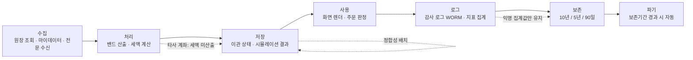
```mermaid
flowchart LR
    C["수집<br/>원장 조회 · 마이데이터 · 전문 수신"] --> P["처리<br/>밴드 산출 · 세액 계산"]
    P --> S["저장<br/>이관 상태 · 시뮬레이션 결과"]
    S --> U["사용<br/>화면 렌더 · 주문 판정"]
    U --> L["로그<br/>감사 로그 WORM · 지표 집계"]
    L --> R["보존<br/>10년 / 5년 / 90일"]
    R --> D["파기<br/>보존기간 경과 시 자동"]

    P -.->|"타사 계좌: 세액 미산출"| S
    S -.->|"정합성 배치"| S
    L -.->|"익명 집계값만 유지"| R
```

#### 6.2.3 주요 Entity 필드 정의

**`ACCOUNT`**

| Field | Type | Null | 설명 |
| --- | --- | :---: | --- |
| `account_id` | VARCHAR(32) | N | PK |
| `customer_id` | VARCHAR(32) | N | FK → `CUSTOMER` |
| `account_type` | ENUM | N | IRP · 연금저축 · DC · DB |
| `is_own_account` | BOOLEAN | N | 자사 여부. `false`면 세액 미산출 (CON-02) |
| `opened_at` | DATE | N | 계좌 개설일. 2013.3.1 판정 |
| `inherited_join_date` | DATE | Y | 승계 가입일 |
| `join_date_inherited` | BOOLEAN | **Y** | 승계 플래그. `null`이면 양쪽 계산 (REQ-FUNC-014) |
| `from_db_transfer` | BOOLEAN | N | 2013.3.1 전 DB 이체분. 6년차 기산 |
| `pension_start_applied_at` | DATE | Y | **한도용** 연차 기산 |
| `first_receipt_at` | DATE | Y | **감면율용** 연차 기산. 위와 별개 필드 |
| `eval_amount_at_period_start` | DECIMAL(18,0) | N | 과세기간 개시일 평가액 |
| `withdrawn_this_year` | DECIMAL(18,0) | N | 당해 누적 인출액 |

**`FUND_SOURCE_BALANCE`**

| Field | Type | Null | 설명 |
| --- | --- | :---: | --- |
| `account_id` | VARCHAR(32) | N | PK, FK → `ACCOUNT` |
| `tax_free_bucket1` | DECIMAL(18,0) | N | 당해 납입 연금보험료 |
| `tax_free_bucket2` | DECIMAL(18,0) | N | 당해 전환금액 (ISA 만기 전환분 등) |
| `tax_free_bucket3` | DECIMAL(18,0) | N | 세액공제 한도 초과 납입액 |
| `tax_free_bucket4` | DECIMAL(18,0) | N | 세액공제 미수령액. **확인서 확인 전까지 3층으로 과세** |
| `deferred_severance` | DECIMAL(18,0) | N | 이연퇴직소득 잔액 |
| `deferred_severance_rate` | DECIMAL(6,4) | Y | 적용 퇴직소득세율 |
| `deferred_deposited_at` | DATE | Y | 해외이주 3년 요건 판정 |
| `taxable_income` | DECIMAL(18,0) | N | 3층 세액공제분·운용수익 |
| `item_ra_balance` | DECIMAL(18,0) | Y | 라목 잔액 |
| `item_ra_separated` | BOOLEAN | N | 라목 분리 관리 여부. `false`면 1,500만원 판정 미제공 |

**`TRANSFER`**

| Field | Type | Null | 설명 |
| --- | --- | :---: | --- |
| `transfer_id` | VARCHAR(32) | N | PK |
| `account_id` | VARCHAR(32) | N | FK → `ACCOUNT` |
| `transferor_id` | VARCHAR(32) | N | FK → `TRANSFEROR` |
| `transfer_status` | ENUM | N | 정상 7값 + 예외 4값 |
| `route` | ENUM | N | 실물이전 · 계좌이체 |
| `submitted_at` | TIMESTAMP | Y | 전송 확정 시각 |
| `remitted_at` | TIMESTAMP | Y | 이관사 송금 시각 |
| `settled_at` | TIMESTAMP | Y | 잔고 반영 시각. **완료 판정 기준 (CON-12)** |
| `critical_path_holding_id` | VARCHAR(32) | Y | FK → `HOLDING`. **서버가 지정 (REQ-FUNC-019)** |
| `band_hit` | BOOLEAN | Y | 밴드 적중 여부. 지표 적재 |
| `delayed_flag` | BOOLEAN | N | 지연 여부. 상태가 아닌 플래그 |

**`LOCK_WINDOW`**

| Field | Type | Null | 설명 |
| --- | --- | :---: | --- |
| `transfer_id` | VARCHAR(32) | N | PK, FK → `TRANSFER` |
| `start_at` | TIMESTAMP | N | 전송 확정 시각 |
| `end_band_from` | DATE | N | 해제 밴드 시작 |
| `end_band_to` | DATE | N | 해제 밴드 종료. `end_band_to − end_band_from ≥ 2영업일` |
| `business_days_min` | INT | N | 최소 영업일 수 |
| `business_days_max` | INT | N | 최대 영업일 수 |
| `confidence` | DECIMAL(4,3) | N | 신뢰도 |
| `fallback_level` | TINYINT | N | 1~4. 폴백 사다리 단계 |
| `cached_on` | DATE | N | 당일 캐시 키 (REQ-FUNC-037) |

> **단일 날짜 컬럼이 없다.** `end_date` 같은 필드를 정의하지 않아 **스키마가 단정을 막는다** (CON-13).

**`TRADING_WINDOW`**

| Field | Type | Null | 설명 |
| --- | --- | :---: | --- |
| `transfer_id` | VARCHAR(32) | N | PK, FK → `TRANSFER` |
| `value` | ENUM | N | OPEN · SELL_ONLY · LOCKED · REOPENED |
| `buy_allowed` | BOOLEAN | N | 매수 허용 |
| `sell_allowed` | BOOLEAN | N | 매도 허용 |
| `pay_allowed` | BOOLEAN | N | 추가 납입 허용 |
| `claim_allowed` | BOOLEAN | N | 수령 신청 허용 |
| `confidence` | DECIMAL(4,3) | N | 임계 미만이면 `LOCKED` 강등 (CON-04) |

**`AUDIT_LOG`**

| Field | Type | Null | 설명 |
| --- | --- | :---: | --- |
| `log_id` | VARCHAR(32) | N | PK |
| `transfer_id` | VARCHAR(32) | N | FK → `TRANSFER` |
| `pressed_at` | TIMESTAMP | N | 전송 버튼 누른 시각 |
| `auth_method` | VARCHAR(32) | N | 인증수단 |
| `shown_band_from` | DATE | N | 그때 화면에 표시된 밴드 시작 |
| `shown_band_to` | DATE | N | 그때 화면에 표시된 밴드 종료 |
| `retain_until` | TIMESTAMP | N | 10년 보존 만료 시각 |

**`WITHDRAWAL_REQUEST` · `TAX_BUCKET_BREAKDOWN`**

| Entity | Field | Type | 설명 |
| --- | --- | --- | --- |
| `WITHDRAWAL_REQUEST` | `request_id` | VARCHAR(32) | PK |
| | `account_id` | VARCHAR(32) | FK → `ACCOUNT` |
| | `withdrawal_amount` | DECIMAL(18,0) | 인출 요청액 |
| | `withdrawal_reason` | ENUM | 7종 인출 사유 |
| | `is_unavoidable` | BOOLEAN | 부득이한 사유 여부 |
| | `exceeds_limit` | BOOLEAN | 한도 초과 플래그. 지표 적재 |
| | `is_simulation_only` | BOOLEAN | **항상 `true` (CON-15)** |
| `TAX_BUCKET_BREAKDOWN` | `breakdown_id` | VARCHAR(32) | PK |
| | `request_id` | VARCHAR(32) | FK |
| | `layer_no` | TINYINT | 1 · 2 · 3 |
| | `bucket_no` | TINYINT | 1층 내부 1~4 |
| | `amount` | DECIMAL(18,0) | 차감액 |
| | `tax_rate` | DECIMAL(6,4) | 실효세율 |
| | `tax_amount` | DECIMAL(18,0) | 세액 |
| | `within_limit` | BOOLEAN | 한도 내 여부 |
| | `lost_reduction` | DECIMAL(18,0) | 초과로 잃은 감면액 |

#### 6.2.4 Entity 관계

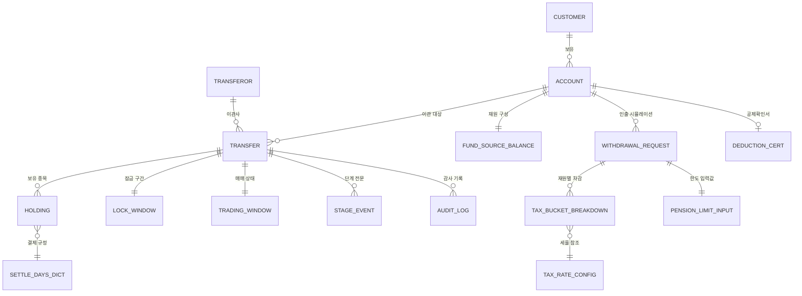
```mermaid
erDiagram
    CUSTOMER ||--o{ ACCOUNT : "보유"
    ACCOUNT ||--o{ TRANSFER : "이관 대상"
    ACCOUNT ||--|| FUND_SOURCE_BALANCE : "재원 구성"
    ACCOUNT ||--o{ WITHDRAWAL_REQUEST : "인출 시뮬레이션"
    ACCOUNT ||--o| DEDUCTION_CERT : "공제확인서"
    TRANSFEROR ||--o{ TRANSFER : "이관사"
    TRANSFER ||--o{ HOLDING : "보유 종목"
    TRANSFER ||--|| LOCK_WINDOW : "잠금 구간"
    TRANSFER ||--|| TRADING_WINDOW : "매매 상태"
    TRANSFER ||--o{ STAGE_EVENT : "단계 전문"
    TRANSFER ||--o{ AUDIT_LOG : "감사 기록"
    HOLDING }o--|| SETTLE_DAYS_DICT : "결제 규정"
    WITHDRAWAL_REQUEST ||--o{ TAX_BUCKET_BREAKDOWN : "재원별 차감"
    WITHDRAWAL_REQUEST ||--|| PENSION_LIMIT_INPUT : "한도 입력값"
    TAX_BUCKET_BREAKDOWN }o--|| TAX_RATE_CONFIG : "세율 참조"
```

#### 6.2.5 도메인 클래스 모델

Entity가 "무엇을 저장하는가"라면 클래스 모델은 "무엇이 계산하는가"다. 법정 산식을 담는 도메인 서비스와 값 객체를 분리한다.

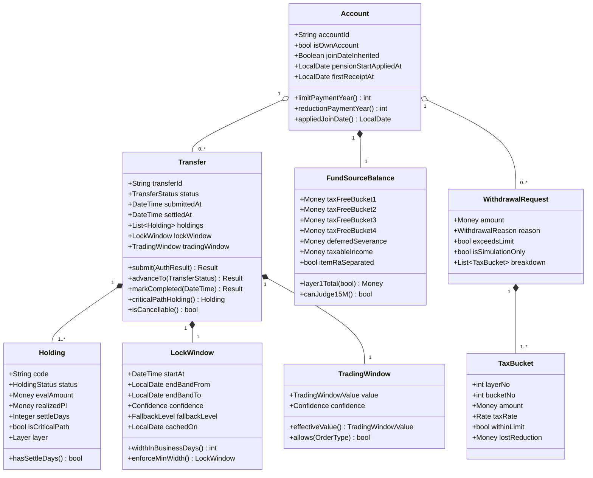
```mermaid
classDiagram
    class Transfer {
        +String transferId
        +TransferStatus status
        +DateTime submittedAt
        +DateTime settledAt
        +List~Holding~ holdings
        +LockWindow lockWindow
        +TradingWindow tradingWindow
        +submit(AuthResult) Result
        +advanceTo(TransferStatus) Result
        +markCompleted(DateTime) Result
        +criticalPathHolding() Holding
        +isCancellable() bool
    }
    class Holding {
        +String code
        +HoldingStatus status
        +Money evalAmount
        +Money realizedPl
        +Integer settleDays
        +bool isCriticalPath
        +Layer layer
        +hasSettleDays() bool
    }
    class LockWindow {
        +DateTime startAt
        +LocalDate endBandFrom
        +LocalDate endBandTo
        +Confidence confidence
        +FallbackLevel fallbackLevel
        +LocalDate cachedOn
        +widthInBusinessDays() int
        +enforceMinWidth() LockWindow
    }
    class TradingWindow {
        +TradingWindowValue value
        +Confidence confidence
        +effectiveValue() TradingWindowValue
        +allows(OrderType) bool
    }
    class Account {
        +String accountId
        +bool isOwnAccount
        +Boolean joinDateInherited
        +LocalDate pensionStartAppliedAt
        +LocalDate firstReceiptAt
        +limitPaymentYear() int
        +reductionPaymentYear() int
        +appliedJoinDate() LocalDate
    }
    class FundSourceBalance {
        +Money taxFreeBucket1
        +Money taxFreeBucket2
        +Money taxFreeBucket3
        +Money taxFreeBucket4
        +Money deferredSeverance
        +Money taxableIncome
        +bool itemRaSeparated
        +layer1Total(bool) Money
        +canJudge15M() bool
    }
    class WithdrawalRequest {
        +Money amount
        +WithdrawalReason reason
        +bool exceedsLimit
        +bool isSimulationOnly
        +List~TaxBucket~ breakdown
    }
    class TaxBucket {
        +int layerNo
        +int bucketNo
        +Money amount
        +Rate taxRate
        +bool withinLimit
        +Money lostReduction
    }

    Transfer "1" *-- "1..*" Holding
    Transfer "1" *-- "1" LockWindow
    Transfer "1" *-- "1" TradingWindow
    Account "1" o-- "0..*" Transfer
    Account "1" *-- "1" FundSourceBalance
    Account "1" o-- "0..*" WithdrawalRequest
    WithdrawalRequest "1" *-- "1..*" TaxBucket
```

**도메인 서비스와 정책**

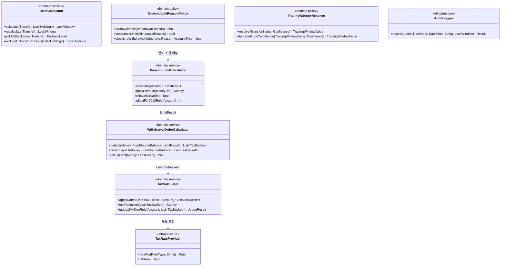
```mermaid
classDiagram
    class PensionLimitCalculator {
        <<domain service>>
        +calculate(Account) LimitResult
        -applyFormula(Money, int) Money
        -isNoLimitYear(int) bool
        -adjustFor2013Rule(Account) int
    }
    class WithdrawalOrderCalculator {
        <<domain service>>
        +deduct(Money, FundSourceBalance, LimitResult) List~TaxBucket~
        -deductLayer1(Money, FundSourceBalance) List~TaxBucket~
        -splitByLimit(Money, LimitResult) Pair
    }
    class TaxCalculator {
        <<domain service>>
        +applyRates(List~TaxBucket~, Account) List~TaxBucket~
        +lostReduction(List~TaxBucket~) Money
        +judge15MillionRule(Account, List~TaxBucket~) JudgeResult
    }
    class BandCalculator {
        <<domain service>>
        +calculate(Transfer, List~Holding~) LockWindow
        +recalculate(Transfer) LockWindow
        -pickFallbackLevel(Transfer) FallbackLevel
        -excludeUnknownProducts(List~Holding~) List~Holding~
    }
    class UnavoidableReasonPolicy {
        <<domain policy>>
        +isUnavoidable(WithdrawalReason) bool
        +consumesLimit(WithdrawalReason) bool
        +blocksIrpWithdrawal(WithdrawalReason, AccountType) bool
    }
    class TradingWindowResolver {
        <<domain policy>>
        +resolve(TransferStatus, Confidence) TradingWindowValue
        -degradeIfLowConfidence(TradingWindowValue, Confidence) TradingWindowValue
    }
    class AuditLogger {
        <<infrastructure>>
        +recordSubmit(TransferId, DateTime, String, LockWindow) Result
    }
    class TaxRateProvider {
        <<infrastructure>>
        +rateFor(RateType, String) Rate
        +isStale() bool
    }

    PensionLimitCalculator ..> WithdrawalOrderCalculator : LimitResult
    WithdrawalOrderCalculator ..> TaxCalculator : List~TaxBucket~
    UnavoidableReasonPolicy ..> PensionLimitCalculator : 한도 소진 여부
    TaxCalculator ..> TaxRateProvider : 세율 조회
```

**계산 순서가 고정된 이유** — `PensionLimitCalculator → WithdrawalOrderCalculator → TaxCalculator`. 한도를 먼저 구해야 한도 내/초과를 가를 수 있고, 그래야 같은 재원에 다른 세율을 적용할 수 있다 (REQ-FUNC-089). 순서를 바꾸면 초과분에 5.5%를 매기는 사고가 난다.

**`AuditLogger.recordSubmit()`이 `Result`를 반환하는 이유** — `void`가 아니다. 적재 실패 시 전송을 롤백해야 하므로(REQ-FUNC-029) 로그를 부수 효과로 둘 수 없다.

#### 6.2.6 마이데이터 제공 범위

| 필드군 | 제공 | 영향 |
| --- | :---: | --- |
| 계좌 평가액 · 개설일 · 최초납입일 · 거래내역 | **O** | 타사 계좌도 한도 계산 가능 |
| 과세제외금액 4버킷 | **X** | 타사 세액 미산출 |
| 이연퇴직소득 잔액 · 적용 세율 | **X** | 타사 세액 미산출 |
| 세액공제 받은 납입액 | **X** | 타사 세액 미산출 |

`가입자부담금`/`사용자부담금` 구분은 재원 구분의 대체물이 될 수 없다. 이연퇴직소득은 사용자부담금과 다른 개념이며, 세액공제 수령 여부는 어느 필드에도 담기지 않는다. [REF-13]

### 6.3 State Transition & Exception Handling

[REF-01 §8.6 · §8.7]의 명세를 요구사항 관점으로 옮긴다. 정상 흐름보다 **이상 흐름이 사고를 만든다.**

#### 6.3.1 상태 전이 매트릭스

**`ACTION_REQUIRED`의 성격** — `VERIFYING`을 **대체하는 독립 상태**다. sub-status가 아니다. 고객이 할 일이 있는 구간과 기다리는 구간은 화면이 완전히 다르고, sub-status로 두면 `transfer_status`만으로 알림 발송 여부를 판정할 수 없다. 반대로 **`delayed_flag`는 플래그**다 — 지연은 단계가 뒤로 가는 것이 아니라 같은 단계에 오래 머무는 것이다.

| # | 현재 상태 | Event | 다음 상태 | 허용 | 실패 시 | Requirement |
| :---: | --- | --- | --- | :---: | --- | --- |
| T-01 | (없음) | 예약 저장 | `DRAFT` | O | 저장 실패 응답 | REQ-FUNC-020 |
| T-02 | `DRAFT` | 전송 확정 (인증 + 감사 로그 성공) | `RECEIVED` | O | **`DRAFT` 유지** | REQ-FUNC-028 ~ 030 |
| T-03 | `DRAFT` | 예약 폐기 | (삭제) | O | `DRAFT` 유지 | REQ-FUNC-021 |
| T-04 | `RECEIVED` | 이체 요청 전문 송신 성공 | `REQUESTED` | O | 재시도 큐 | REQ-FUNC-030 |
| T-05 | `REQUESTED` | ③ 전문 수신 | `VERIFYING` | O | 지연 감지 | REQ-FUNC-054 |
| T-06 | `VERIFYING` | ④ 전문 수신 | `LIQUIDATING` | O | 지연 감지 | REQ-FUNC-054 |
| T-07 | `LIQUIDATING` | ⑤ 전문 수신 | `REMITTING` | O | 현재 상태 유지 | REQ-FUNC-057 |
| T-08 | `REMITTING` | 잔고 반영 확인 | `COMPLETED` | O | **`REMITTING` 유지** | REQ-FUNC-057 |
| T-09 | `VERIFYING` | 본인 확인 미완 | `ACTION_REQUIRED` | O | `VERIFYING` 유지 | REQ-FUNC-038 ~ 039 |
| T-10 | `ACTION_REQUIRED` | 통화 완료 · 현금화 미착수 | `VERIFYING` | O | 현재 상태 유지 | REQ-FUNC-040 |
| T-11 | `ACTION_REQUIRED` | 통화 완료 + ④ 전문 동시 수신 | `LIQUIDATING` | **조건부** | ④ 유효성 확인 후 | REQ-FUNC-040 |
| T-12 | `ACTION_REQUIRED` | 신청 후 5영업일 경과 | `CANCELED_NO_VERIFY` | O | 배치 재시도 (최대 3회) | REQ-FUNC-038 |
| T-13 | `REQUESTED` · `VERIFYING` | 이관사 거절 | `REJECTED` | O | 수동 확인 큐 | REQ-FUNC-042 |
| T-14 | `LIQUIDATING` | 일부 종목 이전 불가 | `PARTIAL_BLOCKED` | O | `LIQUIDATING` 유지 | REQ-FUNC-044 |
| T-15 | `PARTIAL_BLOCKED` | 고객 선택 완료 | `LIQUIDATING` | O | 현재 상태 유지 | REQ-FUNC-044 |
| T-16 | `RECEIVED` · `REQUESTED` | 당일 · 의사확인 전 취소 | `CANCELED_BY_USER` | **조건부** | 의사확인 완료 시 거부 | REQ-FUNC-021 |

**금지 전이** — 아래는 어떤 이벤트로도 발생해서는 안 된다. 발생 시 정합성 오류로 알람한다 (REQ-NF-046).

| 금지 전이 | 이유 |
| --- | --- |
| `COMPLETED` → 임의 상태 | 종결 상태 |
| `REJECTED` → `VERIFYING` 이후 | 재신청은 신규 `transfer_id`로만 |
| `CANCELED_*` → 임의 상태 | 종결 상태 |
| `DRAFT` → `REQUESTED` 이상 | `RECEIVED` 건너뛰기 = 감사 로그 누락 |
| 역방향 전이 (단계 번호 감소) | E-02로 처리 |

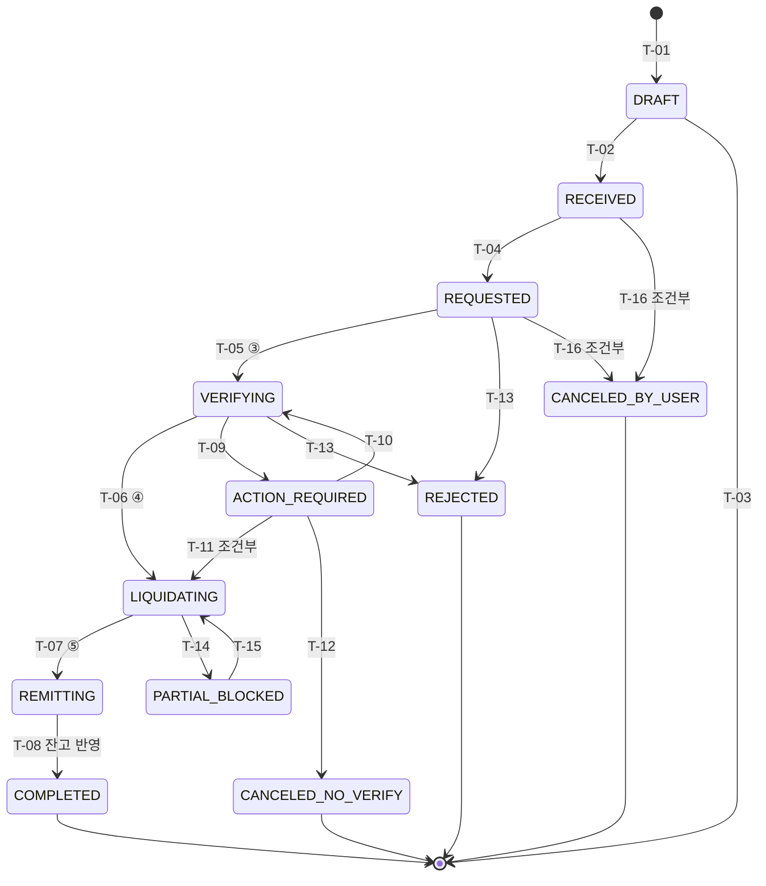
```mermaid
stateDiagram-v2
    [*] --> DRAFT : T-01
    DRAFT --> RECEIVED : T-02
    DRAFT --> [*] : T-03
    RECEIVED --> REQUESTED : T-04
    REQUESTED --> VERIFYING : T-05 ③
    VERIFYING --> LIQUIDATING : T-06 ④
    LIQUIDATING --> REMITTING : T-07 ⑤
    REMITTING --> COMPLETED : T-08 잔고 반영
    COMPLETED --> [*]
    VERIFYING --> ACTION_REQUIRED : T-09
    ACTION_REQUIRED --> VERIFYING : T-10
    ACTION_REQUIRED --> LIQUIDATING : T-11 조건부
    ACTION_REQUIRED --> CANCELED_NO_VERIFY : T-12
    REQUESTED --> REJECTED : T-13
    VERIFYING --> REJECTED : T-13
    LIQUIDATING --> PARTIAL_BLOCKED : T-14
    PARTIAL_BLOCKED --> LIQUIDATING : T-15
    RECEIVED --> CANCELED_BY_USER : T-16 조건부
    REQUESTED --> CANCELED_BY_USER : T-16 조건부
    REJECTED --> [*]
    CANCELED_NO_VERIFY --> [*]
    CANCELED_BY_USER --> [*]
```

#### 6.3.2 멱등성 원칙

| # | 원칙 | Requirement |
| :---: | --- | --- |
| ID-1 | 수신 전문의 멱등 키는 `(transfer_id, stage_no, 이관사 전문 일련번호)` | REQ-NF-045 |
| ID-2 | 동일 멱등 키는 **최초 1회만 처리.** 이후는 수신 로그만 적재 | REQ-NF-045 |
| ID-3 | §6.3.1에 정의되지 않은 전이는 **거부 + 알람** | REQ-NF-046 |
| ID-4 | 재시도는 지수 백오프 (1분 → 5분 → 15분, 최대 3회) | REQ-NF-042 |
| ID-5 | 고객 요청 API는 **클라이언트 생성 요청 ID**를 멱등 키로 받는다 | REQ-FUNC-030 |

#### 6.3.3 예외 처리 매트릭스

| # | 케이스 | 감지 | 처리 | 고객 화면 |
| :---: | --- | --- | --- | --- |
| E-01 | 동일 전문 2회 수신 | 멱등 키 중복 | **무시.** 수신 로그만 적재 | 변화 없음 |
| E-02 | 역순 전문 수신 (④ 후 ③) | `stage_no` < 현재 단계 | **무시.** 단계를 되돌리지 않음 | 변화 없음 |
| E-03 | `COMPLETED` 후 이전 단계 전문 | 종결 상태 + 전문 도착 | **무시 + 알람** | 변화 없음 |
| E-04 | 단계 전문 누락 (③ 없이 ④) | 단계 건너뜀 | ④ 처리 + ③을 `ESTIMATED`로 보정 | 정상 진행 |
| E-05 | 전문 수신 후 DB 저장 실패 | 트랜잭션 롤백 | **미처리로 남기고 재시도 큐** (ID-4) | 이전 상태 유지 |
| E-06 | DB 저장 성공 후 알림 실패 | 발송 API 오류 | 상태 유지. 알림만 재시도 → 인앱 대체 | 상태 정상 · 알림 지연 |
| E-07 | 알림 성공 응답 후 미전달 | 전달 콜백 미수신 | 재발송하지 않음. **화면이 최종 진실** | 화면에서 확인 |
| E-08 | 앱 오프라인 중 상태 변경 | — | 재접속 시 **전체 상태 재수신** | 최신 상태 |
| E-09 | 계산 중 세율 설정 조회 실패 | 조회 타임아웃 | **계산 중단.** 캐시 사용 금지 | 갱신 중 안내 |
| E-10 | `settle_days` 일부 누락 | 사전 조회 `null` | 해당 종목만 제외 후 산출 | "소요 기간 확인 중" |
| E-11 | `TRANSFER` ↔ `TRADING_WINDOW` 불일치 | 시간별 정합성 배치 | **`LOCKED`로 강등 + 알람** | 매매 불가 |
| E-12 | 전송 요청 중복 도착 | 요청 ID 중복 | 최초 1회만 처리, 최초 결과 반환 | 동일 결과 |

> **보정은 항상 보수적 방향으로 한다** (REQ-NF-043). 매매가 막혔는데 열렸다고 표시하면 회복 불가능하고, 완료가 아닌데 완료로 표시하면 "돈이 없다"는 최악의 문의가 발생한다. **낙관적 방향이 더 나쁘다.**

#### 6.3.4 영업일 · Cut-off · 시간대

D+N 계산이 개발자마다 달라지지 않도록 기준을 고정한다. **완료일 밴드 적중률이 핵심 지표**이므로 해석 여지를 남기지 않는다.

| # | 항목 | 정의 |
| :---: | --- | --- |
| BD-1 | 기준 시간대 | `Asia/Seoul` (KST, UTC+9). 서머타임 없음 |
| BD-2 | 영업일 | 대한민국 증권시장 영업일. 토·일, 법정·임시공휴일, 거래소 휴장일 제외 |
| BD-3 | 캘린더 원천 | 한국거래소 휴장일 Calendar Master. 연 1회 정기 + 임시공휴일 즉시 반영 |
| BD-4 | 신청 Cut-off | **15:30 KST.** 이후 접수는 다음 영업일 D+0 |
| BD-5 | D+0 | 접수 영업일. Cut-off 이전 = 당일, 이후 = 다음 영업일 |
| BD-6 | D+N | D+0에서 영업일 N개. **비영업일 미카운트** |
| BD-7 | 밴드 폭 | 영업일 수로 계산. 달력일 아님 |
| BD-8 | 최소 폭 | 2영업일. 미달 시 종료일을 밀어 확보 |
| BD-9 | 배치 기준 | 밴드 재계산은 영업일 09:00 KST. 비영업일 미실행 |
| BD-10 | 자동취소 마감 | 신청 후 5영업일 (BD-6 기준) |
| BD-11 | 의사확인 원칙 기한 | 신청일 +1영업일 |
| BD-12 | 알림 발송 | 시간대 제약 없이 60초 이내 (야간·주말 무관) |

**계산 예시** — 2026-08-18(화) 16:00 신청

| 단계 | 계산 | 결과 |
| --- | --- | --- |
| Cut-off | 16:00 > 15:30 → 다음 영업일 | D+0 = 08-19(수) |
| D+5 | 08-20·21·24·25·26 (08-22·23 주말 제외) | 08-26(수) |
| 최소 폭 | 2영업일 확보 | 밴드 = 08-26 ~ 08-28 |

> **Cut-off 15:30 근거** — 증권시장 정규장 마감 시각이다. 이후 접수 건은 당일 처리 여지가 없다. 이관사 접수 정책과 다를 수 있어 §6.5 OI-16으로 확인 항목에 포함한다.

### 6.4 Detailed Interaction Models

§3.4의 간결 버전에서 생략한 오류 분기와 대안 흐름을 포함한 확장 버전이다.

#### 6.5.1 이체 예약 — 마이데이터 지연 및 결제 규정 결측

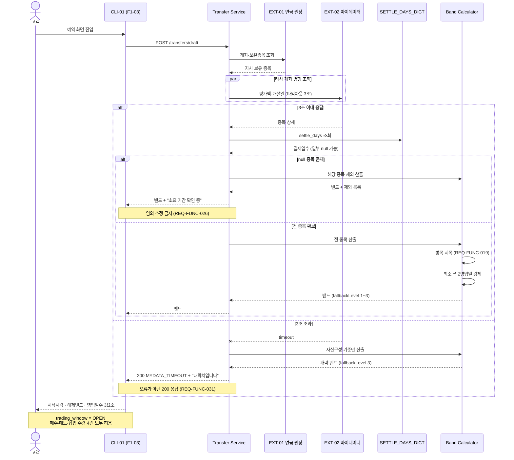
```mermaid
sequenceDiagram
    actor C as 고객
    participant UI as CLI-01 (F1-03)
    participant TS as Transfer Service
    participant LD as EXT-01 연금 원장
    participant MD as EXT-02 마이데이터
    participant DI as SETTLE_DAYS_DICT
    participant BC as Band Calculator

    C->>UI: 예약 화면 진입
    UI->>TS: POST /transfers/draft
    TS->>LD: 계좌·보유종목 조회
    LD-->>TS: 자사 보유 종목

    par 타사 계좌 병행 조회
        TS->>MD: 평가액·개설일 (타임아웃 3초)
    end

    alt 3초 이내 응답
        MD-->>TS: 종목 상세
        TS->>DI: settle_days 조회
        DI-->>TS: 결제일수 (일부 null 가능)
        alt null 종목 존재
            TS->>BC: 해당 종목 제외 산출
            BC-->>TS: 밴드 + 제외 목록
            TS-->>UI: 밴드 + "소요 기간 확인 중"
            Note over TS,UI: 임의 추정 금지 (REQ-FUNC-026)
        else 전 종목 확보
            TS->>BC: 전 종목 산출
            BC->>BC: 병목 지목 (REQ-FUNC-019)
            BC->>BC: 최소 폭 2영업일 강제
            BC-->>TS: 밴드 (fallbackLevel 1~3)
            TS-->>UI: 밴드
        end
    else 3초 초과
        MD--xTS: timeout
        TS->>BC: 자산구성 기준만 산출
        BC-->>TS: 개략 밴드 (fallbackLevel 3)
        TS-->>UI: 200 MYDATA_TIMEOUT + "대략치입니다"
        Note over TS,UI: 오류가 아닌 200 응답 (REQ-FUNC-031)
    end

    UI-->>C: 시작시각 · 해제밴드 · 영업일수 3요소
    Note over C,UI: trading_window = OPEN<br/>매수·매도·납입·수령 4건 모두 허용
```

**대응 요구사항** — REQ-FUNC-016 ~ 019, 026, 031 · REQ-NF-006, 011

#### 6.5.2 전송 확정 — 감사 로그 실패 시 롤백

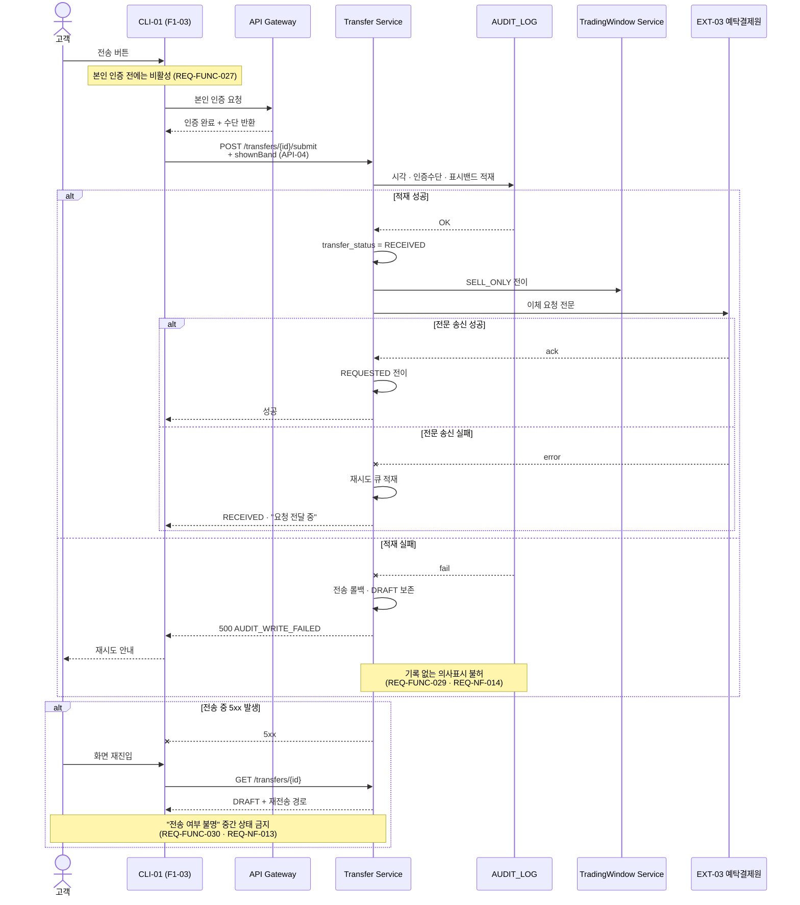
```mermaid
sequenceDiagram
    actor C as 고객
    participant UI as CLI-01 (F1-03)
    participant GW as API Gateway
    participant TS as Transfer Service
    participant AL as AUDIT_LOG
    participant TW as TradingWindow Service
    participant KSD as EXT-03 예탁결제원

    C->>UI: 전송 버튼
    Note over UI: 본인 인증 전에는 비활성 (REQ-FUNC-027)
    UI->>GW: 본인 인증 요청
    GW-->>UI: 인증 완료 + 수단 반환

    UI->>TS: POST /transfers/{id}/submit<br/>+ shownBand (API-04)
    TS->>AL: 시각 · 인증수단 · 표시밴드 적재

    alt 적재 성공
        AL-->>TS: OK
        TS->>TS: transfer_status = RECEIVED
        TS->>TW: SELL_ONLY 전이
        TS->>KSD: 이체 요청 전문
        alt 전문 송신 성공
            KSD-->>TS: ack
            TS->>TS: REQUESTED 전이
            TS-->>UI: 성공
        else 전문 송신 실패
            KSD--xTS: error
            TS->>TS: 재시도 큐 적재
            TS-->>UI: RECEIVED · "요청 전달 중"
        end
    else 적재 실패
        AL--xTS: fail
        TS->>TS: 전송 롤백 · DRAFT 보존
        TS-->>UI: 500 AUDIT_WRITE_FAILED
        UI-->>C: 재시도 안내
        Note over TS,AL: 기록 없는 의사표시 불허<br/>(REQ-FUNC-029 · REQ-NF-014)
    end

    alt 전송 중 5xx 발생
        TS--xUI: 5xx
        C->>UI: 화면 재진입
        UI->>TS: GET /transfers/{id}
        TS-->>UI: DRAFT + 재전송 경로
        Note over C,TS: "전송 여부 불명" 중간 상태 금지<br/>(REQ-FUNC-030 · REQ-NF-013)
    end
```

**대응 요구사항** — REQ-FUNC-027 ~ 030 · REQ-NF-013, 014

#### 6.5.3 병목 정리 및 밴드 재계산

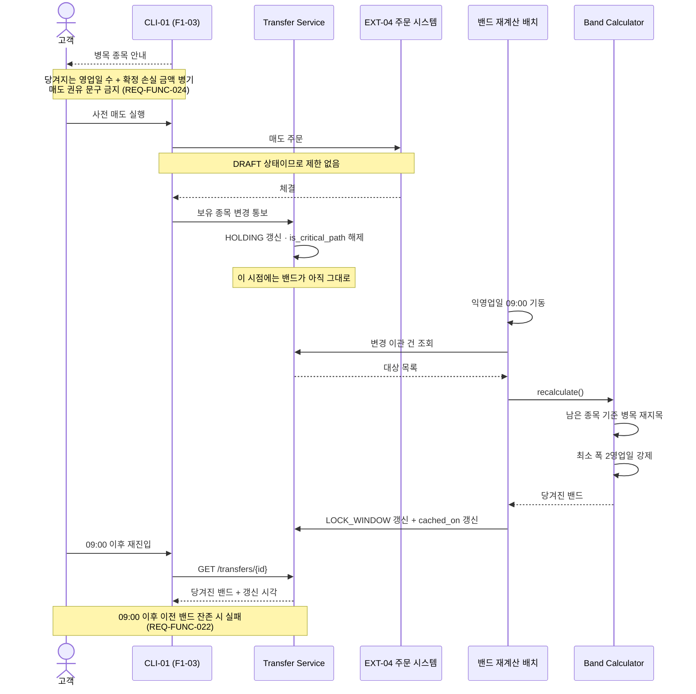
```mermaid
sequenceDiagram
    actor C as 고객
    participant UI as CLI-01 (F1-03)
    participant TS as Transfer Service
    participant ORD as EXT-04 주문 시스템
    participant BAT as 밴드 재계산 배치
    participant BC as Band Calculator

    UI-->>C: 병목 종목 안내
    Note over UI,C: 당겨지는 영업일 수 + 확정 손실 금액 병기<br/>매도 권유 문구 금지 (REQ-FUNC-024)

    C->>UI: 사전 매도 실행
    UI->>ORD: 매도 주문
    Note over UI,ORD: DRAFT 상태이므로 제한 없음
    ORD-->>UI: 체결
    UI->>TS: 보유 종목 변경 통보
    TS->>TS: HOLDING 갱신 · is_critical_path 해제
    Note over TS: 이 시점에는 밴드가 아직 그대로

    BAT->>BAT: 익영업일 09:00 기동
    BAT->>TS: 변경 이관 건 조회
    TS-->>BAT: 대상 목록
    BAT->>BC: recalculate()
    BC->>BC: 남은 종목 기준 병목 재지목
    BC->>BC: 최소 폭 2영업일 강제
    BC-->>BAT: 당겨진 밴드
    BAT->>TS: LOCK_WINDOW 갱신 + cached_on 갱신

    C->>UI: 09:00 이후 재진입
    UI->>TS: GET /transfers/{id}
    TS-->>UI: 당겨진 밴드 + 갱신 시각
    Note over C,TS: 09:00 이후 이전 밴드 잔존 시 실패<br/>(REQ-FUNC-022)
```

**대응 요구사항** — REQ-FUNC-019, 022 ~ 024, 037

#### 6.4.4 진행 단계 갱신 및 지연 감지

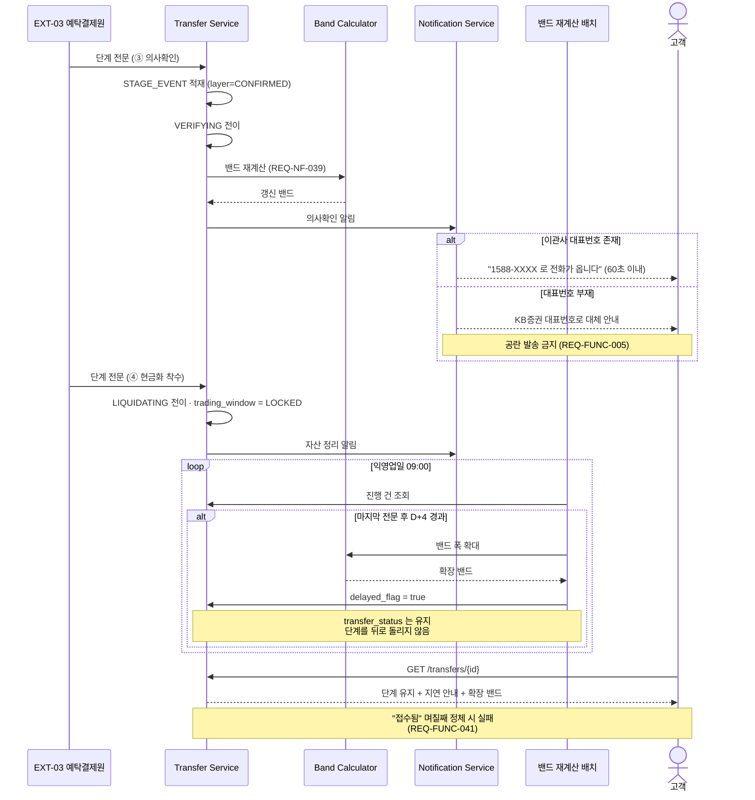
```mermaid
sequenceDiagram
    participant KSD as EXT-03 예탁결제원
    participant TS as Transfer Service
    participant BC as Band Calculator
    participant NS as Notification Service
    participant BAT as 밴드 재계산 배치
    actor C as 고객

    KSD->>TS: 단계 전문 (③ 의사확인)
    TS->>TS: STAGE_EVENT 적재 (layer=CONFIRMED)
    TS->>TS: VERIFYING 전이
    TS->>BC: 밴드 재계산 (REQ-NF-039)
    BC-->>TS: 갱신 밴드
    TS->>NS: 의사확인 알림
    alt 이관사 대표번호 존재
        NS-->>C: "1588-XXXX 로 전화가 옵니다" (60초 이내)
    else 대표번호 부재
        NS-->>C: KB증권 대표번호로 대체 안내
        Note over NS,C: 공란 발송 금지 (REQ-FUNC-005)
    end

    KSD->>TS: 단계 전문 (④ 현금화 착수)
    TS->>TS: LIQUIDATING 전이 · trading_window = LOCKED
    TS->>NS: 자산 정리 알림

    loop 익영업일 09:00
        BAT->>TS: 진행 건 조회
        alt 마지막 전문 후 D+4 경과
            BAT->>BC: 밴드 폭 확대
            BC-->>BAT: 확장 밴드
            BAT->>TS: delayed_flag = true
            Note over BAT,TS: transfer_status 는 유지<br/>단계를 뒤로 돌리지 않음
        end
    end

    C->>TS: GET /transfers/{id}
    TS-->>C: 단계 유지 + 지연 안내 + 확장 밴드
    Note over C,TS: "접수됨" 며칠째 정체 시 실패<br/>(REQ-FUNC-041)
```

**대응 요구사항** — REQ-FUNC-003 ~ 005, 034 ~ 035, 041, 054 · REQ-NF-039

#### 6.4.5 인출순서·세액 계산 — 계산 전 가드

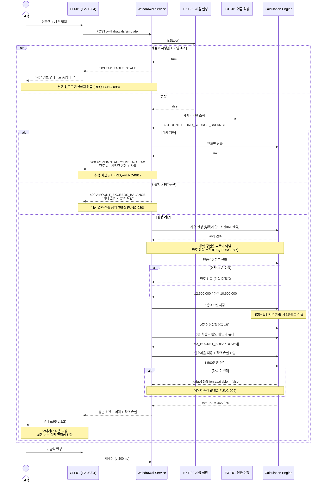
```mermaid
sequenceDiagram
    actor C as 고객
    participant UI as CLI-01 (F2-03/04)
    participant WS as Withdrawal Service
    participant TR as EXT-09 세율 설정
    participant LD as EXT-01 연금 원장
    participant EN as Calculation Engine

    C->>UI: 인출액 + 사유 입력
    UI->>WS: POST /withdrawals/simulate
    WS->>TR: isStale()

    alt 세율표 시행일 +30일 초과
        TR-->>WS: true
        WS-->>UI: 503 TAX_TABLE_STALE
        UI-->>C: "세율 정보 업데이트 중입니다"
        Note over WS,C: 낡은 값으로 계산하지 않음 (REQ-FUNC-098)
    else 정상
        TR-->>WS: false
        WS->>LD: 계좌 · 재원 조회
        LD-->>WS: ACCOUNT + FUND_SOURCE_BALANCE

        alt 타사 계좌
            WS->>EN: 한도만 산출
            EN-->>WS: limit
            WS-->>UI: 200 FOREIGN_ACCOUNT_NO_TAX<br/>한도 O · 세액란 공란 + 사유
            Note over WS,UI: 추정 계산 금지 (REQ-FUNC-081)
        else 인출액 > 평가금액
            WS-->>UI: 400 AMOUNT_EXCEEDS_BALANCE<br/>"최대 인출 가능액: N원"
            Note over WS,UI: 계산 결과 산출 금지 (REQ-FUNC-080)
        else 정상 계산
            WS->>EN: 사유 판정 (부득이/한도소진/IRP제약)
            EN-->>WS: 판정 결과
            Note over EN,WS: 주택 구입은 부득이 아님<br/>한도 정상 소진 (REQ-FUNC-077)

            WS->>EN: 연금수령한도 산출
            alt 연차 11년 이상
                EN-->>WS: 한도 없음 (산식 미적용)
            else
                EN-->>WS: 12,600,000 / 잔여 10,600,000
            end

            WS->>EN: 1층 4버킷 차감
            Note over EN: 4호는 확인서 미제출 시 3층으로 이월
            WS->>EN: 2층 이연퇴직소득 차감
            WS->>EN: 3층 차감 + 한도 내/초과 분리
            EN-->>WS: TAX_BUCKET_BREAKDOWN[]

            WS->>EN: 실효세율 적용 + 감면 손실 산출
            WS->>EN: 1,500만원 판정
            alt 라목 미분리
                EN-->>WS: judge15Million.available = false
                Note over EN,WS: 게이지 숨김 (REQ-FUNC-092)
            end
            EN-->>WS: totalTax = 465,960
            WS-->>UI: 층별 소진 + 세액 + 감면 손실
            UI-->>C: 결과 (p95 ≤ 1초)
            Note over UI,C: 모의계산 라벨 고정<br/>실행 버튼·상담 진입점 없음
        end
    end

    C->>UI: 인출액 변경
    UI->>WS: 재계산 (≤ 300ms)
```

**대응 요구사항** — REQ-FUNC-072 ~ 101 · REQ-NF-004, 005, 012

#### 6.4.6 공제확인서 제출 및 버킷 이동

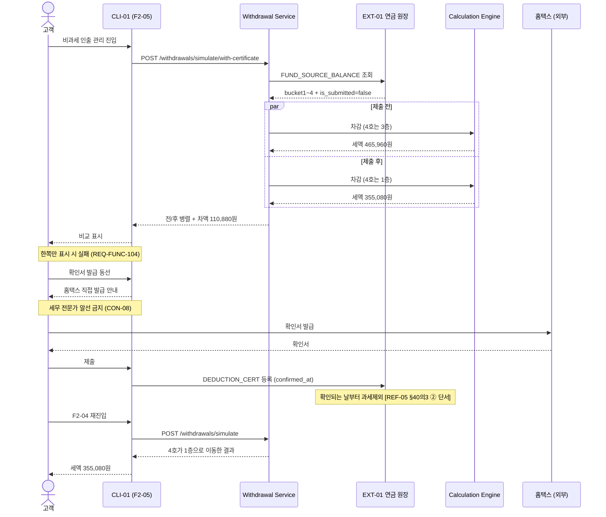
```mermaid
sequenceDiagram
    actor C as 고객
    participant UI as CLI-01 (F2-05)
    participant WS as Withdrawal Service
    participant LD as EXT-01 연금 원장
    participant EN as Calculation Engine
    participant HT as 홈택스 (외부)

    C->>UI: 비과세 인출 관리 진입
    UI->>WS: POST /withdrawals/simulate/with-certificate
    WS->>LD: FUND_SOURCE_BALANCE 조회
    LD-->>WS: bucket1~4 + is_submitted=false

    par 제출 전
        WS->>EN: 차감 (4호는 3층)
        EN-->>WS: 세액 465,960원
    and 제출 후
        WS->>EN: 차감 (4호는 1층)
        EN-->>WS: 세액 355,080원
    end

    WS-->>UI: 전/후 병렬 + 차액 110,880원
    UI-->>C: 비교 표시
    Note over UI,C: 한쪽만 표시 시 실패 (REQ-FUNC-104)

    C->>UI: 확인서 발급 동선
    UI-->>C: 홈택스 직접 발급 안내
    Note over UI,C: 세무 전문가 알선 금지 (CON-08)
    C->>HT: 확인서 발급
    HT-->>C: 확인서
    C->>UI: 제출
    UI->>LD: DEDUCTION_CERT 등록 (confirmed_at)
    Note over LD: 확인되는 날부터 과세제외 [REF-05 §40의3 ② 단서]

    C->>UI: F2-04 재진입
    UI->>WS: POST /withdrawals/simulate
    WS-->>UI: 4호가 1층으로 이동한 결과
    UI-->>C: 세액 355,080원
```

**대응 요구사항** — REQ-FUNC-087, 088, 102 ~ 104

#### 6.4.7 이체 완료 판정

```mermaid
sequenceDiagram
    participant KSD as EXT-03 예탁결제원
    participant TS as Transfer Service
    participant BAT as 잔고 확인 배치
    participant LD as EXT-01 연금 원장
    participant TW as TradingWindow Service
    participant NS as Notification Service
    actor C as 고객

    KSD->>TS: 송금 통보 전문 (⑤)
    TS->>TS: REMITTING 전이 · remitted_at 기록
    Note over TS: 아직 COMPLETED 아님 (CON-12)

    C->>TS: 현황판 조회
    TS-->>C: "송금 중" 표시

    loop 상시 배치
        BAT->>LD: 수관 계좌 잔고 확인
        alt 잔고 미반영
            LD-->>BAT: 미반영
            Note over BAT: REMITTING 유지
        else 잔고 반영
            LD-->>BAT: 반영 + 금액
            BAT->>TS: COMPLETED 전이 · settled_at 기록
            BAT->>TW: REOPENED 전이
            BAT->>TS: band_hit 적재
            BAT->>NS: 입고 알림 (60초 이내)
            NS-->>C: 알림 (야간·주말 무관)
            alt 입고 금액 차이 10% 이상
                BAT->>TS: 차이 플래그
                Note over BAT,C: 완료 표시 + 확인 안내 + 대표번호<br/>(REQ-FUNC-060)
            end
        end
    end

    C->>TS: 완료 화면 진입
    TS-->>C: 송금 시각 + 잔고 반영 시각 각각
    TS-->>C: 확정 가입일 카드 → 기능2 한도 산식 입력
```

**대응 요구사항** — REQ-FUNC-057 ~ 062 · REQ-NF-023

### 6.5 Validation Plan

[REF-01 §13.1]의 가설 검증 계획을 요구사항 검증 관점으로 정리한다.

#### 6.5.1 계산 검증 데이터셋

릴리스마다 전건 대조한다. **1원이라도 불일치 시 릴리스를 중단한다** (REQ-NF-038).

**기준 계좌** — 평가액 84,000,000원 · 만 57세 · 연금수령연차 3년 · 올해 기인출 2,000,000원 · 이연퇴직소득 28,000,000원 (적용 퇴직소득세율 6.6%)

| # | 조건 | 기대값 | 검증 요구사항 |
| :---: | --- | ---: | --- |
| V-01 | 연금수령한도 | 12,600,000원 | REQ-FUNC-073 |
| V-02 | 올해 남은 금액 | 10,600,000원 | REQ-FUNC-073 |
| V-03 | 가입일 미승계 시 한도 (1년차) | 10,080,000원 | REQ-FUNC-013, 014 |
| V-04 | 15,000,000원 인출 · 일반 | 세금 465,960원 | REQ-FUNC-085, 094 |
| V-05 | 15,000,000원 인출 · 확인서 제출 후 | 세금 355,080원 | REQ-FUNC-088, 104 |
| V-06 | 15,000,000원 인출 · 부득이한 사유 | 세금 378,840원 | REQ-FUNC-076 |

**밴드 검증값** — 서동현 IRP 이체 (6종 · 2026-08-18(화) 15:00 전송)

| 조건 | 기준 소요 | 해제 밴드 | 검증 요구사항 |
| --- | :---: | --- | --- |
| 병목 그대로 (해외 펀드 포함) | 9~11영업일 | 8월 31일(월) ~ 9월 2일(수) | REQ-FUNC-017, 018 |
| 병목 정리 후 | 6~8영업일 | 8월 26일(수) ~ 8월 28일(금) | REQ-FUNC-022 |

> **밴드 검증 기준값 미확정.** [REF-01]과 [REF-02]의 평가금액·손실액이 불일치한다(48,500,000원 vs 44,890,000원, 420,000원 vs 312,000원). **기준 확정 전까지 밴드 검증값을 인수 판정에 사용하지 않는다.** 계산 검증값 V-01 ~ V-06은 이 불일치와 무관하므로 그대로 사용한다.

#### 6.5.2 가설 검증 단계

| 단계 | 범위 | 승격 조건 | 검증 가정 |
| --- | --- | --- | --- |
| Phase 0 (내부) | 임직원 IRP 이관 건 · 세율표 검증 · 문의코드 `TRF-STATUS` 태깅 · 마이데이터 동의 법무 검토 | 문의율·자동취소율 기준선 4주 관측치 확정 · 인수 조건 전건 통과 · `settle_days` 실측 확보 | ASM-07 ~ 11 |
| Phase 1 (제한 베타) | PB 미배정 IRP 단건 10% / 기능2 전 사용자 | 밴드 적중률 ≥ 75% · 주문 거부율 ≤ 0.1% · 계산 오류 0건 | ASM-02, 04, 06 |
| Phase 2 (확대) | 동일 조건 50% | 밴드 적중률 ≥ 85% · 예약 전환율 ≥ 40% · 문의율 감소 확인 | ASM-01, 03 |
| Phase 3 (전체) | PB 미배정 전체 | 진행 단계 커버리지 유지 · 문의율 ≤ 0.3건/건 | ASM-05 |

#### 6.5.3 검증 방법 정의

| 코드 | 방법 | 정의 | 적용 |
| :---: | --- | --- | --- |
| T | Test | 정해진 입력으로 실행해 출력을 기대값과 대조 | 계산 로직, 상태 전이, 성능 임계치 |
| I | Inspection | 산출물·화면을 육안 또는 정적 분석으로 확인 | 문구 규칙, 표기 원칙, 규제 제약 |
| D | Demonstration | 실제 조작으로 동작을 시연 | 화면 전이, 진입점, 접근 경로 |
| A | Analysis | 모델·통계로 추론 | 밴드 산출 규격, 가용성, 운영 지표 |

### 6.6 Open Issues

착수 전 확정이 필요한 항목이다. 전 항목에 대응책이 걸려 있어 회신이 늦어져도 축소형으로 인도된다.

| # | 항목 | 담당 | 등급 | 미확정 시 확정 동작 |
| :---: | --- | --- | :---: | --- |
| OI-01 | 상품별 결제 규정(`settle_days`) 실측 확보 | 연금시스템 | **게이트** | **Phase 1 착수하지 않는다** |
| OI-02 | 콜센터 문의코드 `TRF-STATUS` 신설 | 콜센터 운영 | **게이트** | **기준선 없이 Phase 1 승격하지 않는다** |
| OI-03 | 이관 계좌 가입일 기준 (종전 vs 신규) | 연금시스템 | 축소 | 승계·미승계 양쪽 한도 병렬 표시 |
| OI-04 | 라목 잔액 분리 관리 여부 | 연금시스템 | 축소 | 1,500만원 판정 게이지 비노출 |
| OI-05 | 의사확인 자동취소 기준일 (+1 vs 5영업일) | 연금시스템 | 축소 | 두 날짜를 눈금 2개로 병기 |
| OI-06 | 이연퇴직소득 입금일 원장 기록 여부 | 연금시스템 | 축소 | 해외이주 사유를 선택 목록에서 제외 |
| OI-07 | 이관사 × 자산구성 단위 전문 적재 가능 여부 | 연금시스템 | 축소 | 폴백 사다리 ②~③단계로 운영 |
| OI-08 | 이관 중 매매 제한 정책 확정 | 연금시스템 | 축소 | 미확인 구간 `LOCKED` 보수 표시 |
| OI-09 | 예약 저장 구조의 접수 규정 충돌 여부 | 법무 | 축소 | 예약을 저장 전용으로 축소 |
| **OI-10** | 개별 계좌 세액 계산의 **투자자문업 해당 여부** | 법무 | **게이트** | **기능2를 출시하지 않는다.** 기능1은 영향 없어 단독 출시 가능 |
| OI-11 | 마이데이터 타사 조회 동의 범위 | 법무 | 축소 | 타사 계좌 기능을 Phase 2로 이연 |
| OI-12 | 진행 알림의 광고성 정보 해당 여부 | 법무 | 축소 | 인앱 알림으로만 제공, 푸시 보류 |
| OI-13 | 계산 오류 시 면책 범위 | 법무 | 축소 | 실효적 방어 4종 전부 적용 상태로 인도 |
| OI-14 | 전자적 의사표시 로그 보존 범위 | 법무 | 축소 | 감사 로그 10년 보존을 상한으로 적용 |
| OI-15 | 밴드 검증 기준값 확정 ([REF-01] vs [REF-02]) | 기획 | 축소 | 밴드 검증값을 인수 판정에서 제외 |
| OI-16 | 신청 Cut-off 15:30이 이관사 접수 정책과 일치하는가 | 연금시스템 | 축소 | 15:30 기준으로 산출하되 밴드 폭을 1영업일 확대 |
| OI-17 | 감사 로그·개인정보 **법정 보존기간 확정** | 법무·정보보호 | 축소 | 설계 상한 10년으로 운영하되 정책 확정 시 즉시 조정 |

---

*Author: Planning Analyst (IT) · Reviewer: Development Team Lead · Approver: Planning Manager (PM)*

---

## Disclaimer

이 문서는 제품 구현을 위한 요구사항 명세이며 **법률·세무 자문이 아니다.** 조문 인용은 국가법령정보센터·국세청 공개 법령 자료 원문으로 확인했다. §1.5의 규제 관련 제약(CON-06 ~ CON-11)은 이 문서가 내린 설계 판단이며, 출시 전 법무·컴플라이언스 검토로 확정한다 (OI-10).
