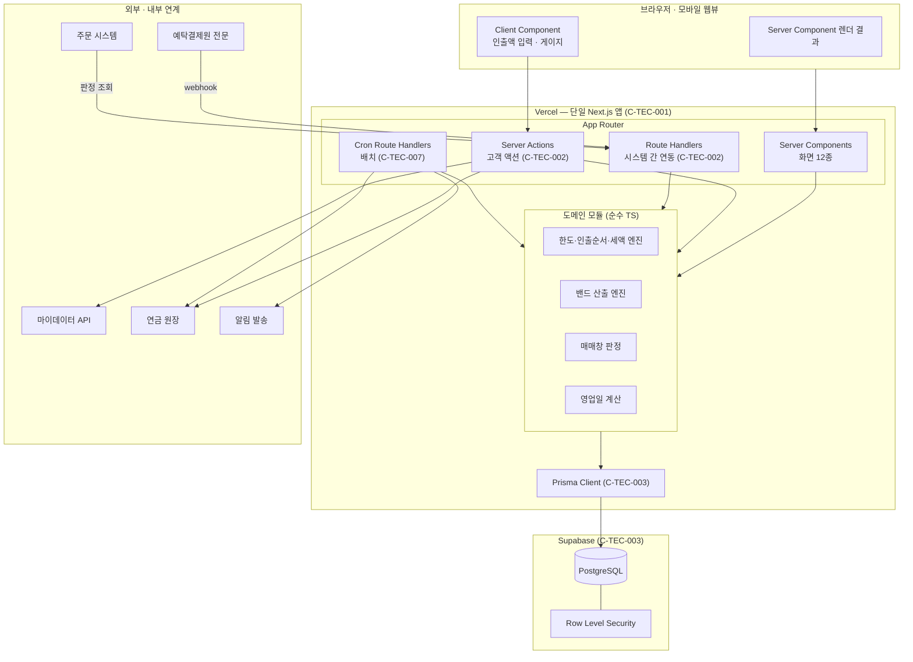

# SRS · 연금플러스 (기술 제약 반영판)

## 연금계좌 이체 진행 조회 · 인출순서 시뮬레이터 — Next.js 단일 풀스택 구현

---

| 항목 | 값 |
| --- | --- |
| **Document ID** | `PENSION-PLUS-SRS-002` |
| **Version** | `1.0` |
| **Status** | **Conditional Ready for Implementation** |
| **Date** | 2026-08-25 |
| **Source PRD** | `source/ai-place-prd-v3_1.md` (PRD v3.1) |
| **선행 SRS** | `02_SRS_연금플러스_v1.0.md` · `03_SRS_연금플러스_ISO29148_v0.1.md` |
| **문서 성격** | **기술 제약 확정판.** 선행 SRS가 구현 독립적으로 명세한 요구사항을 지정 기술 스택 위에서 구현 가능한 형태로 구체화한다 |

---

## 0. 이 문서가 선행 SRS와 다른 점

| 구분 | 선행 SRS (`02_SRS_연금플러스_v1.0` · `srs-001`) | **이 문서 (SRS-002)** |
| --- | --- | --- |
| 기술 선택 | **금지.** "구현 기술을 선택하지 않는다"를 원칙으로 명시 | **확정.** C-TEC-001 ~ 007을 전제로 설계 |
| 인터페이스 | 논리적 입출력만 정의. Endpoint·HTTP Method는 TBD | **App Router 경로·Server Action 시그니처 확정** |
| 데이터 | 논리 Entity·필드·타입 | **Prisma 스키마 · Supabase 물리 제약** |
| 배포·운영 | 범위 밖 | **Vercel 배포·Cron·환경변수 확정** |
| UI | 화면 목록·표기 규칙 | **Tailwind · shadcn/ui 컴포넌트 매핑** |
| 요구사항 ID | `SRS-FR-xxx` 등 | **선행 ID를 그대로 참조.** 신규 ID는 `TEC-xxx` 계열만 생성 |

> **요구사항 자체는 바꾸지 않는다.** 이 문서는 "무엇을 만들 것인가"를 재정의하지 않고, "지정된 스택에서 그것을 어떻게 만족시키는가"만 다룬다. 기술 제약이 기존 요구사항 충족을 위협하는 지점은 **§9 제약 충돌**에 격리한다.

---

## 1. Technology Constraints

### 1.1 확정 제약 (C-TEC)

| ID | 제약 | 적용 범위 | 이 문서에서의 반영 |
| --- | --- | --- | --- |
| **C-TEC-001** | 모든 서비스는 Next.js (App Router) 기반 단일 풀스택으로 구현한다. 프론트엔드·백엔드를 분리하지 않는다 | 전 시스템 | §2 아키텍처 · §3 라우트 맵 |
| **C-TEC-002** | 서버 로직은 Server Actions 또는 Route Handlers로 구현한다. 별도 백엔드 서버를 두지 않는다 | 전 서버 로직 | §4 실행 모델 판정 |
| **C-TEC-003** | DB는 Prisma + 로컬 Supabase로 개발하고 배포 시 Supabase(PostgreSQL)를 사용한다 | 데이터 계층 | §5 데이터 계층 |
| **C-TEC-004** | UI·스타일링은 Tailwind CSS와 shadcn/ui를 사용한다 | 전 화면 | §6 UI 계층 |
| **C-TEC-005** | AI 기능이 포함되는 경우 Vercel AI SDK로 외부 API를 호출한다. 자체 AI 서버를 구축하지 않는다 | **조건부** | §7 AI 통합 |
| **C-TEC-006** | 외부 AI 호출은 Google Gemini API를 기본으로 하며 환경 변수만으로 모델 교체가 가능해야 한다 | **조건부** | §7 AI 통합 |
| **C-TEC-007** | 배포·인프라는 Vercel로 단일화하고 Git Push만으로 배포를 자동화한다 | 배포·운영 | §8 배포·운영 |

### 1.2 제약이 요구사항에 미치는 영향 요약

| 영향 | 건수 | 상세 |
| --- | :---: | --- |
| 그대로 충족 | 대다수 | 화면·계산·상태 전이 요구사항 |
| **구현 방식이 확정됨** | 12건 | §4 · §5 · §6에서 매핑 |
| **충돌 또는 위험** | **7건** | §9에서 완화책과 함께 격리 |
| **적용 대상 없음 (조건부)** | 2건 | C-TEC-005 · C-TEC-006 (§7) |

---

## 2. System Architecture

### 2.1 아키텍처 개요

C-TEC-001·002에 따라 **별도 백엔드 서버가 없다.** 클라이언트 렌더링, 서버 로직, 데이터 접근이 하나의 Next.js 애플리케이션 안에 있다.



### 2.2 계층 책임

| 계층 | 구현 수단 | 책임 | 금지 사항 |
| --- | --- | --- | --- |
| **표현** | Server Components + Client Components | 화면 렌더, 표기 규칙 적용 | 밴드·세액 **계산 금지** (선행 SRS `SRS-FR-019` 서버 지정 원칙) |
| **서버 액션** | Server Actions | 고객 액션 처리, 상태 전이 | 시스템 간 연동 수신 |
| **시스템 연동** | Route Handlers | 전문 수신, 판정 응답, Cron | 고객 세션 의존 |
| **도메인** | 순수 TypeScript 모듈 | 법정 계산, 상태 판정, 영업일 | I/O 수행 금지 (테스트 가능성 확보) |
| **데이터** | Prisma Client | DB 접근, 트랜잭션 | 비즈니스 규칙 포함 금지 |

> **도메인 모듈을 순수 TS로 격리하는 이유.** 선행 SRS `SRS-NFR-REL-011`이 검증 데이터셋 6건 전건 일치를 요구한다. I/O가 섞이면 이 회귀 시험을 매 릴리스 자동으로 돌릴 수 없다.

### 2.3 디렉터리 구조

```
app/
├── (customer)/                       # 고객 화면 그룹
│   ├── layout.tsx
│   ├── home/page.tsx                 # F1-01
│   ├── transfer/
│   │   ├── terms/page.tsx            # F1-02
│   │   ├── draft/page.tsx            # F1-03
│   │   ├── [transferId]/
│   │   │   ├── page.tsx              # F1-04 현황판
│   │   │   ├── basis/page.tsx        # F1-05 완료일 근거
│   │   │   └── completion/page.tsx   # F1-06
│   └── withdrawal/
│       ├── page.tsx                  # F2-01 출금관리
│       ├── recipient/page.tsx        # F2-02
│       ├── amount/page.tsx           # F2-03
│       ├── result/page.tsx           # F2-04
│       ├── tax-free/page.tsx         # F2-05
│       └── inheritance/page.tsx      # F2-06
├── api/
│   ├── internal/
│   │   ├── trading-window/route.ts   # 주문 시스템 판정 조회
│   │   ├── stage-events/route.ts     # 예탁원 전문 수신
│   │   └── settlement/route.ts       # 잔고 반영 통보
│   └── cron/
│       ├── band-recalc/route.ts      # 밴드 재계산 (영업일 09:00)
│       ├── settlement-check/route.ts # 잔고 확인
│       ├── tax-freshness/route.ts    # 세율 신선도 점검
│       └── reconcile/route.ts        # 정합성 보정
lib/
├── actions/                          # Server Actions
│   ├── transfer.ts
│   └── withdrawal.ts
├── domain/                           # 순수 TS — I/O 없음
│   ├── pension-limit.ts
│   ├── withdrawal-order.ts
│   ├── tax.ts
│   ├── band.ts
│   ├── trading-window.ts
│   ├── business-day.ts
│   └── state-machine.ts
├── db/
│   └── prisma.ts
└── adapters/                         # 외부 연동
    ├── ledger.ts
    ├── mydata.ts
    ├── ksd.ts
    └── notification.ts
prisma/
└── schema.prisma
components/ui/                        # shadcn/ui
components/domain/                    # 공통 표기 컴포넌트
```

---

## 3. App Router 라우트 맵

### 3.1 고객 화면 (Server Components)

| 경로 | 화면 | 렌더 방식 | 데이터 취득 | 선행 SRS 요구사항 |
| --- | --- | --- | --- | --- |
| `/home` | F1-01 홈 · 진행 알림 | Server Component | Prisma 직접 조회 | `SRS-FR-001` ~ `007` |
| `/transfer/terms` | F1-02 유의사항 | Server Component | 원장 어댑터 + Prisma | `SRS-FR-008` ~ `015` |
| `/transfer/draft` | F1-03 예약·잠금 미리보기 | Server Component + Client 하위 | 마이데이터 + 밴드 엔진 | `SRS-FR-016` ~ `032` |
| `/transfer/[transferId]` | F1-04 현황판 | Server Component | Prisma (당일 캐시) | `SRS-FR-033` ~ `050` |
| `/transfer/[transferId]/basis` | F1-05 완료일 근거 | Server Component | Prisma | `SRS-FR-051` ~ `056` |
| `/transfer/[transferId]/completion` | F1-06 완료 | Server Component | Prisma | `SRS-FR-057` ~ `064` |
| `/withdrawal` | F2-01 출금관리 | Server Component | 원장 어댑터 | `SRS-FR-065` ~ `068` |
| `/withdrawal/recipient` | F2-02 수령 대상 | Server Component | Prisma | `SRS-FR-069` ~ `071` |
| `/withdrawal/amount` | F2-03 인출금액 | **Client Component 주도** | Server Action 호출 | `SRS-FR-072` ~ `084` |
| `/withdrawal/result` | F2-04 인출순서 결과 | **Client Component 주도** | Server Action 호출 | `SRS-FR-085` ~ `101` |
| `/withdrawal/tax-free` | F2-05 비과세 관리 | Server Component + Client | Server Action | `SRS-FR-102` ~ `106` |
| `/withdrawal/inheritance` | F2-06 타명의 조회 | Server Component | 정적 + 딥링크 | `SRS-FR-107` ~ `110` |

> **F2-03·F2-04만 Client Component가 주도한다.** 선행 SRS `SRS-NFR-PERF-005`가 인출액 변경 시 **p95 ≤ 300ms 재계산**을 요구한다. 서버 왕복으로는 이 임계를 안정적으로 지킬 수 없으므로 **계산 엔진을 클라이언트에서도 실행**한다 (§9.3 참조).

### 3.2 시스템 연동 (Route Handlers)

| 경로 | Method | 호출자 | 목적 | 인증 | 선행 SRS |
| --- | :---: | --- | --- | --- | --- |
| `/api/internal/trading-window` | GET | 주문 시스템 | 매매 가능 여부 판정 | 시스템 간 인증 | `SRS-IF-006` |
| `/api/internal/stage-events` | POST | 예탁원 중계 | 단계 전문 수신 | 시스템 간 인증 + 서명 | `SRS-IF-007` |
| `/api/internal/settlement` | POST | 원장 연계 | 잔고 반영 통보 | 시스템 간 인증 | `SRS-IF-010` |

### 3.3 배치 (Cron Route Handlers)

C-TEC-007에 따라 별도 스케줄러를 두지 않고 **Vercel Cron**을 사용한다.

| 경로 | 스케줄 | 목적 | 선행 SRS |
| --- | --- | --- | --- |
| `/api/cron/band-recalc` | 영업일 09:00 KST | 밴드 재계산 | `SRS-FR-022`, `SRS-BR-047` |
| `/api/cron/settlement-check` | **주기 TBD** → [OPEN-TEC-001](#open-tec-001) | 잔고 반영 확인 | `SRS-FR-057` |
| `/api/cron/tax-freshness` | 일 1회 | 세율 신선도 점검 (D+21 경고 / D+30 차단) | `SRS-FR-098` |
| `/api/cron/reconcile` | **주기 TBD** → [OPEN-TEC-002](#open-tec-002) | 3자 정합성 보정 | `SRS-REC-003` |

**`vercel.json` 스케줄 선언**

```json
{
  "crons": [
    { "path": "/api/cron/band-recalc",      "schedule": "0 0 * * 1-5" },
    { "path": "/api/cron/tax-freshness",    "schedule": "0 21 * * *" }
  ]
}
```

> **Vercel Cron은 UTC 기준이다.** `0 0 * * 1-5`는 UTC 00:00 = **KST 09:00**이며 월~금이다. 그러나 **공휴일 판정은 Cron이 하지 않는다.** 핸들러 진입 직후 영업일 여부를 확인하고 비영업일이면 즉시 반환해야 한다 (`TEC-BATCH-002`).

---

## 4. Server-side Execution Model

### 4.1 Server Action vs Route Handler 판정 기준

C-TEC-002는 두 수단만 허용한다. 어느 것을 쓸지 판정 기준을 고정한다.

| 조건 | 선택 | 이유 |
| --- | --- | --- |
| 고객 세션이 있고 화면에서 호출 | **Server Action** | 세션·CSRF가 프레임워크에서 처리됨 |
| 외부·내부 **시스템**이 호출 | **Route Handler** | 세션이 없고 별도 인증이 필요 |
| Cron이 호출 | **Route Handler** | 세션 없음 |
| 응답을 다른 시스템이 파싱 | **Route Handler** | 구조화된 응답 계약 필요 |
| 화면 재검증(revalidate)이 필요 | **Server Action** | `revalidatePath` 사용 가능 |

### 4.2 Server Action 목록

| Action | 파일 | 입력 | 출력 | 상태 변경 | 선행 SRS |
| --- | --- | --- | --- | :---: | --- |
| `saveDraft` | `lib/actions/transfer.ts` | accountId, transferorId, requestId | transferId, 3그룹 판정, 밴드 | **Y** | `SRS-IF-003` |
| `updateDraft` | 〃 | transferId, requestId | 갱신 밴드 | **Y** | `SRS-FR-022` |
| `submitTransfer` | 〃 | transferId, requestId, authResult, shownBand | status, tradingWindow | **Y** | `SRS-IF-004` |
| `cancelTransfer` | 〃 | transferId, requestId | status | **Y** | `SRS-IF-005` |
| `getPensionLimit` | `lib/actions/withdrawal.ts` | accountId | limit, remaining, 근거 | **N** | `SRS-IF-008` |
| `simulateWithdrawal` | 〃 | accountId, amount, reason | 층별 차감, 세액 | **N** | `SRS-IF-009` |
| `compareWithCertificate` | 〃 | accountId, amount | 제출 전/후 비교 | **N** | `SRS-FR-104` |

### 4.3 Server Action 시그니처 규약

```ts
// lib/actions/transfer.ts
'use server'

// 모든 Server Action은 아래 결과 타입을 반환한다 (TEC-ACT-001)
type ActionResult<T> =
  | { ok: true;  data: T }
  | { ok: false; errorId: string; message: string; retryable: boolean }

export async function submitTransfer(input: {
  transferId: string
  requestId: string        // 클라이언트 생성 멱등 키 (SRS-IDEM-005)
  authResult: { method: string; verifiedAt: string }
  shownBand: {             // 화면 표시값 — 서버 재산출값으로 대체 금지 (SRS-FR-028)
    endBandFrom: string
    endBandTo: string
    businessDaysMin: number
    businessDaysMax: number
  }
}): Promise<ActionResult<{ status: TransferStatus; tradingWindow: TradingWindowValue }>>
```

| ID | 규약 |
| --- | --- |
| `TEC-ACT-001` | 모든 Server Action은 예외를 던지지 않고 `ActionResult<T>` 판별 유니온을 반환해야 한다. `errorId`는 선행 SRS §15의 논리 오류 식별자를 사용한다 |
| `TEC-ACT-002` | 상태를 변경하는 Server Action은 `requestId`를 필수 인자로 받아야 한다 (`SRS-IDEM-005`) |
| `TEC-ACT-003` | Server Action은 입력을 **서버에서 재검증**해야 한다. 클라이언트 검증 결과를 신뢰하지 않는다 |
| `TEC-ACT-004` | 계좌 소유권 검증을 Server Action 진입 직후 수행해야 한다 (`SRS-SEC-002`) |
| `TEC-ACT-005` | `simulateWithdrawal`·`getPensionLimit`·`compareWithCertificate`는 **어떤 쓰기도 수행하지 않아야 한다** (`CON-T-07`) |

### 4.4 트랜잭션 경계

선행 SRS `SRS-FR-029`는 **감사 로그 적재 실패 시 전송 롤백**을 요구한다. Prisma 인터랙티브 트랜잭션으로 원자성을 확보한다.

```ts
// 전송 확정 — 감사 로그와 상태 전이는 하나의 트랜잭션 (SRS-FR-029)
await prisma.$transaction(async (tx) => {
  const t = await tx.transfer.findUniqueOrThrow({ where: { id: transferId } })
  assertTransition(t.status, 'RECEIVED')          // SRS-STATE-T02 · 금지 전이 차단

  await tx.auditLog.create({ data: {              // 실패 시 전체 롤백
    transferId, pressedAt, authMethod,
    shownBandFrom, shownBandTo,
  }})

  await tx.transfer.update({
    where: { id: transferId, status: 'DRAFT' },   // 낙관적 동시성 (TEC-DB-004)
    data: { status: 'RECEIVED', submittedAt: new Date() },
  })

  await tx.tradingWindow.update({
    where: { transferId }, data: { value: 'SELL_ONLY', ... },
  })
})
// 외부 전문 송신·알림 발송은 트랜잭션 밖 (실패해도 상태는 유지 — SRS-ERR-006)
```

| ID | 규약 |
| --- | --- |
| `TEC-TX-001` | 감사 로그 적재와 상태 전이는 **동일 트랜잭션**에서 수행해야 한다 |
| `TEC-TX-002` | 외부 시스템 호출(전문 송신·알림)은 트랜잭션 **밖**에서 수행해야 한다. 외부 실패가 상태를 오염시키지 않아야 한다 |
| `TEC-TX-003` | 상태 전이 시 `where`에 **현재 상태를 포함**하여 동시 전이를 차단해야 한다 |
| `TEC-TX-004` | 트랜잭션 최대 수행 시간은 서버리스 함수 실행 한도 내여야 한다 (§9.2) |

---

## 5. Data Layer — Prisma + Supabase

### 5.1 환경 구성 (C-TEC-003)

| 환경 | DB | 접속 방식 | 마이그레이션 |
| --- | --- | --- | --- |
| 로컬 개발 | 로컬 Supabase (Docker) | 직접 연결 | `prisma migrate dev` |
| 배포 | Supabase (PostgreSQL) | **커넥션 풀러 경유** | `prisma migrate deploy` |

| ID | 요구사항 |
| --- | --- |
| `TEC-DB-001` | 로컬과 배포 환경은 **동일한 Prisma 스키마**를 사용해야 한다. 환경별 스키마 분기를 두지 않는다 |
| `TEC-DB-002` | 배포 환경의 애플리케이션 접속은 **커넥션 풀러**를 경유해야 한다. 서버리스 함수의 커넥션 고갈을 방지한다 (§9.4) |
| `TEC-DB-003` | 마이그레이션은 Prisma Migrate로만 수행해야 한다. 수동 DDL을 적용하지 않는다 |
| `TEC-DB-004` | 상태 전이 시 낙관적 동시성 제어를 적용해야 한다 (`TEC-TX-003`) |

**환경 변수**

| 변수 | 용도 | 비고 |
| --- | --- | --- |
| `DATABASE_URL` | 애플리케이션 접속 (풀러 경유) | 배포 시 pooler 포트 |
| `DIRECT_URL` | 마이그레이션 전용 직접 연결 | Prisma `directUrl` |
| `SUPABASE_SERVICE_ROLE_KEY` | 서버 전용 키 | **클라이언트 노출 금지** |

### 5.2 Prisma 스키마

선행 SRS §11의 논리 Entity 16종을 물리 모델로 옮긴다. **논리 제약을 스키마 레벨에서 강제**하는 것이 핵심이다.

```prisma
// prisma/schema.prisma
generator client { provider = "prisma-client-js" }
datasource db {
  provider  = "postgresql"
  url       = env("DATABASE_URL")
  directUrl = env("DIRECT_URL")
}

enum TransferStatus {
  DRAFT
  RECEIVED
  REQUESTED
  VERIFYING
  ACTION_REQUIRED
  LIQUIDATING
  PARTIAL_BLOCKED
  REMITTING
  COMPLETED
  REJECTED
  CANCELED_BY_USER
  CANCELED_NO_VERIFY
}

enum TradingWindowValue { OPEN SELL_ONLY LOCKED REOPENED }
enum HoldingStatus     { TRANSFERABLE LIQUIDATION_REQUIRED UNDETERMINED }
enum DataLayer         { CONFIRMED ESTIMATED }
enum AccountType       { IRP PENSION_SAVINGS DC DB }
enum WithdrawalReason  { GENERAL HOUSING CARE_3_6M CARE_OVER_6M MEDICAL DISASTER EMIGRATION }
enum TransferRoute     { IN_KIND CASH }

model Account {
  id                       String    @id
  customerId               String
  accountType              AccountType
  isOwnAccount             Boolean
  openedAt                 DateTime  @db.Date
  inheritedJoinDate        DateTime? @db.Date
  joinDateInherited        Boolean?  // null = 미설정 → 양쪽 한도 병렬 산출 (SRS-FR-014)
  fromDbTransfer           Boolean   @default(false)
  pensionStartAppliedAt    DateTime? @db.Date   // 한도용 연차 기산
  firstReceiptAt           DateTime? @db.Date   // 감면율용 연차 기산 — 위와 별개 (SRS-BR-019c)
  evalAmountAtPeriodStart  Decimal   @db.Decimal(18, 0)
  withdrawnThisYear        Decimal   @db.Decimal(18, 0) @default(0)

  fundSource   FundSourceBalance?
  deductCert   DeductionCert?
  transfers    Transfer[]
  withdrawals  WithdrawalRequest[]

  @@index([customerId])
}

model FundSourceBalance {
  accountId              String   @id
  account                Account  @relation(fields: [accountId], references: [id])
  taxFreeBucket1         Decimal  @db.Decimal(18, 0) @default(0)
  taxFreeBucket2         Decimal  @db.Decimal(18, 0) @default(0)
  taxFreeBucket3         Decimal  @db.Decimal(18, 0) @default(0)
  taxFreeBucket4         Decimal  @db.Decimal(18, 0) @default(0) // 확인 전까지 3층 (SRS-BR-023a)
  deferredSeverance      Decimal  @db.Decimal(18, 0) @default(0)
  deferredSeveranceRate  Decimal? @db.Decimal(6, 4)
  deferredDepositedAt    DateTime? @db.Date
  taxableIncome          Decimal  @db.Decimal(18, 0) @default(0)
  itemRaBalance          Decimal? @db.Decimal(18, 0)
  itemRaSeparated        Boolean  @default(false) // false → 1,500만원 판정 미제공 (SRS-FR-092)
}

model Transfer {
  id                     String         @id @default(cuid())
  accountId              String
  transferorId           String
  status                 TransferStatus
  route                  TransferRoute
  submittedAt            DateTime?
  remittedAt             DateTime?
  settledAt              DateTime?      // 완료 판정 기준 (SRS-FR-057)
  criticalPathHoldingId  String?        // 서버가 지정 (SRS-FR-019)
  bandHit                Boolean?
  delayedFlag            Boolean        @default(false) // 상태가 아니라 플래그 (SRS-BR-003)
  createdAt              DateTime       @default(now())

  account       Account        @relation(fields: [accountId], references: [id])
  transferor    Transferor     @relation(fields: [transferorId], references: [id])
  holdings      Holding[]
  lockWindow    LockWindow?
  tradingWindow TradingWindow?
  stageEvents   StageEvent[]
  auditLogs     AuditLog[]

  @@index([accountId, status])
  @@index([status, delayedFlag])
}

model LockWindow {
  transferId        String   @id
  transfer          Transfer @relation(fields: [transferId], references: [id])
  startAt           DateTime?
  endBandFrom       DateTime @db.Date   // 단일 완료일 컬럼을 두지 않는다 (CON-T-05)
  endBandTo         DateTime @db.Date
  businessDaysMin   Int
  businessDaysMax   Int
  confidence        Decimal  @db.Decimal(4, 3)
  fallbackLevel     Int      // 1~4
  cachedOn          DateTime @db.Date   // 당일 캐시 (SRS-FR-037)
}

model TradingWindow {
  transferId    String             @id
  transfer      Transfer           @relation(fields: [transferId], references: [id])
  value         TradingWindowValue
  buyAllowed    Boolean
  sellAllowed   Boolean
  payAllowed    Boolean
  claimAllowed  Boolean
  confidence    Decimal            @db.Decimal(4, 3)
  updatedAt     DateTime           @updatedAt
}

model StageEvent {
  id          String    @id @default(cuid())
  transferId  String
  stageNo     Int
  messageSeq  String    // 이관사 전문 일련번호
  receivedAt  DateTime
  layer       DataLayer
  rawMessage  Json      // 원문 보존 — replay 근거 (SRS-REC-001)
  createdAt   DateTime  @default(now())

  transfer Transfer @relation(fields: [transferId], references: [id])

  // 멱등 키 (SRS-IDEM-001) — DB 유니크 제약으로 중복 처리 원천 차단
  @@unique([transferId, stageNo, messageSeq])
  @@index([transferId, stageNo])
}

model AuditLog {
  id              String   @id @default(cuid())
  transferId      String
  pressedAt       DateTime
  authMethod      String
  shownBandFrom   DateTime @db.Date   // 클라이언트 표시값 (SRS-FR-028)
  shownBandTo     DateTime @db.Date
  retainUntil     DateTime
  createdAt       DateTime @default(now())

  transfer Transfer @relation(fields: [transferId], references: [id])
  @@index([transferId])
}

model WithdrawalRequest {
  id                String            @id @default(cuid())
  accountId         String
  withdrawalAmount  Decimal           @db.Decimal(18, 0)
  withdrawalReason  WithdrawalReason
  isUnavoidable     Boolean
  exceedsLimit      Boolean
  isSimulationOnly  Boolean           @default(true) // 항상 true (CON-T-07)
  createdAt         DateTime          @default(now())

  account   Account              @relation(fields: [accountId], references: [id])
  breakdown TaxBucketBreakdown[]
  limitInput PensionLimitInput?
}

model TaxRateConfig {
  id             String   @id @default(cuid())
  rateType       String
  condition      String
  rate           Decimal  @db.Decimal(6, 4)  // 지방소득세 포함 실효세율
  effectiveFrom  DateTime @db.Date
  updatedAt      DateTime @updatedAt
  updatedBy      String                       // 변경자 기록 (SRS-SEC-013)

  @@unique([rateType, condition, effectiveFrom])
}

model SettleDaysDict {
  productCode  String   @id
  assetClass   String
  settleDays   Int
  measuredAt   DateTime @db.Date
}

// Holding · Transferor · DeductionCert · PensionLimitInput · TaxBucketBreakdown · Customer 생략
```

### 5.3 스키마 레벨 제약 강제

Prisma만으로 표현할 수 없는 논리 제약은 **마이그레이션 SQL로 추가**한다.

| ID | 요구사항 | 구현 |
| --- | --- | --- |
| `TEC-DB-010` | 밴드 폭이 2영업일 미만인 레코드가 저장되지 않아야 한다 | `CHECK` 제약 + 애플리케이션 검증 (영업일 판정은 앱에서) |
| `TEC-DB-011` | `endBandFrom ≤ endBandTo`가 강제되어야 한다 | `CHECK (end_band_from <= end_band_to)` |
| `TEC-DB-012` | 재원 잔액과 금액 필드는 음수가 될 수 없다 | `CHECK (... >= 0)` |
| `TEC-DB-013` | 감사 로그는 **UPDATE·DELETE가 불가**해야 한다 (WORM, `SRS-SEC-012`) | 애플리케이션 역할에서 `UPDATE`/`DELETE` 권한 회수 + 트리거 차단 |
| `TEC-DB-014` | 단계 전문의 멱등 키 중복이 DB에서 차단되어야 한다 | `@@unique([transferId, stageNo, messageSeq])` |
| `TEC-DB-015` | 고객은 본인 계좌 데이터만 접근할 수 있어야 한다 (`SRS-SEC-002`) | Supabase RLS 정책 + 애플리케이션 검증 **이중화** |

```sql
-- 감사 로그 WORM 강제 (TEC-DB-013)
REVOKE UPDATE, DELETE ON "AuditLog" FROM app_role;

CREATE OR REPLACE FUNCTION block_audit_mutation() RETURNS trigger AS $$
BEGIN
  RAISE EXCEPTION 'AuditLog is append-only';
END; $$ LANGUAGE plpgsql;

CREATE TRIGGER audit_log_immutable
  BEFORE UPDATE OR DELETE ON "AuditLog"
  FOR EACH ROW EXECUTE FUNCTION block_audit_mutation();

-- 밴드 정합성 (TEC-DB-011)
ALTER TABLE "LockWindow"
  ADD CONSTRAINT band_order CHECK (end_band_from <= end_band_to);
```

> **RLS와 애플리케이션 검증을 이중화하는 이유.** Server Action은 서비스 롤로 접속하므로 RLS만으로는 부족하다. 반대로 애플리케이션 검증만 두면 직접 DB 접근 경로에서 뚫린다. `SRS-SEC-002`는 두 층 모두를 요구한다.

### 5.4 도메인 모듈과 Prisma의 경계

| 규칙 | 내용 |
| --- | --- |
| `TEC-DOM-001` | `lib/domain/*`은 Prisma Client를 import하지 않아야 한다 |
| `TEC-DOM-002` | 도메인 함수는 순수 함수여야 하며 `Date.now()` 등 비결정적 호출을 직접 하지 않고 인자로 받아야 한다 |
| `TEC-DOM-003` | 금액은 `Decimal` 타입으로 다루어야 한다. `number`(부동소수) 연산을 금지한다 (`SRS-NFR-REL-011` 원 단위 일치) |
| `TEC-DOM-004` | 검증 데이터셋 6건이 도메인 모듈 단위 시험으로 자동 검증되어야 한다 |

```ts
// lib/domain/pension-limit.ts — 순수 함수 (TEC-DOM-001, 002)
import { Decimal } from 'decimal.js'

export function calcPensionLimit(input: {
  evalAmountAtPeriodStart: Decimal
  paymentYear: number
  withdrawnThisYear: Decimal
  unavoidableWithdrawn: Decimal   // 한도 미산입 (SRS-BR-019b)
}): { limit: Decimal | null; remaining: Decimal | null; noLimit: boolean } {
  if (input.paymentYear >= 11) {
    return { limit: null, remaining: null, noLimit: true }  // SRS-FR-083
  }
  const limit = input.evalAmountAtPeriodStart
    .div(11 - input.paymentYear)
    .mul(1.2)
  const consumed = input.withdrawnThisYear.minus(input.unavoidableWithdrawn)
  return { limit, remaining: limit.minus(consumed), noLimit: false }
}
```

---

## 6. UI Layer — Tailwind CSS + shadcn/ui

### 6.1 컴포넌트 매핑 (C-TEC-004)

| 화면 요소 | shadcn/ui 컴포넌트 | 선행 SRS 요구사항 |
| --- | --- | --- |
| 진행 카드 | `Card` | `SRS-FR-001` |
| 단계 타임라인 | `Progress` + 커스텀 | `SRS-FR-033` |
| 제한 업무 표 | `Table` | `SRS-FR-046` |
| 종목 3그룹 판정 | `Accordion` + `Badge` | `SRS-FR-016` |
| 고객센터 연결 시트 | `Sheet` | `SRS-FR-010`, `011` |
| 계산 근거 토글 | `Collapsible` | `SRS-FR-075` |
| 한도 게이지 | `Progress` (3구간 커스텀) | `SRS-FR-072` |
| 인출액 입력 | `Input` + `Slider` | `SRS-FR-074` |
| 인출 사유 선택 | `Select` | `SRS-FR-076` |
| 3층 소진 시각화 | 커스텀 (Tailwind) | `SRS-FR-085` |
| 경고·주의 안내 | `Alert` | `SRS-FR-077`, `078` |
| 전송 확인 | `AlertDialog` | `SRS-FR-027` |
| 약관 전문 | `ScrollArea` | `SRS-FR-008` |
| 예외 상태 배너 | `Alert` (variant) | `SRS-FR-040` |

### 6.2 공통 표기 컴포넌트 (필수)

선행 SRS의 표기 규칙은 화면마다 지켜야 한다. 화면별 구현에 맡기면 한 곳이 빠져도 알 수 없으므로 **전용 컴포넌트로 강제**한다.

| 컴포넌트 | 강제하는 규칙 | 선행 SRS |
| --- | --- | --- |
| `<BandDisplay>` | 밴드 두 값만 받으며 단일 날짜 prop을 **정의하지 않는다** | `SRS-FR-018`, `036` |
| `<LayerBadge>` | `layer`에 따라 확정(분단위 시각)/추정(비단정 서술)을 분기 | `SRS-FR-034`, `035` |
| `<SimulationLabel>` | 모의계산 라벨을 sticky로 고정 | `SRS-FR-082` |
| `<StatusLabel>` | enum → 한글 표시명 변환. 원본 enum을 렌더하지 않는다 | `SRS-FR-047` |
| `<MoneyText>` | 원 단위 확정 금액 표기. 비율 단독 표기를 차단 | `SRS-FR-093` |
| `<MaskedAccount>` | 계좌번호 중간 4자리 마스킹 | `SRS-SEC-009` |

```tsx
// components/domain/band-display.tsx
// 단일 날짜 prop이 타입에 존재하지 않는다 — 컴파일 단계에서 위반을 차단 (SRS-FR-018)
type BandDisplayProps = {
  endBandFrom: Date
  endBandTo: Date
  businessDaysMin: number
  businessDaysMax: number
  approximate?: boolean      // 폴백 ③④단계 시 "대략치입니다" 병기
}
```

| ID | 요구사항 |
| --- | --- |
| `TEC-UI-001` | 완료일·해제일 표시는 반드시 `<BandDisplay>`를 사용해야 한다. 날짜를 직접 렌더링하지 않는다 |
| `TEC-UI-002` | 상태 표시는 반드시 `<StatusLabel>`을 사용해야 한다 |
| `TEC-UI-003` | 금액 표시는 반드시 `<MoneyText>`를 사용해야 한다 |
| `TEC-UI-004` | 위 규칙 위반을 **ESLint 커스텀 룰 또는 코드 리뷰 체크리스트**로 차단해야 한다 (`SRS-NFR-MNT-004`) |

### 6.3 접근성 (C-TEC-004 + `SRS-NFR-ACC`)

| ID | 요구사항 | 구현 |
| --- | --- | --- |
| `TEC-UI-010` | 본문 4.5:1 · 큰 텍스트 3:1 색 대비를 확보해야 한다 | Tailwind 색상 토큰을 대비 검증 통과 팔레트로 고정 |
| `TEC-UI-011` | 한글을 어절 단위로 줄바꿈해야 한다 | `break-keep` 유틸리티를 전역 기본값으로 |
| `TEC-UI-012` | shadcn/ui의 기본 접근성 속성(ARIA)을 제거하지 않아야 한다 | 컴포넌트 커스터마이즈 시 검증 |

---

## 7. AI Integration (C-TEC-005 · C-TEC-006)

### 7.1 적용 대상 판정

> **PRD v3.1에는 AI를 호출하는 기능 요구사항이 존재하지 않는다.**

전 요구사항 83건을 검토한 결과, 계산은 전부 **법정 산식**(시행령 §40의2·§40의3)이고 문구 변환은 **매핑표 기반**(`SRS-FR-042`)이다. 따라서 C-TEC-005·006은 **조건부 제약**으로서 현재 발동 대상이 없다.

| 판정 | 내용 |
| --- | --- |
| 현재 적용 대상 | **없음** |
| 제약의 성격 | AI 기능이 **추가될 경우** 적용되는 상시 제약 |
| SRS 처리 | 요구사항을 발명하지 않는다. 대신 §7.2의 **적용 규칙**을 사전 정의한다 |

### 7.2 AI 기능 추가 시 적용 규칙

| ID | 요구사항 |
| --- | --- |
| `TEC-AI-001` | AI 기능을 추가하는 경우 Vercel AI SDK를 통해 외부 API를 호출해야 하며, 자체 추론 서버를 구축하지 않아야 한다 (C-TEC-005) |
| `TEC-AI-002` | 기본 모델은 Google Gemini API로 하고, **환경 변수 변경만으로 모델을 교체**할 수 있어야 한다 (C-TEC-006) |
| `TEC-AI-003` | 모델 호출은 SDK 표준 인터페이스로만 수행해야 하며, 특정 벤더 전용 파라미터에 직접 의존하지 않아야 한다 |
| `TEC-AI-004` | API 키는 서버 측 환경 변수로만 관리하고 클라이언트 번들에 포함하지 않아야 한다 |
| `TEC-AI-005` | AI 호출은 **Server Action 또는 Route Handler에서만** 수행해야 한다 (C-TEC-002) |

```ts
// 모델 교체 가능 구조 (TEC-AI-002, 003)
import { google } from '@ai-sdk/google'
import { generateText } from 'ai'

const model = google(process.env.AI_MODEL_ID ?? 'gemini-2.0-flash')
```

| 환경 변수 | 용도 |
| --- | --- |
| `GOOGLE_GENERATIVE_AI_API_KEY` | Gemini API 키 (서버 전용) |
| `AI_MODEL_ID` | 모델 식별자. 이 값만 바꿔 교체 |

### 7.3 AI 적용이 금지되는 영역

AI 기능을 추가하더라도 아래 영역에는 적용할 수 없다. **선행 SRS의 규제 제약이 직접 충돌하기 때문이다.**

| 영역 | 금지 근거 |
| --- | --- |
| 세액·한도 계산 | 법정 산식이며 재량 판단이 아니다. 검증 데이터셋 원 단위 일치 요구(`SRS-NFR-REL-011`)를 확률적 생성으로 충족할 수 없다 |
| 완료일 예측 | 밴드 산출 규격이 확정되어 있다(`SRS-BR-011`). 추정 방식 변경은 PRD 변경 사항 |
| 세무 관련 안내문 생성 | 세무사법 §2 4호 — 조세 상담·자문 저촉 (`SRS-PRIV-004`) |
| 종목 관련 문구 생성 | 자본시장법 §6⑦ — 종목·수량·시기 지정 저촉 (`SRS-PRIV-001`) |
| 거절 사유 평이화 | PRD가 **매핑표 방식**을 확정했다(`SRS-FR-042`). 생성형 변환은 금소법 §21① 단정 금지 위반 위험 |

> **거절 사유 평이화는 AI를 붙이고 싶어지는 자리다.** 그러나 같은 사유 코드에 매번 다른 문구가 나오면 고객이 다른 안내를 받게 되고, 생성 문구가 "압류 대상자" 같은 사람 규정 표현을 만들 위험이 있다. PRD가 매핑표를 지정한 것은 이 때문이다.

---

## 8. Deployment and Operations (C-TEC-007)

### 8.1 배포 파이프라인

| ID | 요구사항 |
| --- | --- |
| `TEC-OPS-001` | 배포는 Vercel 플랫폼으로 단일화해야 하며, 별도 CI/CD 파이프라인을 구성하지 않아야 한다 |
| `TEC-OPS-002` | Git Push로 배포가 자동 수행되어야 한다 |
| `TEC-OPS-003` | 프로덕션 배포 전 Preview 배포에서 검증 데이터셋 6건 회귀 시험이 통과해야 한다 (`SRS-NFR-MNT-003`) |
| `TEC-OPS-004` | DB 마이그레이션은 배포 파이프라인의 빌드 단계에서 `prisma migrate deploy`로 수행해야 한다 |

| 브랜치 | 환경 | DB |
| --- | --- | --- |
| feature/* | Preview | Supabase Preview 브랜치 또는 로컬 |
| main | Production | Supabase Production |

### 8.2 환경 변수 목록

| 변수 | 계층 | 노출 | 용도 |
| --- | --- | :---: | --- |
| `DATABASE_URL` | 서버 | X | Prisma 애플리케이션 접속 (풀러) |
| `DIRECT_URL` | 서버 | X | 마이그레이션 직접 연결 |
| `SUPABASE_SERVICE_ROLE_KEY` | 서버 | X | 서비스 롤 |
| `CRON_SECRET` | 서버 | X | Cron 엔드포인트 인증 (`TEC-SEC-002`) |
| `INTERNAL_API_KEY` | 서버 | X | 시스템 간 인증 (`SRS-SEC-003`) |
| `LEDGER_API_BASE` | 서버 | X | 연금 원장 어댑터 |
| `MYDATA_API_BASE` | 서버 | X | 마이데이터 어댑터 |
| `KSD_WEBHOOK_SECRET` | 서버 | X | 전문 수신 서명 검증 |
| `TAX_TABLE_STALE_DAYS` | 서버 | X | 기본 30 (`SRS-FR-098`) |
| `TAX_TABLE_WARN_DAYS` | 서버 | X | 기본 21 |
| `AI_MODEL_ID` | 서버 | X | AI 기능 추가 시 (`TEC-AI-002`) |
| `GOOGLE_GENERATIVE_AI_API_KEY` | 서버 | X | AI 기능 추가 시 |

| ID | 요구사항 |
| --- | --- |
| `TEC-OPS-010` | 모든 비밀 값은 `NEXT_PUBLIC_` 접두사를 사용하지 않아야 한다. 클라이언트 번들 포함을 원천 차단한다 |
| `TEC-OPS-011` | 세율 차단 임계는 환경 변수로 관리하여 배포 없이 조정 가능해야 한다 |

### 8.3 Cron 실행 규약

| ID | 요구사항 |
| --- | --- |
| `TEC-BATCH-001` | Cron 엔드포인트는 `CRON_SECRET` 검증 없이 실행되지 않아야 한다 |
| `TEC-BATCH-002` | 배치 핸들러는 진입 직후 **영업일 여부를 검증**하고 비영업일이면 처리 없이 반환해야 한다 (`SRS-BR-047`) |
| `TEC-BATCH-003` | 배치는 **멱등**해야 한다. 중복 실행 시 동일 결과를 보장해야 한다 (§9.5) |
| `TEC-BATCH-004` | 배치는 처리 대상을 페이지 단위로 나누어 실행 시간 한도 내에 완료해야 한다 (§9.2) |
| `TEC-BATCH-005` | 배치 실행 결과(대상 건수·성공·실패·스킵)를 로그로 남겨야 한다 |

```ts
// app/api/cron/band-recalc/route.ts
export async function GET(req: Request) {
  if (req.headers.get('authorization') !== `Bearer ${process.env.CRON_SECRET}`) {
    return new Response('Unauthorized', { status: 401 })    // TEC-BATCH-001
  }
  const today = nowInSeoul()
  if (!isBusinessDay(today)) {
    return Response.json({ skipped: 'non-business-day' })   // TEC-BATCH-002
  }
  // cachedOn < today 인 건만 처리 → 중복 실행해도 결과 동일 (TEC-BATCH-003)
  const targets = await prisma.lockWindow.findMany({
    where: { cachedOn: { lt: today } }, take: BATCH_PAGE_SIZE,
  })
  // ...
}
```

---

## 9. 제약 충돌 및 완화

지정 스택이 선행 SRS의 요구사항 충족을 **위협하는 지점 7건**이다. 조용히 덮지 않고 완화책과 함께 기록한다.

### 9.1 [CONFLICT-01] 서버리스 콜드 스타트 vs 성능 SLO

| 항목 | 내용 |
| --- | --- |
| **충돌** | `SRS-NFR-PERF-003`은 이관 상태 조회 **p95 ≤ 500ms**를 요구한다. 서버리스 함수의 콜드 스타트는 이 임계를 단독으로 소진할 수 있다 |
| **영향 요구사항** | `SRS-NFR-PERF-001` (0.8초) · `002` (1.2초) · `003` (500ms) |
| **가장 위험한 것** | **`SRS-IF-006` 매매창 판정.** 주문 시스템이 매 주문마다 호출하며, 응답이 늦으면 `SRS-ERR-011`에 따라 `LOCKED`로 강등된다. 즉 **콜드 스타트가 고객의 정상 주문을 막는다** |
| **완화** | ① 판정 엔드포인트를 Edge Runtime으로 배포해 콜드 스타트를 최소화 ② 판정 결과를 짧은 TTL로 캐시 ③ 주기적 워밍 |
| **잔여 위험** | 완화 후에도 p95 500ms 보장이 확정되지 않는다. **Phase 0에서 실측 후 판정** |
| **Open** | [OPEN-TEC-003](#open-tec-003) |

> **강등의 방향이 안전하다는 점이 유일한 완충이다.** 타임아웃 시 `LOCKED`로 강등되므로 "막혔는데 열렸다"는 회복 불가 오류는 발생하지 않는다. 다만 정상 주문이 거부되면 가드레일 지표(`SRS-NFR-REL-004`, 일간 ≤ 0.1%)를 소진한다.

### 9.2 [CONFLICT-02] 서버리스 실행 시간 한도 vs 배치 요구

| 항목 | 내용 |
| --- | --- |
| **충돌** | PRD §8.7은 잔고 반영 확인을 **"상시 배치"** 로, 정합성 검사를 **"시간별"** 로 규정한다. 서버리스에는 상주 프로세스가 없고 함수 실행 시간에 한도가 있다 |
| **영향 요구사항** | `SRS-FR-057` (완료 판정) · `SRS-REC-003` (정합성 배치) |
| **완화** | ① "상시"를 **Cron 주기 실행**으로 재정의 ② 처리 대상을 페이지 단위로 분할 (`TEC-BATCH-004`) ③ 완료 통보를 **push 방식**(`/api/internal/settlement`)으로 전환해 폴링 의존을 낮춤 |
| **잔여 위험** | Cron 주기가 길면 완료 표시가 지연된다. `SRS-FR-059`는 잔고 반영 **60초 이내** 알림을 요구하므로, 폴링만으로는 이 요구를 충족할 수 없다 |
| **결론** | **원장 측 push 연동이 필요하다.** 폴링 단독으로는 60초 요구를 만족하지 못한다 |
| **Open** | [OPEN-TEC-001](#open-tec-001) · [OPEN-TEC-002](#open-tec-002) |

### 9.3 [CONFLICT-03] 재계산 300ms vs 서버 왕복

| 항목 | 내용 |
| --- | --- |
| **충돌** | `SRS-NFR-PERF-005`는 인출액 변경 시 **p95 ≤ 300ms** 재계산을 요구한다. 서버 왕복(네트워크 + 콜드 스타트 + DB)으로는 불안정하다 |
| **영향 요구사항** | `SRS-FR-101` · `SRS-NFR-PERF-005` |
| **완화** | 도메인 계산 모듈이 **순수 TypeScript**이므로(`TEC-DOM-001`) 동일 코드를 클라이언트에서도 실행한다. 재원 잔액·한도·세율을 최초 1회 서버에서 받아오고, 이후 슬라이더 조작은 **클라이언트에서 재계산**한다 |
| **필수 조건** | ① 제출·저장 시점에는 **반드시 서버에서 재계산**하여 검증한다 (`TEC-ACT-003`) ② 세율 신선도 판정은 **서버 전용**이다. 클라이언트가 캐시한 세율로 결과를 내면 `SRS-FR-098` 위반 |
| **잔여 위험** | 클라이언트 계산 결과와 서버 계산 결과가 다를 수 있다. **동일 도메인 모듈을 쓰므로 로직 차이는 없으나, 클라이언트가 낡은 세율을 들고 있을 수 있다** |
| **대응** | 세율표 버전을 응답에 포함하고, 버전이 바뀌면 클라이언트 계산을 무효화한다 (`TEC-CALC-002`) |

| ID | 요구사항 |
| --- | --- |
| `TEC-CALC-001` | 도메인 계산 모듈은 서버와 클라이언트에서 **동일 코드**로 실행되어야 한다 |
| `TEC-CALC-002` | 클라이언트 계산 결과에는 사용된 **세율표 버전**이 포함되어야 하며, 서버 버전과 다르면 결과를 무효화하고 재조회해야 한다 |
| `TEC-CALC-003` | 실제 제출·저장 시점에는 서버 계산 결과만을 사용해야 한다 |
| `TEC-CALC-004` | 세율 신선도 판정(`SRS-FR-098`)은 서버에서만 수행해야 한다 |

### 9.4 [CONFLICT-04] 서버리스 커넥션 vs PostgreSQL 커넥션 한도

| 항목 | 내용 |
| --- | --- |
| **충돌** | 서버리스 함수는 인스턴스마다 DB 커넥션을 연다. 동시 실행이 늘면 PostgreSQL 커넥션 한도를 초과한다 |
| **영향 요구사항** | `SRS-NFR-AVL-001` · `002` (가용성) |
| **완화** | ① Supabase 커넥션 풀러 경유 필수 (`TEC-DB-002`) ② Prisma Client 전역 싱글턴 ③ 트랜잭션 최소화 |
| **잔여 위험** | 풀러 경유 시 일부 Prisma 기능(prepared statement 등)에 제약이 생길 수 있다 |

```ts
// lib/db/prisma.ts — 개발 시 HMR로 인한 커넥션 폭증 방지
const g = globalThis as unknown as { prisma?: PrismaClient }
export const prisma = g.prisma ?? new PrismaClient()
if (process.env.NODE_ENV !== 'production') g.prisma = prisma
```

### 9.5 [CONFLICT-05] Cron 중복 실행 vs 당일 캐시 일관성

| 항목 | 내용 |
| --- | --- |
| **충돌** | 선행 SRS는 배치를 **단일 인스턴스(리더 선출)** 로 운영할 것을 전제한다. Vercel Cron은 중복 실행 가능성을 배제하지 않는다 |
| **영향 요구사항** | `SRS-FR-037` (같은 날 밴드 값 동일) |
| **완화** | 리더 선출 대신 **멱등 처리**로 해결한다. 처리 대상을 `cachedOn < today`로 한정하고, 갱신 시 `cachedOn = today`로 설정한다. 중복 실행되어도 두 번째 실행은 대상이 0건이다 |
| **잔여 위험** | 두 실행이 동시에 같은 레코드를 읽는 경우. `WHERE cachedOn < today` 조건을 UPDATE에 포함해 원자적으로 처리한다 |

```ts
// 멱등 갱신 — 동시 실행되어도 1회만 반영 (TEC-BATCH-003)
await prisma.lockWindow.updateMany({
  where: { transferId, cachedOn: { lt: today } },   // 조건을 UPDATE에 포함
  data: { endBandFrom, endBandTo, cachedOn: today },
})
```

### 9.6 [CONFLICT-06] 외부 전문 수신 경로

| 항목 | 내용 |
| --- | --- |
| **충돌** | `SRS-IF-007`은 예탁결제원 단계 전문 수신을 요구한다. Vercel의 엔드포인트는 공개 인터넷 경로다. **금융 전용망을 통해 전문이 오가는 경우 직접 수신이 성립하지 않는다** |
| **영향 요구사항** | `SRS-IF-007` · `SRS-FR-003` · `SRS-FR-054` |
| **완화** | ① 내부 중계 시스템이 전문을 수신한 뒤 본 시스템의 Route Handler를 호출하는 구조 ② 요청 서명 검증(`KSD_WEBHOOK_SECRET`) ③ 호출 원본 제한 |
| **잔여 위험** | 중계 시스템의 존재 여부가 확인되지 않았다 |
| **Open** | [OPEN-TEC-004](#open-tec-004) |

### 9.7 [CONFLICT-07] 퍼블릭 클라우드 배포 vs 금융권 운영 요건

| 항목 | 내용 |
| --- | --- |
| **충돌** | C-TEC-007은 Vercel 단일 배포를 지정한다. 그러나 선행 SRS는 감사 로그 장기 보존(`SRS-SEC-012`), 접근통제(`SRS-SEC-004`), 개인정보 처리(`SRS-SEC-011`)를 요구한다. **금융회사의 실제 운영 환경에서는 망 분리·데이터 소재지 등 추가 요건이 적용될 수 있다** |
| **영향 요구사항** | `SRS-SEC-004` ~ `015` · `SRS-PRIV-020` |
| **본 문서의 입장** | **기술 제약을 그대로 반영한다.** C-TEC-007은 확정 제약이므로 우회 설계를 하지 않는다 |
| **다만** | 실제 프로덕션 적용 시 규제 검토가 별도로 필요하다는 사실을 기록한다. **이 SRS가 그 검토를 대신하지 않는다** |
| **Open** | [OPEN-TEC-005](#open-tec-005) |

> **이 항목을 삭제하지 않는 이유.** 학습·포트폴리오 목적의 구현에서는 문제가 되지 않는다. 그러나 문서에 기록이 없으면 나중에 "왜 이 스택으로 갔는지" 설명할 수 없다. 제약을 따르되 한계를 남긴다.

### 9.8 충돌 요약

| ID | 충돌 | 완화 가능 | 잔여 위험 | Blocks Dev | Blocks Release |
| --- | --- | :---: | --- | :---: | :---: |
| CONFLICT-01 | 콜드 스타트 vs 성능 SLO | 부분 | p95 보장 미확정 | N | **판정 필요** |
| CONFLICT-02 | 실행 한도 vs 상시 배치 | 부분 | 60초 알림 요구 미충족 | N | **Y (push 연동 필요)** |
| CONFLICT-03 | 재계산 300ms | **Y** | 세율 버전 동기화 | N | N |
| CONFLICT-04 | 커넥션 한도 | **Y** | Prisma 기능 제약 | N | N |
| CONFLICT-05 | Cron 중복 실행 | **Y** | 없음 (멱등 처리) | N | N |
| CONFLICT-06 | 전문 수신 경로 | 조건부 | 중계 시스템 미확인 | **Y** | Y |
| CONFLICT-07 | 퍼블릭 클라우드 | — | 규제 검토 필요 | N | **판정 필요** |

---

## 10. Requirement Impact Analysis

기술 제약으로 **구현 방식이 확정된** 선행 SRS 요구사항이다. 요구사항 자체는 변하지 않는다.

| 선행 SRS 요구사항 | 기술 제약 | 확정된 구현 방식 |
| --- | --- | --- |
| `SRS-FR-019` 병목 서버 지목 | C-TEC-001 | Server Component / Server Action 내부에서만 산출. Client Component는 결과만 받음 |
| `SRS-FR-028` 감사 로그 3요소 | C-TEC-002·003 | Server Action 트랜잭션 + `AuditLog` 테이블 |
| `SRS-FR-029` 로그 실패 시 롤백 | C-TEC-003 | `prisma.$transaction` 인터랙티브 트랜잭션 |
| `SRS-FR-037` 당일 캐시 | C-TEC-003 | `LockWindow.cachedOn` 컬럼 + Cron 멱등 갱신 |
| `SRS-FR-098` 세율 차단 | C-TEC-007 | 환경 변수 임계 + Cron 점검 + 서버 전용 판정 |
| `SRS-FR-101` 즉시 재계산 | C-TEC-001 | 도메인 모듈 클라이언트 동시 실행 (§9.3) |
| `SRS-IF-006` 매매창 판정 | C-TEC-002 | Route Handler + Edge Runtime |
| `SRS-IF-007` 전문 수신 | C-TEC-002 | Route Handler webhook + 서명 검증 |
| `SRS-IDEM-001` 멱등 키 | C-TEC-003 | `@@unique([transferId, stageNo, messageSeq])` DB 제약 |
| `SRS-SEC-002` 소유권 검증 | C-TEC-003 | Supabase RLS + Server Action 검증 이중화 |
| `SRS-SEC-012` 감사 로그 불변 | C-TEC-003 | 권한 회수 + 트리거 차단 |
| `SRS-NFR-REL-011` 검증 데이터셋 | C-TEC-001 | 도메인 모듈 단위 시험 + 배포 전 게이트 |

### 10.1 요구사항이 바뀌지 않았음의 확인

| 확인 항목 | 결과 |
| --- | :---: |
| 선행 SRS의 기능 요구사항을 삭제했는가 | 아니오 |
| 선행 SRS의 AC를 완화했는가 | 아니오 |
| PRD의 Business Rule을 변경했는가 | 아니오 |
| PRD의 Gate를 해제했는가 | 아니오 |
| 기술 편의를 위해 규제 제약을 완화했는가 | 아니오 |

---

## 11. Open Questions (기술)

<a id="open-tec-001"></a>
### OPEN-TEC-001 — 잔고 반영 확인 Cron 주기

| 항목 | 내용 |
| --- | --- |
| **Question** | PRD가 "상시"로 규정한 잔고 반영 확인을 어느 주기로 실행하는가? 또는 원장 측 push 연동이 가능한가? |
| **Decision Owner** | 연금시스템팀 · Engineering |
| **Blocks Development** | NO — 잠정 주기로 구현 가능 |
| **Blocks Release** | **YES** — `SRS-FR-059`의 60초 알림 요구를 폴링만으로 충족할 수 없다 |
| **Impact** | push 미지원 시 완료 알림 SLO를 조정하거나 요구사항을 완화해야 한다 (PRD 변경 사항) |
| **Source** | §9.2 CONFLICT-02 |

<a id="open-tec-002"></a>
### OPEN-TEC-002 — 정합성 배치 주기

| 항목 | 내용 |
| --- | --- |
| **Question** | PRD의 "시간별 정합성 배치"를 정확히 몇 분/시간 주기로 실행하는가? |
| **Decision Owner** | Engineering |
| **Blocks Development** | NO |
| **Blocks Release** | NO |
| **Impact** | 주기가 길수록 `TRANSFER` ↔ `TRADING_WINDOW` 불일치 노출 시간이 길어진다 |
| **Source** | §9.2 · `SRS-REC-003` |

<a id="open-tec-003"></a>
### OPEN-TEC-003 — 매매창 판정 응답 시간 실측

| 항목 | 내용 |
| --- | --- |
| **Question** | Edge Runtime + 캐시 적용 시 `SRS-IF-006`의 p95 ≤ 500ms를 충족하는가? |
| **Decision Owner** | Engineering |
| **Blocks Development** | NO |
| **Blocks Release** | **판정 필요** — 미충족 시 정상 주문이 `LOCKED`로 거부되어 가드레일 지표를 소진한다 |
| **Impact** | 미충족 시 아키텍처 변경(전용 엔드포인트 분리) 또는 SLO 재협의 |
| **Source** | §9.1 CONFLICT-01 |

<a id="open-tec-004"></a>
### OPEN-TEC-004 — 예탁원 전문 수신 경로

| 항목 | 내용 |
| --- | --- |
| **Question** | 예탁결제원 단계 전문을 본 시스템의 공개 엔드포인트로 직접 수신할 수 있는가? 불가하다면 중계 시스템이 존재하는가? |
| **Decision Owner** | 연금시스템팀 · 정보보호 |
| **Blocks Development** | **YES** — 수신 경로가 없으면 `SRS-IF-007`을 구현할 수 없다 |
| **Blocks Release** | YES |
| **Impact** | 중계 부재 시 기능1의 진행 단계 추적이 폴백 사다리 ③단계로 고정된다 |
| **Source** | §9.6 CONFLICT-06 |

<a id="open-tec-005"></a>
### OPEN-TEC-005 — 퍼블릭 클라우드 배포의 규제 적합성

| 항목 | 내용 |
| --- | --- |
| **Question** | Vercel 및 Supabase를 통한 배포·데이터 저장이 해당 금융회사의 운영 요건(망 구성·데이터 소재지·위탁 심사)을 충족하는가? |
| **Decision Owner** | 정보보호 · 법무 · 컴플라이언스 |
| **Blocks Development** | NO — 개발·검증 환경에서는 무관 |
| **Blocks Release** | **판정 필요** |
| **Impact** | 부적합 시 인프라 제약(C-TEC-003·007)의 재검토가 필요하다. **본 SRS는 이 판단을 대신하지 않는다** |
| **Source** | §9.7 CONFLICT-07 |

<a id="open-tec-006"></a>
### OPEN-TEC-006 — 감사 로그 보존기간과 저장 방식

| 항목 | 내용 |
| --- | --- |
| **Question** | PRD가 TBD로 남긴 법정 보존기간이 확정되면, 해당 기간의 데이터를 PostgreSQL에 그대로 보관하는가? |
| **Decision Owner** | 법무·정보보호 · Engineering |
| **Blocks Development** | NO |
| **Blocks Release** | NO |
| **Impact** | 장기 보존 시 파티셔닝 또는 아카이브 계층이 필요하다 |
| **Source** | PRD §15.2 Q5 · `SRS-PRIV-020` |

<a id="open-tec-007"></a>
### OPEN-TEC-007 — 본인 인증 수단

| 항목 | 내용 |
| --- | --- |
| **Question** | `SRS-FR-027`의 본인 인증을 어떤 수단으로 구현하는가? 기존 앱 인증 세션을 재사용하는가, 전송 시점 재인증을 요구하는가? |
| **Decision Owner** | 정보보호 · Product |
| **Blocks Development** | **YES** — 전송 기능의 핵심 게이트 |
| **Blocks Release** | YES |
| **Impact** | 인증 수단에 따라 `AuditLog.authMethod` 값 체계와 Server Action 인터페이스가 달라진다 |
| **Source** | 선행 SRS OPEN-SRS-012 |

---

## 12. C-TEC 제약 준수 확인

| Constraint | 반영 절 | 준수 여부 | 근거 |
| --- | --- | :---: | --- |
| **C-TEC-001** Next.js App Router 단일 풀스택 | §2 · §3 | **준수** | 별도 백엔드 서버 없음. 디렉터리 구조·라우트 맵 확정 |
| **C-TEC-002** Server Actions / Route Handlers | §4 | **준수** | 판정 기준 표 · Action 7종 · Route Handler 7종 확정 |
| **C-TEC-003** Prisma + Supabase | §5 | **준수** | 스키마 · 물리 제약 · 커넥션 정책 확정 |
| **C-TEC-004** Tailwind + shadcn/ui | §6 | **준수** | 컴포넌트 매핑 14종 · 공통 표기 컴포넌트 6종 |
| **C-TEC-005** Vercel AI SDK | §7 | **조건부 준수** | PRD에 AI 기능 없음. 추가 시 적용 규칙 사전 정의 |
| **C-TEC-006** Gemini 기본 · 환경변수 교체 | §7.2 | **조건부 준수** | `AI_MODEL_ID` 환경 변수 구조 정의 |
| **C-TEC-007** Vercel 단일 배포 · Git Push 자동화 | §8 | **준수** | 배포 파이프라인 · Cron · 환경 변수 확정 |

### 12.1 신규 생성 요구사항 목록

이 문서가 새로 만든 요구사항은 **기술 구현 규약(`TEC-*`)뿐**이다. 기능 요구사항은 생성하지 않았다.

| 계열 | 건수 | 내용 |
| --- | :---: | --- |
| `TEC-ACT-*` | 5 | Server Action 규약 |
| `TEC-TX-*` | 4 | 트랜잭션 경계 |
| `TEC-DB-*` | 9 | 데이터 계층·물리 제약 |
| `TEC-DOM-*` | 4 | 도메인 모듈 격리 |
| `TEC-UI-*` | 7 | UI 컴포넌트 규약 |
| `TEC-AI-*` | 5 | AI 통합 (조건부) |
| `TEC-OPS-*` | 6 | 배포·환경 변수 |
| `TEC-BATCH-*` | 5 | Cron 실행 규약 |
| `TEC-CALC-*` | 4 | 클라이언트 계산 동기화 |
| **합계** | **49** | |

---

## 13. 최종 판정

### 13.1 Readiness

**CONDITIONAL READY FOR IMPLEMENTATION**

### 13.2 판정 근거

| 구분 | 내용 |
| --- | --- |
| **가능한 것** | C-TEC 7건이 모두 설계에 반영되었고, 라우트·스키마·컴포넌트·배포 구조가 확정되었다. 화면 12종과 계산 로직은 이 문서만으로 구현 착수가 가능하다 |
| **막는 것 (Blocks Development)** | [OPEN-TEC-004](#open-tec-004) 전문 수신 경로 · [OPEN-TEC-007](#open-tec-007) 본인 인증 수단. 두 건은 기능1의 핵심 경로를 구성한다 |
| **막는 것 (Blocks Release)** | [OPEN-TEC-001](#open-tec-001) 완료 알림 60초 요구 · [OPEN-TEC-003](#open-tec-003) 판정 응답 시간 · [OPEN-TEC-005](#open-tec-005) 규제 적합성 |
| **승계된 Gate** | PRD의 SYS-Q3 · SYS-Q7 (Phase 1 착수) · LEGAL-Q1 (기능2 Release)은 **그대로 유효**하다. 기술 제약 반영이 이를 해제하지 않는다 |

### 13.3 착수 가능 범위

| 범위 | 착수 가능 | 조건 |
| --- | :---: | --- |
| 도메인 계산 모듈 (한도·인출순서·세액·영업일) | **가능** | 없음. 검증 데이터셋 6건으로 즉시 검증 가능 |
| Prisma 스키마 · 마이그레이션 | **가능** | 없음 |
| UI 컴포넌트 (공통 표기 6종 포함) | **가능** | 없음 |
| 화면 F2-01 ~ F2-06 (기능2) | **가능** | 개발은 가능. **출시는 LEGAL-Q1** |
| 화면 F1-01 ~ F1-06 (기능1) | **부분** | 전문 수신 경로(OPEN-TEC-004) 확정 전까지 폴백 사다리 ③단계 기준으로만 |
| 전송 기능 | **불가** | 본인 인증 수단(OPEN-TEC-007) 확정 필요 |
| 배치·Cron | **가능** | 주기는 잠정값으로 |

### 13.4 요약 수치

| 항목 | 값 |
| --- | ---: |
| 반영한 기술 제약 (C-TEC) | 7 |
| 신규 기술 규약 (TEC-*) | 49 |
| 확정된 App Router 경로 | 19 |
| 확정된 Server Action | 7 |
| 확정된 Route Handler | 7 |
| Prisma 모델 (스키마 명세) | 16 |
| shadcn/ui 컴포넌트 매핑 | 14 |
| 공통 표기 컴포넌트 | 6 |
| **식별된 제약 충돌** | **7** |
| 기술 Open Question | 7 |
| Blocks Development | 2 |
| Blocks Release | 3 |
| **변경한 선행 요구사항** | **0** |

---

*작성: Requirements Engineering · 검토: 개발팀 리드 · 승인: 기획 매니저 (PM)*

---

## 면책

이 문서는 지정된 기술 제약(C-TEC-001 ~ 007)을 전제로 한 구현 설계 명세다. **법률·세무·규제 자문이 아니다.**

§9.7 및 [OPEN-TEC-005](#open-tec-005)에 기록한 대로, 퍼블릭 클라우드 배포의 금융권 규제 적합성은 본 문서가 판단하지 않는다. 실제 프로덕션 적용 전 정보보호·법무·컴플라이언스 검토가 별도로 필요하다.

PRD v3.1의 Gate(SYS-Q3 · SYS-Q7 · LEGAL-Q1)는 이 문서로 해제되지 않는다.
