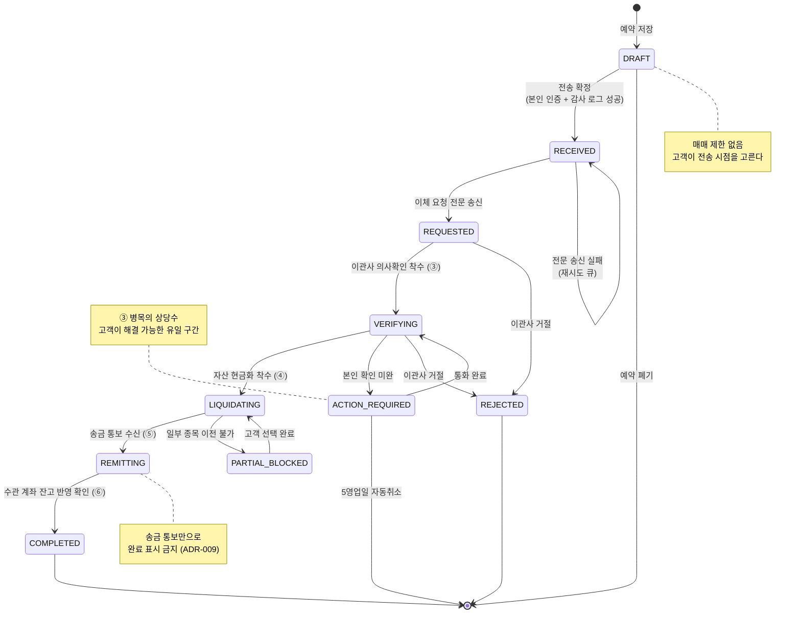
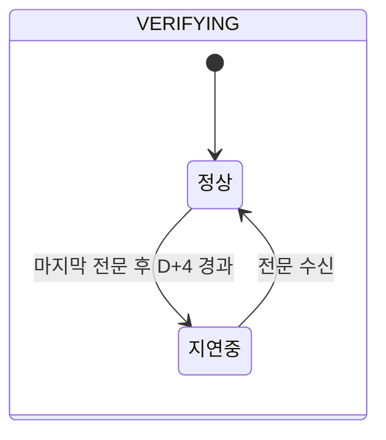
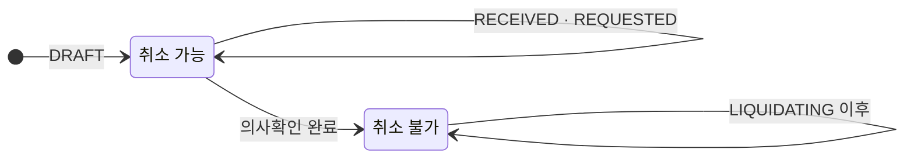
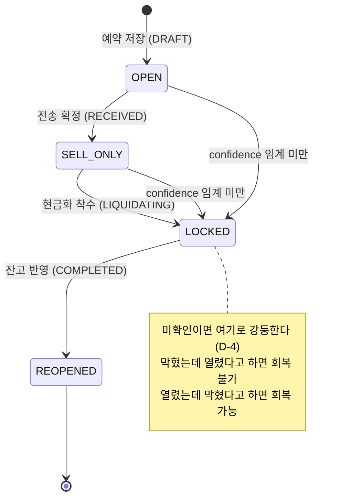
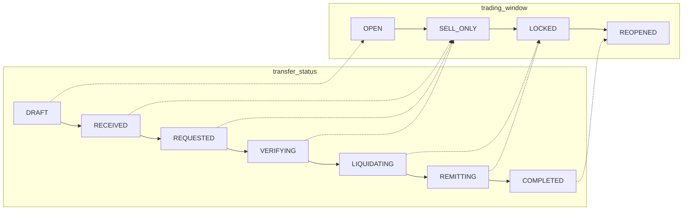
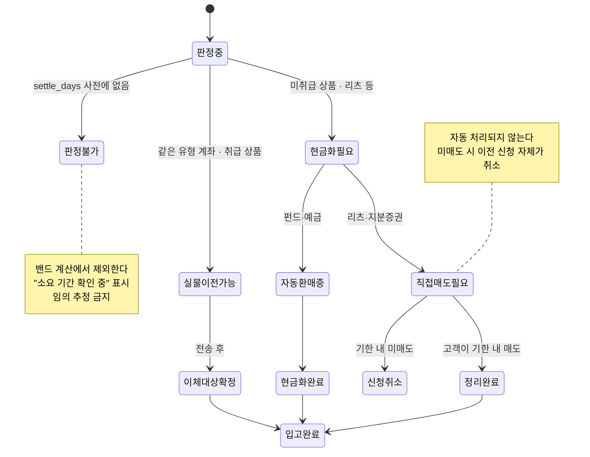

# 06. 상태 다이어그램 (State Machine)

> 출처: `02_SRS_연금플러스_v1.0.md` §6.10
> 이 문서는 **상태가 어떤 조건으로 옮겨가는가**를 정의한다. 이관 건 상태와 매매창 상태는 **연동되지만 별개**다.

---

## 1. 이관 건 상태 (`transfer_status`)

### 1.1 지연은 상태가 아니라 **플래그**다

`DELAYED`는 별도 상태로 두지 않고 **현재 상태 위에 얹는 플래그**로 처리한다.

> **왜 별도 상태로 만들지 않는가.** 지연은 단계가 뒤로 가는 것이 아니라 **같은 단계에 오래 머무는 것**이다. 상태로 만들면 "접수됨 → 지연 → 접수됨"처럼 단계가 왕복해 고객이 더 혼란스러워진다. AC F1-04 #4는 "단계는 유지하되 지연 안내와 밴드 확장"을 요구한다.

### 1.2 취소 가능 구간

| 상태 | 취소 | 근거 |
|---|:---:|---|
| `DRAFT` | 가능 | 아직 신청이 아님 |
| `RECEIVED` · `REQUESTED` | **신청 당일, 의사확인 전까지만** | 이관사 절차 |
| `VERIFYING` (확인 완료 후) | 불가 | 의사확인이 끝나면 당일이라도 철회 불가 |
| `LIQUIDATING` 이후 | 불가 | 자산이 이미 현금화 중 |

**의사확인 기한은 두 개다.** 모순이 아니라 성격이 다르다.

| 날짜 | 성격 |
|---|---|
| 이체신청일 +1영업일 | 통화가 이뤄져야 하는 **원칙 기한** |
| 신청 후 5영업일 | 재시도까지 끝난 뒤의 **자동취소 마감** |

화면은 두 날짜를 하나의 타임라인 위에 **눈금 두 개**로 표시한다.

---

## 2. 매매창 상태 (`trading_window`)

### 2.1 허용 매트릭스

| 상태 | 적용 시점 | 매수 | 매도 | 추가 납입 | 수령 신청 |
|---|---|:---:|:---:|:---:|:---:|
| `OPEN` | 예약 저장 중 | 가능 | 가능 | 가능 | 가능 |
| `SELL_ONLY` | 전송 후 ~ 현금화 착수 전 | **막힘** | 가능 | 막힘 | 막힘 |
| `LOCKED` | 현금화 진행 중 | 막힘 | 막힘 | 막힘 | 막힘 |
| `REOPENED` | 잔고 반영 후 | 가능 | 가능 | 가능 | 가능 |

**예외** — 실물이전이 불가한 리츠·지분증권 등 상장상품은 기한 내에 **직접 매도해야 한다.** 이 매도는 제한 대상이 아니며, 하지 않으면 이전 신청이 취소된다.

### 2.2 두 상태 기계의 연동

> **왜 분리했는가.** 매매 제한의 범위와 시작 시점은 **이관사가 정한다**(SRS L-4). 회사마다 다를 수 있어 우리가 실시간으로 확인할 수 없다. 이관 단계와 매매 제한을 한 필드로 묶으면 이관사 정책이 다를 때 표현할 수 없다.

---

## 3. 종목 상태 (`holding_status`)

---

## 4. 상태 전이 시 부수 효과

| 전이 | 부수 효과 |
|---|---|
| `DRAFT` → `RECEIVED` | 감사 로그 적재 (**실패 시 롤백**) · `trading_window = SELL_ONLY` · 접수 알림 |
| `REQUESTED` → `VERIFYING` | `STAGE_EVENT` 적재 · 밴드 재계산 · 의사확인 알림 (60초 이내) |
| `VERIFYING` → `LIQUIDATING` | `trading_window = LOCKED` · 자산 정리 알림 |
| `LIQUIDATING` → `REMITTING` | `remitted_at` 기록. **완료 표시하지 않음** |
| `REMITTING` → `COMPLETED` | `settled_at` 기록 · `band_hit` 적재 · `trading_window = REOPENED` · 입고 알림 (60초 이내) |
| → `ACTION_REQUIRED` | 통화 예정일 + 자동취소 마감 병기 표시 · 대표번호 노출 |
| → `REJECTED` | 사유 평이화 · 해소 절차 3단계 · 재신청 버튼 비활성 |
| → `PARTIAL_BLOCKED` | 종목별 구분 + 평가손익 · 선택지 2개 이상 (매도 지시 버튼 없음) |
| 병목 정리 | `is_critical_path` 해제 · 익영업일 09:00 밴드 재계산 |

---

## 5. 화면 표시 매핑

내부 코드는 화면에 **절대 노출되지 않는다** (U-1).

| 코드 | 화면 표시 |
|---|---|
| `DRAFT` | 예약 저장됨 |
| `RECEIVED` | 신청 접수됨 |
| `REQUESTED` | 요청 전달됨 |
| `VERIFYING` | ○○에서 확인 중 |
| `LIQUIDATING` | 자산 정리 중 |
| `REMITTING` | 송금 중 |
| `COMPLETED` | 이체 완료 |
| `ACTION_REQUIRED` | 고객 확인 필요 |
| `REJECTED` | 이체 거절 |
| `PARTIAL_BLOCKED` | 일부 이전 불가 |
| `DELAYED` (플래그) | 예정보다 늦어지고 있습니다 |

"원 사업자 처리 대기" 같은 내부 용어도 금지다. 한글 상태명과 **회사명**만 쓴다.
