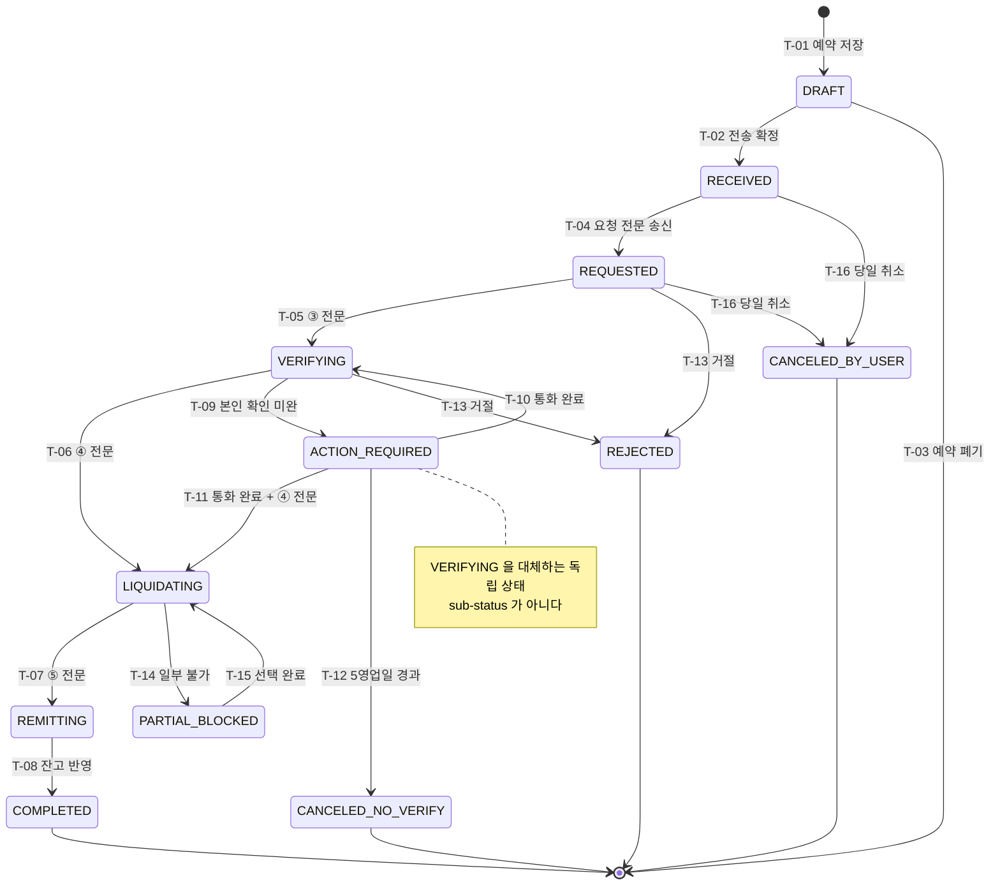

# PRD · 연금플러스

**연금계좌 이체 진행 조회 · 인출순서 시뮬레이터**

| 항목 | 내용 |
|---|---|
| **Document ID** | **PENSION-PLUS-PRD** |
| **Version** | **3.1** |
| **Status** | **Phase 0 Ready · Conditional Ready for Development** |
| **Last Updated** | **2026-08-25** |
| 서비스명 | 연금플러스 |
| 기준 서비스 | KB증권 (수관사 관점) |
| 대상 기능 | 기능1 이수관 현황판 · 기능2 인출순서 시뮬레이터 |
| 팀 | 페이스메이커 (김동건 · 유고은 · 양승연) |
| 조문 기준 | 2026.1.1 시행 개정세법 |
| 산출물 | TO-BE 프로토타입 12화면 (별첨 HTML) |

> **개발 준비도.** 이 문서는 **Phase 0 착수가 가능한 상태**입니다. Phase 1로 넘어가려면 아래 Gate가 먼저 닫혀야 합니다.
>
> | Gate | 항목 | 담당 | 미해결 시 |
> |---|---|---|---|
> | **SYS-Q3** | 상품별 결제 규정(`settle_days`) 실측 확보 | 연금시스템팀 | Phase 1 착수 불가 |
> | **SYS-Q7** | 콜센터 문의코드 `TRF-STATUS` 신설 | 콜센터 운영 | 기준선 없이 Phase 1 승격 불가 |
> | **LEGAL-Q1** | 개별 계좌 세액 계산의 투자자문업 해당 여부 | 법무 | **기능2 출시 보류** (§15.2 참조) |
>
> Gate가 아닌 확인 항목 11건은 미해결 상태에서도 정해진 축소형으로 인도됩니다.

> **v3.1에서 달라진 것.** 개발 인계 관점의 검토 지적 6건을 반영했습니다.
>
> 1. **§8.6 상태 전이 매트릭스 신설** — 상태값 목록이 아니라 어떤 이벤트로 어디로 갈 수 있는지를 명세했습니다. `ACTION_REQUIRED`가 `VERIFYING`을 대체하는지 그 위에 얹히는지도 확정했습니다.
> 2. **§8.7 예외·재시도·멱등성 매트릭스 신설** — 중복 전문, 역순 전문, 완료 후 전문, 저장 실패, 알림 실패 등 12개 케이스의 처리 규칙을 정했습니다.
> 3. **§8.8 영업일·Cut-off·시간대 정의 신설** — D+N 계산이 개발자마다 달라지지 않도록 기준을 못박았습니다.
> 4. **문서 버전 체계 정리** — 파일명과 내부 버전 불일치를 해소하고 Document ID / Version / Status / Last Updated를 분리했습니다.
> 5. **문서 상태 하향** — "Ready for Sprint"는 Gate가 남아 있는 상태에서 과한 표현이라 "Phase 0 Ready"로 정정했습니다.
> 6. **LEGAL-Q1을 Gate로 상향** — 기능2 전체의 법적 지위를 결정하는 질문이라 축소 대응으로 넘길 사안이 아니라고 판단했습니다.
>
> 추가로 인수 조건의 **판정 회색지대 1건**(p95 1.2초 목표 / 2초 실패)을 제거했습니다.

> **v3.0에서 달라진 것.** 검토 기준 6항목(목표·지표 / 스토리·AC / 기능 요구 / 비기능 / 리스크·가정 / 범위)에 맞춰 판정 가능한 형태로 정리했습니다.
>
> 1. **지표에 측정 창구를 붙였습니다.** 기준선·목표·데이터 소스·측정 주기를 한 줄에 담아, 어느 테이블 어느 필드로 재는지가 확정됐습니다.
> 2. **인수 조건을 Given-When-Then으로 다시 썼습니다.** 화면마다 사용자 스토리를 앞에 두고, AC에 SLO 수치를 박고, 실패 케이스를 2개 이상 유지했습니다.
> 3. **기능 요구사항 표에 근거와 의존성 열을 추가했습니다.** Could 이상 항목은 1스프린트 내 구현 가능 여부를 판정했습니다.
> 4. **비기능 요구사항을 임계치·모니터링·알람 조건으로 분해했습니다.** 보안 요구사항을 인증·암호화·접근통제·로그 보존으로 나눠 세웠습니다.
> 5. **ADR(§13)을 신설했습니다.** 이 제품의 구조를 결정한 9개 판단을 배경·대안·선택·결과로 기록했습니다.
> 6. **결정을 흐리던 유보 표현을 걷어냈습니다.** "확인이 필요합니다"로 끝나던 문장은 미확인 시 취할 동작을 명시한 결정문으로 바꿨고, 확인 자체는 §15 착수 전 확인 사항으로 모았습니다. 확정 사실과 추정을 구분하는 설계 원칙(§8.1 `layer`)과 금소법상 필수 고지는 그대로 둡니다.

> **v2에서 달라진 것.** v1의 핵심 질문과 중심 개념(진행 단계 가시성)은 그대로 두고, 통합본(`09_PRD_연금플러스_통합본_v1`)의 시장 근거·비기능 수치·롤아웃 계획·판정 가능한 인수 조건을 이식했습니다. 통합본이 신설한 **기능3(연금수령한도 계산기)은 독립 기능에서 제외**하고 한도 계산은 기능2의 구성요소로 유지합니다.
>
> **v2.1에서 되살린 것.** 통합본 F2-01의 **예약(`DRAFT`) + 전송 시점 고객 선택**과 **매매 잠금 계층(`trading_window`)** 을 복원했습니다. 처리 속도는 단축할 수 없지만 **언제 시작할지는 고객이 정할 수 있다** — 통제 불가 구간을 통제 가능 구간으로 바꾸는 유일한 지점이라 백로그에 둘 자리가 아니었습니다. 화면은 11개에서 12개가 됐습니다.

---

## 1. 배경

### 1.1 시장 상황

이관 처리 속도는 원 사업자와 예탁결제원 단일 인프라에 묶여 있어 어느 증권사도 이 구간을 단축할 수 없습니다. 경쟁축은 **처리 속도**가 아니라 **그 상태를 고객 눈에 보이게 하는가**로 옮겨왔습니다.

PB가 배정되는 고액 자산가는 상담사를 통해 진행 상황과 세제 설명을 받습니다. PB가 없는 일반 고객 구간에는 그 기능이 시스템화되어 있지 않습니다. 이 구간이 신규 진입 시 가장 빠르게 확장할 수 있는 영역입니다.

| 구분 | 규모 |
|---|---|
| TAM · 국내 연금계좌 전체 적립금 | 약 699.6조원 (퇴직연금 501.4조 + 연금저축 198.2조) |
| SAM · 연간 실제 이관 처리 물량 | 연 321만 건 / 금액 하한 연 9.6조원 |
| SOM · 개선 기능으로 확보·방어 가능한 물량 | 연 9,600건 / 약 5,900억원 (SAM × 0.3%, 보수적) |
| 참고 · 수령 국면 모집단 | 2025년 퇴직연금 수급 개시 60.1만 명 (일시금 83.5%) |

### 1.2 차별화 축 — 어디가 비어 있는가

| 구간 | 현재 시장 | 판정 |
|---|---|---|
| **신청 전** 판별 | 예탁결제원이 실물이전 가능 여부 사전조회를 **무료 제공** (2025.7.21~) | 기본기. 여기서는 차별화되지 않음 |
| **신청 후** 진행 가시성 | 확인된 제공 사업자 없음 | **여기가 공백** |
| 인출 시점 세액 계산 | 개인 계좌 기준으로 3층 순서·세액을 계산해 주는 곳 없음 | **공백** |
| 수령 한도 조회 | 통합연금포털은 "조회는 충족, 비교는 미제공" | 부분 공백 |

> **왜 지금인가.** 2026.1.1 개정으로 이연퇴직소득 감면 구간이 20년 초과 50%까지 3단계로 늘었습니다. 계산 복잡도가 올라갔는데, 새로 열린 50% 구간에 실제로 서 있는 사람은 연금 수령자의 **2.3%**뿐입니다(10년 이하가 82%). 제도는 열렸지만 계산해 본 사람이 없다는 뜻입니다.

### 1.3 AS-IS 실측 갭

KB증권 앱 실화면을 캡처해 확인한 갭입니다. 신청 플로우 ①~④·⑥은 정상 구간이라 손대지 않습니다.

| 지점 | 현재 화면에서 벌어지는 일 |
|---|---|
| **기능1 ⑤ 유의사항** | 해지공제·투자위험·압류 등 일반 약관 14개 조항이 팝업 전문으로만 노출. 읽다가 막혀도 물어볼 경로가 없음. 가입일이 이어지는지에 대한 안내가 어디에도 없음 |
| **기능1 ⑦ 신청내역** | 처리상태 칸에 "신청중" 한 줄. 5단계 진행 순서는 하단 "알려드립니다"에 고정 텍스트로만 존재해 내 건과 연결되지 않음. 의사확인 기한이 ⑤ 약관(+1영업일)과 ⑦ 안내문(5영업일)에 다르게 적혀 있음 |
| **기능1 · 매매 제한** | 이체 중 어떤 업무가 언제까지 막히는지 고지되지 않음 (고지율 0%) |
| **기능1 · 신청 시점** | 신청 화면에 보내기 버튼 하나뿐. 저장해 두고 나중에 보내는 경로가 없어, 잠금이 언제 시작될지를 고객이 고를 수 없음 |
| **기능1 · 종목 판정** | 어느 종목이 그대로 옮겨지고 어느 종목이 팔려 나가는지 신청 전에 알 수 없음. 특정 종목 하나가 전체를 늦추고 있어도 드러나지 않음 |
| **기능2 ② 해지없이 출금하기** | 중도인출이 "연금저축 해지" 화면 하위 섹션에만 존재. 해지 의사가 없는 고객은 도달하지 않음. 본인/타명의 분기 없음 |
| **기능2 ③ 예상 해지 금액** | 과세제외 3항목·과세대상 3항목의 금액은 이미 표시됨. 다만 병렬 나열만 하고 어느 재원부터 차감되는지 순서가 없음. 세금은 합계 3줄만 있고 어느 재원에서 나왔는지 연결되지 않음 |
| **기능2 전반** | 은행연합회 비과세 한도조회, 금감원 상속인금융거래조회 링크 전무 |

### 1.4 Problem Statement

> KB증권의 **일반 고객(PB 미배정)** 은 **연금 이전을 결심한 순간**에 **상품별 이전 가능 여부, 실시간 진행 현황, 추가 운용지시 제한 사유를 즉각 확인할 방법이 없어서** **투자손실을 최소화하며 이관을 완료하는 것**을 달성하지 못하고 있다.

---

## 2. 목표와 성공 지표

### 2.1 목표

사람(PB·콜센터)이 처리하던 확인과 설명을 화면으로 대체합니다. 일반 고객 구간의 비대면 원가를 낮추고, 대기 중 이탈과 중도 포기를 줄여 캐시백을 태우지 않고도 이관 물량을 방어합니다. **PB 고정비 + 이벤트 변동비의 이중 부담 구조를 푸는 것**이 목적입니다.

| 기능 | 한 줄 제안 |
|---|---|
| 기능1 이수관 현황판 | "지금 어디까지 왔는지, 언제 끝나는지, 그때까지 무엇이 막히는지 보여드립니다." |
| 기능2 인출순서 시뮬레이터 | "법이 정한 순서대로 어느 돈이 먼저 나가고 세금이 얼마인지 미리 계산해 드립니다." |

### 2.2 핵심 지표

| 지표 | 정의 | 기준선 | 목표 | 측정 창구 (데이터 소스) | 주기 |
|---|---|---|:---:|---|:---:|
| **북극성 — 상태 확인 문의율** | 이관 신청 후 완료 전까지 들어온 콜센터·PB 문의 건수 ÷ 이관 건수 | Phase 0 4주 관측치로 확정 (2026-09-30) | **≤ 0.3건/건** | CTI 문의코드 `TRF-STATUS` + PB 상담로그 ÷ `TRANSFER` 건수 | 주간 |
| 완료일 밴드 적중률 | 실제 완료일이 안내 밴드 안에 든 비율 | 0% (신규 지표) | ≥ 85% | `LOCK_WINDOW.end_band_from~to` vs `TRANSFER.settled_at` 배치 대조 | 주간 |
| 사전 조회 → 신청 전환율 | 유의사항·가입일 화면 조회 후 실제 이체 신청 전환 | Phase 1 4주 관측치로 확정 | ≥ 35% | GA 퍼널 `f1_02_view` → `f1_03_submit` | 주간 |
| 의사확인 자동취소율 | 5영업일 내 유선 확인 미완으로 자동 취소된 건수 ÷ 신청 건수 | Phase 0 4주 관측치로 확정 (2026-09-30) | 기준선 대비 **-50%**, 절대 상한 **≤ 5%** | `transfer_status = CANCELED_NO_VERIFY` ÷ 전체 신청 | 주간 |
| 시뮬레이션 후 한도 초과 인출률 | 시뮬레이터 사용자의 한도 초과 인출 발생률 | 미사용 코호트 동시 측정 | 미사용 대비 **-30%p**, 절대치 **≤ 10%** | `withdrawal_request.exceeds_limit` × 시뮬레이터 사용 코호트 | 월간 |
| 공제확인서 제출 건수 | 비과세 인출 관리 화면 진입 후 확인서 제출 전환 | 0% (신규 동선) | ≥ 15% | GA `f2_05_view` → 원장 `4호 확인서 등록` 플래그 전환 | 월간 |
| 예약 → 전송 전환율 | 예약 저장 건 중 실제 전송으로 확정된 비율 | 0% (신규 상태값) | ≥ 60% (하한 30%) | `transfer_status` `DRAFT` → `RECEIVED` 전이율 | 주간 |
| **가드레일 — 매매 상태 오표시 주문 거부율** | 화면이 "가능"으로 표시했는데 거부된 주문 ÷ 전체 주문 | 0% (신규 통제) | **≤ 0.1%** | 주문 거부 로그 `reason = TRANSFER_LOCK` ÷ 전체 주문 | **일간 · 실시간 알람** |
| 현황판 재방문 횟수 | 신청 1건당 현황판 조회 횟수 | Phase 1 4주 관측치로 확정 | 정상 대역 **1.5~4.0회/건** | GA `f1_04_view` ÷ `TRANSFER` 건수 | 주간 |

> **가드레일은 다른 지표와 성격이 다릅니다.** 나머지는 목표치에 가까울수록 좋지만 이것은 **넘으면 즉시 멈추는 선**입니다. 막혔는데 열렸다고 표시해 주문이 거부되면, 그 한 번으로 화면 전체의 신뢰가 무너집니다. 일간 집계가 0.1%를 넘으면 자동 알람이 울리고 해당 기능을 롤백합니다 (§10 알람 조건).

> **재방문 횟수는 낮을수록 좋은 지표가 아닙니다.** 1.5회 미만이면 화면을 못 찾고 있다는 뜻이고, 4.0회를 넘으면 화면이 답을 못 주고 있다는 뜻입니다. 대역을 벗어나면 북극성(문의율)과 교차 확인해 원인을 가릅니다.

**기준선 확정 절차** — 콜센터 문의 코드에 "이관 상태 확인" 분류가 없어 북극성과 자동취소율은 현재 관측되지 않습니다. Phase 0에서 문의코드 `TRF-STATUS`를 신설하고 **4주 관측치를 기준선으로 확정**합니다. **기준선 확정 전에는 Phase 1로 승격하지 않습니다** — 이것이 Phase 0의 유일한 승격 조건입니다 (§12).

### 2.3 성공요인(KSF) 대응

| KSF | 현재 수준 | 대응 화면 |
|---|---|---|
| 1. 이관 가능 여부 사전 판별력 | 중간 (PB 고객만) | F1-02 가입일 카드 · 이체 불가 조건 |
| 2. 통제 불가 구간의 상태 가시성 | 낮음~중간 (PB 고객만) | **F1-04 현황판 · F1-05 완료일 근거** |
| 3. PB 1인당 관리 자산 확대 | 중간 | F1-06 완료 후 동선 |
| 4. 일반 고객 구간 비대면 원가 절감 | 낮음 | F1-04 2단 기한 · 거절 사유 안내 · 기능2 전체 |
| 5. 이벤트 경쟁과 고정비 동시 부담 관리 | 위험 신호 | 캐시백 없이 방어하는 구조 전체 |

---

## 3. 범위

### 3.1 포함 (In Scope)

| 기능 | 화면 | 핵심 |
|---|---|---|
| **기능1 이수관 현황판** | F1-01 ~ F1-06 (6종) | 예약 · 잠금 구간 미리보기 · 진행 단계 · 완료일 밴드 · 예외 4종 |
| **기능2 인출순서 시뮬레이터** | F2-01 ~ F2-06 (6종) | 3층 차감 순서 · 재원별 세액 · 한도 계산 · 비과세 관리 |

**한도 계산은 기능2의 구성요소입니다.** 인출순서는 "한도 내 / 한도 초과"를 갈라야 세율이 달라지므로 한도 없이 성립하지 않습니다. 독립 기능으로 세우지 않을 뿐, 계산·게이지·산식 공개는 모두 F2-03에 포함됩니다.

### 3.2 제외 (Out of Scope)

| 항목 | 제외 사유 | 소관 |
|---|---|---|
| 연금수령한도 **단독 계산기** | 한도는 기능2 안에서 계산됨. 별도 진입점은 중복 | — |
| 개인화된 이관 가능 여부 **사전 판별 로직** | 예탁결제원이 무료 제공 중. AS-IS 분석도 ⑤ 지점을 고객센터 연결로 한정 | 예탁결제원 |
| 이관 중 매수 허용 | 화면이 아니라 정책·제도 요구 | 정책 |
| 다건 통합 현황판 | B2C 확정으로 범위 밖 | — |
| 만기 대기 vs 즉시 이전 비교 시뮬 | 중도해지금리 곡선 데이터 필요 | Phase 2 |
| 이전 후 예상 수익률 포함 회사별 비교 | 사업자 비교표 영역 | F3 |
| 거절 사유의 **개별 해소 대행·상담 배정** | 현황판은 사유 평이화와 표준 해소 절차 안내까지만 | F4 |
| 상속 서류 준비 체크리스트 | 계좌를 찾은 이후 단계 | F10 |
| 타사 계좌의 세액 계산 | 마이데이터 규격에 재원 구분 항목이 없음 | — |
| 은행연합회·금감원 **실시간 API 연동** | 외부 기관 시스템. 이 릴리스는 딥링크 수준 | Phase 2 |
| 세무 상담·자문 | 세무사법 §2 위반 소지 | — |
| 로보어드바이저 단독 연결·수익률 약속형 문구 | 중립성 훼손 (11.1 조건 참조) | — |

### 3.3 경계 판정 — In/Out이 맞닿는 4지점

In과 Out이 같은 대상을 다르게 자르는 구간입니다. 구현 중 해석이 갈리지 않도록 경계를 못박습니다.

| 지점 | In (이 릴리스에서 만든다) | Out (만들지 않는다) | 판정 기준 |
|---|---|---|---|
| **외부 기관 연결** | 은행연합회 한도조회·금감원 상속인조회로 나가는 **딥링크와 준비 서류 안내** (FR-F2-05-04, FR-F2-06-01) | 두 기관의 **API 호출·결과 수신·화면 내 렌더링** | 우리 서버가 외부에 요청을 보내면 Out |
| **실물이전 사전조회** | 예탁결제원 사전조회 화면으로 보내는 **진입점** (FR-F1-01-05, Could) | 이전 가능 여부를 **우리가 판정하는 로직** | 판정 주체가 우리면 Out |
| **거절 사유 대응** | 사유 코드의 **평이화 문구 변환**과 **표준 해소 절차 3단계 표시** (FR-F1-04-07) | 고객별 사유에 맞춘 **개별 해소 대행·상담사 배정·재신청 대리** | 고객마다 다른 답을 주면 Out |
| **사업자 비교표(F3) 경유** | "계좌 하나 더" 안내를 **F3 진입점으로 보내는 링크** (FR-F2-05-05) | F3 **화면 자체의 구축** | F3 미출시 구간에는 이 안내를 노출하지 않는다 (아래 참조) |

> **F3 의존 항목의 처리.** FR-F2-05-05는 F3 경유를 요구하는데 F3은 이 릴리스 범위 밖입니다. 특정 회사로 직접 연결하는 것은 중립성 조건 ①(§11.1)이 금지하므로, **F3 출시 전까지 "계좌 하나 더" 안내 자체를 노출하지 않습니다.** 우회 연결을 만들지 않는 쪽을 택했습니다 — 근거는 [ADR-006](#adr-006-결과-화면에-상담매매-진입점을-두지-않는다).

---

## 4. 사용자

### 4.1 핵심 페르소나 — 서동현 (41세, 적극투자형, PB 미배정) · 기능1

> "옮기는 며칠 동안 시장이 빠지면, 그건 누가 책임지죠?"

은행권 DC형 1건 + IRP 1건 보유. ETF 4종·채권형 펀드 1종·원리금보장 예금 1건 혼합. 종목별로 손익 구간이 갈려 있습니다.

**Pain** — 보유 종목의 실물이전 가능 여부는 예탁결제원에서 사전 조회할 수 있습니다. 그러나 신청부터 완료까지 수 영업일간 매매 지시가 막히는데, **그 구간이 언제 시작해서 언제 끝나는지 안내되지 않습니다.**

**대응 화면** — **F1-03 예약 · 잠금 구간 미리보기**(보내는 시점을 직접 고름, 병목 종목 정리 시 밴드 재계산), F1-04 제한 업무 카드와 해제 시점, F1-05 완료일 근거.

### 4.2 핵심 페르소나 — 오정숙 (수령 개시 예정) · 기능2

> "개시하시면 이제 못 옮기세요"를 지나가듯 들은 순간, 개시 전에 정리할 게 무엇인지 알고 싶다.

되돌릴 수 없는 선택인데 미리 알려주는 곳이 없습니다. 중요도 5·비가역.

**대응 화면** — F2-03 인출금액 입력(한도 게이지), F2-04 인출순서 결과.

### 4.3 핵심 페르소나 — 최은호 (상속·승계) · 기능2

> 승계라는 절차의 존재만 알게 되고 처리 방법이 안내되지 않아, 무엇부터 할지 정하지 못한다.

**대응 화면** — F2-06 타명의 조회. 상속인 조회는 계좌를 **찾기 이전** 단계이고, 찾은 뒤 서류를 준비하는 것은 F10 소관입니다.

### 4.4 극단 사용자 — 강태섭

> "안 된다고만 하지 말고, 뭘 하면 되는지 알려주세요."

압류가 설정된 연금저축계좌 보유. 이전 신청마다 거절되는데 사유가 코드·전문용어로만 통보됩니다.

**대응 화면** — F1-04 거절 상태에서 평이화된 사유와 해소 방법 3단계. 본격 대응은 F4 소관.

### 4.5 비활성 사용자 — 김상철

> "옮기면 세금 문다던데, 굳이 건드릴 이유가 있나요?"

이체 시 과세되지 않는다는 사실을 모른 채 방치. 절차상 막힌 것은 없고 오해 때문에 진입 자체를 하지 않습니다.

**대응 화면** — F1-01 홈에 "이체할 때 세금은 없습니다" 안내.

---

## 5. 기능 요구사항 — 기능1 이수관 현황판

### F1-01 홈 · 진행 알림

> **스토리** — PB가 배정되지 않은 일반 고객(서동현)으로서, 이관이 지금 어디까지 왔는지 확인하려고 콜센터에 전화하지 않기 위해, 앱을 열자마자 홈에서 진행 카드를 보고 싶다.

| ID | 요구사항 | 우선순위 | 근거 | 의존성 |
|---|---|:---:|---|---|
| FR-F1-01-01 | 진행 중인 이관 건이 있으면 홈에 카드로 노출한다. 현재 단계·이관사·수관 계좌·예상 완료 기간·신청일 5요소를 표시한다 | Must | AS-IS ⑦은 "신청중" 한 줄뿐 (§1.3). 북극성(문의율) 직결 | `TRANSFER` 원장 · 이관사 마스터 |
| FR-F1-01-02 | 알림 3종을 발송한다 — 접수 완료 / 의사확인 전화 예정 / 자산 정리 착수 | Must | KSF 2 상태 가시성 (§2.3). 앱 재진입 없이도 상태가 전달돼야 함 | 푸시 플랫폼 · 단계별 전문 수신 시각 |
| FR-F1-01-03 | 의사확인 알림에 걸려올 전화번호와 통화 기한을 포함한다 | Must | ③ 병목의 상당수가 "모르는 번호를 안 받아서" 발생 (§8.2) | 이관사 마스터 (대표번호) |
| FR-F1-01-04 | 연금계좌 간 이체는 이체 시점에 과세되지 않는다는 안내를 노출한다 | Should | 비활성 사용자 김상철의 진입 차단 사유가 오해 (§4.5) | 없음 (정적 문구) |
| FR-F1-01-05 | 실물이전 가능 여부 사전조회(예탁결제원) **진입점**을 제공한다 | Could (Phase 2) | 판별 로직은 범위 밖, 진입점만 제공 (§3.3) | 예탁결제원 딥링크 규격 |

> **1스프린트 판정** — Could인 FR-F1-01-05는 외부 딥링크 URL 1건 연결이므로 2인일 내 구현 가능합니다. 나머지 Must/Should는 `TRANSFER` 원장 조회와 정적 문구로 구성되어 1스프린트 안에 들어갑니다.

**Acceptance Criteria**

| # | Given | When | Then | 판정 |
|:---:|---|---|---|:---:|
| 1 | 진행 중인 이관 건이 0건이다 | 홈에 진입한다 | 진행 카드가 렌더되지 않는다 | **실패** — 값이 빈 카드가 노출되면 |
| 2 | 진행 중인 이관 건이 1건 있다 | 홈에 진입한다 | 5요소가 모두 표시되고 **첫 렌더 p95 ≤ 0.8초** | **실패** — 5요소 중 하나라도 누락되면 |
| 3 | 예상 완료일이 산출되어 있다 | 카드가 렌더된다 | 완료 예상이 **밴드(최소 폭 2영업일)** 로 표시된다 | **실패** — 단일 날짜로 표시되면 |
| 4 | 진행 카드가 노출되어 있다 | "진행 상황 자세히 보기"를 누른다 | F1-04로 이동하고 **화면 전환 p95 ≤ 1.2초** | **실패** — p95가 1.2초를 초과하면 |
| 5 | `transfer_status`가 `REQUESTED` → `VERIFYING`으로 전이한다 | 전이 전문을 수신한다 | 해당 알림이 **전이 후 60초 이내** 발송된다 | **실패** — 야간 배치로 일괄 발송되면 |
| 6 | 이관사 대표번호가 마스터에 없다 | 의사확인 알림을 발송한다 | 번호 없이 발송하지 않고 **KB증권 대표번호로 대체 안내**한다 | **실패** — 번호란이 공란으로 발송되면 |

### F1-02 유의사항 확인

> **스토리** — 이관을 결심한 고객으로서, 약관 14개 조항을 읽다 막혔을 때 어디에 물어야 할지 알기 위해, 유의사항 화면에서 회사별 문의 창구와 내 계좌 판정을 함께 보고 싶다.

| ID | 요구사항 | 우선순위 | 근거 | 의존성 |
|---|---|:---:|---|---|
| FR-F1-02-01 | 기존 약관 전문을 그대로 유지한다 | Must | 약관 고지 의무. 요약·발췌는 설명의무 위반 소지 (금소법 §19) | 기존 약관 원문 |
| FR-F1-02-02 | 화면 하단에 고객센터 연결 바를 고정한다 | Must | AS-IS ⑤는 읽다 막혀도 물어볼 경로가 없음 (§1.3) | 없음 |
| FR-F1-02-03 | 연결 시트에서 KB증권(이체 절차)과 이관사(해지공제·의사확인)를 나눠 안내한다 | Must | 두 회사 소관이 달라 한 번호로는 답이 안 나옴 | 이관사 마스터 (대표번호) |
| FR-F1-02-04 | 가입일 카드를 노출한다 — 종전 계좌 가입일 · KB 계좌 개설일 · 이체 후 적용 가입일 | Must | 가입일 승계 여부가 기능2 한도 산식을 바꿈 (§7.6) | 원장 승계 플래그 (§9.1) |
| FR-F1-02-05 | 이체 불가 조건과 내 계좌 판정을 표시한다 | Must | 신청 후 거절되면 회복 비용이 큼 | 계좌 상태 (압류·거래내역) |

> **1스프린트 판정** — 전 항목 Must이며 원장 조회 + 정적 렌더로 구성됩니다. 신규 계산 로직이 없어 1스프린트 안에 들어갑니다.

**Acceptance Criteria**

| # | Given | When | Then | 판정 |
|:---:|---|---|---|:---:|
| 1 | 원장 승계 플래그가 `true`다 | 가입일 카드를 렌더한다 | **플래그 값을 그대로** 표시하고 "5년은 다시 세지 않습니다"로 문구가 전환된다 | **실패** — 화면이 플래그와 무관하게 승계 여부를 단정하면 |
| 2 | 원장 승계 플래그가 `false`다 | 가입일 카드를 렌더한다 | "5년을 다시 세게 됩니다"로 전환되고, 미승계 기준 한도가 병기된다 | **실패** — 문구가 전환되지 않으면 |
| 3 | 원장 승계 플래그가 `null`(미설정)이다 | 가입일 카드를 렌더한다 | 승계·미승계 **양쪽 한도를 모두** 표시하고 확정 시점을 안내한다 | **실패** — 한쪽만 표시하면 |
| 4 | 계좌가 이체 가능 상태다 | 유의사항 화면에 진입한다 | 이체 불가 조건 **3종이 모두** 표시된다 — 2013.1.1~2.28 가입 / 거래내역 있는 수관 계좌 / 압류·가압류·질권 | **실패** — 3종 중 하나라도 누락되면 |
| 5 | 고객이 문의 바를 누른다 | 연결 시트가 열린다 | KB증권과 이관사 **두 번호가 역할과 함께** 구분 노출된다 | **실패** — 한 번호만 노출되면 |
| 6 | 약관 전문 로딩이 3초를 넘는다 | 화면에 진입한다 | 로딩 상태를 표시하고 **약관 미로딩 상태에서 다음 단계 진행을 차단**한다 | **실패** — 약관 없이 신청으로 넘어가지면 |

### F1-03 이체 예약 · 잠금 구간 미리보기

> **스토리** — 적극투자형 고객(서동현)으로서, 시장이 빠질 때 손이 묶이는 사고를 피하기 위해, 신청을 보내기 전에 거래가 막히는 구간을 확인하고 **언제 보낼지 내가 고르고** 싶다.

| ID | 요구사항 | 우선순위 | 근거 | 의존성 |
|---|---|:---:|---|---|
| FR-F1-03-01 | 보유 종목을 3그룹으로 판정한다 — 그대로 옮김 / 팔아야 함 / 판정 불가 | Must | AS-IS는 어느 종목이 팔려 나가는지 신청 전에 알 수 없음 (§1.3) | 마이데이터 보유종목 · `settle_days` 사전 |
| FR-F1-03-02 | 잠금 구간을 미리 보여준다 — **시작 시각 · 해제 밴드 · 영업일 수** 3요소 | Must | 잠금 고지율 0% (§1.3). 차별화 공백의 핵심 | `LOCK_WINDOW` · 영업일 캘린더 |
| FR-F1-03-03 | 결제주기가 가장 느린 종목을 병목(`is_critical_path`)으로 지목한다 | Must | 종목 하나가 전체 해제일을 정하는데 드러나지 않음 (§8.4) | `settle_days` 사전 (서버 계산) |
| FR-F1-03-04 | **예약 저장 후 전송 시점을 고객이 고른다.** 저장 중에는 어떤 매매도 제한하지 않는다 | Must | 통제 불가 구간을 통제 가능으로 바꾸는 유일한 지점 — [ADR-002](#adr-002-예약draft-상태를-두고-전송-시점을-고객이-고르게-한다) | `transfer_status = DRAFT` 신설 · 접수 규정 확인 (§15) |
| FR-F1-03-05 | 병목 종목을 전송 전에 정리하면 밴드를 재계산한다 (익영업일 09:00 이전 반영) | Must | 정리의 효과가 보이지 않으면 정리할 이유가 없음 | 야간 배치 · `LOCK_WINDOW` 재계산 |
| FR-F1-03-06 | 현금화 대상의 **확정 손익을 금액으로** 병기한다 | Must | 일수만 보여주면 매도를 권유하는 것이 됨 (자본시장법 §6⑦) | 평가손익 조회 |
| FR-F1-03-07 | 상태별 가능 여부 4항목(매수 · 매도 · 추가 납입 · 수령 신청)을 표로 표시한다 | Must | 무엇이 언제까지 막히는지 고지되지 않음 (§1.3) | `trading_window` |
| FR-F1-03-08 | 기준 소요가 없는 신규 상품은 밴드를 추정하지 않고 계산에서 제외하며 "소요 기간 확인 중"으로 표시한다 | Must | 임의 추정은 금소법 §21① 단정 금지에 저촉 | `settle_days` 사전의 결측 처리 |
| FR-F1-03-09 | 전송 버튼은 **본인 인증 후에만** 활성화하고, 누른 시각 · 인증수단 · **그때 표시된 밴드 값**을 로그로 보존한다 | Must | 전송은 전자적 의사표시. 분쟁 시 표시값이 쟁점 (§11.2) | 인증 모듈 · 감사 로그 (§10 보안) |
| FR-F1-03-10 | 마이데이터 응답이 3초를 넘으면 자산구성 기준 소요로 개략 밴드를 내고 "대략치입니다"를 병기한다 | Should | 빈 화면·무한 로딩이 이탈로 직결 | 마이데이터 API · 폴백 사다리 (§8.5) |
| FR-F1-03-11 | 영업일 캘린더에 주말 · 공휴일을 제외해 표시하고 영업일 수와 일치시킨다 | Should | 화면의 일수와 캘린더 칸이 어긋나면 밴드 신뢰가 깨짐 | 영업일 캘린더 마스터 |

> **1스프린트 판정** — Should인 FR-F1-03-10·11은 각각 폴백 분기 1개와 캘린더 마스터 조회로, 합쳐 3인일 규모입니다. Must 중 FR-F1-03-04(예약 상태 신설)가 가장 큽니다. **접수 규정 충돌 확인(§15.1 Q9)이 스프린트 시작 전에 닫히지 않으면 FR-F1-03-04를 저장 전용으로 축소해 스프린트를 지킵니다** (§14 리스크).

**Acceptance Criteria**

| # | Given | When | Then | 판정 |
|:---:|---|---|---|:---:|
| 1 | 보유 종목이 6종이고 `settle_days`가 모두 확보돼 있다 | 예약 화면에 진입한다 | 잠금 구간에 시작 시각·해제 밴드·영업일 수 **3요소가 모두** 표시되고 **첫 렌더 p95 ≤ 1.2초** | **실패** — 3요소 중 하나라도 누락되면 |
| 2 | 밴드가 산출되었다 | 해제일을 표시한다 | **밴드로만**, 최소 폭 2영업일로 표시된다 | **실패** — 단일 날짜로 표시되면 |
| 3 | `transfer_status`가 `DRAFT`다 | 매수·매도·납입·수령 신청을 각각 시도한다 | **4건 모두 정상 처리**된다 (`trading_window = OPEN`) | **실패** — 4건 중 하나라도 막히면 |
| 4 | 전송이 확정되었다 (`RECEIVED`) | 매수를 시도한다 | 매수는 거부되고 매도만 허용된다 (`SELL_ONLY`) | **실패** — 전송 후에도 매수가 열려 있으면 |
| 5 | 병목 종목을 전송 전에 매도했다 | 익영업일 09:00 배치가 돈다 | 밴드가 **당겨진 값으로 갱신**되고 갱신 시각이 표시된다 | **실패** — 09:00 이후에도 이전 밴드가 남아 있으면 |
| 6 | 병목 정리 안내를 노출한다 | 고객이 안내를 본다 | **당겨지는 영업일 수와 확정 손실 금액이 나란히** 표시된다 | **실패** — 일수만 표시하거나, "정리하세요" 같은 권유 문구가 있으면 |
| 7 | 보유 종목 중 1종이 `settle_days` 사전에 없다 | 밴드를 계산한다 | 해당 종목을 **계산에서 제외**하고 "소요 기간 확인 중"을 표시한다 | **실패** — 임의 추정치로 밴드를 내면 |
| 8 | 전송 요청 중 서버 오류(5xx)가 발생한다 | 고객이 화면을 다시 연다 | 상태가 **`DRAFT`로 보존**되고 재전송 경로가 제공된다 | **실패** — 전송 여부를 알 수 없는 중간 상태로 남으면 |
| 9 | `trading_window.confidence`가 임계 미만이다 | 상태 표를 렌더한다 | 보수적으로 **`LOCKED`(매매 불가)** 로 표시하고 대표번호를 병기한다 | **실패** — "매도 가능"으로 단정하면 |
| 10 | 전송 버튼을 누른다 | 본인 인증을 마친다 | 누른 시각·인증수단·**표시 중이던 밴드 값**이 감사 로그에 적재된다 (누락률 0%) | **실패** — 인증 없이 버튼이 활성화되거나 밴드 값이 누락되면 |
| 11 | 마이데이터 응답이 3초를 초과한다 | 밴드를 계산한다 | 자산구성 기준 소요로 개략 밴드를 내고 "대략치입니다"를 병기한다 | **실패** — 빈 화면이나 무한 로딩이 되면 |

> **이 화면만 다른 사례를 씁니다.** 나머지 화면은 연금저축보험 이체(종목 없음) 사례인데, 종목별 판정과 병목 지목은 종목이 있어야 성립합니다. 프로토타입의 F1-03은 서동현 페르소나의 IRP 이체(종목 6종 · 48,500,000원)로 구성했습니다.

### F1-04 이수관 현황판 (핵심)

> **스토리** — 이관을 신청한 고객으로서, 며칠째 "신청중" 한 줄만 보며 불안해하지 않기 위해, 지금 어느 회사가 무엇을 하고 있고 내가 할 일이 있는지 한 화면에서 알고 싶다.
>
> **스토리 (극단 사용자 강태섭)** — 압류가 걸린 계좌를 가진 고객으로서, 코드로만 통보되는 거절 사유를 이해하기 위해, 무엇이 막혔고 무엇을 하면 풀리는지 사람 말로 듣고 싶다.

| ID | 요구사항 | 우선순위 | 근거 | 의존성 |
|---|---|:---:|---|---|
| FR-F1-04-01 | 5단계 + 완료 타임라인을 표시하고 현재 단계를 강조한다 | Must | KSF 2 — 차별화 공백의 핵심 화면 (§1.2) | 단계별 전문 수신 시각 |
| FR-F1-04-02 | 확정 단계는 분단위 시각, 추정 단계는 "예상" 표시와 "보통 이 시점에는" 서술로 구분한다 | Must | ③④는 이관사 내부라 실시간 확인 불가 (§8.1). 단정 시 금소법 §21① 저촉 | `HOLDING.layer` · `confidence` |
| FR-F1-04-03 | 예상 완료일을 기간으로 표시한다. 단일 날짜 표시를 금지한다 | Must | 단일 날짜는 지킬 수 없는 약속 — [ADR-003](#adr-003-완료일을-단일-날짜가-아니라-밴드로-표시한다) | `LOCK_WINDOW` 밴드 |
| FR-F1-04-04 | 고객 확인 필요 상태에서 통화 예정일(경과)과 자동취소 마감을 하나의 화면에 나란히 표시한다 | Must | AS-IS는 두 기한이 다른 곳에 다르게 적혀 있음 (§8.3) | 의사확인 기한 정책 확정 (§15.1 Q4) |
| FR-F1-04-05 | 이관사 대표번호와 "이 번호로 전화가 옵니다"를 노출하고 고객이 직접 거는 경로를 제공한다 | Must | ③ 병목의 유일한 고객 해결 가능 구간 (§8.2) | 이관사 마스터 |
| FR-F1-04-06 | 예외 상태 4종을 처리한다 — 고객 확인 필요 / 지연 / 일부 이전 불가 / 거절 | Must | 정상 경로만 만들면 문의가 예외 경로로 몰림 | `transfer_status` 예외값 4종 |
| FR-F1-04-07 | 거절 시 사유 코드가 아니라 **평이화된 사유와 표준 해소 절차 3단계**를 안내한다 | Must | 개별 대행은 F4 소관, 표준 절차 표시까지가 이 릴리스 (§3.3) | 거절 사유 코드 ↔ 문구 매핑표 |
| FR-F1-04-08 | 일부 이전 불가 시 종목별 처리 구분과 평가손익을 함께 표시한다 | Must | 손익 없이 구분만 주면 판단 근거가 없음 | 평가손익 조회 |
| FR-F1-04-09 | **이체 중 제한되는 업무 목록과 해제 시점을 표시한다** | Must | 고지율 0% 구간 (§1.3). 가드레일 지표 직결 | `trading_window` |
| FR-F1-04-10 | 단계 상세 시트에서 처리 주체·하는 일·표준 소요를 제공한다 | Should | "왜 기다리는지"를 알면 문의가 줄어듦 (도미노 트래커 §15.2) | 단계 마스터 (정적) |
| FR-F1-04-11 | 표준 소요 대비 **p90 초과** 시 지연을 자동 감지한다 | Should (Phase 2) | 임의 "+2영업일"보다 분포 기반이 정확 (§8.5) | Phase 3 통계 축적 · 폴백 사다리 |
| FR-F1-04-12 | 자산 정리 단계에서 상품별 예상 완료일을 분해해 표시한다 | Could (Phase 2) | 병목 종목을 진행 중에도 식별하게 함 | 상품별 환매 진행 전문 |

> **1스프린트 판정** — Could인 FR-F1-04-12는 상품별 환매 진행 전문이 선행되어야 하므로 **Phase 2로 확정**했습니다 (1스프린트 내 불가). Should인 FR-F1-04-11도 통계 표본(n ≥ 30)이 없어 Phase 2입니다. **Phase 1 스프린트에는 Must 9건만 넣습니다.**

**Acceptance Criteria**

| # | Given | When | Then | 판정 |
|:---:|---|---|---|:---:|
| 1 | 같은 날 이미 현황판을 조회했다 | 같은 날 다시 진입한다 | 밴드 값이 **직전 조회와 동일**하다 (당일 캐시) | **실패** — 같은 날 값이 달라지면 |
| 2 | 현재 단계가 추정 구간(③④)이다 | 단계 설명을 렌더한다 | "보통 1~3영업일 걸립니다" 형태로 표시된다 | **실패** — "확인 중입니다" 같은 단정 표현이 쓰이면 |
| 3 | 상태가 `VERIFYING`이다 | 화면 문구를 렌더한다 | "○○에서 확인 중"으로 표시된다 | **실패** — `VERIFYING` 등 영문 enum이나 "원 사업자 처리 대기" 같은 내부 용어가 노출되면 |
| 4 | 예탁원 통보를 D+4까지 수신하지 못했다 | 현황판에 진입한다 | 단계는 유지하되 "예정보다 늦어지고 있습니다"와 **밴드 확장**이 표시된다 | **실패** — "접수됨"이 며칠째 변화 없이 그대로면 |
| 5 | 상태가 `PARTIAL_BLOCKED`다 | 화면을 렌더한다 | 선택지가 **2개 이상**, 각 선택의 결과와 함께 표시된다 | **실패** — 선택지가 1개거나, 매도 지시 버튼이 존재하면 |
| 6 | 거절 사유 코드가 압류다 | 거절 화면을 렌더한다 | "계좌에 압류가 설정되어 있습니다"처럼 **상태를 서술**하고 해소 절차 3단계를 표시한다 | **실패** — "압류 대상자" 등 사람을 규정하는 표현이 쓰이면 |
| 7 | 거절 상태이고 해소가 확인되지 않았다 | 재신청 버튼을 본다 | 버튼이 **비활성**이다 | **실패** — 해소 확인 전에 재신청이 눌리면 |
| 8 | 이체가 진행 중이다 | 제한 업무 목록을 렌더한다 | 4항목 각각에 **해제 시점이 함께** 표시된다 | **실패** — 목록만 있고 해제 시점이 없으면 |
| 9 | 현황판에 진입한다 | 화면이 렌더된다 | **첫 렌더 p95 ≤ 1.2초**, 상태 조회 API **p95 ≤ 500ms** | **실패** — p95가 임계를 넘으면 |
| 10 | `ACTION_REQUIRED` 상태다 | 화면을 렌더한다 | 통화 예정일과 자동취소 마감이 **같은 화면에 나란히** 표시된다 | **실패** — 두 날짜가 다른 화면에 흩어져 있으면 |

### F1-05 완료일 근거

> **스토리** — 완료일 안내를 받은 고객으로서, 그 날짜를 믿어도 되는지 판단하기 위해, 어떤 계산으로 그 기간이 나왔는지 근거를 열어보고 싶다.

| ID | 요구사항 | 우선순위 | 근거 | 의존성 |
|---|---|:---:|---|---|
| FR-F1-05-01 | 신청일·옮기는 자산·기준 소요·여유 기간·안내 기간을 단계별로 공개한다 | Must | 산출근거를 감추지 않는 것이 금소법 §21① 준수 수단 (§11 #10) | `LOCK_WINDOW` · `settle_days` |
| FR-F1-05-02 | 자산별 기준 소요 표를 제공하고 내 계좌에 적용된 행을 강조한다 | Must | 내 계좌가 왜 느린지가 표 한 줄로 설명됨 | `settle_days` 사전 |
| FR-F1-05-03 | 지금까지 확인된 단계와 확인 시점을 표시한다 | Must | 확정과 추정을 분리해야 단정 금지를 지킴 | 단계별 전문 수신 시각 |
| FR-F1-05-04 | 업계 안내 기준을 병기한다 | Should | 우리 밴드가 업계 대비 어디인지 비교 기준 제공 | 업계 기준선 (정적, §8.5) |
| FR-F1-05-05 | IRP와 연금저축 사이에는 현금이전만 가능하다는 점을 명시한다 | Should | 실물이전을 기대했다 현금화되면 분쟁 소지 | 계좌 유형 판정 |

> **1스프린트 판정** — 전 항목이 이미 계산된 값의 표시 로직입니다. 신규 연산이 없어 Should 포함 1스프린트 안에 들어갑니다.

**자산별 기준 소요**

| 옮기는 자산 | 기준 소요 |
|---|---:|
| 예금 · 현금성만 | 4영업일 |
| 국내 펀드 · ETF | 6영업일 |
| 해외 펀드 포함 | 9~11영업일 |
| 연금저축보험 (해지환급금 산출) | 7영업일 |
| 실물이전 (IRP → IRP) | 3영업일 |

**Acceptance Criteria**

| # | Given | When | Then | 판정 |
|:---:|---|---|---|:---:|
| 1 | 신청 후 ③ 단계 전문을 수신했다 | 근거 화면에 진입한다 | 예상 완료일이 **수신 시점 기준으로 재계산**된 값으로 표시된다 | **실패** — 신청 시점 값이 그대로 고정돼 있으면 |
| 2 | 밴드를 산출한다 | 안내 기간을 표시한다 | 최소 폭이 **2영업일** 이상이다 | **실패** — 폭이 0~1영업일이면 |
| 3 | 보유 상품이 `settle_days` 사전에 없다 | 밴드를 계산한다 | 해당 상품을 계산에서 제외하고 "소요 기간 확인 중"을 표시한다 | **실패** — 임의 추정치를 넣으면 |
| 4 | 마이데이터 응답이 3초를 초과한다 | 근거 화면에 진입한다 | 기준 소요 기반 개략 밴드와 "대략치입니다"가 병기된다 | **실패** — 빈 화면이나 무한 로딩이 되면 |
| 5 | 내 계좌 자산이 해외 펀드를 포함한다 | 기준 소요 표를 렌더한다 | "해외 펀드 포함 9~11영업일" 행이 **강조**되어 표시된다 | **실패** — 어느 행이 적용됐는지 표시되지 않으면 |

### F1-06 이체 완료

> **스토리** — 이관을 마친 고객으로서, 현금으로 들어온 돈이 놀지 않게 하기 위해, 완료 화면에서 무엇이 얼마나 들어왔고 다음에 무엇을 할 수 있는지 바로 알고 싶다.

| ID | 요구사항 | 우선순위 | 근거 | 의존성 |
|---|---|:---:|---|---|
| FR-F1-06-01 | **완료는 수관 계좌 잔고 반영을 확인한 뒤에만 표시한다.** 그 전까지는 송금 중으로 둔다 | Must | 송금 통보와 실제 입고 사이에 반나절~1일 간극 — [ADR-009](#adr-009-완료-판정-기준을-송금-통보가-아니라-잔고-반영으로-둔다) | 잔고 반영 확인 배치 |
| FR-F1-06-02 | 이관사 송금 시각과 잔고 반영 시각을 각각 표시한다 | Must | 두 시각이 다르다는 사실 자체가 문의를 줄임 | 전문 수신 시각 · 원장 반영 시각 |
| FR-F1-06-03 | 잔고 반영 시 60초 이내 알림을 발송한다 (야간·주말 무관) | Must | 잠금 해제 시점을 즉시 알아야 매매 재개 가능 | 푸시 플랫폼 (야간 발송 정책 확인 §15.2 Q3) |
| FR-F1-06-04 | 가입일 확정 카드를 표시한다 | Must | 이 값이 기능2 한도 산식의 입력이 됨 (§7.1) | 원장 승계 플래그 확정값 |
| FR-F1-06-05 | 예상 소요 대비 실제 소요를 표시하고 밴드 적중 여부를 로그에 적재한다 | Should | 밴드 적중률(핵심 지표) 측정 창구 그 자체 (§2.2) | 적중률 집계 배치 |
| FR-F1-06-06 | 완료 직후 수익률 랭킹과 인출순서 미리 보기로 연결한다 (2탭 이내) | Should | KSF 3 — 예수금이 놀면 이관 방어의 의미가 반감 | 상품 랭킹 화면 |

> **1스프린트 판정** — Should인 FR-F1-06-05는 적중률 집계 배치가 §2.2 측정 창구와 동일 산출물이라 중복 개발이 없습니다. FR-F1-06-06은 기존 랭킹 화면으로의 링크라 1인일입니다. 전 항목 1스프린트 가능합니다.

**Acceptance Criteria**

| # | Given | When | Then | 판정 |
|:---:|---|---|---|:---:|
| 1 | 이관사 송금 통보만 수신했고 잔고는 미반영이다 | 현황판을 렌더한다 | 상태가 **`REMITTING`(송금 중)** 으로 유지된다 | **실패** — "완료"로 표시되면 |
| 2 | 잔고 반영이 확인된다 | 원장에 반영된다 | **60초 이내** 알림이 발송된다 (야간·주말 무관) | **실패** — 익일 배치로 밀리면 |
| 3 | 입고 금액이 예상 이전 금액과 10% 이상 차이난다 | 완료 화면을 렌더한다 | 완료는 표시하되 "금액을 확인해 주세요"와 대표번호를 병기한다 | **실패** — 차이를 표시하지 않고 완료만 띄우면 |
| 4 | 완료 화면에서 수익률 랭킹으로 이동한다 | 랭킹을 렌더한다 | **과거 수익률 정렬 사실만** 표시된다 | **실패** — 전망·추천 문구가 붙으면 (근퇴법 시행령 §34 4호) |
| 5 | 가입일 확정 카드가 표시된다 | 기능2 F2-03에 진입한다 | 한도 산식이 **같은 가입일 값**을 사용한다 | **실패** — 두 화면의 가입일이 다르면 |
| 6 | 밴드가 8/31~9/2였고 실제 완료가 9/1이다 | 완료 처리한다 | 적중 `true`로 로그에 적재되고 주간 집계에 반영된다 | **실패** — 적중 여부가 적재되지 않으면 |

---

## 6. 기능 요구사항 — 기능2 인출순서 시뮬레이터

### F2-01 출금관리

> **스토리** — 해지할 생각은 없고 일부만 필요한 고객으로서, 계좌를 깨지 않고 돈을 빼는 방법을 찾기 위해, 출금 메뉴에서 그 선택지를 바로 발견하고 싶다.

| ID | 요구사항 | 우선순위 | 근거 | 의존성 |
|---|---|:---:|---|---|
| FR-F2-01-01 | 출금관리에 "연금 외 수령" 메뉴를 신설한다. 연금수령·해지와 같은 층에 둔다 | Must | AS-IS는 해지 화면 하위에만 있어 해지 의사가 없는 고객이 도달 못 함 (§1.3) | 메뉴 구조 변경 |
| FR-F2-01-02 | 메뉴마다 한 줄 설명을 붙여 목적 차이를 진입 전에 구분한다 | Must | 세 메뉴의 결과가 비가역적으로 다름 | 없음 (정적 문구) |
| FR-F2-01-03 | 평가금액·적용 가입일·올해 기인출액·올해 남은 금액을 진입 전에 노출한다 | Must | 진입 전에 판단이 끝나면 잘못된 메뉴 진입이 줄어듦 | 원장 4개 필드 (§9.1) |

> **1스프린트 판정** — 메뉴 1개 신설과 원장 4필드 조회입니다. 신규 계산이 없어 1스프린트 안에 들어갑니다.

**Acceptance Criteria**

| # | Given | When | Then | 판정 |
|:---:|---|---|---|:---:|
| 1 | 출금관리 화면에 진입한다 | 메뉴 목록을 렌더한다 | "연금 외 수령"이 연금수령·해지와 **같은 층(형제 노드)** 에 있다 | **실패** — 해지 메뉴의 하위 섹션에 있으면 |
| 2 | 계좌 원장이 정상 조회된다 | 메뉴 화면을 렌더한다 | 평가금액·적용 가입일·올해 기인출액·올해 남은 금액 **4개가 모두** 표시된다 | **실패** — 하나라도 누락되면 |
| 3 | 적용 가입일이 원장에 없다 | 메뉴 화면을 렌더한다 | 해당 값을 "확인 중"으로 표시하고 **한도 관련 수치를 노출하지 않는다** | **실패** — 가입일 없이 한도를 계산해 표시하면 |
| 4 | 메뉴 화면에 진입한다 | 화면이 렌더된다 | **첫 렌더 p95 ≤ 1초** | **실패** — p95가 1초를 넘으면 |

### F2-02 수령 대상 선택

> **스토리** — 상속을 앞둔 고객(최은호)으로서, 내 계좌가 아닌 계좌를 어떻게 다뤄야 하는지 알기 위해, 처음 갈림길에서 본인 건과 타인 명의 건을 구분해 들어가고 싶다.

| ID | 요구사항 | 우선순위 | 근거 | 의존성 |
|---|---|:---:|---|---|
| FR-F2-02-01 | 본인 계좌 / 타인 명의(상속 등) 2분기를 제공한다 | Must | AS-IS에 본인/타명의 분기가 없음 (§1.3). 두 갈래는 법적 절차가 완전히 다름 | 없음 |
| FR-F2-02-02 | 각 갈래에 무슨 일이 일어나는지 한 줄로 미리 설명한다 | Must | 잘못 들어가면 되돌아 나오는 비용이 큼 | 없음 (정적 문구) |
| FR-F2-02-03 | 승계를 마친 계좌는 본인 계좌 목록에서 선택하도록 안내한다 | Should | 승계 완료 계좌는 법적으로 본인 계좌 (§7.7) | 승계 완료 플래그 |

> **1스프린트 판정** — 화면 분기 1개와 정적 문구입니다. 0.5스프린트 규모로 1스프린트 안에 들어갑니다.

**Acceptance Criteria**

| # | Given | When | Then | 판정 |
|:---:|---|---|---|:---:|
| 1 | 수령 대상 선택 화면에 있다 | "타 명의 · 상속"을 선택한다 | **F2-06이라는 별도 화면**으로 분기한다 | **실패** — 같은 화면에서 조건 분기만 하면 |
| 2 | 두 갈래가 표시된다 | 화면을 렌더한다 | 각 갈래에 결과를 설명하는 한 줄이 붙어 있다 | **실패** — 라벨만 있고 설명이 없으면 |
| 3 | 배우자 승계가 완료된 계좌를 보유한다 | 수령 대상 선택 화면에 진입한다 | 해당 계좌가 **본인 계좌 목록**에 나타난다 | **실패** — 타 명의 목록에 있거나 어느 쪽에도 없으면 |

### F2-03 인출금액 입력

> **스토리** — 수령 개시를 앞둔 고객(오정숙)으로서, 되돌릴 수 없는 선택을 하기 전에 손해를 확인하기 위해, 인출액을 넣어보며 한도에 걸리는지와 세금이 얼마나 달라지는지 보고 싶다.

| ID | 요구사항 | 우선순위 | 근거 | 의존성 |
|---|---|:---:|---|---|
| FR-F2-03-01 | 연금수령한도 게이지를 표시한다. 이미 인출 / 이번 인출 / 한도 초과를 색으로 구분한다 | Must | 한도 초과 여부가 세율을 3배 가르는 분기점 (§7.4) | 시행령 §40의2 산식 · 평가액 |
| FR-F2-03-02 | **한도 초과 입력을 차단하지 않는다.** 초과분의 세액을 미리 보여준다 | Must | 차단하면 이유를 못 배움. 보여주는 것이 목적 — [ADR-005](#adr-005-한도-초과-입력을-차단하지-않고-세액을-보여준다) | 세액 계산 엔진 |
| FR-F2-03-03 | 계산 근거를 토글로 공개한다 — 산식·대입값·기준일·적용 가입일·근거 법령 | Must | 산출근거 공개가 금소법 §21① 준수 수단 (§11 #10) | 산식 메타데이터 |
| FR-F2-03-04 | 인출 사유 선택이 한도 소진 여부와 세율에 실제로 반영된다 | Must | 부득이한 사유는 한도에 포함되지 않음 (시행령 §40의2 ③3호 후단) | 사유 코드 ↔ 세율 매핑 |
| FR-F2-03-05 | 주택 구입·전세보증금은 세법상 부득이한 사유가 **아님**을 경고한다 | Must | 근퇴법 인출 사유와 소득세법 부득이한 사유가 다름 (§7.8). 오인 시 세액 오안내 | 사유 코드 매핑 |
| FR-F2-03-06 | 요양 3~6개월 구간은 세법 요건은 충족해도 IRP 중도인출이 불가할 수 있음을 안내한다 | Must | 소득세법 3개월 / 근퇴법 6개월 불일치 구간 (§7.8) | 계좌 유형 판정 |
| FR-F2-03-07 | 해외이주 + 퇴직금 유입 계좌는 입금일부터 3년 경과 여부를 표시한다 | Must | 시행령 §40의2 ③ 단서 — 3년 미경과 시 연금수령 불인정 | 이연퇴직소득 입금일 (§15.1 Q5) |
| FR-F2-03-08 | 인출 금액이 계좌 평가금액을 초과하면 계산을 진행하지 않고 최대 인출 가능액을 안내한다 | Must | 불가능한 값으로 낸 계산 결과는 오안내 | 평가액 조회 |
| FR-F2-03-09 | 타사 계좌는 세액을 표시하지 않고 사유를 안내한다. 한도는 계산한다 | Must | 마이데이터에 재원 구분 항목이 없음 (§9.3) — [ADR-004](#adr-004-타사-계좌는-한도만-계산하고-세액은-표시하지-않는다) | 마이데이터 API |
| FR-F2-03-10 | `모의계산 결과` 라벨을 스크롤과 무관하게 고정 노출한다 | Must | 금소법 §21① 단정 금지. 확정 세액으로 오인 방지 | 없음 (UI 고정) |
| FR-F2-03-11 | 연금수령연차 11년 이상은 산식을 적용하지 않고 "한도 없음"으로 처리한다 | Must | 시행령 §40의2 ③3호 — 분모가 0 이하가 됨 | 연차 계산 |
| FR-F2-03-12 | 승계 계좌는 항목별 기준일이 다르다는 표를 근거 안에 제공한다 | Should | 세 조문이 각각 다른 날을 기준으로 함 (§7.7) | 승계 계좌 플래그 |

> **1스프린트 판정** — Should인 FR-F2-03-12는 §7.7 표를 근거 토글에 넣는 정적 작업(1인일)입니다. Must 중 FR-F2-03-07은 **이연퇴직소득 입금일 확보(§15.1 Q5)가 선행**되어야 합니다. 미확보 시 해외이주 사유를 선택 목록에서 제외하고 고객센터 안내로 대체해 스프린트를 지킵니다.

**Acceptance Criteria**

| # | Given | When | Then | 판정 |
|:---:|---|---|---|:---:|
| 1 | 인출 사유로 "의료 목적"을 선택한다 | 한도 게이지를 렌더한다 | "이번 인출은 한도에 들어가지 않습니다"로 전환된다 | **실패** — 한도가 소진되는 것으로 계산되면 |
| 2 | 인출 사유로 **"주택 구입"** 을 선택한다 | 한도 게이지를 렌더한다 | 한도가 **정상 소진**되고 일반 세율이 적용된다 | **실패** — 부득이한 사유와 같은 전환이 일어나면 (세금 혜택으로 오인) |
| 3 | 인출 사유로 "요양 3~6개월"을 선택하고 계좌가 IRP다 | 결과를 렌더한다 | 세법 요건 충족 표시와 **"IRP 중도인출 자체가 불가할 수 있습니다"** 안내가 함께 표시된다 | **실패** — 세법 요건 충족만 표시되면 |
| 4 | 평가금액이 18,500,000원이다 | 20,000,000원을 입력한다 | 계산을 중단하고 "최대 인출 가능액: 18,500,000원"을 즉시 안내한다 | **실패** — 계산 결과가 산출되면 |
| 5 | 타사 계좌를 선택했다 | 인출액을 입력한다 | 한도는 계산되고 **세액란은 공란** + 사유가 표시된다 | **실패** — 추정 세액이 표시되면 |
| 6 | 결과가 화면 아래로 길게 이어진다 | 하단까지 스크롤한다 | `모의계산 결과` 라벨이 **계속 보인다** | **실패** — 스크롤 시 라벨이 사라지면 |
| 7 | 연금수령연차가 12년차다 | 한도를 계산한다 | 산식을 적용하지 않고 "한도 없음"으로 표시한다 | **실패** — 산식이 적용되면 (분모 음수) |
| 8 | 평가액 84,000,000원 · 연차 3년 · 기인출 2,000,000원이다 | 한도를 계산한다 | 한도 **12,600,000원**, 남은 금액 **10,600,000원**이 산출되고 **응답 p95 ≤ 1초** | **실패** — 검증값과 1원이라도 다르면 |
| 9 | 인출액을 변경한다 | 값을 입력한다 | 게이지·세액이 **즉시(≤ 300ms) 재계산**된다 | **실패** — 별도 조회 버튼을 눌러야 갱신되면 |

### F2-04 인출순서 결과 (핵심)

> **스토리** — 인출을 앞둔 고객으로서, 어느 돈이 먼저 나가고 세금이 왜 그만큼인지 납득하기 위해, 법이 정한 순서대로 3층이 깎이는 과정을 금액으로 보고 싶다.

| ID | 요구사항 | 우선순위 | 근거 | 의존성 |
|---|---|:---:|---|---|
| FR-F2-04-01 | 재원 3층을 법정 순서대로 표시하고 층별 소진을 시각화한다 | Must | AS-IS는 병렬 나열만 하고 차감 순서가 없음 (§1.3) | 재원별 잔액 (§9.1) |
| FR-F2-04-02 | "법이 정한 순서"임을 화면 머리에 먼저 명시한다 (자문이 아님) | Must | 자문으로 오인되면 자본시장법 §6⑦ 저촉 | 없음 (정적 문구) |
| FR-F2-04-03 | 1층을 4개 버킷으로 분해한다. 4번째는 확인서 제출 전까지 잠금 상태로 노출한다 | Must | §40의3 ② 단서 — 확인되는 날부터 과세제외 (§7.2) | 4호 확인서 등록 플래그 |
| FR-F2-04-04 | 층 안에서 한도 내 / 한도 초과분을 분리하고 각각 다른 세율을 적용한다 | Must | 한도 초과분은 연금외수령 (시행령 §40의2 ⑤) | 한도 계산 결과 (F2-03) |
| FR-F2-04-05 | 한도 초과로 잃은 감면액을 별도로 표시한다 | Must | "서두르면 세금 3배"를 금액으로 보여주는 지점 (§7.4) | 세액 계산 엔진 |
| FR-F2-04-06 | 연 1,500만원 경계 게이지를 표시하고 판정에서 제외되는 항목을 명시한다 | Must | 분모에 3층 재원만 들어감 (§7.5). 오산 시 종합과세 오안내 | 재원별 연간 누적 인출액 |
| FR-F2-04-07 | 금액은 비율이 아니라 원(₩) 확정 금액으로 우선 표기한다 | Must | 비율은 체감이 안 되고 오차 누적이 안 보임 | 없음 |
| FR-F2-04-08 | 세율은 지방소득세를 포함한 실효세율로 표기한다 | Must | 원문 세율(5%)과 실납(5.5%)이 달라 오안내 소지 (§7.3) | 세율 설정 파일 |
| FR-F2-04-09 | 세금 내역 3줄(연금·기타·퇴직소득세)을 유지하되 순서표와 연결한다 | Must | AS-IS의 합계 3줄이 재원과 연결되지 않음 (§1.3) | 재원 ↔ 세목 매핑 |
| FR-F2-04-10 | 계산에 쓴 값과 "실제 원천징수 세액과 다를 수 있습니다"를 병기한다 | Must | 금소법 §19 설명의무 · §44② 입증책임 대응 (§11.2) | 없음 (정적 문구) |
| FR-F2-04-11 | 세율표 최종 갱신일을 병기하고, **시행일 기준 D+30을 초과하면** 계산 결과 노출을 차단한다 | Must | 2026.1.1 개정 미반영 자료가 시중에 다수 (§7.3) — [ADR-008](#adr-008-세율을-코드가-아니라-시행일이-붙은-설정으로-관리한다) | 세율 설정 파일 메타 |
| FR-F2-04-12 | **결과 화면에 1:1 상담 진입점과 매수·매도 버튼을 두지 않는다** | Must | 유상 자문·투자일임 적용배제 요건 (§11 #3, #4) — [ADR-006](#adr-006-결과-화면에-상담매매-진입점을-두지-않는다) | 코드 리뷰 체크리스트 |

> **1스프린트 판정** — 전 항목 Must이며 계산 엔진 1식으로 묶입니다. FR-F2-04-06(1,500만원 판정)은 **라목 잔액 분리 관리 여부(§15.1 Q2)** 에 걸립니다. 미확인 시 라목이 섞인 계좌를 판정 대상에서 제외하고 주의 문구로 대체합니다 (§14 리스크).

**Acceptance Criteria**

| # | Given | When | Then | 판정 |
|:---:|---|---|---|:---:|
| 1 | 인출액 15,000,000원이 입력돼 있다 | 인출액을 변경한다 | 층별 소진·세율·세액이 **≤ 300ms 내 재계산**된다 | **실패** — 조회 버튼을 눌러야 갱신되면 |
| 2 | 4호 확인서가 미제출 상태다 | 확인서를 제출 상태로 바꾼다 | 4번째 버킷이 **3층 → 1층으로 이동**하고 세액이 줄어든다 | **실패** — 버킷 위치나 세액에 변화가 없으면 |
| 3 | 검증 계좌(평가액 84,000,000원 · 57세 · 3년차 · 기인출 2,000,000원 · 이연퇴직소득 28,000,000원 @6.6%)다 | 15,000,000원 인출을 계산한다 | 일반 **465,960원**, 확인서 제출 후 **355,080원**, 부득이한 사유 **378,840원** | **실패** — 세 값 중 하나라도 다르면 |
| 4 | 결과 화면이 렌더된다 | 화면 전체를 훑는다 | 실제 출금·매수·매도로 넘어가는 버튼이 **하나도 없다** | **실패** — 실행 버튼이 하나라도 있으면 (투자일임 §6⑧) |
| 5 | 결과 화면이 렌더된다 | 화면 전체를 훑는다 | 1:1 상담 진입점이 **없다** | **실패** — 상담 진입점이 있으면 (적용배제 요건 상실) |
| 6 | 세율표 최종 갱신일이 시행일 + 31일이다 | 결과 화면에 진입한다 | 계산 결과 대신 **"세율 정보 업데이트 중입니다"** 가 표시된다 | **실패** — 낡은 세율로 계산 결과를 내면 |
| 7 | 계산 결과가 표시된다 | 세율 표기를 확인한다 | 지방소득세 포함 **실효세율(5.5% 등)** 로 표기된다 | **실패** — 원문 세율(5%)로 표기되면 |
| 8 | 인출액이 한도를 480만원 초과한다 | 결과를 렌더한다 | 초과분에 16.5%가 적용되고 **잃은 감면액이 별도 금액으로** 표시된다 | **실패** — 초과분이 한도 내와 같은 세율로 계산되면 |

### F2-05 비과세 인출 관리

> **스토리** — 세금을 덜 내고 싶은 고객으로서, 서류 한 장으로 세금이 줄어든다는 걸 알기 위해, 확인서를 내면 얼마가 달라지는지 제출 전후를 나란히 보고 싶다.

| ID | 요구사항 | 우선순위 | 근거 | 의존성 |
|---|---|:---:|---|---|
| FR-F2-05-01 | 현재 비과세로 인출 가능한 금액과 4개 버킷 내역을 표시한다 | Must | 1층 4버킷 중 4호만 조건부 (§7.2) | 재원별 잔액 · 확인서 플래그 |
| FR-F2-05-02 | 「연금보험료 등 소득·세액 공제확인서」 제출 동선을 제공한다 | Must | 이 동선이 F2-05의 존재 이유. 공제확인서 제출 건수(핵심 지표) 직결 | 홈택스 딥링크 · 서류 등록 창구 |
| FR-F2-05-03 | 제출 전/후 비과세 인출 가능액을 나란히 비교한다 | Must | 차액을 금액으로 봐야 제출 유인이 생김 | 세액 계산 엔진 |
| FR-F2-05-04 | 은행연합회 연금저축 세액공제 한도 조회·변경으로 **딥링크 연결**한다 | Should | API 연동은 범위 밖, 링크는 In (§3.3) | 은행연합회 딥링크 URL |
| FR-F2-05-05 | 추가 계좌 안내는 특정 회사 링크가 아니라 **사업자 비교표(F3) 경유**로 한다 | Should (F3 출시 전 보류) | 중립성 조건 ① (§11.1). F3 미출시 구간에는 안내 자체를 비노출 (§3.3) | **F3 출시** |

> **1스프린트 판정** — Should인 FR-F2-05-05는 **F3에 의존하므로 이 스프린트에서 구현하지 않습니다.** 나머지는 계산 엔진 재사용 + 딥링크 2건으로 1스프린트 안에 들어갑니다.

**Acceptance Criteria**

| # | Given | When | Then | 판정 |
|:---:|---|---|---|:---:|
| 1 | 4호 확인서가 미제출 상태다 | 비과세 인출 관리 화면에 진입한다 | 제출 **전 금액과 후 금액이 나란히** 표시되고 차액이 강조된다 | **실패** — 한쪽만 표시되면 |
| 2 | 확인서 제출 동선을 연다 | 안내를 읽는다 | 홈택스에서 **고객이 직접 발급·제출**하는 절차로만 안내된다 | **실패** — 세무 전문가 알선 링크가 있으면 (세무사법 §2조의2) |
| 3 | F3이 아직 출시되지 않았다 | 비과세 인출 관리 화면에 진입한다 | "계좌 하나 더" 안내가 **노출되지 않는다** | **실패** — 특정 증권사로 직접 연결되는 링크가 노출되면 |
| 4 | 1층 4개 버킷 잔액이 조회된다 | 화면을 렌더한다 | 버킷 4개가 각각 금액과 함께 표시되고 4호는 잠금 상태로 구분된다 | **실패** — 4개를 합산해 한 줄로만 표시하면 |

### F2-06 타명의 조회

> **스토리** — 상속인(최은호)으로서, 어디에 무엇이 있는지 몰라 첫 발을 못 떼는 상황을 벗어나기 위해, 피상속인 계좌를 찾는 공식 창구와 준비 서류를 안내받고 싶다.

| ID | 요구사항 | 우선순위 | 근거 | 의존성 |
|---|---|:---:|---|---|
| FR-F2-06-01 | 금융감독원 상속인 금융거래조회 서비스로 **딥링크 연결**하고 필요 서류를 안내한다 | Must | AS-IS에 링크 전무 (§1.3). 계좌를 찾는 것이 모든 절차의 선행 단계 | 금감원 딥링크 URL |
| FR-F2-06-02 | 조회 결과에 자사 계좌가 있는 경우의 상담 경로를 제공한다 | Must | 이 화면은 계산 결과 화면이 아니므로 상담 배치가 허용됨 (§11 #3) | 고객센터 채널 |
| FR-F2-06-03 | 이 조회로 확인되지 않는 기관 목록을 명시한다 (국민연금·근로복지공단 등) | Should | 조회 결과를 전부로 오인하면 자산을 놓침 | 기관 목록 (정적) |
| FR-F2-06-04 | 배우자 승계 시 항목별 기준을 표로 제시한다 | Should | 세 조문이 각각 다른 날을 기준으로 함 (§7.7) | 없음 (정적 표) |

> **1스프린트 판정** — 딥링크 1건과 정적 안내로 구성됩니다. 전 항목 1스프린트 안에 들어갑니다.

**Acceptance Criteria**

| # | Given | When | Then | 판정 |
|:---:|---|---|---|:---:|
| 1 | 타 명의 · 상속 화면에 진입한다 | 화면을 렌더한다 | 금감원 조회 딥링크와 **필요 서류 목록이 함께** 표시된다 | **실패** — 링크만 있고 서류 안내가 없으면 |
| 2 | 조회로 확인되지 않는 기관이 있다 | 안내를 렌더한다 | 국민연금·근로복지공단 등 **기관 목록이 링크와 함께 병기**된다 | **실패** — 링크만 있고 목록이 없으면 |
| 3 | 이 화면은 계산 결과 화면이 아니다 | 고객센터 연결을 배치한다 | 정상 배치된다 (§11 #3 적용 대상 아님) | **실패** — 세액 계산 결과가 이 화면에 함께 표시되면 |
| 4 | 배우자 승계 계좌를 조회한다 | 기준 표를 렌더한다 | 계좌 가입일 / 5년 요건 / 연금수령연차 / 개시 연령 **4항목의 기준이 각각** 표시된다 | **실패** — 4항목을 하나의 기준일로 뭉뚱그리면 |

---

## 7. 계산 규칙

모든 산식은 법정 산식이며 재량 판단이 아닙니다.

### 7.1 연금수령한도 (소득세법 시행령 §40의2)

```
연금수령한도 = 과세기간 개시일 현재 평가액 ÷ (11 − 연금수령연차) × 120 / 100
잔여 한도   = 연금수령한도 − 당해 과세기간 기인출액
```

| 규칙 | 내용 | 근거 |
|---|---|---|
| 기준일 | 과세기간 개시일(1월 1일). 개시 신청 과세기간에는 신청일 현재 평가액 | 시행령 §40의2 ③3호 |
| 11년차 이상 | 산식을 적용하지 않는다. 한도 없음 | 시행령 §40의2 ③3호 |
| 2013.3.1 이전 가입 | 6년차부터 기산. 2013.3.1 전 DB형 가입자가 퇴직해 전액 이체된 계좌 포함 | 시행령 §40의2 ④1호 |
| 승계 계좌 | 사망일 당시 피상속인의 연금수령연차를 승계 | 시행령 §40의2 ④2호 |
| 한도 초과분 | 연금외수령으로 본다 | 시행령 §40의2 ⑤ |
| **부득이한 인출** | **§20의2①에 따라 인출한 금액은 '인출한 금액'에 포함하지 않는다** | 시행령 §40의2 ③3호 후단 |

**연금 인정 3요건** — ① 55세 이후 수령 개시 신청 ② 가입일부터 5년 경과(이연퇴직소득이 있는 계좌는 면제) ③ 한도 이내 인출.

| 연차 | 계산 (평가액 6,000만원 기준) | 한도 |
|:---:|---|---:|
| 1년차 | 6,000 ÷ (11−1) × 120% | 720만원 |
| 5년차 | 6,000 ÷ (11−5) × 120% | 1,200만원 |
| 10년차 | 6,000 ÷ (11−10) × 120% | 7,200만원 (사실상 전액) |
| 11년차~ | 산식 미적용 | 한도 없음 |

> 분모가 매년 줄고 평가액도 매년 바뀌므로 이 계산은 매년 다시 해야 합니다.

> **연차는 두 종류입니다.** 한도용 연차는 최초로 연금수령할 수 있는 날이 속하는 과세기간부터 실제 수령 여부와 무관하게 누적됩니다. 감면율용 연차는 실제로 수령한 연차만 카운트합니다. **원장 필드를 분리해 관리해야 합니다.**

### 7.2 인출순서 (소득세법 시행령 §40의3 ①)

인출은 아래 순서로 강제됩니다. 고객도 금융회사도 바꿀 수 없습니다.

| 순위 | 재원 | 세금 |
|---|---|---|
| 1 | 과세제외금액 | 비과세 |
| 2 | 이연퇴직소득 | 퇴직소득세 × 70 / 60 / 50%. 한도 초과 시 100% |
| 3 | 세액공제분 · 운용수익 등 | 연금소득세 3.3~5.5%. 한도 초과 시 기타소득세 16.5% |

**1층 내부 순서 — 시행령 §40의3 ②**

```
① 당해 과세기간에 납입한 연금보험료
② 당해 과세기간에 납입한 전환금액 (ISA 만기 전환분 등)
③ 세액공제 한도를 초과하여 납입한 금액
④ 세액공제를 받지 않은 금액
```

> **④는 원장에 상시 존재하는 잔액이 아닙니다.** §40의3 ② 단서는 "제4호는 제201조의10에 따라 **확인되는 금액만** 해당하며, **확인되는 날부터** 과세제외금액으로 본다"고 정합니다. 「연금보험료 등 소득·세액 공제확인서」를 제출하기 전에는 3층에 포함되어 과세됩니다. **원장 구조 변경 없이 구현 가능하며, 확인서 제출을 유도하는 것이 F2-05의 핵심 동선입니다.**

| 규칙 | 내용 | 근거 |
|---|---|---|
| 한도 초과 시 인출 순서 | 연금수령분이 먼저 인출되고 그다음 연금외수령분이 인출된다 | 시행령 §40의3 ③ |
| 운용손실 | 원금이 인출순서의 **역순**으로 차감된 후의 금액을 기준으로 한다 | 시행령 §40의3 ⑤ |

### 7.3 세율

화면에는 지방소득세를 포함한 실효세율을 표시합니다.

| 구분 | 소득세법 원문 | 화면 표시 |
|---|---|---|
| 연금소득세 (55~69세) | 100분의 5 | **5.5%** |
| 연금소득세 (70~79세) | 100분의 4 | **4.4%** |
| 연금소득세 (80세 이상) | 100분의 3 | **3.3%** |
| 종신형 수령 | 100분의 3 (2026.1.1 시행) | **3.3%** |
| 기타소득세 | 100분의 15 | **16.5%** |
| 1,500만원 초과 선택세율 | 100분의 15 | **16.5%** |

**이연퇴직소득 감면율 (소득세법 §129①5호의3)**

| 실제 수령연차 | 감면 후 부담 | 시행 |
|---|:---:|---|
| 10년 이하 | 퇴직소득세의 **70%** | 기존 |
| 10년 초과 ~ 20년 이하 | **60%** | 2020.1.1 |
| **20년 초과** | **50%** | **2026.1.1 신설** |

> **종신형 세율은 2025.12.23 개정으로 4% → 3%로 인하되어 2026.1.1 시행됐습니다.** 시중 자료와 타사 계산기 대부분이 아직 4.4%로 표기하고 있어 외부 자료와 대조하면 오히려 틀린 결과가 나옵니다. 검증 기준은 **국세청 홈택스 모의계산**으로 잡습니다.

### 7.4 계산 예시

계좌 평가액 6,000만원 · 62세 · 1년차 · 과세제외 300만원 + 세액공제분 등 5,700만원(이연퇴직소득 없음). 올해 한도 = 6,000 ÷ (11−1) × 120% = **720만원**.

| 인출액 | 계산 | 세액 |
|---|---|---:|
| 720만원 (한도 내) | 과세제외 300만원 → 0원, 잔여 420만원 × 5.5% | **23.1만원** |
| 1,200만원 (480만원 초과) | 한도 내 23.1만원 + 초과 480만원 × 16.5% (79.2만원) | **102.3만원** |
| 같은 480만원을 내년 한도 내에서 | 480만원 × 5.5% | **26.4만원** |

**서두르면 세금이 3배입니다.** 이 차이를 인출 전에 보여주는 것이 기능2의 존재 이유입니다.

> 위 계산은 단순화한 예시입니다. 실제로는 인출 시점마다 그 인출분에 세율이 적용됩니다. 화면에는 "예시"임을 반드시 명시합니다.

**프로토타입 검증값** — 별첨 프로토타입의 기본 계좌(평가액 84,000,000원 · 만 57세 · 연차 3년 · 올해 기인출 2,000,000원 · 이연퇴직소득 28,000,000원 @ 퇴직소득세 6.6%) 기준입니다. 인수 조건 검증 시 이 값과 대조합니다.

| 조건 | 결과 |
|---|---:|
| 연금수령한도 | 12,600,000원 (= 84,000,000 ÷ 8 × 1.2) |
| 올해 남은 금액 | 10,600,000원 |
| 가입일 **미승계** 시 한도 (1년차) | 10,080,000원 — 차이 2,520,000원 |
| 15,000,000원 인출 · 일반 | 세금 465,960원 |
| 15,000,000원 인출 · **공제확인서 제출 후** | 세금 355,080원 — 110,880원 감소 |
| 15,000,000원 인출 · **부득이한 사유** | 세금 378,840원 — 한도 미소진 |

### 7.5 연 1,500만원 판정

판정의 분모에 들어가는 것은 **3층 재원에서 나온 연금소득뿐**입니다.

| 구분 | 판정 포함 여부 |
|---|---|
| 이연퇴직소득을 연금수령하는 연금소득 | 제외 (금액 무관 분리과세) |
| 의료목적·부득이한 사유 인출 | 제외 (금액 무관 분리과세) |
| 위 둘을 제외한 연금소득 | **포함** — 합계 1,500만원 이하면 분리과세 |

초과 시 종합과세 결정세액과 (해당 연금소득 × 16.5% + 나머지 종합세액) 중 납세자가 유리한 쪽을 선택합니다.

> **라목 주의.** 인출순서를 정하는 §40의3 ①3호는 재원을 "나목부터 **라목**까지"로 묶지만, 부득이한 사유 인출을 금액 무관 분리과세하는 §14③9호 나목은 "나목 및 **다목**"만 적습니다. 라목(이체·입금되어 이연된 소득)이 섞인 계좌에서 부득이한 사유로 인출할 때 두 조문의 적용 범위가 어긋날 수 있습니다.
>
> **결정.** 라목 잔액이 원장에서 분리 관리되는 계좌만 1,500만원 판정을 수행합니다. 분리되지 않은 계좌는 **게이지를 숨기고 "이 계좌는 재원 구성상 종합과세 판정을 제공하지 않습니다"를 표시**합니다. 어긋날 수 있는 판정을 내는 것보다 내지 않는 쪽이 안전합니다. 원장 분리 여부는 §15.1 Q2에서 닫습니다.

### 7.6 가입일 승계

| 규칙 | 내용 | 근거 |
|---|---|---|
| 원칙 | 연금계좌의 가입일 등은 **이체받은 계좌**를 기준으로 적용한다 | 시행령 §40의4 ④ |
| 단서 | 연금계좌가 **새로 설정되어 전액이 이체되는 경우**에는 이체되기 전의 연금계좌를 기준으로 **할 수 있다** | 시행령 §40의4 ④ 단서 |

KB증권은 "거래내역이 없는 신연금저축계좌로만 이체 가능"이라는 제약을 두고 있어 단서 요건이 **항상 충족**됩니다.

**결정.** 단서는 임의규정("할 수 있다")이므로 화면이 승계 여부를 판단하지 않습니다. **원장 승계 플래그를 단일 진실 원천으로 삼아 그 값을 그대로 표시**하고, 플래그가 미설정(`null`)인 계좌에 한해 적용·미적용 양쪽 한도를 모두 계산해 병렬 표시합니다 (AC F1-02 #1~3). 원장의 채택 기준은 §15.1 Q1에서 닫습니다.

### 7.7 배우자 승계 계좌

세 조문이 각각 다른 것을 정합니다. 상충이 아니라 역할 분담입니다.

| 무엇을 | 어느 날 · 누구 기준 | 근거 |
|---|---|---|
| 계좌 가입일 | 승계하는 날 | 시행령 §100의2 ① 본문 |
| 5년 경과 요건 | 피상속인이 처음 가입한 날 | 시행령 §100의2 ① 단서 |
| 연금수령연차 | 사망일 당시 피상속인의 연차 | 시행령 §40의2 ④2호 |
| 연금 개시 연령 | 승계받은 배우자 본인 나이 (만 55세) | 소득세법 §44 ②, 시행령 §100의2 ① |

### 7.8 부득이한 사유

| 사유 | 세법상 부득이한 사유 | 한도 소진 | 적용 세율 |
|---|:---:|:---:|---|
| 일반 중도인출 | ✕ | O | 일반 |
| **주택 구입 · 전세보증금** | **✕** | **O** | 일반 |
| 요양 3~6개월 | O | ✕ | 연금소득세 |
| 요양 6개월 이상 | O | ✕ | 연금소득세 |
| 의료 목적 | O | ✕ | 연금소득세 |
| 천재지변 · 재난 · 파산 | O | ✕ | 연금소득세 |
| 해외이주 (조건부) | O | ✕ | 연금소득세 |

- **주택 구입 · 전세보증금** — 무주택자에 한해 근퇴법 시행령 §18의 중도인출 사유이므로 인출은 가능합니다. 그러나 소득세법 §20의2의 부득이한 사유는 **아닙니다**. 한도도 그대로 소진되고 세율도 일반 인출과 같습니다. 근퇴법 §25에 따른 개인형퇴직연금(상시 10명 미만 사업장 특례) 가입자는 하나의 사업에 근로하는 동안 중도인출이 1회로 한정됩니다.
- **요양 3~6개월** — 소득세법은 3개월 이상, 근퇴법은 6개월 이상입니다. 이 구간은 세법 요건은 충족해도 IRP 중도인출 자체가 불가할 수 있습니다.
- **해외이주 + 이연퇴직소득** — 그 퇴직소득을 연금계좌에 **입금한 날부터 3년 이후** 해외이주하는 경우에 한정하여 연금수령으로 봅니다 (시행령 §40의2 ③ 단서).
- **증빙** — 사유가 확인된 날부터 **6개월 이내**에 연금계좌취급자에게 제출해야 합니다.

---

## 8. 상태 설계

### 8.1 진행 단계

| # | 내부 단계명 | 처리 주체 | 트리거 | 표준 소요 | 데이터 |
|---|---|---|---|---|---|
| ① | 신청 접수 | KB증권 (수관사) | 이체신청서 등록 | 신청 당일~다음 영업일 | 확정 (자체 원장) |
| ② | 이체 요청 전달 | 중계망 | 이체요청 전문 송신 | D+0~1영업일 | 확정 (전문 송신) |
| ③ | 이관사 의사확인 | 이관사 | 의사확인 통화·녹취 | D+1영업일 (업계 표준) | **추정** |
| ④ | 자산 현금화 | 이관사 | 환매·해지, 보험은 해지환급금 산출 | 상품별 상이 | **추정** |
| ⑤ | 송금·입금 반영 | 이관사 → KB증권 | 송금내역 통보 | D+1영업일 | 확정 (전문 수신) |
| ⑥ | 이체 완료 | KB증권 | 수관 계좌 잔고 반영 확인 | 송금 후 반나절~1일 | 확정 |

> ③④는 이관사 내부 처리라 수관사가 실시간으로 볼 수 없습니다. 받을 수 있는 것은 전문 수신 시점뿐입니다. **현황판은 확정 상태와 추정 상태가 섞인 화면이며, 추정 구간을 단정하면 규제 문제가 됩니다.**

### 8.2 상태값

| 계층 | 필드 | 값 |
|---|---|---|
| 건 | `transfer_status` | `DRAFT` · `RECEIVED` · `REQUESTED` · `VERIFYING` · `LIQUIDATING` · `REMITTING` · `COMPLETED` |
| 건 (예외) | `transfer_status` | `ACTION_REQUIRED` · `REJECTED` · `PARTIAL_BLOCKED` |
| 건 (종결) | `transfer_status` | `CANCELED_BY_USER` · `CANCELED_NO_VERIFY` |
| 건 (플래그) | `delayed_flag` | 상태가 아니라 현재 상태 위에 얹는 플래그 (§8.6.1) |
| 종목 | `holding_status` | 실물이전 가능 / 현금화 필요 / 판정 불가 3그룹 + 현금화 진행 상태 + `is_critical_path` |
| 매매 | `trading_window` | `OPEN` · `SELL_ONLY` · `LOCKED` · `REOPENED` |

**고객 화면 표시**

| 코드 | 화면 표시 |
|---|---|
| `DRAFT` | 예약 저장됨 |
| `RECEIVED` | 신청 접수됨 |
| `REQUESTED` | 요청 전달됨 |
| `VERIFYING` | ○○에서 확인 중 |
| `LIQUIDATING` | 자산 정리 중 |
| `REMITTING` | 송금 중 |
| `COMPLETED` | 이체 완료 |
| `ACTION_REQUIRED` | 고객 확인 필요 |
| `REJECTED` | 이체 거절 |
| `PARTIAL_BLOCKED` | 일부 이전 불가 |
| `DELAYED` | 지연 |

> 화면 문구에 내부 상태 코드(영문 enum)를 노출하지 않습니다. 한글 상태명과 회사명만 씁니다.
>
> `ACTION_REQUIRED`가 실질적으로 가장 중요합니다. ③ 병목의 상당 부분이 "고객이 이관사 전화를 모르는 번호로 받지 않아서" 발생하는데, 이것은 고객이 해결할 수 있는 유일한 구간입니다.

### 8.3 의사확인 기한

AS-IS에는 기한이 두 곳에 다르게 적혀 있습니다. 모순이 아니라 성격이 다른 두 날짜입니다.

| 날짜 | 성격 | 출처 |
|---|---|---|
| 이체신청일 +1영업일 | 통화가 이뤄져야 하는 **원칙 기한** | AS-IS ⑤ 약관, 업계 표준 절차 |
| 신청 후 5영업일 | 재시도까지 끝난 뒤의 **자동취소 마감** | AS-IS ⑦ 안내문 |

화면은 두 날짜를 하나의 타임라인 위에 눈금 두 개로 표시합니다.

### 8.4 매매 잠금 구간

```
잠금 구간 = 전송 확정 시각 ~ 수관 계좌 입고 반영 시각
안내 밴드 = 위 구간을 최소 2영업일 폭으로 표시 (단일 날짜 금지)
```

| 상태 | 언제 | 매수 | 매도 | 추가 납입 | 수령 신청 |
|---|---|:---:|:---:|:---:|:---:|
| `OPEN` | 예약 저장 중 (아직 안 보냄) | 가능 | 가능 | 가능 | 가능 |
| `SELL_ONLY` | 전송 후 ~ 현금화 착수 전 | 막힘 | 가능 | 막힘 | 막힘 |
| `LOCKED` | 현금화 진행 중 | 막힘 | 막힘 | 막힘 | 막힘 |
| `REOPENED` | 수관 계좌 잔고 반영 후 | 가능 | 가능 | 가능 | 가능 |

> **미확인이면 `LOCKED`로 둡니다.** 막혔는데 열렸다고 표시하면 주문이 거부되고, 열렸는데 막혔다고 표시하면 기회를 놓칩니다. 둘 다 나쁘지만 앞쪽이 회복 불가능합니다. 가드레일 지표(≤ 0.1%)가 이 선을 지킵니다.

**병목 종목** — 결제주기가 가장 느린 종목 하나가 전체 해제일을 정합니다. 서버가 `is_critical_path`로 지목하고, 그 종목을 전송 전에 정리하면 밴드를 다시 계산합니다. 안내에는 **당겨지는 영업일 수와 확정되는 손실 금액을 함께** 놓습니다. 한쪽만 보여주면 판단을 유도하는 것이 됩니다.

**프로토타입 검증값** — 서동현 IRP 이체(6종 · 48,500,000원 · 2026-08-18(화) 15:00 전송) 기준입니다.

| 조건 | 기준 소요 | 해제 밴드 |
|---|:---:|---|
| 병목 그대로 (해외 펀드 포함) | 9~11영업일 | 8월 31일(월) ~ 9월 2일(수) |
| 병목 정리 후 (남은 자산 기준) | 6~8영업일 | 8월 26일(수) ~ 8월 28일(금) |

당겨지는 폭 **3영업일**, 그 대가로 확정되는 손실 **420,000원**. 화면은 이 둘을 나란히 놓고 고객이 정하게 합니다.

### 8.5 예상 완료일 산정

```
예상 완료일 = 신청일 + 기준 소요(자산 구성) + 단계별 조정
안내 기간   = 예상 완료일 ~ 예상 완료일 + 2영업일 (최소 폭 2영업일)
```

**회사별 밴드 산출 규격 (Phase 3)**

| 항목 | 값 |
|---|---|
| 집계 창 | 최근 180일 (rolling) |
| 표본 요건 | n ≥ 30 |
| 밴드 | p50 ~ p80 영업일 |
| 최소 폭 | 2영업일 |
| 이상치 | 90영업일 초과 건 제외 |
| 지연 감지 | p90 초과 |
| 재계산 | 매주 월요일, 조문·절차 변경 시 즉시 |

**폴백 사다리** — 위에서부터 조건이 맞는 첫 단계를 사용합니다.

| 단계 | 산출 근거 | 조건 |
|---|---|---|
| ① | 이관사 × 자산구성 실측 | n ≥ 30 |
| ② | 이관사 전체 실측 | n ≥ 30 |
| ③ | 자산구성 기준 소요 | 항상 사용 가능 |
| ④ | 업계 안내 기준 (최대 9영업일) | 최후 폴백 |

> 평균이 아니라 백분위를 씁니다. 분쟁·압류 건이 분포의 꼬리를 길게 만들어 평균은 체감보다 늦게 나옵니다. 중앙값에서 시작해 p80으로 닫으면 다섯 건 중 네 건이 그 안에서 끝납니다. 지연 임계도 같은 분포에서 p90으로 뽑아 임의로 정한 "+2영업일"을 대체합니다.

**업계 안내 기준선**

| 구간 | 기준 |
|---|---|
| 의사확인 통화 | 신청일 +1영업일 |
| 송금·이체결과 확인 | 신청일 +4~5영업일 |
| 완료까지 | 최대 9영업일 |
| 실물이전 경로 | 최소 3영업일 |

---

### 8.6 상태 전이 매트릭스

§8.2가 상태값 **목록**이라면 이 절은 상태 **머신**이다. 허용되지 않은 전이는 시도 자체가 오류다.

#### 8.6.1 `ACTION_REQUIRED`의 성격 — 결정

> **`ACTION_REQUIRED`는 `VERIFYING`을 대체하는 독립 상태다.** `VERIFYING` 위에 얹히는 sub-status가 아니다.
>
> 이유는 두 가지다. 첫째, 고객이 해야 할 일이 있는 구간과 기다리기만 하면 되는 구간은 **화면이 완전히 다르다**(통화 예정일·자동취소 마감·대표번호 표시). 둘째, sub-status로 두면 `transfer_status`만 보고 알림 발송 여부를 판정할 수 없다.
>
> **`DELAYED`는 반대다.** 이것만 상태가 아니라 **플래그**(`delayed_flag`)로 둔다. 지연은 단계가 뒤로 가는 것이 아니라 같은 단계에 오래 머무는 것이므로, 상태로 만들면 "접수됨 → 지연 → 접수됨"처럼 단계가 왕복해 고객이 더 혼란스러워진다.

#### 8.6.2 정상 전이

| # | 현재 상태 | Event | 다음 상태 | 허용 | 실패 시 |
|:---:|---|---|---|:---:|---|
| T-01 | (없음) | 예약 저장 | `DRAFT` | O | 저장 실패 응답. 상태 미생성 |
| T-02 | `DRAFT` | 사용자 전송 확정 (인증 + 감사 로그 성공) | `RECEIVED` | O | **`DRAFT` 유지** |
| T-03 | `DRAFT` | 사용자 예약 폐기 | (삭제) | O | `DRAFT` 유지 |
| T-04 | `RECEIVED` | 이체 요청 전문 송신 성공 | `REQUESTED` | O | `RECEIVED` 유지 + 재시도 큐 |
| T-05 | `REQUESTED` | 이관사 확인 착수 전문(③) 수신 | `VERIFYING` | O | `REQUESTED` 유지 + 지연 감지 |
| T-06 | `VERIFYING` | 현금화 착수 전문(④) 수신 | `LIQUIDATING` | O | `VERIFYING` 유지 + 지연 감지 |
| T-07 | `LIQUIDATING` | 송금 통보 전문(⑤) 수신 | `REMITTING` | O | `LIQUIDATING` 유지 |
| T-08 | `REMITTING` | 수관 계좌 잔고 반영 확인 | `COMPLETED` | O | **`REMITTING` 유지** |

#### 8.6.3 예외 전이

| # | 현재 상태 | Event | 다음 상태 | 허용 | 실패 시 |
|:---:|---|---|---|:---:|---|
| T-09 | `VERIFYING` | 본인 확인 미완 (통화 실패·미응답) | `ACTION_REQUIRED` | O | `VERIFYING` 유지 |
| T-10 | `ACTION_REQUIRED` | 통화 완료 · 현금화 미착수 | `VERIFYING` | O | `ACTION_REQUIRED` 유지 |
| T-11 | `ACTION_REQUIRED` | 통화 완료 · 현금화 착수 전문 동시 수신 | `LIQUIDATING` | **조건부** | ④ 전문 유효성 확인 후 처리 |
| T-12 | `ACTION_REQUIRED` | 신청 후 5영업일 경과 | `CANCELED_NO_VERIFY` | O | 배치 재시도 (최대 3회) |
| T-13 | `REQUESTED` · `VERIFYING` | 이관사 거절 통보 | `REJECTED` | O | 현재 상태 유지 + 수동 확인 큐 |
| T-14 | `LIQUIDATING` | 일부 종목 이전 불가 판정 | `PARTIAL_BLOCKED` | O | `LIQUIDATING` 유지 |
| T-15 | `PARTIAL_BLOCKED` | 고객 선택 완료 | `LIQUIDATING` | O | `PARTIAL_BLOCKED` 유지 |
| T-16 | `RECEIVED` · `REQUESTED` | 당일 · 의사확인 전 취소 요청 | `CANCELED_BY_USER` | **조건부** | 의사확인 완료 시 거부 |

**T-11의 조건** — `ACTION_REQUIRED`에서 `VERIFYING`을 건너뛰고 `LIQUIDATING`으로 직행하는 것은 **④ 전문이 도착한 경우에만** 허용한다. 통화 완료 사실만으로는 `VERIFYING`으로 돌아간다.

**T-16의 조건** — 취소는 `submitted_at`이 **당일**이고 ③ 전문이 **미수신**일 때만 허용한다. 두 조건 중 하나라도 깨지면 거부한다.

#### 8.6.4 금지 전이

아래는 **어떤 이벤트로도 발생해서는 안 되는 전이**다. 발생하면 데이터 정합성 오류로 간주하고 알람을 발생시킨다.

| 금지 전이 | 이유 |
|---|---|
| `COMPLETED` → 임의 상태 | 종결 상태. 되돌리지 않는다 |
| `REJECTED` → `VERIFYING` 이후 | 거절 건은 재신청으로만 재개 (신규 `transfer_id`) |
| `CANCELED_*` → 임의 상태 | 종결 상태 |
| `DRAFT` → `REQUESTED` 이상 | `RECEIVED`를 건너뛸 수 없다 (감사 로그 누락) |
| 역방향 전이 (단계 번호 감소) | §8.7 E-02로 처리 |

#### 8.6.5 상태 전이도



---

### 8.7 예외 · 재시도 · 멱등성 매트릭스

전문 기반 시스템에서는 **정상 흐름보다 이상 흐름이 사고를 만든다.** 아래 12개 케이스의 처리 규칙을 고정한다.

#### 8.7.1 멱등성 원칙

| # | 원칙 |
|:---:|---|
| ID-1 | 모든 수신 전문은 `(transfer_id, stage_no, 이관사 전문 일련번호)`를 **멱등 키**로 사용한다 |
| ID-2 | 동일 멱등 키의 전문은 **최초 1회만 처리**하고 이후는 수신 사실만 로그에 남긴다 |
| ID-3 | 상태 전이는 §8.6 매트릭스에 정의된 것만 수행한다. 정의 밖 전이는 **거부하고 알람**한다 |
| ID-4 | 재시도는 **지수 백오프**(1분 → 5분 → 15분, 최대 3회)로 하고 초과 시 수동 확인 큐로 보낸다 |
| ID-5 | 고객 요청 API(전송·취소)는 **클라이언트 생성 요청 ID**를 멱등 키로 받는다 |

#### 8.7.2 예외 처리 매트릭스

| # | 케이스 | 감지 방법 | 처리 | 고객 화면 |
|:---:|---|---|---|---|
| **E-01** | 동일 전문 2회 수신 | 멱등 키 중복 | **무시.** 수신 로그만 적재. 상태 변경 없음 | 변화 없음 |
| **E-02** | 역순 전문 수신 (④ 후 ③ 도착) | `stage_no` < 현재 단계 | **무시.** 단계를 되돌리지 않는다. 정합성 로그 적재 | 변화 없음 |
| **E-03** | `COMPLETED` 후 이전 단계 전문 수신 | 종결 상태 + 전문 도착 | **무시 + 알람.** 이관사 시스템 이상 가능성 | 변화 없음 |
| **E-04** | 단계 전문 누락 (③ 없이 ④ 도착) | 단계 건너뜀 | **④를 처리하되 ③을 추정 완료로 보정.** `layer = ESTIMATED`로 기록 | 정상 진행 |
| **E-05** | 전문 수신 후 DB 저장 실패 | 트랜잭션 롤백 | **전문을 미처리로 남기고 재시도 큐 적재** (ID-4). 3회 초과 시 수동 큐 | 이전 상태 유지 |
| **E-06** | DB 저장 성공 후 알림 발송 실패 | 발송 API 오류 | **상태는 유지.** 알림만 재시도. 3회 실패 시 인앱 알림으로 대체 | 상태 정상 · 알림 지연 |
| **E-07** | 알림 발송 성공 응답 후 실제 미전달 | 전달 확인 콜백 미수신 | 재발송하지 않는다. **앱 진입 시 현황판이 최신 상태를 보여주므로 화면이 최종 진실** | 화면에서 확인 가능 |
| **E-08** | 앱 오프라인 중 상태 변경 | — | 서버 상태가 진실. 앱 재접속 시 **전체 상태를 다시 받아 렌더** (증분 동기화 없음) | 재접속 시 최신 상태 |
| **E-09** | 계산 중 세율 설정 조회 실패 | 조회 타임아웃·오류 | **계산 중단.** 캐시된 세율을 쓰지 않는다 | "세율 정보 업데이트 중입니다" |
| **E-10** | `settle_days` 일부 종목만 누락 | 사전 조회 결과 `null` | **해당 종목만 밴드 계산에서 제외.** 나머지로 산출하고 제외 사실 표시 | "소요 기간 확인 중" 병기 |
| **E-11** | `TRANSFER`와 `TRADING_WINDOW` 불일치 | 정합성 배치 (시간별) | **`TRADING_WINDOW`를 `LOCKED`로 강등**하고 알람. 보수적 처리 우선 | 매매 불가 표시 |
| **E-12** | 전송 요청 중복 도착 (더블 클릭·재시도) | 클라이언트 요청 ID 중복 | **최초 1회만 처리.** 이후는 최초 결과를 그대로 반환 (ID-5) | 동일 결과 |

#### 8.7.3 재처리 및 정합성 보정

| # | 요구사항 |
|:---:|---|
| RC-1 | 수신한 모든 전문은 **원문 그대로 보존**한다. 처리 실패 건도 폐기하지 않는다 |
| RC-2 | 전문 원문을 기준으로 **상태를 재생(replay)** 할 수 있어야 한다 |
| RC-3 | 시간별 정합성 배치가 `TRANSFER` ↔ `TRADING_WINDOW` ↔ `STAGE_EVENT` 3자 일치를 검사한다 |
| RC-4 | 불일치 발견 시 **보수적 방향으로 보정**한다 (매매는 `LOCKED`, 완료는 미완료로) |
| RC-5 | 보정 이력은 별도 로그로 남기고 운영 대시보드에 노출한다 |

> **왜 보수적 방향인가.** 매매가 막혔는데 열렸다고 표시하면 주문이 거부되어 회복 불가능하다. 완료가 아닌데 완료로 표시하면 "돈이 없다"는 최악의 문의가 발생한다. 두 오류 모두 **낙관적 방향이 더 나쁘다.**

---

### 8.8 영업일 · Cut-off · 시간대 정의

D+1, 4~5영업일, 9영업일, 밴드가 문서 전반에 쓰인다. **완료일 밴드 적중률이 핵심 지표**이므로 계산 기준을 개발자마다 다르게 해석할 여지를 남기지 않는다.

| # | 항목 | 정의 |
|:---:|---|---|
| BD-1 | **기준 시간대** | `Asia/Seoul` (KST, UTC+9). 서머타임 없음 |
| BD-2 | **영업일 정의** | **대한민국 증권시장 영업일.** 토·일, 법정공휴일, 임시공휴일, 한국거래소 휴장일 제외 |
| BD-3 | **캘린더 원천** | 한국거래소 휴장일 Calendar Master. 연 1회 정기 반영 + 임시공휴일 지정 시 즉시 반영 |
| BD-4 | **신청 Cut-off** | **15:30 KST.** 이후 접수 건은 다음 영업일 D+0으로 간주 |
| BD-5 | **D+0 정의** | 신청이 접수된 영업일. Cut-off 이전 접수 = 접수 당일, 이후 = 다음 영업일 |
| BD-6 | **D+N 계산** | D+0에서 영업일 N개를 더한 날. **비영업일은 카운트하지 않는다** |
| BD-7 | **밴드 폭 계산** | `end_band_to − end_band_from`을 **영업일 수**로 계산한다. 달력일이 아니다 |
| BD-8 | **최소 폭** | 2영업일. 계산 결과가 이보다 좁으면 종료일을 밀어 확보한다 |
| BD-9 | **배치 기준 시각** | 밴드 재계산 배치는 **영업일 09:00 KST**에 기동한다. 비영업일에는 실행하지 않는다 |
| BD-10 | **자동취소 마감** | 신청 후 **5영업일**. BD-6 기준으로 계산한다 |
| BD-11 | **의사확인 원칙 기한** | 신청일 **+1영업일** |
| BD-12 | **알림 발송 시간** | 상태 전이 알림은 **시간대 제약 없이** 60초 이내 발송한다 (야간·주말 무관) |

**계산 예시** — 2026-08-18(화) 16:00 신청

| 단계 | 계산 | 결과 |
|---|---|---|
| Cut-off 판정 | 16:00 > 15:30 → 다음 영업일 | D+0 = 2026-08-19(수) |
| D+5 | 8/19 기준 영업일 5개 (8/20·21·24·25·26) | 2026-08-26(수) |
| 주말 처리 | 8/22·23은 토·일 → 카운트 제외 | — |
| 최소 폭 2영업일 | 8/26 ~ 8/28(금) | 밴드 = 8/26 ~ 8/28 |

> **Cut-off를 15:30으로 잡은 이유.** 증권시장 정규장 마감(15:30) 기준이다. 마감 이후 접수 건은 당일 처리 여지가 없으므로 다음 영업일로 미룬다. 이 값은 이관사 접수 정책과 다를 수 있어 **§15.1 확인 항목**에 포함한다.

---

## 9. 데이터 요구사항

### 9.1 원장에서 확보해야 할 필드

| 필드 | 사용 기능 | 비고 |
|---|---|---|
| 계좌 개설일 / 승계 가입일 | 기능2 | 2013.3.1 판정. **§40의4 ④ 중 어느 기준을 채택했는지 플래그 필요** |
| DB 이체 유래 여부 | 기능2 | §40의2 ④1호 괄호 — 2013.3.1 전 DB 가입자 퇴직 이체분은 6년차 기산 |
| 연금개시 신청일 | 기능2 | 한도용 연차 기산 |
| 최초 실제 수령일 | 기능2 | 감면율용 연차 기산 — **위와 별개 필드** |
| 과세기간 개시일 평가액 | 기능2 | 매년 1월 1일 스냅샷 |
| 과세제외금액 잔액 (1·2·3호 버킷) | 기능2 | AS-IS 화면상 이미 개별 관리 중으로 확인됨 |
| 4호 확인서 등록 여부·금액 | 기능2 | 확인되는 날부터 과세제외금액으로 전환 |
| 이연퇴직소득 잔액 + 적용 퇴직소득세율 | 기능2 | 입금 시점 산정 세액 기준 |
| 이연퇴직소득 입금일 | 기능2 | 해외이주 3년 요건 판정 |
| 나목~라목 재원 잔액 | 기능2 | **라목 미분리 계좌는 1,500만원 판정에서 제외** (§7.5 결정) |
| 당해 연도 누적 인출액 (재원별) | 기능2 | 한도 소진 및 재원 잔액 추적 |
| 단계별 전문 수신 시각 | 기능1 | 진행 단계 표시 및 밴드 재계산 |
| 상품별 결제 규정 (`settle_days`) | 기능1 | 완료일 밴드 정확도에 직결 |
| 이관사 마스터 (대표번호) | 기능1 | 의사확인 안내 |
| 이관사 × 자산구성 × 소요일 이력 | 기능1 | Phase 3 회사별 밴드 |

### 9.2 핵심 엔터티

| 엔터티 | 필드(안) |
|---|---|
| `TRANSFER` | `transfer_id`, `transfer_status`, `route`, `submitted_at`, `settled_at`, `critical_path_holding` |
| `HOLDING` | `code`, `holding_status`, `eval_amount`, `realized_pl`, `settle_days`, `is_critical_path`, `layer` (확정 / 추정) |
| `LOCK_WINDOW` | `start_at`, `end_band_from`, `end_band_to`, `business_days_min`, `business_days_max`, `confidence` |
| `TRADING_WINDOW` | `value`, `buy_allowed`, `sell_allowed`, `pay_allowed`, `claim_allowed`, `confidence` |
| `withdrawal_request` | `account_type`, `withdrawal_amount`, `tax_bucket_breakdown[]` |
| `tax_bucket_breakdown` | `bucket_type`, `amount`, `tax_rate`, `layer` |
| `pension_limit_input` | `eval_amount`, `payment_year`, `age`, `has_retirement_fund` |

**설계 규칙** — ① 모든 추정 필드에 `layer` + `confidence`를 부여한다 ② 날짜는 단일값이 아니라 밴드로 저장한다 ③ `critical_path_holding`은 서버가 지정한다(프런트 계산 금지) ④ `trading_window`는 `confidence`가 낮으면 `LOCKED`로 내려 쓴다.

### 9.3 마이데이터의 한계

은행·금융투자 업권 규격 기준. 연금 관련 API는 `DB-001`, `DC-001~004`, `IRP-001~004`.

| 구분 | 항목 |
|---|---|
| **제공됨** | 계좌잔액, 평가금액, 투자원금, 개설일, 최초납입일, 만기일, 금리, 누적금액, 사용자부담금, 가입자부담금, 상품별 원금·좌수·만기, 거래내역 |
| **제공 안 됨** | 과세제외금액 / 이연퇴직소득 / 세액공제 받은 납입액 — **양 업권 규격 모두에서 부재** |

**결론**

- **한도 계산은 마이데이터로 타사 계좌까지 가능합니다.** 평가액과 개설일만 있으면 됩니다.
- **세액 계산은 마이데이터만으로는 구현할 수 없습니다.** 자사 계좌 전용으로 설계하고 타사는 세액을 표시하지 않습니다.
- `가입자부담금`과 `사용자부담금`의 구분은 재원 구분의 대체물이 될 수 없습니다. 이연퇴직소득은 사용자부담금과 다른 개념이고, 세액공제 수령 여부는 어느 필드에도 담기지 않습니다.

### 9.4 외부 의존 현황

| 대상 | 확보 상태 | 확보 기한 | 미확보 시 확정 동작 |
|---|:---:|:---:|---|
| 마이데이터 연금 API | 확정 | — | 수기 입력 폴백 |
| 예탁원 통보 전문 (④⑤) | 협의 중 | Phase 0 종료 | 폴백 사다리 ③단계(자산구성 기준 소요)로 밴드 산출 (§8.5) |
| KB증권 상품별 결제 규정 (`settle_days`) | 협의 중 | **Phase 1 릴리스 게이트** | **미확보 시 Phase 1 착수하지 않는다** — 밴드 정확도가 북극성에 직결 |
| 이관사 내부 진행 (③④) | **경로 없음 (설계 전제)** | — | 추정 레이어로만 표시. 확정 표기 금지 (§8.1) |
| 은행연합회 한도조회 | 딥링크 확인 | Phase 1 | 링크 미확보 시 해당 버튼 비노출 |
| 금감원 상속인 조회 | 딥링크 확인 | Phase 1 | 링크 미확보 시 고객센터 안내로 대체 |

> **"경로 없음"은 미확인이 아니라 확정된 제약입니다.** ③④는 이관사 내부 처리라 수관사에 실시간 조회 수단이 존재하지 않습니다. 이 사실 위에 추정 레이어(§8.1)와 밴드 표시(§8.5)를 설계했습니다.

---

## 10. 비기능 요구사항

### 10.1 성능

| # | 요구사항 | 임계치 | 모니터링 항목 | 알람 조건 |
|:---:|---|---|---|---|
| P-1 | 홈 진행 카드 첫 렌더 | p95 ≤ 0.8초 | `f1_01_render_ms` | p95가 1.0초 초과 10분 지속 |
| P-2 | 잠금 구간 · 현황판 첫 렌더 | p95 ≤ 1.2초 | `f1_03_render_ms` · `f1_04_render_ms` | p95가 1.5초 초과 10분 지속 |
| P-3 | 이관 상태 조회 API | p95 ≤ 500ms | `api_transfer_status_ms` | p95가 700ms 초과 5분 지속 |
| P-4 | 기능2 계산 결과 응답 | p95 ≤ 1초 | `f2_calc_ms` | p95가 1.3초 초과 10분 지속 |
| P-5 | 인출액 변경 시 재계산 | ≤ 300ms | `f2_recalc_ms` | p95가 500ms 초과 |
| P-6 | 마이데이터 응답 타임아웃 | 3초 (초과 시 폴백) | `mydata_timeout_rate` | 타임아웃율 5% 초과 |

### 10.2 가용성

| # | 요구사항 | 임계치 | 모니터링 항목 | 알람 조건 |
|:---:|---|---|---|---|
| A-1 | 월 가용성 | ≥ 99.5% | `uptime_monthly` | 99.5% 미달 시 월간 리포트 |
| A-2 | 영업일 08~18시 가용성 | ≥ 99.9% | `uptime_business_hours` | 5분 연속 헬스체크 실패 |
| A-3 | 마이데이터 장애 시 폴백 | 폴백 사다리 ③단계로 자동 강등 (§8.5) | `fallback_level` | ④단계(업계 기준) 진입 시 |
| A-4 | 세율표 노후화 시 차단 | 시행일 **+30일** 초과 시 결과 노출 차단 | `tax_table_age_days` | **D+21에 사전 경고**, D+30에 차단 |

### 10.3 보안

| # | 요구사항 | 임계치 | 모니터링 항목 | 알람 조건 |
|:---:|---|---|---|---|
| S-1 | **전송 기록** — 전송 버튼은 이체 신청 의사표시이므로 본인 인증 후에만 활성화하고, 누른 시각 · 인증수단 · **그때 화면에 표시된 밴드 값**을 감사 로그로 보존한다 | 로그 누락률 **0%** | `submit_audit_missing` | 누락 **1건이라도** 발생 시 즉시 |
| S-2 | 감사 로그 보존 기간 | **10년** (상법상 상사채권 소멸시효 + 여유) | `audit_retention_days` | 보존 정책 위반 감지 시 |
| S-3 | 전송·인증 구간 암호화 | TLS 1.3, 저장 시 AES-256 | `tls_version_dist` | TLS 1.2 이하 요청 비율 1% 초과 |
| S-4 | 계좌·세액 데이터 접근통제 | 최소권한. 운영자 조회는 사유 입력 필수 | `admin_access_log` | 사유 없는 조회 시도 발생 시 |
| S-5 | 마이데이터 타사 계좌 조회 동의 | 조회 시점 유효 동의 100% | `mydata_consent_valid` | 동의 없는 조회 1건이라도 |
| S-6 | 화면·로그의 개인정보 마스킹 | 계좌번호 중간 4자리 마스킹 | `pii_unmasked_detect` | 비마스킹 노출 감지 시 즉시 |

### 10.4 비용

| # | 요구사항 | 임계치 | 모니터링 항목 | 알람 조건 |
|:---:|---|---|---|---|
| C-1 | 이관 건당 푸시 발송 | ≤ 8건 | `push_per_transfer` | 평균 8건 초과 시 |
| C-2 | 이관 건당 마이데이터 호출 | ≤ 12회 | `mydata_call_per_transfer` | 평균 12회 초과 시 |
| C-3 | 건당 처리 원가 | PB 응대 대비 **≤ 5%** | `unit_cost_ratio` | 월간 리포트 |

### 10.5 정확성 · 표기

| # | 요구사항 | 임계치 · 판정 기준 |
|:---:|---|---|
| Q-1 | 표기 원칙 | 화면 문구에 내부 상태 코드·내부 용어·조문 번호 약어를 쓰지 않는다. 근거 조문은 정식 법령명으로 근거 공개 영역에만 표기한다 |
| Q-2 | 금액 표기 | 계산에 쓴 값은 **원 단위 확정치**로 표시. 세율 단독 표기 금지 |
| Q-3 | 확정/추정 분리 | `layer` 값에 따라 시각적으로 분리 표기 (§8.1) |
| Q-4 | 세율 관리 | 세율 상수와 감면율을 코드에 하드코딩하지 않는다. **시행일이 붙은 설정으로 관리한다** ([ADR-008](#adr-008-세율을-코드가-아니라-시행일이-붙은-설정으로-관리한다)) |
| Q-5 | 계산 검증 | 계산 로직을 버전관리하고 검증 기록을 보존한다. 검증 기준은 **국세청 홈택스 모의계산**. 릴리스마다 §7.4 검증값 6건 전건 대조 |
| Q-6 | 재계산 | 이체 진행 단계 전문 수신 시마다 예상 완료일을 재계산한다 |
| Q-7 | 색 대비 | 본문 텍스트 4.5:1, 큰 텍스트 3:1 이상 (WCAG AA) |
| Q-8 | 줄바꿈 | 한글은 어절 단위로 끊는다 (`word-break: keep-all`) |

### 10.6 대시보드

아래 항목을 하나의 운영 대시보드에 노출하고, 굵은 항목은 **일간 자동 알람**을 겁니다.

| 항목 | 출처 | 주기 |
|---|---|:---:|
| **매매 상태 오표시 주문 거부율** (가드레일 ≤ 0.1%) | 주문 거부 로그 | **일간** |
| **세율표 최종 갱신일 경과일수** (D+21 경고 / D+30 차단) | 세율 설정 메타 | **일간** |
| **전송 감사 로그 누락 건수** (0건) | 감사 로그 | **일간** |
| 밴드 적중률 | 완료 배치 대조 | 주간 |
| 북극성 문의율 | CTI 문의코드 | 주간 |
| 폴백 사다리 진입 단계 분포 | 밴드 산출 로그 | 주간 |
| 외부 링크 클릭 후 이탈률 | GA 이벤트 | 주간 |
| 건당 처리 원가 | 비용 집계 | 월간 |

---

## 11. 컴플라이언스 요구사항

인가는 불필요하지만 아래 조건이 깨지면 규제 지위가 바뀝니다. 인용 조문은 원문으로 확인했습니다.

| # | 제약 | 근거 | 화면에서의 처리 |
|---|---|---|---|
| 1 | **종목·수량·시기를 지정하지 않는다** | 자본시장법 §6⑦ — 투자자문업은 "종류, 종목, 취득·처분, 그 방법·수량·가격 및 시기"에 관한 자문 | 세액과 일정만 계산한다. 무엇을 얼마나 팔지는 정하지 않으므로 정의에 해당하지 않는다 |
| 2 | 계산기를 유료화하지 않는다 | 자본시장법 시행령 §7④8호 — "따로 대가 없이 다른 영업에 부수하여" | 전 가입자 무료. 프리미엄 분기 없음 |
| 3 | **결과 화면에 유상 1:1 자문을 두지 않는다** | 자본시장법 §6⑦ · 시행령 §7④8호 | F2-04에 상담 진입점 없음. 고객센터 연결은 절차 안내 화면에만 |
| 4 | 자동 인출·운용을 실행하지 않는다 | 자본시장법 §6⑧ — 투자일임업 | 실제 출금·매매로 넘어가는 버튼 없음 |
| 5 | "조세에 관한 상담·자문"으로 넘어가지 않는다 | 세무사법 §2 4호 | 법정 산식에 값을 넣은 결과와 조문만 표시. 개별 사안 해석 없음 |
| 6 | 세무대리를 소개·알선하고 대가를 받지 않는다 | 세무사법 §2조의2 (2021.11.23 신설, 1년 이하 징역 또는 1천만원 이하 벌금) | 외부 세무 전문가 알선 없음. 확인서는 고객이 직접 발급·제출 |
| 7 | **불확실한 것을 단정하지 않는다** | 금융소비자보호법 §21① 1호 | 완료일은 기간, ③④는 "보통 이 시점에는", 가입일 승계는 양쪽 계산. `모의계산 결과` 라벨 고정 |
| 8 | 상품의 가치 상승·하락을 단정하지 않는다 | 근퇴법 시행령 §34 4호 | 수익률 랭킹은 과거 수익률 정렬 사실만 표시 |
| 9 | 특정 가입자에게 특별한 이익을 주지 않는다 | 근퇴법 §33④ | 전 가입자 동일 제공. 등급·자산 규모별 분기 없음 |
| 10 | 산출근거를 감추지 않는다 | 위 7번 준수 수단 | 산식·대입값·기준일·밴드 산출 규격 공개 |
| 11 | **타사 계좌는 세액을 표시하지 않는다** | 마이데이터 규격 한계 | 재원 3층 공란, 세액 미산출, 사유 안내 |

> **인용 범위에 대한 두 가지 확인.** 근퇴법 시행령 §34는 5호까지이며, 이 서비스에 걸리는 조항은 4호(운용방법의 가치 판단)입니다. 자본시장법 §7③은 "개별성 없는 조언"(간행물·방송 등)에 대한 적용배제 조항이라 개별 계좌 데이터를 쓰는 이 계산에는 적용되지 않으므로 근거에서 제외했습니다. 적용배제의 실제 근거는 §6⑦ 정의와 시행령 §7④8호의 무상·부수 요건입니다.

### 11.1 중립성 조건

기능2는 사업자 비교·상품 안내와 맞닿아 있습니다. 아래 조건 없이 내면 이 서비스의 장기 방어선(중립성)을 잃습니다.

| 조건 | 내용 |
|---|---|
| ① | "계좌 하나 더" 안내는 특정 회사 링크가 아니라 사업자 비교표(F3) 경유 |
| ② | 수익률을 약속하지 않음 — "회사별로 얼마나 다른지 보여드립니다"까지만 |
| ③ | 로보어드바이저를 한 회사 링크로 두지 않음 |
| ④ | 이관 진단(F1)과 로보어드바이저를 같은 화면에 나란히 두지 않음 |

### 11.2 계산 오류 책임

- 성격: 부수적 정보제공 의무 위반에 따른 채무불이행·불법행위 책임.
- 금소법 §19 설명의무 위반이 인정되면 §44②의 **입증책임 전환**(고의 및 과실 없음을 금융회사가 입증)이 적용될 수 있습니다.
- "참고용" 면책 문구는 신뢰 형성 정도를 낮추고 과실상계 사유로 작동하는 정도이며, 약관규제법상 고의·중과실 면책조항은 무효로 보는 것이 일반 법리입니다.
- **실효적 방어** — 산식·가정·기준일의 완전 공개, 계산 로직 버전관리와 검증기록, 세법 개정 반영 SLA, "실제 원천징수 세액과 다를 수 있음" 병기.

---

## 12. 릴리스 계획

| 단계 | 범위 | 승격 조건 |
|---|---|---|
| **0. 내부** | 임직원 IRP 이관 건(기능1) · 세율표 검증(기능2) · **콜센터 문의 코드 `TRF-STATUS` 태깅** · 마이데이터 동의 절차 법무 검토 | **문의율·자동취소율 기준선 4주 관측치 확정** · AC 전건 통과 · `settle_days` 실측 확보 |
| **1. 제한 베타** | PB 미배정 · IRP 단건 10%(기능1) / 기능2 전 사용자 공개 | 밴드 적중률 ≥ 75% · **주문 거부율 ≤ 0.1%** · 계산 오류 0건 |
| **2. 확대** | 동일 조건 50% | 밴드 적중률 ≥ 85% · 예약 → 전송 전환율 ≥ 40% · 문의율 기준선 대비 감소 확인 |
| **3. 전체** | PB 미배정 전체 | 진행 단계 커버리지 유지 · 문의율 ≤ 0.3건/건 |

> 기능2는 기능1과 의존 관계가 없습니다. 시행령 조문 기반이라 외부 연동 없이 구현 가능하며, 마이데이터 연동이 늦어질 경우 기능1보다 먼저 낼 수 있는 카드입니다.

**기능 단위 단계**

| Phase | 범위 |
|---|---|
| Phase 1 | 예약 · 잠금 구간 미리보기 · 진행 단계 타임라인 · 완료일 밴드 · 의사확인 안내 · 알림 3종 · 기능2 전체 |
| Phase 2 | 지연 자동 감지 · 상품별 환매 완료일 분해 · 실물이전 사전조회 연동 · 운용손실 역순 차감 |
| Phase 3 | 이관사별 처리 소요 통계 축적 → 회사별 밴드 개인화 |

---

## 13. 가정 · 결정 기록 (ADR)

### 13.1 검증해야 할 비즈니스 가설

이 제품은 아래 6개 가설 위에 서 있습니다. 각 가설은 §2.2의 지표로 검증되며, **반증되면 취할 조치를 미리 정해 두었습니다.**

| # | 가설 | 검증 지표 | 검증 시점 | 반증 시 조치 |
|:---:|---|---|:---:|---|
| **H1** | 이관 문의의 상당수는 "상태를 몰라서" 발생한다. 상태를 보여주면 문의가 줄어든다 | 북극성 문의율 ≤ 0.3건/건 | Phase 2 | 문의 원인을 재분류하고, 상태 가시성이 원인이 아니면 현황판 투자를 축소한다 |
| **H2** | 고객은 처리 속도보다 **언제 시작할지 고를 수 있는 것**에 가치를 둔다 | 예약 → 전송 전환율 ≥ 60% (하한 30%) | Phase 1 | 30% 미만이면 예약을 저장 전용으로 축소하고 전송 시점 선택 UI를 걷어낸다 |
| **H3** | 세금 차이를 미리 보면 인출 시점을 조정한다 | 시뮬레이션 후 한도 초과 인출률 미사용 대비 -30%p | Phase 2 | 차이가 없으면 F2-04를 정보 제공으로 축소하고 무게를 F2-05(확인서)로 옮긴다 |
| **H4** | 동선을 만들면 고객이 공제확인서를 실제로 제출한다 | 제출 전환 ≥ 15% | Phase 1 +1개월 | 5% 미만이면 화면 내 동선 대신 인출 시점 알림 기반으로 전환한다 |
| **H5** | 캐시백을 태우지 않고도 이관 물량을 방어할 수 있다 | 건당 원가 PB 대비 ≤ 5% · SOM 대비 유입/이탈 | Phase 3 | 방어에 실패하면 이벤트 병행을 재검토한다. **이것이 실패하면 사업 논리 자체가 바뀐다** |
| **H6** | 밴드(기간) 표시가 단일 날짜보다 신뢰를 준다 | 밴드 적중률 ≥ 85% · 재방문 1.5~4.0회/건 | Phase 1 | 적중률 미달이 2주 지속되면 밴드 폭을 넓히고, 그래도 미달이면 완료일 표시를 중단한다 |

> **H5가 가장 크고 가장 늦게 검증됩니다.** 나머지 5개는 화면 단위로 되돌릴 수 있지만 H5는 사업 구조 판단입니다. Phase 3 전까지는 원가 지표를 월간으로 계속 읽습니다.

### 13.2 결정 기록 (ADR)

이 제품의 구조를 정한 9개 판단입니다. 나중에 "왜 이렇게 만들었나"를 다시 묻지 않기 위해 배경·대안·결과를 남깁니다.

#### ADR-001 기능3(연금수령한도 계산기)을 독립 기능으로 세우지 않는다

| | |
|---|---|
| **배경** | 통합본이 한도 계산기를 별도 기능으로 신설했다. 한도는 그 자체로 조회 수요가 있다 |
| **대안** | ① 독립 기능으로 분리 ② 기능2의 구성요소로 편입 |
| **결정** | ②. 인출순서는 "한도 내 / 한도 초과"를 갈라야 세율이 달라지므로 한도 없이 성립하지 않는다. 계산·게이지·산식 공개는 모두 F2-03에 포함한다 |
| **결과** | 진입점이 하나 줄어 한도만 보려는 고객은 인출 화면을 거쳐야 한다. 대신 한도와 세액이 항상 같은 값으로 맞물린다 |

#### ADR-002 예약(DRAFT) 상태를 두고 전송 시점을 고객이 고르게 한다

| | |
|---|---|
| **배경** | 이관 처리 속도는 예탁결제원 단일 인프라에 묶여 있어 어느 증권사도 단축할 수 없다. AS-IS 신청 화면에는 보내기 버튼 하나뿐이라 잠금 시작 시점을 고객이 고를 수 없다 |
| **대안** | ① 즉시 전송만 유지 ② 예약 상태를 신설하고 전송 시점을 고객이 선택 |
| **결정** | ②. **속도는 못 줄여도 시작 시점은 고객이 정할 수 있다.** 통제 불가 구간을 통제 가능 구간으로 바꾸는 유일한 지점이라 백로그에 둘 자리가 아니었다 |
| **결과** | 상태값 1개(`DRAFT`)와 화면 1개가 늘었다. 이체 신청 접수 규정과 충돌 여부가 열려 있어(§15.1 Q9), 충돌 시 저장 전용으로 축소하는 경로를 함께 설계했다 |

#### ADR-003 완료일을 단일 날짜가 아니라 밴드로 표시한다

| | |
|---|---|
| **배경** | ③④는 이관사 내부 처리라 수관사가 실시간으로 볼 수 없다. 단일 날짜는 지킬 수 없는 약속이 된다 |
| **대안** | ① 단일 예상일 ② 밴드(기간) ③ 표시하지 않음 |
| **결정** | ②, 최소 폭 2영업일. ③은 AS-IS와 같아져 문제를 해결하지 못한다 |
| **결과** | "언제 끝나요"에 정확히 답하지 못한다는 불만이 남는다. 대신 틀린 날짜로 신뢰를 잃는 사고가 사라진다. 금소법 §21① 단정 금지에도 부합한다 |

#### ADR-004 타사 계좌는 한도만 계산하고 세액은 표시하지 않는다

| | |
|---|---|
| **배경** | 마이데이터 은행·금융투자 양 업권 규격 모두에 과세제외금액·이연퇴직소득·세액공제 납입액 항목이 없다 (§9.3) |
| **대안** | ① `가입자부담금`/`사용자부담금`으로 근사 ② 세액 미표시 ③ 타사 계좌 자체를 배제 |
| **결정** | ②. 근사는 재원 구분의 대체물이 될 수 없다. 한도는 평가액과 개설일만 있으면 되므로 계산해 제공한다 |
| **결과** | 타사 계좌 고객에게 반쪽 기능이 된다. 대신 틀린 세액을 보여주는 것보다 낫다. 규격이 개정되면 재검토한다 |

#### ADR-005 한도 초과 입력을 차단하지 않고 세액을 보여준다

| | |
|---|---|
| **배경** | 한도를 넘으면 세율이 5.5%에서 16.5%로 3배가 된다. 입력을 막으면 왜 막혔는지 배우지 못한다 |
| **대안** | ① 초과 입력 차단 ② 입력 허용 + 초과분 세액 표시 |
| **결정** | ②. 이 제품의 목적은 막는 것이 아니라 **보여주는 것**이다. 초과로 잃는 감면액을 별도 금액으로 표시한다 |
| **결과** | 고객이 초과 인출을 그대로 실행할 수 있다. 다만 결과 화면에 실행 버튼이 없어(ADR-006) 실행은 별도 경로를 거친다 |

#### ADR-006 결과 화면에 상담·매매 진입점을 두지 않는다

| | |
|---|---|
| **배경** | 자본시장법 시행령 §7④8호의 적용배제는 "따로 대가 없이 다른 영업에 부수하여" 제공될 것을 요구한다. 결과 화면에 유상 자문을 붙이면 이 요건이 깨진다 |
| **대안** | ① 상담 진입점 배치(전환율 유리) ② 배치하지 않음 |
| **결정** | ②. F2-04에 1:1 상담 진입점과 매수·매도 버튼을 두지 않는다. 고객센터 연결은 절차 안내 화면(F1-02, F2-06)에만 둔다 |
| **결과** | 전환 동선을 하나 잃는다. 대신 계산기가 투자자문업·투자일임업 정의 밖에 머문다. **코드 리뷰 체크리스트에 넣어 회귀를 막는다.** 같은 이유로 F3 미출시 구간에는 "계좌 하나 더" 안내도 노출하지 않는다 (§3.3) |

#### ADR-007 밴드 산출에 평균이 아니라 백분위(p50~p80)를 쓴다

| | |
|---|---|
| **배경** | 분쟁·압류 건이 처리 소요 분포의 꼬리를 길게 만든다. 평균을 쓰면 체감보다 늦은 값이 나온다 |
| **대안** | ① 평균 ± 표준편차 ② p50~p80 백분위 |
| **결정** | ②. 중앙값에서 시작해 p80으로 닫으면 다섯 건 중 네 건이 그 안에서 끝난다. 지연 임계도 같은 분포의 p90으로 뽑아 임의로 정한 "+2영업일"을 대체한다 |
| **결과** | 표본 n ≥ 30이 필요해 초기에는 쓸 수 없다. 폴백 사다리 4단계(§8.5)를 함께 설계해 표본 없이도 정상 동작하게 했다 |

#### ADR-008 세율을 코드가 아니라 시행일이 붙은 설정으로 관리한다

| | |
|---|---|
| **배경** | 세법은 매년 개정된다. 종신형 세율은 2025.12.23 개정으로 4%→3%가 되어 2026.1.1 시행됐는데 시중 자료 대부분이 아직 4.4%로 표기한다 |
| **대안** | ① 상수 하드코딩 ② 시행일 메타가 붙은 외부 설정 |
| **결정** | ②. 세율·감면율을 시행일과 함께 설정으로 분리하고, **시행일 +30일이 지나도록 갱신되지 않으면 계산 결과 노출을 차단**한다 (D+21 사전 경고) |
| **결과** | 배포 없이 세율을 바꿀 수 있다. 대신 설정 갱신이 운영 책임이 되어 대시보드 상시 노출 항목이 됐다 (§10.6) |

#### ADR-009 완료 판정 기준을 송금 통보가 아니라 잔고 반영으로 둔다

| | |
|---|---|
| **배경** | 이관사 송금 통보와 수관 계좌 실제 입고 사이에 반나절~1일 간극이 있다. 통보 시점에 "완료"를 띄우면 잔고가 비어 있는 완료 화면이 나온다 |
| **대안** | ① 송금 통보 시 완료 ② 잔고 반영 확인 후 완료 |
| **결정** | ②. 통보만 받은 상태는 `REMITTING`(송금 중)으로 유지한다 |
| **결과** | 완료 표시가 최대 1일 늦어진다. 대신 "완료라는데 돈이 없다"는 최악의 문의가 사라지고, 잠금 해제 시점과 완료 표시가 일치한다 |

---

## 14. 리스크

§13.1의 가설이 틀렸을 때가 아니라, **맞아도 실패할 수 있는 경로**를 적었습니다. 각 리스크에는 발동 조건이 있는 대응책이 걸려 있습니다.

| 구분 | 리스크 | 대응 |
|---|---|---|
| 기술 | ③④ 추정이 반복 어긋나 확정 단계 신뢰까지 오염 (매일 보는 화면이라 빠르게 무너짐) | 밴드 적중률 주간 85% 미만 시 밴드 폭 확대 |
| 기술 | 예탁원 통보 미수신으로 화면이 한 단계에서 멈춤 | 경과일 기반 추정 문구 + 밴드 확장 |
| 기술 | `trading_window` 오표시로 주문이 거부됨 — 한 번으로 화면 전체 신뢰가 무너짐 | 미확인 시 `LOCKED` 보수 표시. 가드레일 0.1% 초과 시 즉시 알림 |
| 규제 | 예약 전송이 이체 신청 접수 규정과 충돌할 수 있음 | 착수 전 확인. 미확인 시 예약을 **저장 전용**으로만 출시 |
| 데이터 | `settle_days` 실측값이 실제와 달라 밴드 전체가 부정확 | 출시 전 실측 확보를 릴리스 게이트로 |
| 데이터 | 라목 잔액이 별도 관리되지 않으면 1,500만원 판정이 어긋남 | 착수 전 원장 확인. 미확인 시 해당 계좌에 주의 문구 |
| 데이터 | 마이데이터가 과세제외금액·이연퇴직소득을 구분하지 못함 | 타사 계좌는 세액 미표시. 자사 계좌 전용 설계 |
| 법규 | 세율표 노후화로 오안내 (2026.1.1 개정 미반영 자료와 대조당함) | 세율표를 시행일 기반 설정으로 분리, 갱신일 대시보드 노출 |
| 법규 | 계산 오류 시 책임 | 산식 공개, 버전관리, 검증기록 보존 |
| 규제 | 결과 화면에 상담을 붙이면 적용배제 요건이 깨짐 | 화면 설계 단계에서 차단. 코드 리뷰 체크리스트 포함 |
| 규제 | 사업자 비교·로보 안내가 권유로 오인 | 11.1 중립성 조건 준수, 관련 문의·민원 모니터링 |
| 개인정보 | 타사 계좌 조회에 마이데이터 허가·동의 절차가 추가로 필요 | **Phase 0 종료를 법무 검토 완료 게이트로 건다.** 미완 시 타사 계좌 기능을 Phase 2로 이연하고 자사 계좌 전용으로 출시한다 |
| 개인정보 | 진행 알림이 광고성 정보로 분류될 여지 | 알림 문안에서 상품·혜택 언급을 배제해 거래 관련 정보로 분류되게 한다. 광고성 판정 시 수신동의를 별도 취득하고, 취득 전에는 인앱 알림으로만 제공한다 |
| 측정 | 콜센터 문의 코드 미태깅으로 북극성 기준선이 없음 | Phase 0에서 태깅 선행 |
| 운영 | Phase 3 통계 미축적 시 회사별 개인화 불가 | 폴백 사다리로 표본 없이도 정상 동작 |

---

## 15. 착수 전 확인 사항

법무·연금시스템팀에 물어야 할 항목입니다. 모두 예/아니오로 답할 수 있는 질문으로 정리했습니다.

**이 질문들은 결정을 미루는 목록이 아닙니다.** 각 항목은 §14 리스크에 대응책이 이미 걸려 있어, 답이 늦어져도 제품은 정해진 축소형으로 출시됩니다. 아래 표의 **차단 여부** 열이 그 구분입니다.

| 차단 등급 | 의미 | 해당 |
|---|---|---|
| **게이트** | 답이 없으면 해당 Phase에 착수하지 않거나 기능을 출시하지 않는다 | 연금시스템 Q3 · Q7 · **법무 Q1** |
| 축소 | 답이 없으면 기능을 정해진 축소형으로 출시한다 | 그 외 전부 |

### 15.1 연금시스템팀

| # | 질문 | 영향 | 차단 | 답이 없을 때의 확정 동작 |
|:---:|---|---|:---:|---|
| 1 | 타사 연금 가져오기로 개설된 계좌의 가입일은 **종전 계좌 기준입니까, 신규 계좌 기준입니까?** | 연금수령연차 → 한도 금액 | 축소 | 승계·미승계 양쪽 한도를 병렬 표시 (§7.6) |
| 2 | 3층 재원 중 **라목**(이체·입금되어 이연된 소득) 잔액이 별도로 관리됩니까? | 1,500만원 판정 정확도 | 축소 | 라목 미분리 계좌는 판정 게이지 비노출 (§7.5) |
| 3 | **KB증권 상품별 결제 규정**을 실측 확보할 수 있습니까? | 완료일 밴드 정확도 (북극성 직결) | **게이트** | **Phase 1에 착수하지 않는다** (§9.4) |
| 4 | 의사확인 자동취소 기준일은 **신청일 +1영업일입니까, 5영업일입니까?** | 카운트다운 표시 기준 | 축소 | 두 날짜를 성격이 다른 눈금 2개로 병기 (§8.3) |
| 5 | 이연퇴직소득 **입금일**이 원장에 기록되어 있습니까? | 해외이주 3년 요건 판정 | 축소 | 해외이주 사유를 선택 목록에서 제외하고 고객센터 안내 |
| 6 | 단계별 전문 수신 시각을 **이관사 × 자산구성 단위로 적재**할 수 있습니까? | Phase 3 착수 시점 | 축소 | 폴백 사다리 ②~③단계로 운영 (§8.5) |
| 7 | 콜센터 문의 코드에 **"이관 상태 확인" 분류**를 추가할 수 있습니까? | 북극성 기준선 측정 | **게이트** | **기준선 없이 Phase 1로 승격하지 않는다** (§2.2) |
| 8 | 이관 중 매매 제한 정책이 확정됐습니까? **전송 후 매도는 열립니까, 전부 막힙니까?** | `trading_window` 값 · 가드레일 | 축소 | 미확인 구간은 `LOCKED`로 보수 표시 (§8.4) |
| 9 | 예약 저장 후 전송하는 구조가 **이체 신청 접수 규정과 충돌하지 않습니까?** | F1-03 성립 여부 | 축소 | 예약을 **저장 전용**으로 축소해 출시 (ADR-002) |

### 15.2 법무 · 컴플라이언스

| # | 질문 | 영향 | 차단 | 답이 없을 때의 확정 동작 |
|:---:|---|---|:---:|---|
| **1** | 개별 계좌 데이터로 세액을 계산하되 종목·수량·시기를 지정하지 않는 이 계산이 **투자자문업에 해당합니까?** | 기능2 구조 전체 | **게이트 (LEGAL-Q1)** | **기능2를 출시하지 않는다.** 기능1은 영향 없어 단독 출시 가능 |
| 2 | 타사 계좌 조회에 마이데이터를 쓰려면 **별도 허가·동의 절차가 어디까지 필요합니까?** | 타사 계좌 기능 구현 가능 여부 | 축소 | 타사 계좌 기능을 Phase 2로 이연, 자사 전용 출시 (§14) |
| 3 | 이체 진행 상황 푸시가 **광고성 정보에 해당합니까?** 수신동의를 따로 받아야 합니까? | 알림 발송 요건 | 축소 | 인앱 알림으로만 제공, 푸시 보류 (§14) |
| 4 | 계산 오류 시 **면책 문구로 어디까지 방어됩니까?** 산식·기준일 공개가 실효적 방어가 됩니까? | 책임 범위 | 축소 | §11.2의 실효적 방어 4종을 전부 적용한 상태로 출시 |
| 5 | 예약 전송 버튼을 **전자적 의사표시**로 볼 때, 인증수단과 로그 보존 범위는 어디까지 필요합니까? | F1-03 전송 구조 | 축소 | 감사 로그 10년 보존(§10.3 S-2)을 상한으로 적용 |

---

## 16. 참조

### 16.1 법령

| 법령 | 조문 |
|---|---|
| 소득세법 | §14③9호(분리과세연금소득), §20조의3(연금소득), §44②(연금계좌 승계), §64조의4(세액계산 특례), §129①5호의3(원천징수세율) |
| 소득세법 시행령 | §20조의2(부득이한 인출사유), §40조의2(연금수령 요건·한도·연차), §40조의3(인출순서), §40조의4(연금계좌 이체·가입일 승계), §100조의2(배우자 승계), §201조의10(공제확인서) |
| 근로자퇴직급여보장법 | §7(수급권의 보호), §25(개인형퇴직연금 특례), §33(퇴직연금사업자의 책무) |
| 근퇴법 시행령 | §18(IRP 급여·중도인출), §34(퇴직연금사업자의 금지행위) |
| 자본시장법 | §6⑦⑧(투자자문업·투자일임업) |
| 자본시장법 시행령 | §7④8호(적용배제) |
| 금융소비자보호법 | §19(설명의무), §21(부당권유), §44②(손해배상 입증책임) |
| 세무사법 | §2(직무), §2조의2(소개·알선 금지) |

### 16.2 벤치마크

| 사례 | 가져온 작동 원리 | 변형한 부분 |
|---|---|---|
| **도미노 피자 트래커** (미국, 2008) | 조리 시간은 그대로 두고 단계만 보이게 해서 상태 확인 전화를 줄임 (17년간 25억 건 이상 추적) | 배달은 GPS 위치를 보여주지만 이관에는 위치가 없다. "어느 기관에서 어떤 업무가 처리 중인지"로 바꿔 적용 |
| **토스 · 핀다 대출 비교** (한국) | 여러 금융사 한도·금리를 가조회로 확인해 신청 전에 결과를 보여줌 | 대출은 여러 회사를 병렬 조회하지만 이관은 내 계약 하나에 대한 단일 판정이라 형태를 바꿔 적용 |
| **영국 연금 인출세 계산기** | 인출 금액을 입력하면 비과세분과 과세분을 나눠 세액을 계산 | 영국은 2분할이지만 한국은 3층이고 순서가 법으로 강제된다. 비율 계산이 아니라 순서대로 빼는 방식으로 적용 |
| **통합연금포털** (금감원) | 수령 방식별 일반 정보·회사별 공시 제공 | "조회는 충족, 비교는 미제공" — 개인 계좌의 개인 숫자 계산은 공백으로 남아 우리가 채움 |

### 16.3 산출물 · 선행 문서

| 문서 | 역할 |
|---|---|
| 이 문서 (`ai-place-prd-v3_0`) | 기능1·2 통합 PRD |
| `PRD_연금플러스` v1.0 | 축·범위 원본 |
| `09_PRD_연금플러스_통합본_v1` | 시장 근거·비기능 수치·롤아웃 출처 |
| `09-1` F2 상세 PRD | AC·NFR·데이터스키마 |
| `09-0` F14·F15 진출 근거 | 계산 예시·조건 근거 |
| TO-BE 프로토타입 (HTML) | 12화면 · 계산 엔진 동작 |
| AS-IS 화면 흐름 문서 (HTML) | 실캡처 10장 |

> 1.1의 수급 개시 60.1만 명·감면 대상 2.3%·잠금 고지율 0%, 1.2의 통합연금포털 판정은 `09-0`·`09-1`을 출처로 합니다.

---

## 17. 면책

이 문서는 제품 구현을 위한 설계 문서이며 **법률·세무 자문이 아닙니다.** 조문 인용은 국가법령정보센터·국세청 공개 법령 자료 원문으로 확인했습니다. §11의 규제 해당 여부는 이 문서가 내린 설계 판단이며, 출시 전 법무·컴플라이언스 검토로 확정합니다 (§15.2).

세법은 매년 개정되므로 세율 상수와 감면율은 코드에 하드코딩하지 말고 시행일이 붙은 설정으로 관리합니다.
