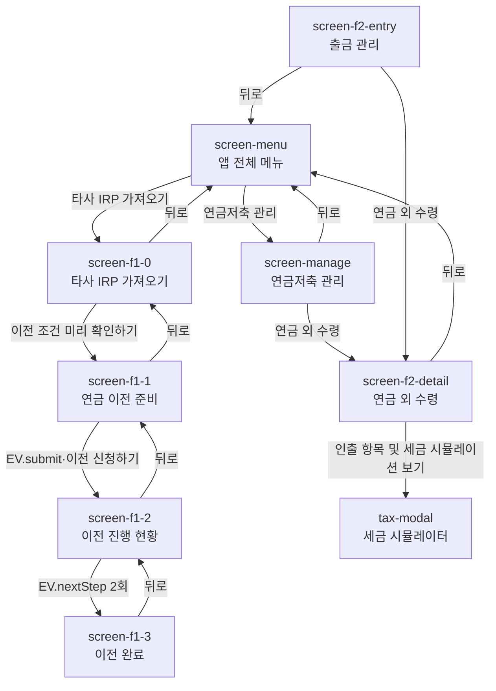

# KB증권 연금 통합 시연 프로토타입 V7 — 내용 전문

> 이 문서는 `통합_프로토타입_최종_V7.html`의 내용을 손실 없이 Markdown으로 옮긴 것입니다.
> 원본에 없는 해석·판단·보완은 넣지 않았고, 원본의 오탈자·수치 불일치도 고치지 않고 그대로 옮긴 뒤 마지막 [부록 C](#부록-c-원본의-내부-불일치)에 따로 정리했습니다.

| 항목 | 값 |
| --- | --- |
| 원본 파일 | `통합_프로토타입_최종_V7.html` |
| 문서 제목(`<title>`) | KB증권 연금 통합 시연 프로토타입 V7 |
| 언어 | `ko` |
| 총 줄 수 | 2,025줄 (스타일 1~1,125 / 마크업 1,127~1,757 / 스크립트 1,758~2,023) |
| 외부 의존성 | Pretendard 웹폰트 (jsDelivr CDN) 1건 |
| 뷰포트 | `width=device-width, initial-scale=1.0, maximum-scale=1.0, user-scalable=no` |

---

## 1. 전역 구조

### 1.1 기기 프레임

프로토타입 전체가 `.device` 하나에 담긴 모바일 목업입니다.

| 속성 | 값 |
| --- | --- |
| 크기 | 375 × 812 px |
| 테두리 | 14px solid `#1f2937` |
| 모서리 | border-radius 40px |
| 레이아웃 | flex column, `overflow: hidden` |

### 1.2 상태바

기기 프레임 최상단에 고정됩니다.

- 좌: `9:41`
- 우: `LTE 🔋`

### 1.3 화면 목록

`.screen` 요소 8개가 한 번에 하나씩만 `active` 클래스를 갖습니다. 최초 활성 화면은 `screen-menu`입니다.

| # | 화면 ID | 화면명 | 소속 |
| --- | --- | --- | --- |
| 1 | `screen-menu` | 앱 전체 메뉴 | 공통 진입점 |
| 2 | `screen-manage` | 연금저축 관리 | 공통 진입점 |
| 3 | `screen-f1-0` | 타사 IRP 가져오기 (진입) | 기능1 |
| 4 | `screen-f1-1` | 연금 이전 준비 (예약·잠금 미리보기) | 기능1 |
| 5 | `screen-f1-2` | 이전 진행 현황 (현황판) | 기능1 |
| 6 | `screen-f1-3` | 이전 완료 | 기능1 |
| 7 | `screen-f2-entry` | 출금 관리 | 기능2 |
| 8 | `screen-f2-detail` | 연금 외 수령 | 기능2 |

화면 외 오버레이 3종 + 모달 1종이 별도로 존재합니다 → [4장](#4-전역-오버레이) 참조.

### 1.4 화면 전이도

> `screen-f2-entry`는 화면으로 구현되어 있으나 다른 화면에서 이 화면으로 이동하는 링크가 없습니다. 상세는 [부록 C](#부록-c-원본의-내부-불일치) 참조.

---

## 2. 화면별 내용

### 2.1 `screen-menu` — 앱 전체 메뉴

기능1·기능2 양쪽의 진입점 역할을 합니다.

**헤더**

- 뒤로가기 `〈`
- 검색바: `🔍 메뉴명을 검색해보세요`

**좌측 사이드바**

| 항목 | 상태 |
| --- | --- |
| My연금 | — |
| 퇴직연금 | — |
| 연금저축 | **활성** |

**본문**

제목 줄: **연금저축** / 우측에 `↺ Reset` 버튼 → `EV.reset()`

| 그룹 | 메뉴 | 배지 | 동작 |
| --- | --- | --- | --- |
| 연금저축 ETF/리츠 | 연금저축 ETF/리츠 매매 | — | 없음 |
| **연금플러스 🌟** | 연금저축 관리 | `NEW` | `nav('screen-manage')` |
| **연금플러스 🌟** | 타사 IRP 가져오기 (실물이전) | `NEW` | `nav('screen-f1-0')` |

> `연금플러스 🌟` 그룹 제목은 파란색(`#2563eb`) + `font-weight: 800`으로 강조되어, 기존 메뉴군과 시각적으로 구분됩니다.

---

### 2.2 `screen-manage` — 연금저축 관리

**헤더**: `〈` → `screen-menu` / 제목 **연금저축 관리**

**탭**: `입출금 관리`(활성) / `서비스 관리`

**입금 관리**

| 아이콘 | 항목 | 동작 |
| --- | --- | --- |
| 📅 | 입금한도 설정 | 없음 |
| 🧾 | 입금지급내역 | 없음 |

**출금 관리**

| 아이콘 | 항목 | 보조 문구 | 동작 |
| --- | --- | --- | --- |
| 💰 | 연금수령 | — | 없음 |
| 💸 | **연금 외 수령** | 해지 없이 꼭 필요한 금액만 빼기 | `nav('screen-f2-detail')` |
| 🚫 | 연금저축 해지 | — | 없음 |

> `연금 외 수령` 행만 초록 배경(`#F0FDF4`)에 초록 텍스트(`#15803d` / `#166534`)로 강조되어 있습니다. 이 화면에서 기능2로 연결되는 지점입니다.

---

### 2.3 `screen-f1-0` — 타사 IRP 가져오기 (진입)

**헤더**: `〈` → `screen-menu` / 제목 **타사 IRP 가져오기**

**본문** (중앙 정렬)

- 눈썹 문구: 세제혜택은 그대로, 투자선택은 더 넓게
- 대제목: **퇴직연금 IRP** **KB로 옮길 타이밍**

**소구 카드**

> **KB증권만의 새로운 연금 이전**
> 답답했던 연금 이관, 거래가 멈추는 기간을 <mark>먼저 확인하고 원할 때 시작</mark>하세요!

**개념 다이어그램**: `타사 개인형 IRP` → (세로 연결선) → `KB증권 IRP`

**규칙 안내** — 배지 `조건`

> 같은 유형끼리만 옮길 수 있습니다. **개인형IRP ↔ 개인형IRP**, DC ↔ DC, DB ↔ DB.
> 연금저축계좌는 실물이전 대상이 아니며, 계좌이체(전액 현금화)로만 옮겨집니다.

**하단 버튼**: `이전 조건 미리 확인하기` → `nav('screen-f1-1')`

---

### 2.4 `screen-f1-1` — 연금 이전 준비

**헤더**: `〈` → `screen-f1-0` / 제목 **연금 이전 준비**

#### 2.4.1 거래 제한 구간 미리보기

제목: 지금 신청하면 이 기간에 <mark>매매·입금이 제한됩니다</mark>

소제목: **거래 제한 예상 구간**

캘린더 그리드 (`#calendarGrid`)는 JS가 렌더링합니다 → [부록 A](#부록-a-캘린더-데이터) 참조.

기간 표기 (`#durationTxt1`): **예상 7~9영업일** (초기값)

**안내 박스** — 배지 `안내`

> 실물이전은 최소 3영업일이 걸리고, **현금화가 필요한 상품이 있으면 그만큼 더 걸립니다.** 실제 속도는 기존 금융사(이관사)가 정하므로 KB증권이 앞당길 수 없습니다. 밴드는 확정 일정이 아닌 예상 구간입니다.

#### 2.4.2 보유 종목 6건 판정 결과

**원칙** — 배지 `원칙`

> **전액 이전만 가능합니다.** 일부 종목만 남겨두거나, 일부는 실물·일부는 현금으로 나눠서 옮길 수 없습니다.

**그룹 1 — 그대로 옮겨집니다 (3건)** · 상태점 `success`

| 종목명 | 평가금액 |
| --- | --- |
| KODEX 미국S&P500TR | 12,480,000원 |
| TIGER 미국나스닥100 | 8,320,000원 |
| KODEX 200 | 4,150,000원 |

**그룹 2 — 직접 팔아야 합니다 (1건)** · 상태점 `danger` · 요소 ID `hCritical`

| 종목명 | 평가금액 |
| --- | --- |
| ESR켄달스퀘어리츠 `조치 필요` | 3,240,000원 |

> **※ 리츠는 실물이전이 불가한 상품입니다.**
> 펀드·예금과 달리 자동으로 처리되지 않습니다. 기존 금융사가 정한 기한 안에 **직접 매도하지 않으면 이전 신청 자체가 취소됩니다.**
> 지금 팔면 예상 손익: **-312,000원**

버튼: `신청 전에 미리 매도하기` → `EV.sell()`

**그룹 3 — 자동으로 팔려서 현금으로 갑니다 (1건)** · 상태점 `warning`

| 종목명 | 평가금액 |
| --- | --- |
| 코어운용 멀티전략 | 6,700,000원 |

> KB증권 미취급 상품 · 환매 결제 3영업일
> 별도 조치 없이 자동 환매됩니다. 지금 기준 예상 손익: **+214,000원**

**그룹 4 — 불이익이 있습니다 (1건)** · 상태점 `danger`

| 종목명 | 평가금액 |
| --- | --- |
| 정기예금 (만기 2027-03-11) | 10,000,000원 |

> KB증권이 취급하지 않아 실물이전이 불가합니다. 전액 이전 원칙상 **이 예금만 남겨둘 수 없어** 중도해지됩니다.
> 중도해지 이율 적용으로 **-86,000원**이 확정됩니다.

**사전 확인 사항** — 배지 `확인`

> 신청 전에 **체결되지 않은 주문이 남아 있으면 이전 신청이 취소될 수 있습니다.** 미체결 주문과 예약주문을 먼저 정리해 주세요.

#### 2.4.3 하단 버튼 (2분할)

| 버튼 | 보조 문구 | 동작 |
| --- | --- | --- |
| 예약만 저장 | 거래 제한 없음 | `showToast('예약 상태로 저장되었습니다.')` |
| **이전 신청하기** | 신청 즉시 거래 제한 | `EV.submit()` |

---

### 2.5 `screen-f1-2` — 이전 진행 현황

**헤더**: `〈` → `screen-f1-1` / 제목 **이전 진행 현황**

#### 2.5.1 상태 배너 (`#s2-banner`)

초기 상태 = `warning`

| 요소 | 초기값 |
| --- | --- |
| 제목 (`#s2-banner-title`) | 거래가 제한된 상태입니다 |
| 부제 (`#s2-banner-sub`) | 재개 예상: 8/31(월) ~ 9/2(수) |
| 취소 칩 (`#s2-cancel-chip`) | `오늘 안에는 취소 가능` (클래스 `open`) |
| D-day (`#s2-dday`) | D-5 영업일 |

#### 2.5.2 진행 트래커 (5단계)

진행률 바 `#pizza-progress` 초기값 **50%**

| 단계 | 라벨 | 초기 상태 |
| --- | --- | --- |
| 1 | 접수 | done |
| 2 | 요청 | done |
| 3 | 확인 중 | **active** |
| 4 | 송금중 | — |
| 5 | 완료 | — |

#### 2.5.3 현재 단계 포커스 카드

| 요소 | 초기값 |
| --- | --- |
| 제목 (`#focus-title`) | 3. 이관사 이전의사 확인 |
| 소요 (`#focus-time`) | 보통 1~3영업일 |

설명 (`#focus-desc`)

> 이관사가 신청 고객 본인에게 (**유선 통화 또는 문자**)로 최종 확인을 합니다.
> ※ 취소는 신청 당일 의사 확인 전까지만 가능합니다. (본인 확인이 안 되면 신청이 취소됩니다.)

**취소 가능 시점 밴드** (`#pnr-band`) — 배지 `중요`

> 취소는 **신청 당일에, 이 확인을 마치기 전까지만** 가능합니다. 의사 확인이 끝나면 당일이라도 취소·철회할 수 없습니다.

**연락 안내 블록** (`#focus-action`) — 배지 `알림`

- 문구: 이 번호로 전화가 옵니다
- 번호: **1588-9999 국민은행**
- 버튼: `연락처에 번호 저장하기` → `showToast('연락처에 번호를 저장합니다.')`

#### 2.5.4 종목별 현금화 진행

헤더: 종목별 현금화 진행 / **3 / 6 확정**

| 상태점 | 종목명 | 상태 |
| --- | --- | --- |
| success | KODEX 미국S&P500TR | 이체 대상 확정 |
| success | TIGER 미국나스닥100 | 이체 대상 확정 |
| success | KODEX 200 | 이체 대상 확정 |
| danger | ESR켄달스퀘어리츠 | 직접 매도 필요 · 08-27까지 |
| active | 코어운용 멀티전략 | 자동 환매 중 · 08-27 결제 |
| warning | 정기예금 | 중도해지 처리 · 현금화 |

#### 2.5.5 이전 진행 중 제한되는 것

| 항목 | 초기값 | 판정 |
| --- | --- | --- |
| 새로 사기 (매수 · 상품가입) | 불가 | 불가 |
| 팔기 (매도) — `#restrict-sell` | 원칙 불가 | 불가 |
| 예약주문 · 미체결 주문 | 전건 취소 | 불가 |
| 추가 납입 (입금) | 불가 | 불가 |
| 출금 · 연금수령 신청 | 불가 | 불가 |
| 이전 신청 취소 — `#restrict-cancel` | 당일 · 의사확인 전 | **가능** |

**예외** — 배지 `예외`

> 실물이전이 불가한 **리츠 · 지분증권 등 상장상품은 기한 내에 직접 매도**해야 합니다. 이 매도는 제한 대상이 아니며, 하지 않으면 이전 신청이 취소됩니다.

**출처 고지**

> ※ 제한 범위와 시작 시점은 **기존 금융사(이관사)** 가 정합니다. 회사마다 다를 수 있어 KB증권이 실시간으로 확인할 수 없습니다. 정확한 내용은 이관사 안내를 확인해 주세요.

#### 2.5.6 연말 납입 주의 — 배지 `주의`

> 이전 기간에는 **추가 납입이 막힙니다.**
> 12월에 신청하면 그 해 세액공제 납입을 놓칠 수 있습니다. 연말 이전은 일정을 넉넉히 잡아 주세요.

---

### 2.6 `screen-f1-3` — 이전 완료

**헤더**: `〈` → `screen-f1-2` / 제목 **이전 완료**

**성공 헤더**

- 아이콘 `✓`
- 제목: **이전이 완료됐습니다**
- 시각: 08월 28일 (금) 11:07 잔고 반영 확인

**정산 요약 카드**

| 구분 | 보조 설명 | 금액 |
| --- | --- | --- |
| **최종 입고 금액** | — | **44,804,000원** |
| 실물이전 3종 | 그대로 입고 | 24,950,000원 |
| 현금 입고 | 리츠·펀드·예금 | 19,854,000원 |
| 확정된 손익 | 현금화 3건 | -184,000원 |

**해제 안내**

> 잔고 반영이 끝나 매매·입금이 모두 재개되었습니다.

**재편입 유도** — 배지 `주의`

> **예수금 19,854,000원**이 현금으로 남아있습니다.
> 바로 상품을 매수하여 운용하지 않으면 수익이 발생하지 않습니다.

**하단 버튼 (2분할)**

| 버튼 | 동작 |
| --- | --- |
| 다른 상품 보기 | `showToast('상품 랭킹 화면으로 이동합니다.')` |
| **이전 종목 그대로 담기** | `showToast('이전 종목 비중 그대로 주문 화면으로 이동합니다.')` |

---

### 2.7 `screen-f2-entry` — 출금 관리

**헤더**: `〈` → `screen-menu` / 제목 **출금 관리**

제목: **연금저축 출금 관리**
부제: 필요하신 업무를 선택해주세요.

| 항목 | 설명 | 배지 | 동작 |
| --- | --- | --- | --- |
| 연금수령 | 만 55세 이상, 가입 5년 경과 시 | — | `alert('기존 연금수령 플로우입니다.')` |
| 연금저축 해지 | 계좌 전체를 해지하고 전액 출금 | — | `alert('기존 연금저축 해지 플로우입니다.')` |
| 연금 외 수령 | 중도인출, 비과세인출, 상속인 조회 등 | `NEW` | `nav('screen-f2-detail')` |

---

### 2.8 `screen-f2-detail` — 연금 외 수령

**헤더**: `〈` → `screen-menu` / 제목 **연금 외 수령**

**계좌 선택기**: `신연금저축 394-123-45`

**탭**: `본인 · 중도인출`(활성) / `타 명의 · 상속`

> 이 화면에 재진입하면 항상 `본인 · 중도인출` 탭으로 초기화됩니다 (`nav()` 내부 처리).

#### 2.8.1 탭 1 — 본인 · 중도인출 (`#tab-self`)

**금액 요약 카드** (다크 카드)

| 항목 | 금액 |
| --- | --- |
| **예상 인출가능 금액** ⓘ | **세후 15,950,000원** |
| 총 평가금액(적립금) | 18,500,000원 |
| 세금합계 ⓘ | 2,550,000원 |

**시뮬레이터 진입 카드**

> **내 인출 순서와 세금은?**
> 법령에 따른 인출 순서와 비과세 혜택을 미리 확인해보세요.

버튼: `인출 항목 및 세금 시뮬레이션 보기` → `openModal('tax-modal')`

**동의 체크박스** (`#chk1`)

> 본인은 「소득세법 시행령」 제 40조의 2제 6항에 따라 신연금 계좌의 중도인출을 신청합니다.

**하단 버튼**: `해지없이 출금하기` → `alert('출금이 진행됩니다.')`

#### 2.8.2 탭 2 — 타 명의 · 상속 (`#tab-other`)

제목: **타 명의 계좌 조회 안내**
부제: 상속 예정이거나 본인 명의가 아닌 계좌의 조회를 희망하시는 경우, 관련 법령에 따라 직접 조회가 제한됩니다.

**카드 1 — 상속인 금융거래 조회**

> 상속인의 편의를 위해 피상속인(사망자) 명의의 모든 금융채권 및 채무를 확인하실 수 있는 서비스입니다.

버튼: `금감원 상속인금융거래조회 바로가기` → `alert('금융감독원 상속인금융거래조회서비스로 이동합니다.')`

**카드 2 — KB증권 고객센터 안내**

> 타 명의 계좌 인출 및 상속 절차에 대한 상세한 안내가 필요하신 경우 고객센터로 문의해 주시기 바랍니다.

번호: **📞 1588-6611**

---

## 3. 모달 — `tax-modal` 인출 항목 및 세금 시뮬레이터

**헤더**: 제목 `인출 항목 및 세금 시뮬레이터` / 닫기 `×` → `closeModal('tax-modal')`

부제: 법령에 따라 아래 순서대로 인출되며, 항목별로 세금이 다르게 부과됩니다.

**인출 순서**

| 순위 | 항목 | 설명 | 세율 | 금액 | 비고 |
| --- | --- | --- | --- | --- | --- |
| 1 | 과세제외금액 | 세액공제를 받지 않은 원금 | `비과세` | 3,500,000원 | 강조 표시 |
| 2 | 이연퇴직소득 | — | 퇴직소득세 70~50% | 0원 | — |
| 3 | 과세대상소득 | 세액공제 받은 원금 + 운용수익 | 연금소득세 3.3~5.5% | 12,450,000원 | — |

**비과세 인출 안내 카드**

> **💡 비과세 인출을 희망하시나요?**
> 은행연합회에서 연금저축 한도를 조회 및 변경하신 후, 비과세용 추가 계좌를 개설하시면 세금 부담 없이 인출하실 수 있습니다.

| 버튼 | 동작 |
| --- | --- |
| 은행연합회 연금저축 한도 조회 | `alert('은행연합회 한도 조회 페이지로 이동합니다.')` |
| 비과세 인출용 추가 계좌개설 | `alert('추가 계좌 개설 절차를 시작합니다.')` |
| 닫기 | `closeModal('tax-modal')` |

---

## 4. 전역 오버레이

### 4.1 푸시 알림 (`#pushNoti`)

| 요소 | 내용 |
| --- | --- |
| 헤더 | `KB증권 · 지금` (앱 아이콘 포함) |
| 제목 (`#pushTitle`) | 기본값 `알림 제목` — 호출 시 치환 |
| 본문 (`#pushDesc`) | 기본값 `알림 내용` — 호출 시 치환 |
| 노출 시간 | 4,000ms 후 자동 숨김 |

발생하는 푸시는 [5.4 EV 시나리오 엔진](#54-ev-시나리오-엔진) 참조.

### 4.2 토스트 (`#toast`)

노출 시간 3,400ms 후 자동 숨김. 발생 지점:

| 발생 위치 | 메시지 |
| --- | --- |
| `screen-f1-1` 예약만 저장 | 예약 상태로 저장되었습니다. |
| `screen-f1-2` 연락처 저장 | 연락처에 번호를 저장합니다. |
| `screen-f1-3` 다른 상품 보기 | 상품 랭킹 화면으로 이동합니다. |
| `screen-f1-3` 이전 종목 그대로 담기 | 이전 종목 비중 그대로 주문 화면으로 이동합니다. |
| `EV.sell()` | 실물이전 불가 종목을 미리 정리했습니다. 이전 일정을 다시 계산했습니다. |
| `EV.reset()` | 시연 상태가 모두 초기화되었습니다. |

### 4.3 시연용 진행 버튼 (`#demoAdvanceBtn`)

- 표기: `>` (플로팅 액션 버튼)
- 동작: `EV.nextStep()`
- 노출 조건: **`screen-f1-2`에서만** 표시, 그 외 화면에서는 숨김

### 4.4 시연용 탭 (`.dev-nav`)

기본 `display: none` 상태이며, `screen-f1-*` 화면에 진입할 때만 표시됩니다.

| 버튼 | 이동 대상 |
| --- | --- |
| 0. 진입 | `screen-f1-0` |
| 1. 예약 | `screen-f1-1` |
| 2. 현황판 | `screen-f1-2` |
| 3. 완료 | `screen-f1-3` |

---

## 5. 인터랙션 로직

### 5.1 `nav(screenId)` — 화면 전환

1. 모든 `.screen`에서 `active` 제거 후 대상 화면에 부여
2. 대상 화면의 `.scroll-area` 스크롤을 최상단으로 초기화
3. `screen-f1-`로 시작하면 `.dev-nav`를 표시하고 해당 인덱스 버튼을 활성화, 아니면 숨김
4. 대상이 `screen-f2-detail`이면 탭을 `tab-self`로 초기화
5. `#demoAdvanceBtn`은 대상이 `screen-f1-2`일 때만 표시

### 5.2 보조 함수

| 함수 | 동작 |
| --- | --- |
| `switchTab(tabId, element)` | 모든 `.tab`·`.tab-content`에서 `active` 제거 후 대상에 부여 |
| `openModal(modalId)` | 대상에 `active` 클래스 부여 |
| `closeModal(modalId)` | 대상에서 `active` 클래스 제거 |
| `showToast(msg)` | 토스트 표시, 3,400ms 후 숨김 (타이머 `tt` 재설정) |
| `showPush(title, desc)` | 푸시 표시, 4,000ms 후 숨김 (타이머 `pt` 재설정) |
| `renderCalendar(isFast)` | 캘린더 그리드 렌더링 → [부록 A](#부록-a-캘린더-데이터) |

### 5.3 상태 변수

| 변수 | 초기값 | 역할 |
| --- | --- | --- |
| `demoStep` | `0` | `screen-f1-2`의 시연 진행 단계 |
| `EV.isSold` | `false` | 사전 매도 수행 여부 |

### 5.4 EV 시나리오 엔진

#### `EV.sell()` — 사전 매도 (1회만 실행)

`isSold`가 이미 `true`면 즉시 반환합니다.

| 대상 | 변경 전 | 변경 후 |
| --- | --- | --- |
| 캘린더 | 기본 밴드 | 단축 밴드 (`renderCalendar(true)`) |
| `#durationTxt1` | 예상 7~9영업일 | **예상 5~6영업일** |
| `#hCritical` 클래스 | `item-card danger` | `item-card` |
| 종목 배지 | `조치 필요` (alert) | `사전 매도 완료` (info) |
| 손익 표기 | 지금 팔면 예상 손익: -312,000원 | 확정 손익: -312,000원 |

변경된 설명 문구:

> 신청 전에 정리했으므로 **이관사의 매도 대기 단계가 사라집니다.**
> 예상 구간이 3영업일 앞당겨졌습니다.

토스트: `실물이전 불가 종목을 미리 정리했습니다. 이전 일정을 다시 계산했습니다.`

#### `EV.submit()` — 이전 신청

1. `nav('screen-f1-2')`
2. 400ms 후 푸시 발송

> **이전 신청이 접수되었습니다**
> 지금부터 매매·입금·출금이 제한됩니다.
> 취소는 오늘 중 이관사 의사확인 전까지만 가능합니다.

#### `EV.nextStep()` — 시연 진행

**1회차 (`demoStep === 0` → `1`): 확인 중 → 송금중**

| 대상 | 변경 전 | 변경 후 |
| --- | --- | --- |
| 배너 클래스 | `status-banner warning` | `status-banner alert` |
| 배너 제목 | 거래가 제한된 상태입니다 | 현재 모든 거래가 제한됩니다 |
| 배너 부제 | 재개 예상: 8/31(월) ~ 9/2(수) | 잔고 반영 후 매매·입금이 재개됩니다 |
| D-day | D-5 영업일 | 당일 (D-Day) |
| 취소 칩 | 오늘 안에는 취소 가능 (`open`) | **취소 불가 구간** (`closed`) |
| `#pnr-band` | 표시 | 숨김 |
| `#focus-action` | 표시 | 숨김 |
| 포커스 제목 | 3. 이관사 이전의사 확인 | **4. 송금 및 내역 확인** |
| 포커스 소요 | 보통 1~3영업일 | 당일 (D-Day) |
| `#restrict-sell` | 원칙 불가 | 불가 |
| `#restrict-cancel` | 당일 · 의사확인 전 (`val-yes`) | **불가** (`val-no`) |
| 진행률 | 50% | **75%** |
| 트래커 3 | active | done |
| 트래커 4 | — | **active** |

변경된 포커스 설명:

> 이관사가 종목과 현금을 당사로 송금하고 있습니다.
> 입고 내역이 정확한지 대조하고 잔고에 반영하는 중입니다.
> ※ 현재 송금 진행 단계로, 이전 신청 취소 및 철회가 불가합니다.

푸시:

> **이관사 송금 통보를 받았습니다**
> 아직 완료가 아닙니다.
> 잔고에 실제로 반영돼야 이전이 끝납니다.

**2회차 (`demoStep === 1`): 송금중 → 완료**

1. `nav('screen-f1-3')`
2. `#demoAdvanceBtn` 숨김
3. 400ms 후 푸시 발송

> **입고가 완료되었습니다**
> 예수금 19,854,000원이 반영되었습니다.
> 매매·입금이 모두 재개되었습니다.

#### `EV.reset()` — 시연 초기화

`isSold = false`, `demoStep = 0`으로 되돌리고 아래를 모두 초기 상태로 복원한 뒤 `nav('screen-f1-0')`으로 이동하며 토스트를 띄웁니다.

복원 대상: 캘린더(기본 밴드) · `#durationTxt1` · `#hCritical` 카드 전체 · 배너(제목·부제·D-day·취소 칩) · `#restrict-sell` · `#restrict-cancel` · 포커스 카드(제목·소요·설명) · `#pnr-band` 표시 · `#focus-action` 표시 · 진행률 50% · 트래커 3/4/5 상태 · `#demoAdvanceBtn` 숨김 및 라벨 `>`

---

## 부록 A. 캘린더 데이터

캘린더는 7열 그리드 2행(8월 행 / 9월 행)으로 구성되며, 요일 헤더는 `일 월 화 수 목 금 토`입니다.

### A.1 날짜 유형(클래스)

| 클래스 | 의미 | 시각 표현 |
| --- | --- | --- |
| `weekend` | 주말 | 흐린 글자 (`--text-tertiary`) |
| `locked` | 확정 제한일 | 연빨강 배경 (`--danger-bg`) + 빨간 글자 |
| `est` | 예상 제한일 | 노랑 빗금 배경 + `#B45309` 글자 |
| `start` | 밴드 시작일 | 빨강 채움 + 좌측 라운드 |
| `end` | 밴드 종료일 | 채움 + 우측 라운드 (기본 빨강 / 단축 노랑) |
| `locked-mid` | 밴드 중간 | 라운드 제거 (연속 밴드 표현) |

### A.2 기본 밴드 (`renderCalendar(false)`) — 예상 7~9영업일

| 행 | 일 | 월 | 화 | 수 | 목 | 금 | 토 |
| --- | --- | --- | --- | --- | --- | --- | --- |
| **8월** | 23 `weekend` | **24 `start`** | 25 `locked` | 26 `locked` | 27 `locked` | 28 `locked` | 29 `weekend` |
| **9월** | 30 `weekend` | 31 `locked` | 1 `est` | 2 `est` | **3 `end`** | 4 | 5 `weekend` |

### A.3 단축 밴드 (`renderCalendar(true)`) — 예상 5~6영업일

`EV.sell()` 실행 시 적용됩니다.

| 행 | 일 | 월 | 화 | 수 | 목 | 금 | 토 |
| --- | --- | --- | --- | --- | --- | --- | --- |
| **8월** | 23 `weekend` | **24 `start`** | 25 `locked` | 26 `locked` | 27 `est` | **28 `end`** | 29 `weekend` |
| **9월** | 30 `weekend` | 31 | 1 | 2 | 3 | 4 | 5 `weekend` |

---

## 부록 B. 디자인 토큰

`:root` 블록이 파일 내에 두 번 선언되어 있으며, 뒤 선언이 앞 선언을 덮어씁니다. 아래는 **최종 적용값**입니다.

| 토큰 | 최종값 | 앞 선언값 (덮어써짐) |
| --- | --- | --- |
| `--kb-yellow` | `#FFCC00` | 동일 |
| `--kb-yellow-hover` | `#E6B800` | (뒤 선언에 없음 → 유지) |
| `--kb-dark` | `#2b2b2b` | `#1E1E1E` |
| `--kb-gray` | `#645B4C` | 동일 |
| `--kb-blue` | `#2563EB` | `#3B82F6` |
| `--bg-color` | `#F8FAFC` | `#F4F7FA` |
| `--surface` | `#FFFFFF` | 동일 |
| `--text-primary` | `#1E293B` | `#0F172A` |
| `--text-secondary` | `#64748B` | 동일 |
| `--text-tertiary` | `#94A3B8` | (뒤 선언에 없음 → 유지) |
| `--border` | `#E2E8F0` | 동일 |
| `--border-light` | `#F1F5F9` | (뒤 선언에 없음 → 유지) |
| `--success` | `#10B981` | (뒤 선언에 없음 → 유지) |
| `--success-bg` | `#D1FAE5` | (뒤 선언에 없음 → 유지) |
| `--warning` | `#F59E0B` | (뒤 선언에 없음 → 유지) |
| `--warning-bg` | `#FEF3C7` | (뒤 선언에 없음 → 유지) |
| `--danger` | `#EF4444` | 동일 |
| `--danger-bg` | `#FEE2E2` | (뒤 선언에 없음 → 유지) |

배지 체계: `조건` / `안내` (info) · `원칙` / `예외` (warn) · `확인` / `중요` / `주의` (alert)

---

## 부록 C. 원본의 내부 불일치

변환 과정에서 확인된 원본 자체의 불일치입니다. **본문에서는 원본 그대로 옮겼고, 여기서만 별도로 기록합니다.**

### C.1 기능1 정산 금액이 종목 합계와 맞지 않음

| 계산 | 값 |
| --- | --- |
| 보유 6종목 평가금액 합계 | 44,890,000원 |
| 확정 손익 합계 (-312,000 +214,000 -86,000) | -184,000원 |
| 산식상 최종 입고액 | 44,706,000원 |
| **화면 표기 최종 입고액** | **44,804,000원** |
| 차이 | **+98,000원** |

현금 입고액도 같은 크기만큼 어긋납니다. 현금화 3건 평가액 19,940,000원에서 손익 -184,000원을 반영하면 19,756,000원이지만, 화면에는 19,854,000원으로 표기되어 있습니다(차이 +98,000원). 실물이전 3종 합계 24,950,000원은 정확히 일치합니다.

### C.2 포커스 카드 소요 문구가 초기값과 복원값이 다름

- HTML 초기 마크업: `보통 1~3영업일`
- `EV.reset()` 복원값: `최장 1~3일`

초기화를 한 번 거치면 문구가 바뀝니다.

### C.3 존재하지 않는 요소를 참조

`EV.reset()`이 `#pnr-box-cancel`의 `display`를 설정하지만, 해당 ID를 가진 요소가 문서에 없습니다. 실행 오류는 나지 않으나(존재 확인 후 접근) 아무 동작도 하지 않습니다.

### C.4 `screen-f2-entry`로 가는 경로가 없음

`screen-f2-entry`(출금 관리)는 완성된 화면이지만, 어떤 화면에서도 이 화면으로 이동하는 링크가 없습니다. `screen-manage`의 `연금 외 수령`은 이 화면을 건너뛰고 `screen-f2-detail`로 직접 이동합니다.

### C.5 캘린더 2행의 월 라벨

2행에 `9월` 라벨이 붙어 있으나 첫 두 칸은 8월 30·31일입니다.

### C.6 인출 항목 합계와 적립금의 관계

모달의 인출 항목 3건 합계는 3,500,000 + 0 + 12,450,000 = **15,950,000원**으로, 총 평가금액(적립금) 18,500,000원이 아니라 **세후 인출가능액**과 같습니다. 차액 2,550,000원은 세금합계와 일치합니다. 인출 항목 금액이 세전 기준인지 세후 기준인지 원본에 명시되어 있지 않습니다.
